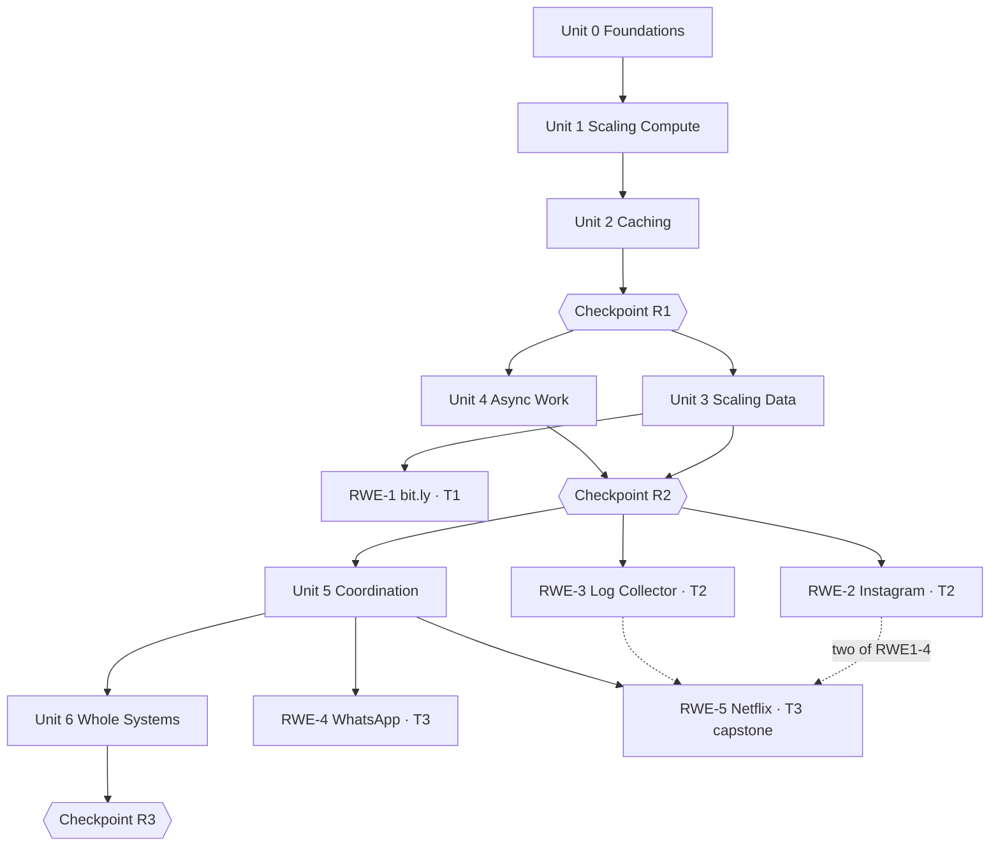

# ScaleCraft Curriculum — Educational Design Document

Status: **proposed design**, 2026-07-22. This is the curriculum the shipped product
should implement. It is a superset of, and consistent with, [[MVP_SCOPE]] — the two
MVP Building Blocks chapters and the bit.ly RWE chapter are specific chapters *inside*
this plan (BB 1.2, BB 2.1, RWE-1), not a separate thing to reconcile later. Content
authors and engineers should be able to build directly from this document; the mapping
to `ChapterDefinition` is given in §12.

Sources: [[../INITIAL_THOUGHTS|INITIAL_THOUGHTS]] (vision, modes, component list),
[[ARCHITECTURE]] (data model, hints vs. explanations), [[MVP_SCOPE]], [[MILESTONES]],
[[RESEARCH]] (Zachtronics/Factorio precedent, competitive gap), plus the learning-science
research summarized in §1.

---

## 1. Educational philosophy and progression strategy

### 1.1 The learner we are designing for

A software engineer (or advanced student) who can build a CRUD app but has never had to
reason about what happens past one server and one database. End state: they can take an
ambiguous product brief ("design a chat app for 100M users") and independently produce a
defensible architecture, articulating the trade-offs — the same competence a strong
system-design interview or a senior design review demands.

### 1.2 Principles, and the research behind them

Each principle below is load-bearing; every structural decision in this document traces
back to at least one of them.

1. **Mastery learning (Bloom, 1968; modern mastery platforms like Khan Academy/Math
   Academy).** Learners advance on demonstrated competence, not on having "seen" a
   chapter. ScaleCraft's success criteria (zero error-severity violations + required
   components present) is already a mastery gate — the curriculum leans into it:
   chapters unlock strictly along the prerequisite graph (§10), and revision
   checkpoints are re-demonstrations, not re-reads. Self-paced single-player is the
   ideal setting for mastery learning because there is no cohort to keep pace with.

2. **Cognitive load theory (Sweller).** Working memory holds ~4 novel elements. Hard
   budget: **no chapter introduces more than 2–3 new components or 1 new edge kind**,
   and the constrained palette (already a product mechanic) is the enforcement — a
   component simply isn't in the palette until the chapter that teaches it. Across the
   whole Building Blocks track, each of the 27 registry components is introduced
   exactly once (audit table in §9).

3. **Progressive disclosure / scaffold fading (worked-example effect, Renkl &
   Atkinson).** Early chapters give a mostly-built starter graph and ask for one
   addition ("completion problems"); mid-track chapters give a skeleton; late chapters
   and all RWE Phase-B work start from a blank canvas. The scaffold fades on a
   deliberate schedule (§9), never randomly per-chapter.

4. **Productive failure (Kapur, 2008) — ScaleCraft's core loop, already.** Letting a
   learner build something wrong and then read *why* it's wrong produces deeper
   learning than preventing the mistake. This is exactly the explanation-always,
   hints-never-pushed policy in [[ARCHITECTURE]]. The curriculum adds a dedicated
   exercise type that exploits it: **Fix-the-Architecture** (§6), where the starter
   graph is deliberately broken and the validation explanations are the primary
   teaching text.

5. **Retrieval practice & the testing effect (Roediger & Karpicke).** Quizzes exist to
   force recall and prediction, not to score. Every quiz question is scenario-shaped
   ("which rule will fire?", "where does this request go next?") and every answer —
   right or wrong — gets an explanation, mirroring the validation philosophy. No
   points, no streaks, no leaderboards: *not a game* applies to assessment too.

6. **Spaced repetition & interleaving (Cepeda et al.; Rohrer).** Concepts reappear on a
   schedule: revision checkpoints R1–R3 are blank-canvas rebuilds that deliberately mix
   components from *all prior* units, and every RWE project's "previously reinforced"
   list (§5) is chosen so that each foundational concept is exercised at least twice
   after its home chapter. Review is offered, never forced (§8).

7. **Project-based learning with bounded novelty.** Each RWE project introduces a small
   number of genuinely new ideas (never more than 2–3) on top of a majority-familiar
   base — the Zachtronics/Factorio pattern from [[RESEARCH]]: new subsystems force
   re-architecture, but only one new subsystem at a time.

8. **Interview-canon alignment as a free by-product.** The RWE roster (bit.ly,
   Instagram, log collector, WhatsApp, Netflix) is the system-design interview canon,
   and BB 6.1 explicitly teaches the requirements → estimation → high-level →
   deep-dive workflow interviews use. We get interview prep without ever framing the
   product as interview prep — it stays a learning lab.

### 1.3 Progression strategy in one paragraph

Three overlapping ramps, moving independently: **(a) palette size** grows from 3
components to all 27; **(b) scaffolding** fades from completion-problems to blank
canvas; **(c) validation posture** shifts from prescriptive ("build this shape") to
anti-pattern-only ("build anything that isn't wrong"). Building Blocks moves ramps
(a) and (b); Real World Extraction moves ramp (c). Sandbox is always available as the
zero-stakes pressure valve — nothing in the curriculum ever locks Sandbox.

---

## 2. Curriculum overview

**Building Blocks:** 7 units, 22 chapters, 3 revision checkpoints.
**Real World Extraction:** 5 projects in 3 difficulty tiers.
**Sandbox:** always unlocked, no curriculum role beyond free practice.

```
BB Unit 0  How the Web Serves a Request      (3 chapters)
BB Unit 1  Scaling Compute                   (4 chapters)
BB Unit 2  Caching                           (3 chapters)  → Checkpoint R1
BB Unit 3  Scaling Data                      (5 chapters)  ─┐   ┌→ RWE-1 bit.ly
BB Unit 4  Asynchronous Work                 (4 chapters)  ─┴→ Checkpoint R2
                                                                ├→ RWE-2 Instagram
                                                                └→ RWE-3 Log Collector
BB Unit 5  Distributed Coordination          (3 chapters)
BB Unit 6  Designing Whole Systems           (1 chapter + Checkpoint R3)
                                                                ├→ RWE-4 WhatsApp
                                                                └→ RWE-5 Netflix (capstone)
```

Units 3 and 4 are deliberately **parallel-eligible**: after R1 a learner may do them in
either order (neither depends on the other), which is the one place the track branches.
Everything else is linear — sequence *is* the pedagogy.

---

## 3. Building Blocks — complete curriculum

Formatting note: chapters are not forced into one template. Canvas-heavy chapters get
full exercise breakdowns; concept-heavy chapters (1.1, 3.5, 5.3) are deliberately
quiz-weighted with a small build, because forcing a big build onto a concept that has
no topology (e.g. CAP) would be busywork. Depth allocation is intentional and noted
per chapter.

Unless stated otherwise, every chapter's **mastery criteria** are: build exercise
passes (zero error violations + required components present and connected) **and** the
chapter quiz completed (every question eventually answered correctly — unlimited
retries, explanation shown on every attempt). "Completion" of a unit = all its
chapters mastered.

---

### Unit 0 — How the Web Serves a Request

*Why this unit exists:* nothing else in the curriculum is intelligible without the
request/response mental model and the reason application servers sit between clients
and data. It is the ZPD floor. *Prepares for:* literally everything; specifically the
"why can't the client just talk to the database" reasoning that rule
`no-direct-client-database` encodes.

#### 0.1 — Client, Server, Database
- **Why it exists / placement:** the minimal viable architecture (the seed graph
  already hardcoded in the app) is the atom every later graph decorates. First chapter
  because it has zero prerequisites.
- **Assumes:** nothing beyond "I have used a website."
- **New components (3):** `client`, `app-server`, `sql-database`. **New edge kind:**
  `request-flow`.
- **Exercises:**
  - *Build:* blank canvas, 3-component palette — wire Client → App Server → SQL DB.
  - *Fix:* starter graph has Client wired directly to the database; learner must
    discover via the validation explanation why that's wrong and repair it. This is
    the learner's first encounter with explanatory validation — the fix exercise is
    placed here *deliberately* so the core product loop is taught in chapter one.
  - *Trace:* run the simulator, predict the token path before pressing play.
- **Quiz (3 q):** why app servers exist (authn/authz/business logic); what
  request/response means; predict-the-violation on a screenshot graph.
- **Prepares for:** every subsequent chapter; the tiered-architecture vocabulary.

#### 0.2 — Naming: DNS and the Browser
- **Why it exists:** learners must know how a request *finds* the system before we
  complicate what's inside it. Small chapter by design — DNS at this depth is one
  concept (resolution before connection).
- **Assumes:** 0.1's request path.
- **New components (2):** `browser`, `dns`.
- **Exercises:** *Completion:* starter graph is 0.1's answer; add Browser + DNS
  correctly (DNS is consulted, not on the request data path — first exposure to "not
  every arrow is the same kind of arrow," softening Unit 3's edge-kind formalism).
  *Trace:* what happens when you type a URL, as a predict-then-simulate.
- **Quiz (3 q):** resolution order; caching of DNS answers (foreshadows Unit 2 —
  deliberate advance organizer); what breaks if DNS is down.
- **Prepares for:** CDN (2.3) which is DNS-steered; "edge of the system" thinking.

#### 0.3 — The Edge: Firewall and Reverse Proxy
- **Why it exists:** establishes the single-entry-point pattern and the security
  perimeter, which every later topology assumes silently. Placed before scaling
  because "one front door" is what makes horizontal scaling (Unit 1) invisible to
  clients.
- **Assumes:** 0.1, 0.2.
- **New components (2):** `firewall`, `reverse-proxy`.
- **Exercises:** *Build* from skeleton: put the perimeter in front of the app tier.
  *Fix:* a permissive-firewall config (`permissive-firewall` rule) — first
  config-level (not topology-level) failure the learner sees; teaches that
  architecture includes configuration.
- **Quiz (4 q):** proxy vs. no proxy; TLS termination (conceptual); which components
  belong inside vs. outside the perimeter; predict-the-violation.
- **Prepares for:** 1.2 (a load balancer is a reverse proxy with a job), 1.4
  (disambiguation chapter).

---

### Unit 1 — Scaling Compute

*Why this unit exists / placement:* the first real scaling pressure a growing system
hits is compute saturation, and it's the gentlest scaling story (stateless compute
scales trivially — data does not, which is exactly why Unit 3 comes later). *Assumes:*
Unit 0. *Prepares for:* the "many identical servers" mental model that caching (Unit
2) and every RWE project take for granted.

#### 1.1 — Vertical vs. Horizontal Scaling
- **Why it exists:** the fork-in-the-road concept of the whole discipline. Concept
  chapter — deliberately quiz-weighted, small build.
- **New components:** none (a second `app-server` *instance* — reusing a component is
  itself the lesson).
- **Exercises:** *Build:* duplicate the app server behind the existing reverse proxy —
  and hit the discovery that nothing routes between them sensibly. The chapter ends on
  that engineered cliffhanger; 1.2 resolves it. (Motivation-before-mechanism: the
  learner should *want* the load balancer before being handed one.)
- **Quiz (5 q):** cost/ceiling trade-offs of vertical scaling; what "stateless"
  buys; which of four workloads scale horizontally.
- **Prepares for:** 1.2 directly.

#### 1.2 — Load Balancing  *(= MVP Building Blocks chapter #1)*
- **Why it exists / placement:** resolves 1.1's cliffhanger. The single most reused
  component in the rest of the curriculum. This is the "networking/load-balancing"
  chapter [[MVP_SCOPE]] names; authoring it as BB 1.2 (with 1.1's context folded into
  its problem statement until Unit 0/1.1 ship) means zero rework when the full track
  lands — see §11 recommendation 1.
- **Assumes:** Unit 0; 1.1's two-server problem.
- **New components (1):** `load-balancer`. **New edge kind:** `control` (health
  checks — introduced here because health checking is the first behavior that is
  clearly *not* request flow).
- **Exercises:**
  - *Build:* place the LB in front of ≥2 app servers (rule
    `single-instance-load-balancer` teaches that an LB over one server is cargo cult).
  - *Config:* choose and justify a balancing algorithm (round-robin vs. least-conn)
    for two described workloads — same topology, different config, both valid; first
    exposure to "more than one right answer."
  - *Trace:* simulate twice, observe different downstream targets.
- **Quiz (5 q):** health checks; what happens when an instance dies; L4 vs. L7 at
  concept level; algorithm choice scenario.
- **Prepares for:** every multi-instance topology; 2.2 (shared state across
  instances); RWE-1.

#### 1.3 — Statelessness and Sessions
- **Why it exists:** horizontal scaling silently assumed stateless servers; this
  chapter surfaces and stress-tests that assumption. Placed immediately after 1.2
  because it is 1.2's hidden precondition.
- **New components:** none (uses `sql-database` as an external session store — with an
  explicit note in the reading that a faster store exists and is two chapters away;
  another advance organizer for Unit 2).
- **Exercises:** *Trade-off scenario* (§6): two presented graphs — sticky sessions vs.
  externalized session store — pick one for each of two product scenarios and get the
  trade-off explanation. *Build:* externalize session state.
- **Quiz (4 q):** what breaks with in-memory sessions behind an LB; sticky-session
  failure modes; JWT/stateless-token concept.
- **Prepares for:** 2.2 (distributed cache is where sessions actually go); WhatsApp
  (RWE-4), where statefulness is unavoidable and this chapter's framing is inverted.

#### 1.4 — Reverse Proxy vs. Load Balancer vs. API Gateway
- **Why it exists:** these three are the most-confused trio in system design; the
  confusion compounds silently if not addressed the moment all three exist. Placed
  here because after 1.2 the learner has met two of the three.
- **New components (1):** `api-gateway`.
- **Exercises:** *Completion:* given a multi-service backend skeleton, place the
  gateway (routing, auth, rate limiting as config). *Fix:* a graph with the three
  roles scrambled.
- **Quiz (5 q):** matching duties to components; when a gateway is overkill; rate
  limiting placement.
- **Prepares for:** RWE projects, all of which front with a gateway or LB; 4.3
  (serverless behind a gateway is the canonical pairing).

---

### Unit 2 — Caching

*Why this unit exists / placement:* caching is the highest-leverage, lowest-machinery
scaling tool — the natural next step once compute scales but the database is now the
bottleneck (which the Unit 1 exercises have quietly set up: many app servers, one
database). Placed *before* Unit 3 (Scaling Data) deliberately: you cache before you
re-architect data, in real life and in this curriculum. *Assumes:* Units 0–1.
*Prepares for:* Unit 3 (replicas are "caching with rigor"), CDN economics in RWE-2/5.

#### 2.1 — Cache-Aside  *(= MVP Building Blocks chapter #2)*
- **Why it exists:** the fundamental caching pattern; the chapter [[MVP_SCOPE]] and
  `INITIAL_THOUGHTS.md` both explicitly sketch (cache available, Kafka not).
- **New components (1):** `cache`.
- **Exercises:** *Build:* app server + cache + DB in cache-aside shape. *Config:* TTL
  and hit-rate; simulate twice and watch a hit vs. a miss branch differently (the
  simulator's coin-flip cache behavior per [[ARCHITECTURE]] was built for exactly
  this moment). *Predict-then-check:* what happens on miss.
- **Quiz (5 q):** staleness/TTL trade-off; what's cacheable; where cache-aside logic
  lives (app, not cache); invalidation as the famous hard problem (concept seed for
  2.2).
- **Prepares for:** 2.2, 2.3, and every RWE read path.

#### 2.2 — Distributed Caching
- **Why it exists:** per-instance caches behind an LB give inconsistent reads — a
  failure the learner can now *predict* (1.2 + 1.3 + 2.1 converge here; this chapter
  is where the curriculum first cashes in interleaving).
- **New components (1):** `distributed-cache`.
- **Exercises:** *Fix:* starter graph has per-server caches; symptoms described in the
  problem statement, learner diagnoses and consolidates. *Build:* move 1.3's session
  store into the distributed cache (a full-circle callback, and a worked example of
  "same component, second job").
- **Quiz (4 q):** consistency between cache nodes; cache stampede (concept);
  invalidation strategies at picker level.
- **Prepares for:** RWE-1's hot-URL cache; 3.1 (replication lag is the same staleness
  conversation with different machinery).

#### 2.3 — Caching at the Edge: CDN
- **Why it exists:** completes the caching story spatially (browser → CDN → cache →
  DB) and closes the loop opened by 0.2's DNS foreshadowing.
- **New components (1):** `cdn`.
- **Exercises:** *Completion:* add CDN for static assets to the running example.
  *Trade-off:* which of five listed asset/response types belong on the CDN.
- **Quiz (4 q):** push vs. pull CDN; cache-control conceptually; why CDNs are
  DNS-steered.
- **Prepares for:** RWE-2 and RWE-5, where the CDN is the star.

#### ✅ Checkpoint R1 — "A Site That Stays Up" (revision)
Blank canvas, palette = everything from Units 0–2, problem statement only: a described
mid-size web product; build the full stack (edge → LB → stateless tier → distributed
cache → DB). No starter graph, no new concepts, prescriptive validation. **Why:** first
spaced-retrieval event; proves the learner can *assemble from memory* what they've so
far mostly completed-from-scaffolds. Mastery: build success only (no quiz — the build
is the retrieval).

---

### Unit 3 — Scaling Data

*Why this unit exists / placement:* the database has been the untouched bottleneck
since Unit 1 — by design. Data is where scaling gets genuinely hard (state!), so it
comes after the learner has every easier tool. *Assumes:* Units 0–2 (R1). *Prepares
for:* Unit 5 (replication here is mechanism; leadership there is coordination), and
the storage decisions in every RWE project. Largest unit (5 chapters) because data has
the most irreducible concepts — depth allocation is deliberate.

#### 3.1 — Read Replicas and Replication
- **New components (1):** `read-replica`. **New edge kind:** `replication` (its
  home chapter; `orphan-read-replica`'s requirement of a replication-kind edge is the
  teaching instrument).
- **Exercises:** *Build:* add replicas, split read/write paths. *Fix:* replica with no
  replication edge (orphan) and app writing to a replica. *Trace:* a write vs. a read.
- **Quiz (5 q):** replication lag ("you just posted but can't see it — why?");
  read-your-writes concept; sync vs. async replication trade-off.
- **Prepares for:** 5.1 directly (leader/follower is this, formalized); RWE-1.

#### 3.2 — Choosing a Database: SQL vs. NoSQL
- **Why it exists:** the most consequential *selection* decision in the curriculum;
  taught as a decision procedure, not a technology tour.
- **New components (1):** `nosql-database`.
- **Exercises:** *Trade-off scenarios* ×3: given data shape + access pattern + scale,
  pick the store and read the reasoning (all three answers differ — one SQL, one
  NoSQL, one "either, and here's why the question matters less than you think").
  Small *build* swapping the store for one scenario.
- **Quiz (5 q):** schema flexibility vs. integrity; joins at scale; when relational
  is non-negotiable.
- **Prepares for:** 3.5 (partitioning is why NoSQL exists), every RWE storage choice.

#### 3.3 — Blobs: Object Storage
- **New components (1):** `object-storage`.
- **Exercises:** *Fix:* images stored as DB blobs (described symptoms: backup bloat,
  slow queries) → move to object storage + serve via the 2.3 CDN. Reinforces two
  prior units in one move.
- **Quiz (3 q):** what belongs in object storage; URL-to-blob indirection (metadata
  in DB, bytes in storage); presigned-upload concept. Small chapter by design — one
  strong idea.
- **Prepares for:** RWE-2 (media pipeline) and RWE-5 (video).

#### 3.4 — Search: the Search Engine
- **Why it exists:** first encounter with *derived data* — a second store that must be
  kept in sync — which is the conceptual bridge into Unit 4.
- **New components (1):** `search-engine`.
- **Exercises:** *Build:* add search fed from the primary DB. The sync arrow is the
  lesson: it can't be request-flow, and doing it synchronously is wrong — the chapter
  lets the learner feel that before Unit 4 names the machinery (`async` edges appear
  in the palette here but the queue itself is still locked; the reading names the
  limitation honestly and points forward).
- **Quiz (4 q):** why LIKE queries don't scale; index freshness; dual-write hazard
  (concept seed for 4.1/4.4).
- **Prepares for:** Unit 4, explicitly and by engineered dissatisfaction.

#### 3.5 — Partitioning and Sharding
- **Why it exists:** the end of the vertical road for data. **Concept chapter,
  quiz-weighted** — sharding has no dedicated component (correctly, per the component
  philosophy: it's a *configuration* of a database, not a new box), so the canvas work
  is config-level: partition-count / shard-key config on the database nodes.
- **New components:** none.
- **Exercises:** *Config:* choose shard keys for two described workloads; validation
  explains hot-partition consequences. *Trade-off:* range vs. hash partitioning.
- **Quiz (6 q — the heaviest quiz in BB, deliberately):** shard-key choice, hot keys,
  cross-shard queries, resharding pain, when *not* to shard.
- **Prepares for:** Kafka partitions (4.4) — same idea, different substrate; 5.2.

---

### Unit 4 — Asynchronous Work

*Why this unit exists / placement:* everything so far is synchronous request/response;
the second half of real systems is work that happens *later*. Placed after Unit 3
because its motivating examples (search-index sync from 3.4, thumbnailing for 3.3's
object storage) were planted there. May be taken before Unit 3 (only 4.4's Kafka
chapter lightly references 3.5's partitioning; the reading covers the gap) — the one
sanctioned branch. *Prepares for:* RWE-2/3/4, which are async-centric.

#### 4.1 — Queues and Workers
- **New components (2):** `message-queue`, `worker`. **New edge kind:** `async` (home
  chapter).
- **Exercises:** *Build:* offload a described slow task (email send) from the request
  path to queue + worker; the request path visibly shortens in the simulator.
  *Trace:* the request completes *before* the work does — the simulator makes
  asynchrony visceral in a way prose cannot.
- **Quiz (5 q):** what belongs on the request path; queue as buffer under spike
  (concept); at-least-once delivery and why workers must be idempotent (seeded here,
  hammered in RWE-4).
- **Prepares for:** everything async; 4.2 immediately.

#### 4.2 — When Work Fails: Dead Letter Queues
- **Why it exists:** failure handling is a first-class topic, not an appendix; the
  `queue-without-dead-letter-queue` rule already encodes this belief.
- **New components (1):** `dead-letter-queue`.
- **Exercises:** *Fix:* the 4.1 graph minus DLQ (the rule fires; learner reads why
  poison messages otherwise loop forever). *Config:* retry count / backoff.
- **Quiz (4 q):** poison messages; retry storms; what a human does with a DLQ. Small
  chapter — one idea, well landed.

#### 4.3 — Scheduled and Ephemeral Compute
- **Why it exists:** rounds out the compute taxonomy (always-on server / worker /
  cron / function) so learners stop reaching for an app server for everything.
- **New components (2):** `cron-job`, `serverless-function`.
- **Exercises:** *Trade-off:* four described jobs → assign each the right compute
  shape. *Completion:* add a nightly cleanup cron and a serverless image-resize (the
  latter fronted by 1.4's API gateway — callback).
- **Quiz (4 q):** cold starts; when serverless is the wrong economics; cron overlap
  hazard (concept seed for 5.2's lock service — advance organizer).

#### 4.4 — Streams and Events: Event Bus and Kafka
- **Why it exists:** the queue's semantics (one consumer takes the message) don't
  cover fan-out or replay; this chapter completes the messaging taxonomy. Last in the
  unit because it *contrasts* with 4.1 — contrast requires the baseline first.
- **New components (2):** `event-bus`, `kafka`.
- **Exercises:** *Build:* one producer, three consumers — discover why a queue is the
  wrong shape, then place the bus/log. *Trade-off:* queue vs. bus vs. Kafka for three
  scenarios (delivery semantics, replay, ordering).
- **Quiz (5 q):** pub/sub vs. queue; log retention/replay; consumer groups;
  partition-ordering (ties to 3.5 if taken, standalone otherwise).
- **Prepares for:** RWE-3 (Kafka is its spine), RWE-2's fan-out.

#### ✅ Checkpoint R2 — "The Whole Backend" (revision)
Blank canvas, palette = Units 0–4 (22 components). Problem: a described e-commerce
site (browse, search, order, email receipts, nightly reports). Requires sync path,
cache, replicas, search, queue+worker+DLQ, cron. Mastery: build success. **Why here:**
this is the largest interleaving event before RWE tiers 2–3 unlock, and it
deliberately requires ≥1 component from every prior unit.

---

### Unit 5 — Distributed Coordination

*Why this unit exists / placement:* last taught unit, on purpose — coordination is the
hardest material (it's about *agreement*, not plumbing) and it needs every prior
mental model: replication (3.1) to motivate leadership, cron overlap (4.3) to motivate
locks, partitioning (3.5) to motivate coordinators. Teaching it earlier would violate
the never-before-the-mental-model rule this document exists to enforce. *Prepares
for:* RWE tiers 3, and honest reasoning about failure everywhere.

#### 5.1 — Leaders and Followers
- **New components (2):** `leader`, `follower`.
- **Exercises:** *Build:* leader–follower replication cluster (the `split-brain-risk`
  rule is the teaching instrument: an even-count / dual-leader shape fires it, and the
  explanation carries the chapter's core idea). *Predict-then-check:* what happens
  when the leader dies.
- **Quiz (5 q):** failover; split brain; why an odd number; write-path vs. read-path
  in a leadered cluster.
- **Why not merged with 3.1:** 3.1 teaches replication as *mechanism* (copies exist);
  5.1 teaches it as *coordination* (who is allowed to accept writes). Different
  questions, different failure modes, deliberately separated by two units of maturity.

#### 5.2 — Agreement: Coordinators and Locks
- **New components (2):** `coordinator`, `lock-service`.
- **Exercises:** *Fix:* the 4.3 cron-overlap scenario, resolved with a lock service
  (callback with two units of spacing — textbook spaced repetition). *Build:*
  coordinator managing shard assignment for the 3.5 config.
- **Quiz (5 q):** what consensus buys (qualitative — no Raft internals; the textbook
  link covers depth); lock service vs. DB lock; what a coordinator actually tracks.
- **Depth note:** consensus algorithms are *deliberately out of scope* on the canvas.
  ScaleCraft teaches when you need coordination and what it costs; the textbook
  teaches how Raft works. This is the clearest example of the product/textbook
  division of labor from `INITIAL_THOUGHTS.md`.

#### 5.3 — Trade-offs at the Core: Consistency and Availability
- **Why it exists:** names and organizes the trade-off the learner has now hit five
  separate times (2.1 staleness, 2.2 invalidation, 3.1 lag, 4.1 eventual processing,
  5.1 failover). **Concept chapter, quiz-only + one trade-off exercise — the only
  chapter with no build**, because CAP has no topology; forcing one would be
  decoration, which the product principles prohibit.
- **New components:** none.
- **Exercises:** *Trade-off scenarios* ×4 (banking ledger, social feed, shopping
  cart, presence indicator): pick CP-ish or AP-ish posture per scenario, read the
  reasoning.
- **Quiz (6 q):** CAP honestly stated (partition tolerance isn't optional); PACELC at
  concept level; mapping product requirements to consistency requirements.
- **Prepares for:** RWE-4/5, whose open phases are judged partly on articulating this.

---

### Unit 6 — Designing Whole Systems (bridge to RWE)

#### 6.1 — From Requirements to Architecture (guided design exercise)
- **Why it exists:** everything so far taught components and patterns; nobody has
  taught the *process* — how you get from an ambiguous brief to a graph. This is the
  explicit bridge into RWE and (silently) the structure of a system-design interview.
- **Assumes:** all of Units 0–5.
- **New components:** none. New *skill*: the workflow.
- **Format — a guided design exercise, the only one of its kind in BB:** a described
  product (a ticket-booking site) walked through in four in-chapter stages, each
  gated: (1) requirements → pick functional/non-functional from a checklist, feedback
  on picks; (2) envelope estimation → order-of-magnitude reads/writes/storage
  (qualitative buckets, no precision theater); (3) high-level build on canvas;
  (4) deep-dive: harden the one subsystem the problem statement stresses (booking
  contention → 5.2's lock, a full-circle moment).
- **Mastery:** all four stages passed. No separate quiz — the chapter *is* assessment.

#### ✅ Checkpoint R3 — "Open Brief" (revision + posture shift)
Full 27-component palette, blank canvas, deliberately underspecified brief, and —
critically — **anti-pattern validation only** (the RWE posture, per [[MVP_SCOPE]]):
many graphs pass; anything embodying a taught anti-pattern fails with the taught
explanation. **Why:** the learner's first experience of "no prescribed shape" happens
*inside* Building Blocks, where the palette is familiar — so RWE's open-endedness is a
change of scenery, not a cliff. Completing R3 completes Building Blocks.

---

## 4. Building Blocks completion requirements

- All 22 chapters mastered (build + quiz per §3's criteria) and R1–R3 passed.
- Chapters unlock along the prerequisite graph (§10); *within* a unit, chapters are
  strictly sequential.
- Revisiting any completed chapter is always allowed and never resets progress.
- There is no time component, no score, and no penalty for attempts — mastery gates
  only. (Not a game.)

---

## 5. Real World Extraction — complete progression

Structure shared by all five projects (the framework from milestone 6 supports this as
content, not new machinery):

- **Phase A — Guided core (prescriptive-ish):** the project's essential path, with
  required components and a starter graph. Bounded novelty lives here.
- **Phase B — Open build (anti-pattern validation):** extend to the full brief from a
  large palette; multiple valid solutions; success = zero error-severity violations +
  required capabilities present. Trade-off notes appear as `warning`-severity
  violations that do not block success — the mechanism for "richer trade-off
  analysis" without prescribing one shape.
- **Stretch — optional scenario twist** (never required for completion): a scale or
  failure wrinkle described in prose, validated by additional anti-pattern rules.
- **Debrief:** on success, 2 distinct reference solutions (`solutionGraph` +
  variants) are revealed with trade-off commentary, plus a short retrospective quiz.
  Showing references *after* success preserves productive struggle while still
  delivering the worked-example payoff.

**Completion criteria per project:** Phase A pass + Phase B pass + retrospective quiz.
Stretch is tracked but optional.

**Difficulty tiers move three dials:** starter-graph size shrinks (A: substantial → B:
none), brief gets vaguer, and the share of `warning`-severity judgment calls grows.

---

### RWE-1 · bit.ly (URL Shortener) — Tier 1 *(= MVP RWE chapter)*
- **Unlocks after:** Unit 3 (needs caching + replicas + storage choice). In the MVP,
  before the full track exists, it gates after the two shipped BB chapters instead —
  same content either way; see §11 rec. 2. (`INITIAL_THOUGHTS.md` lists "URL
  Shortener" and "Bit.ly" separately; they are one project — see §11 rec. 3.)
- **Why first:** the canonical starter system — tiny surface (shorten + redirect),
  extreme read/write asymmetry, one crisp new problem. Smallest plausible RWE case,
  per [[MVP_SCOPE]].
- **Reinforces:** LB + stateless tier (U1), cache-aside for hot URLs (U2), replicas
  + SQL-vs-NoSQL choice (U3).
- **New concepts (2):** short-key generation (hash vs. counter; collisions —
  taught in Phase A reading + a quiz question, config-level on canvas); redirect
  semantics (301 vs. 302 and its caching/analytics consequence).
- **Phase A (guided):** the redirect read path: client → LB → app → cache → store.
- **Phase B (open):** add the shorten write path; choose and justify the store.
- **Stretch:** "a viral link 100×s your read traffic" (cache/CDN reasoning); click
  analytics *without touching the redirect latency* — requires Unit 4, flagged as
  such, and doubles as a pull toward Unit 4 for learners who came in early.

### RWE-2 · Instagram (photo sharing) — Tier 2
- **Unlocks after:** Units 3 **and** 4 (R2).
- **Why second:** first *multi-subsystem* project (upload pipeline ≠ read path ≠
  feed), but every subsystem individually is familiar; the composition is the lesson.
- **Reinforces:** object storage + CDN (3.3/2.3), queue + worker for thumbnail
  processing (4.1/4.2), NoSQL for feed data (3.2), distributed cache (2.2).
- **New concepts (2):** media pipeline shape (upload → store original → async
  process → serve derivatives via CDN); **feed fan-out: push vs. pull** — the
  project's intellectual center, taught via a Phase-B trade-off with both postures
  passing and warning-severity notes on each ("celebrity problem" vs. read
  amplification).
- **Phase A:** the upload/processing pipeline. **Phase B:** the feed read path,
  open. **Stretch:** the celebrity-account hot spot.

### RWE-3 · Distributed Log Collector — Tier 2
- **Unlocks after:** Units 3 and 4 (R2). Order vs. RWE-2 is free — both are Tier 2
  peers; recommended order lists Instagram first only because its product domain
  needs no explanation. (See §11 rec. 4 on why the collector is *not* Tier 1
  despite `INITIAL_THOUGHTS.md` listing it second — its write-heavy,
  infrastructure-flavored shape needs Unit 4, and its unfamiliar domain earns it a
  slot after one confidence-building project.)
- **Why it exists:** the only *infrastructure* system in the roster — no browser, no
  end user. It breaks the "everything is a website" mold and is the purest Kafka
  workout.
- **Reinforces:** Kafka (4.4), workers + DLQ (4.1/4.2), object storage (3.3),
  search engine for querying logs (3.4), cron for retention/compaction (4.3).
- **New concepts (2–3):** ingestion at write-heavy scale (agents → buffered log;
  backpressure qualitatively); hot path vs. cold path (recent-searchable vs.
  archived); retention as a first-class design decision.
- **Phase A:** agents → Kafka → indexing worker → search. **Phase B:** cold-path
  archive + retention + a dashboard query route. **Stretch:** an ingest spike 10×
  (what buffers, what drops, what falls behind).

### RWE-4 · WhatsApp (messaging) — Tier 3
- **Unlocks after:** Unit 5 (recommended: after 6.1).
- **Why here:** messaging *inverts* a foundational assumption — 1.3's beloved
  statelessness — because live connections are stateful. That inversion is only
  instructive to someone who fully internalized the original; hence late placement.
- **Reinforces:** queues + idempotency (4.1), delivery semantics (4.4), leader/
  follower + failover (5.1), consistency postures (5.3), gateway (1.4).
- **New concepts (3):** long-lived connections and connection-holding servers
  (qualitative — the app-server's config gains a "connection-oriented" mode rather
  than a new component, honoring never-fork-a-component); delivery guarantees
  end-to-end (sent/delivered/read as an at-least-once + idempotency + ordering
  story); presence via heartbeats (`control` edges, finally load-bearing).
- **Phase A:** 1-to-1 message path with offline delivery (per-user queueing).
  **Phase B:** group chat fan-out + presence, open. **Stretch:** a region's
  connection tier fails — reconnect storm reasoning.

### RWE-5 · Netflix (video streaming) — Tier 3 capstone
- **Unlocks after:** Unit 5 + at least two other RWE projects completed (a breadth
  gate, not a specific-path gate: the capstone assumes RWE *experience*, not
  particular projects).
- **Why last:** the widest system in the roster — three nearly independent
  subsystems (ingest/transcode; browse/search; playback delivery) that must
  coexist in one graph. It is a composition exam for the entire curriculum.
- **Reinforces:** everything; by design touches ≥1 component from all six
  categories. CDN (2.3) finally carries the load it was foreshadowed for; transcode
  pipeline reprises RWE-2's media pipeline at higher stakes; browse/search reprises
  3.4; viewing-history/resume state reprises 5.3's consistency postures.
- **New concepts (2):** video delivery economics (why ~all bytes must come from the
  edge; origin shielding — taught via warning-severity rules that fire when the
  origin sits on the hot path); regional/multi-datacenter thinking (qualitative:
  zones as canvas annotations, no new components — the existing Zone canvas
  affordance is enough).
- **Phase A (thin — capstone-appropriate):** the playback path only. **Phase B
  (the bulk):** the full service, open brief, largest anti-pattern rule set in the
  product. **Stretch:** "launch in a second region."
- **Debrief:** the full reference-architecture reveal, plus a written-out mapping of
  which curriculum chapter each part of the reference traces back to — the
  curriculum's closing argument that nothing was random.

---

## 6. Exercise strategy (taxonomy)

Six exercise types, all expressible with the existing `ChapterDefinition` +
validation-rule machinery (no new engine work; see §12):

| Type | What it is | Primary learning mechanism | Where used |
|---|---|---|---|
| **Build** | Blank/near-blank canvas, constrained palette | Active construction | Everywhere; the default |
| **Completion** | Substantial starter graph, add the missing piece | Worked-example fading | Heavy in Units 0–2, gone by Unit 5 |
| **Fix-the-Architecture** | Deliberately broken starter graph | Productive failure; error analysis; makes validation explanations the *primary* text | ≥1 per unit; introduced in 0.1 |
| **Config** | Correct topology, tune per-node config | "Architecture includes configuration" | 0.3, 1.2, 2.1, 3.5, 4.2 |
| **Trace / Predict-then-check** | State a prediction, then run the simulator or validator | Retrieval + immediate feedback; the simulator's pedagogical job | 0.1, 0.2, 1.2, 2.1, 3.1, 4.1, 5.1 |
| **Trade-off scenario** | 2+ presented graphs/configs, pick per scenario, read reasoning | Judgment under multiple-right-answers; interview-articulation practice | 1.3, 3.2, 4.3, 4.4, 5.3, all RWE Phase B |

Design rules: every chapter has ≥1 construction-family exercise (build/completion/fix)
**except** 5.3 (justified in §3); fix-exercises always ship symptoms in the problem
statement, never "find the bug" blind; trade-off exercises never have a secretly
"correct" option — the explanation praises the fit and names the cost, both ways.

## 7. Quiz and assessment strategy

- **Chapter quizzes:** 3–6 questions, scenario-shaped (predict-the-violation,
  trace-prediction, trade-off pick, config reasoning). Multiple-choice/matching only —
  auto-gradeable, no free-text grading in scope. Every option, chosen or not, has a
  written explanation (the validation philosophy applied to assessment). Unlimited
  attempts; mastery = each question answered correctly at least once; no scores,
  percentages, or streaks anywhere in the UI.
- **Checkpoints (R1–R3):** assessment *is* a build. No quiz. Detailed in §3.
- **RWE retrospective quizzes:** 4–6 questions asked *after* success, referencing the
  learner's own submitted graph where possible ("your design put X before Y — what
  does that cost under Z?") — cheap because questions are keyed to which of the known
  valid postures they chose (detectable from required-component/rule outcomes).
- **What is deliberately absent:** timed anything, XP, grades, completion percentages
  as motivation. Progress display stays the existing not-started / in-progress /
  complete per chapter.

## 8. Revision strategy

- **Built-in spacing:** the checkpoint cadence (after U2, U4, U6) and each RWE
  project's reinforcement lists (§5) are the primary spaced-repetition mechanism —
  every foundational concept is *required* again ≥2 times after its home chapter, at
  growing intervals. This is spacing by curriculum structure, not by nag.
- **Opt-in review, honoring the no-nudging principle:** the Home page may show a
  quiet "Review" entry listing 2–3 previously-mastered chapters whose concepts are
  about to be needed by the learner's next unlocked content ("RWE-4 leans on 1.3,
  4.1, 5.3"). It is a static, informational affordance the learner can ignore
  forever — never a popup, never gating, never attempt-triggered. This is the same
  pull-not-push contract as hints, applied to review.
- **Re-doing is always allowed:** any mastered chapter can be replayed from scratch
  (fresh attempt slot) without touching its completed status.

## 9. Difficulty curve

Three ramps, by stage:

| Stage | Palette size | Scaffold | Validation posture | New-component rate |
|---|---|---|---|---|
| Unit 0 | 3 → 7 | Completion-heavy, tiny graphs | Prescriptive | 2–3/chapter |
| Units 1–2 | ~8 → 12 | Mixed completion/build | Prescriptive | ≤1/chapter |
| Units 3–4 | ~13 → 22 | Build-first, fixes | Prescriptive, more configs | 1–2/chapter |
| Unit 5 | ~24 → 27 | Blank-canvas default | Prescriptive | 2/chapter |
| U6 + R3 | 27 | None | **Anti-pattern (shift happens here)** | 0 |
| RWE T1–T3 | Large → full | Phase A shrinking → none | Anti-pattern + warnings | ≤3 concepts/project |

Component-introduction audit (each of the 27 registry components introduced exactly
once): 0.1 client, app-server, sql-database · 0.2 browser, dns · 0.3 firewall,
reverse-proxy · 1.2 load-balancer · 1.4 api-gateway · 2.1 cache · 2.2
distributed-cache · 2.3 cdn · 3.1 read-replica · 3.2 nosql-database · 3.3
object-storage · 3.4 search-engine · 4.1 message-queue, worker · 4.2
dead-letter-queue · 4.3 cron-job, serverless-function · 4.4 event-bus, kafka · 5.1
leader, follower · 5.2 coordinator, lock-service. Edge kinds: `request-flow` 0.1 ·
`control` 1.2 · `replication` 3.1 · `async` 4.1.

## 10. Prerequisite graph

Chapters within a unit are strictly sequential; the graph below is unit/project-level.



(Sandbox has no node: always unlocked. RWE-4's *recommended* prerequisite is 6.1, but
its hard gate is Unit 5 — recommendation surfaces as reading-link guidance, not a lock,
to keep the RWE track from becoming a second linear corridor.)

## 11. Recommended changes to current vision/scope (with reasoning)

1. **Author the MVP's "networking/load-balancing" chapter as BB 1.2, with 0.1-style
   context folded into its problem statement for now.** When Units 0–1 ship later, the
   chapter slots into place by trimming its intro rather than being rewritten.
   Reasoning: pure sequencing economics — MVP content should be a subset of the final
   curriculum, never throwaway.
2. **bit.ly's post-MVP gate should move to "after Unit 3."** In the MVP it gates after
   the two shipped chapters (fine — beta users are early adopters, not beginners), but
   its reinforcement list assumes replicas and storage choice; once Unit 3 exists, the
   gate should be honest. Reasoning: never introduce before the mental model exists.
3. **Merge `INITIAL_THOUGHTS.md`'s "URL Shortener" and "Bit.ly" into one project.**
   They are the same system; two near-identical projects would spend the roster's most
   valuable property (bounded novelty per project) on redundancy.
4. **Re-order the Distributed Log Collector from 2nd (its position in
   `INITIAL_THOUGHTS.md`'s list) to Tier 2, after/beside Instagram.** It is
   write-heavy, Kafka-dependent (Unit 4), and domain-unfamiliar to most learners —
   three strikes against it as an early project. Educational reasoning, not
   preference: difficulty ordering should follow prerequisite load, and its load is
   strictly higher than bit.ly's and roughly Instagram's with less domain familiarity.
5. **Add `quiz` and (for 6.1) `stages` as content-model extensions** — see §12. This
   is the one place the curriculum asks for schema growth; everything else in this
   document runs on the existing model.
6. **No new components required for the full curriculum.** WhatsApp's connection
   servers, sharding, and Netflix's regions are all expressible as config, rules, and
   canvas annotations on the existing 27 — a deliberate stress-test pass was done in
   §3/§5 to keep the never-fork-a-component principle intact. If a future project
   genuinely breaks this (e.g. a WebSocket-gateway component earns its keep in RWE-4
   playtesting), add it to the registry globally, never per-chapter.

## 12. Implementation mapping (for engineers/content authors)

- **Chapter = `ChapterDefinition`,** one per BB chapter; RWE projects are 2–3 chained
  `ChapterDefinition`s (Phase A, Phase B, Stretch) sharing a project id — the
  milestone-6 shell needs only a "next phase" link and a project-level grouping on
  Home, not a new framework.
- **Exercise types are content patterns, not code:** Completion/Fix = `starterGraph`
  variants; Config = rules that read node `config`; prescriptive vs. anti-pattern
  posture = which `validationRuleIds` a chapter opts into (per-chapter rule scoping
  already exists); trade-off "both valid, here's the cost" = `warning`-severity rules.
- **Trace/predict exercises** need the milestone-11 simulator plus a one-question
  prompt shown before "Simulate" — the smallest new UI ask in this document.
- **Quizzes** need a `quiz: QuizQuestion[]` field on `ChapterDefinition` and a
  renderer: `{ prompt, options: { label, explanationMd, correct }[], kind }`.
  Auto-graded, unlimited attempts, per-question completion persisted alongside
  chapter progress. 6.1's staged flow generalizes this: `stages` as an ordered list
  of (content | build-gate | quiz-gate).
- **Unlocking** = evaluate §10's graph against persisted per-chapter completion
  (milestone 9/10 persistence). Locked chapters are visible with their prerequisite
  listed (progressive disclosure of the map itself, and it tells the learner *why*
  the order exists).
- **Rule-authoring load:** ~5–10 scoped rules per BB chapter, 15–25 per RWE project
  (anti-pattern posture needs breadth) — this is the biggest content cost in the
  document and strengthens the case for milestone 5's rule-coverage/LLM-assisted
  track and the rule-authoring-ergonomics trigger in [[OPEN_QUESTIONS]].

## 13. Final curriculum map — as it appears in ScaleCraft

```
BUILDING BLOCKS
  Unit 0 · How the Web Serves a Request
    0.1  Client, Server, Database
    0.2  Naming: DNS and the Browser
    0.3  The Edge: Firewall and Reverse Proxy
  Unit 1 · Scaling Compute
    1.1  Vertical vs. Horizontal Scaling
    1.2  Load Balancing
    1.3  Statelessness and Sessions
    1.4  Reverse Proxy vs. Load Balancer vs. API Gateway
  Unit 2 · Caching
    2.1  Cache-Aside
    2.2  Distributed Caching
    2.3  Caching at the Edge: CDN
    ✦    Checkpoint · A Site That Stays Up
  Unit 3 · Scaling Data
    3.1  Read Replicas and Replication
    3.2  Choosing a Database: SQL vs. NoSQL
    3.3  Blobs: Object Storage
    3.4  Search: the Search Engine
    3.5  Partitioning and Sharding
  Unit 4 · Asynchronous Work        (may be taken before Unit 3)
    4.1  Queues and Workers
    4.2  When Work Fails: Dead Letter Queues
    4.3  Scheduled and Ephemeral Compute
    4.4  Streams and Events: Event Bus and Kafka
    ✦    Checkpoint · The Whole Backend
  Unit 5 · Distributed Coordination
    5.1  Leaders and Followers
    5.2  Agreement: Coordinators and Locks
    5.3  Trade-offs at the Core: Consistency and Availability
  Unit 6 · Designing Whole Systems
    6.1  From Requirements to Architecture
    ✦    Checkpoint · Open Brief

REAL WORLD EXTRACTION
  Tier 1   RWE-1  bit.ly — URL Shortener
  Tier 2   RWE-2  Instagram — Photo Sharing
           RWE-3  Distributed Log Collector
  Tier 3   RWE-4  WhatsApp — Messaging
           RWE-5  Netflix — Video Streaming   (capstone)

SANDBOX — always open
```
