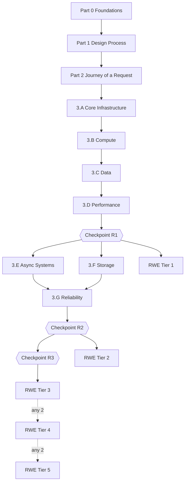

# ScaleCraft Curriculum - Master Specification

Status: **v2.0, 2026-07-31.** This revision restructures the 2026-07-22 curriculum
around an interview-first learning journey and expands it into a full authoring
handbook. It is both the canonical curriculum map and the master specification every
future lesson writer (human or AI) follows. If another model has to write Chapter 3.14
tomorrow, this document is all it should need.

The 2026-07-22 design is superseded, not discarded: its research grounding, exercise
taxonomy, and implementation mapping are carried forward, and §21.4 gives the exact
old-to-new chapter mapping (the shipped 3.0.0 manifest transcribes the old structure
and its slugs are persistence keys - see the migration notes there before touching
`src/curriculum/manifest.ts`).

Sources: [[../INITIAL_THOUGHTS|INITIAL_THOUGHTS]] (vision, modes, component list),
[[ARCHITECTURE]] (data model, hints vs. explanations), [[MVP_SCOPE]], [[MILESTONES]],
[[RESEARCH]], `.claude/docs/pending.md` (the restructure brief), plus the
learning-science research summarized in §1.

Companion document: [[QUIZ_FRAMEWORK]] - the complete quiz specification. Quizzes are
deliberately NOT specified here; §22 only defines how quizzes attach to chapters.

---

## 0. The learning journey this curriculum serves

The shipped app flow, which every chapter must fit:

```
Home Canvas
    v
Choose Learning Path
    ├── Building Blocks
    └── Real World Extraction
    v
Select Chapter (Learning Path page)
    v
Reader (the lesson)
    v
Design Editor (the student solves a design problem)
```

Two consequences are non-negotiable for authors:

1. **Every lesson ends by walking into the Design Editor.** The final section of every
   Reader lesson is a transition brief that reframes what was just learned as the
   problem the learner is about to solve. The exercise must feel like the lesson's
   last act, not a separate activity.
2. **The Reader teaches; the Editor proves.** Nothing is "mastered" by reading.
   Mastery is demonstrated on canvas (and in the chapter quiz), consistent with the
   product's mastery gates.

---

## 1. Curriculum philosophy

### 1.1 The learner we are designing for

A software engineer (or advanced student) who can build a CRUD app but has never had
to reason about what happens past one server and one database. End state: they can
take an ambiguous brief ("design a chat app for 100M users") and independently produce
a defensible architecture, articulate its trade-offs, and drive the conversation - the
competence a strong system-design interview and a senior design review both demand.

### 1.2 How engineers actually learn system design

System design is not a body of facts; it is a way of reasoning under constraints. The
curriculum is built on five observations about how that reasoning actually develops:

1. **Intuition precedes vocabulary that sticks.** An engineer who has *felt* a
   database saturate remembers "read replica" forever; one who memorized the term
   forgets it in a week. Every chapter therefore manufactures the problem before
   naming the solution - the learner should want the component before being handed it.
2. **Components are learned in isolation, but competence lives in composition.**
   Knowing what a queue is teaches almost nothing about when to reach for one. The
   curriculum alternates between introducing blocks (Part 3) and forcing composition
   (checkpoints, Real World Extraction), because the transfer step is where most
   self-study fails.
3. **Trade-off thinking is a habit, not a topic.** You cannot teach "trade-offs" in
   one chapter. Every chapter, without exception, presents at least one decision with
   two defensible answers and names the cost of each (§9, §6).
4. **Seeing beats reading.** Architecture is spatial. A learner who can picture the
   request path can reason about it; one who read a paragraph about it cannot. Hence
   the diagram-first standards in §7-8 and the canvas as the primary teaching surface.
5. **Retrieval, spacing, and productive failure do the long-term work.** Concepts are
   deliberately re-required at growing intervals (§12), quizzes force prediction
   rather than recognition ([[QUIZ_FRAMEWORK]]), and broken-by-design exercises let
   learners fail safely and read *why* (§11's Fix-the-Architecture type).

### 1.3 Research principles (load-bearing, carried forward from v1)

Every structural decision in this document traces to at least one of these:

1. **Mastery learning (Bloom, 1968).** Learners advance on demonstrated competence,
   not exposure. ScaleCraft's pass criteria (zero error-severity violations + required
   components present) is a mastery gate; chapters unlock along the prerequisite
   graph (§17), and checkpoints are re-demonstrations, not re-reads. Self-paced
   single-player is the ideal setting for mastery learning.
2. **Cognitive load theory (Sweller).** Working memory holds ~4 novel elements. Hard
   budget: **no chapter introduces more than 2-3 new components or 1 new edge kind.**
   The constrained palette enforces this mechanically - a component is not in the
   palette until the chapter that teaches it. Each of the 27 registry components is
   introduced exactly once (§16).
3. **Worked examples and scaffold fading (Renkl & Atkinson).** Early exercises are
   completion problems on mostly-built graphs; mid-track gives skeletons; late
   chapters and open builds start blank. The fade follows a schedule (§18), never
   per-chapter whim.
4. **Productive failure (Kapur, 2008).** Building wrong and reading *why* beats being
   prevented from erring. This is the explanation-always, hints-never-pushed policy
   in [[ARCHITECTURE]], exploited by the Fix-the-Architecture exercise type.
5. **Retrieval practice (Roediger & Karpicke).** Quizzes force recall and prediction,
   not scoring. Every answer, right or wrong, gets an explanation. No points, streaks,
   or leaderboards - *not a game* applies to assessment.
6. **Spaced repetition and interleaving (Cepeda et al.; Rohrer).** Checkpoints are
   blank-canvas rebuilds mixing all prior material; every RWE project's "Reinforces"
   list guarantees each foundational concept is exercised at least twice after its
   home chapter. Review is offered, never forced (§12).
7. **Project-based learning with bounded novelty.** Each RWE project introduces at
   most 2-3 genuinely new ideas on a majority-familiar base (the Zachtronics/Factorio
   pattern from [[RESEARCH]]).
8. **Interview-canon alignment.** The RWE roster is the system-design interview canon
   and Part 1 explicitly teaches the interview workflow - but the product stays a
   learning lab, never framed as cram prep. Interview readiness is engineered in, not
   bolted on.

### 1.4 Why the curriculum is ordered the way it is

- **Process before components (Part 1 before Part 3).** Most resources teach 25
  components and hope a design method emerges. ScaleCraft teaches the design method
  first, on tiny systems, so every later component lands inside a working decision
  framework ("where in my process does this block matter?"). This is the largest
  structural change from v1, and the reason the curriculum is "interview-first": the
  interview loop (§10) *is* the engineering design process, taught in week one and
  reinforced in every chapter after.
- **A concrete journey before abstraction (Part 2 before Part 3).** Tracing one real
  request end to end gives the learner a spatial map. Every Part 3 chapter then slots
  a block into a map that already exists, instead of floating free.
- **Blocks ordered by dependency of *motivation*, not taxonomy.** Within Part 3,
  each group's opening chapter manufactures the pressure the group resolves (compute
  saturates before scaling is taught; the database groans before caching is taught).
- **Reliability last within Part 3.** Failure reasoning requires every prior mental
  model - you cannot reason about failover before replication, or about lock
  contention before background jobs.
- **Composition gates (checkpoints) before open-ended work.** The first "no
  prescribed shape" moment happens inside Building Blocks (R3), where the palette is
  familiar, so RWE's open-endedness is a change of scenery, not a cliff.

### 1.5 Interview design vs. production engineering

The two differ, and pretending otherwise produces engineers who fail at both:

- An interview rewards **breadth-first reasoning under time pressure, communicated
  aloud**: clarify, scope, estimate, sketch, deep-dive one thing well, name
  trade-offs. Depth is sampled, not exhaustive.
- Production rewards **depth, operational caution, and boring choices**: migrations,
  monitoring, on-call reality, the cost of cleverness.

ScaleCraft teaches both explicitly and labels which is which. Every chapter carries
both an **Interview lens** and **Production notes** section (§6), and Part 0.3 is
dedicated to the distinction so learners never mistake one register for the other.

### 1.6 Why intuition beats memorization

A memorized answer to "design Instagram" collapses at the first follow-up question.
An engineer with intuition re-derives the design live. Therefore: lessons never
present final architectures first. They present forces (load, latency, failure,
cost), let the learner feel them (on canvas or via prediction prompts), and only then
name the standard resolution - after which the standard pattern feels inevitable
rather than arbitrary. Authors: if a section could be replaced by a flashcard, it is
written wrong.

---

## 2. Learner progression model

Seven stages, each mapped to where it is trained and how it is proven. A learner is
always at exactly one frontier stage but continuously exercises all earlier ones.

| Stage | Capability | Trained in | Proven by |
|---|---|---|---|
| 1. Vocabulary | Names the parts and the forces (latency, throughput, availability) | Part 0, Part 2 | Part 0 quizzes |
| 2. Components | Explains what each block does, its internals, its limits | Part 3 chapters | Chapter builds + quizzes |
| 3. Interactions | Traces how blocks compose; predicts request paths and data flow | Part 2, Part 3 exercises, simulator traces | Trace/predict exercises |
| 4. Trade-offs | Chooses between defensible options and names the cost | Trade-off exercises everywhere; §9 lenses | Trade-off scenarios + quiz |
| 5. Design | Assembles a whole system from an ambiguous brief | Part 1 process + checkpoints + RWE Phase B | Checkpoints R1-R3, RWE passes |
| 6. Defend | Justifies decisions under follow-up pressure; drives the conversation | Part 1.10-1.11, Interview lens sections, retrospective quizzes | RWE debrief quizzes ([[QUIZ_FRAMEWORK]]) |
| 7. Critique | Reviews an existing design; finds what breaks first and what to change | Fix-the-Architecture at scale, RWE stretch scenarios, debrief comparisons | Tier 4-5 RWE, R3 |

Authoring rule: every chapter states (in its metadata, §5.1) which stages it trains.
No chapter may target a stage more than one step past the learner's frontier at that
point in the sequence - this is the formal version of "the learner should never feel
like they skipped five chapters" (§18).

---

## 3. Curriculum structure overview

**Building Blocks** (the taught track): 5 parts, 44 chapters, 3 checkpoints.
**Real World Extraction** (the applied track): 32 projects in 5 difficulty tiers.
**Sandbox**: always unlocked, no curriculum role beyond free practice. Nothing ever
locks Sandbox.

```
BUILDING BLOCKS
  Part 0  Foundations                    (4 chapters)   what the discipline is
  Part 1  Engineering Design Process     (11 chapters)  the interview loop, taught first
  Part 2  Journey of a Request           (3 chapters)   the spatial map
  Part 3  Building Blocks                (26 chapters, 7 groups)
            Core Infrastructure . Compute . Data . Performance   -> Checkpoint R1
            Asynchronous Systems . Storage . Reliability          -> Checkpoint R2
  Part 4  Checkpoints                    R1, R2, R3 (R3 = gateway to open design)

REAL WORLD EXTRACTION
  Tier 1  Foundational systems   (4)   -> unlock after Checkpoint R1
  Tier 2  Applied systems        (5)   -> unlock after Checkpoint R2
  Tier 3  Composite systems      (9)   -> unlock after Checkpoint R3
  Tier 4  Flagship systems       (9)   -> unlock after R3 + 2 Tier-3 projects
  Tier 5  Frontier systems       (5)   -> unlock after 2 Tier-4 projects
```

Three ramps move independently across this structure: **(a) palette size** grows from
3 components to all 27; **(b) scaffolding** fades from completion problems to blank
canvas; **(c) validation posture** shifts from prescriptive ("build this shape") to
anti-pattern-only ("build anything that isn't wrong"). Building Blocks moves ramps
(a) and (b); Real World Extraction moves ramp (c). Details in §18.

---

## 4. Chapter types

Five types. Every chapter declares exactly one; the type determines which blueprint
sections are mandatory (§6) and which exercise mix applies (§11).

| Type | What it is | Examples | Editor exercise |
|---|---|---|---|
| **Concept** | Teaches an idea with no (or minimal) new topology | 0.2, 1.3, 3.13 | Small: config, trade-off pick, or trace |
| **Building Block** | Introduces 1-3 registry components | 3.4 Load Balancer | Full: build/completion/fix, the default |
| **Process** | Teaches a step of the design workflow | 1.4 Estimating Scale | Staged: gated in-chapter stages |
| **Checkpoint** | Blank-canvas re-demonstration, no new material | R1-R3 | The chapter IS the exercise |
| **RWE Project** | Multi-phase open design brief | Every RWE entry | Phase A guided + Phase B open + optional Stretch |

Depth allocation is intentional and per-type: forcing a big build onto a concept with
no topology (e.g. CAP) is busywork and prohibited; skipping the build on a Building
Block chapter is equally prohibited.

---

## 5. The chapter blueprint

The repeatable framework every chapter follows. §5.1-5.3 define the skeleton; §6
lists the section inventory; the per-chapter rows in §14 fill in the specifics.

### 5.1 Chapter metadata (required, every chapter)

Authored at the top of every lesson spec and transcribed into `CurriculumChapter` /
`ChapterDefinition` (§21):

- **Purpose** - one sentence: what the learner can do afterward that they couldn't
  before. If this sentence is vague, the chapter is not ready to write.
- **Type** - one of §4's five.
- **Difficulty** - `foundational` / `intermediate` / `advanced` (matches
  `src/curriculum/types.ts`'s `Difficulty`).
- **Estimated time** - minutes, Reader + Editor combined. Honest, not aspirational.
- **Prerequisites** - chapter numbers that must be COMPLETED. Also transcribed into
  `prerequisiteSlugs`.
- **Unlocks** - future chapters/projects this gates (derivable from §17, restated
  locally so authors feel the downstream weight).
- **Building blocks introduced** - registry component ids (and edge kinds), 0-3.
  Must agree with the audit in §16.
- **Stages trained** - from §2's seven.
- **Interview relevance** - High/Medium/Low, plus which interview-loop steps (§10)
  this chapter feeds. E.g. Load Balancer: High; steps 4 (high-level design) and 6
  (bottlenecks).
- **Production relevance** - one line on where this shows up in real operational
  life.

### 5.2 Learning objectives (required, every chapter)

Three to seven objectives total, each tagged with exactly one category. Every
category below must be represented at least once per chapter *except* Practical in
pure Concept chapters:

- **Knowledge** - "Explain why a load balancer needs health checks."
- **Engineering** - "Decide when round-robin is the wrong algorithm and why."
- **Interview** - "Answer the follow-up 'what happens when an instance dies?' in
  under a minute, with the failure path named."
- **Practical** - "Place an LB in front of two app servers on canvas and pass
  validation."
- **Communication** - "Justify the choice of least-connections aloud, naming the
  workload property that motivates it."

Objectives are testable statements, not topics ("understand caching" is banned).
Every objective must be exercised by at least one of: the build, the quiz, or an
in-lesson prompt - untested objectives get cut.

### 5.3 Lesson flow

The canonical Reader structure, in five acts. Beats marked (opt) may be omitted
where genuinely inapplicable; everything else appears in order. This refines the
17-beat draft in the restructure brief: same content, grouped so authors think in
narrative arcs instead of a checklist, with reinforcement beats (§12) placed at
fixed points instead of sprinkled.

**Act 1 - The problem (motivation before mechanism)**
1. *Cold open*: a concrete, felt failure or pressure ("your product got featured;
   the single server is at 100% CPU; requests are timing out").
2. *Why this exists*: the class of problem this chapter's idea resolves.
3. *Think first*: one prediction prompt before any answer is revealed ("what would
   YOU do - scale the machine or add another?"). Never graded, always present.

**Act 2 - The intuition**
4. *Mental model*: the one-sentence anchor + everyday analogy where honest (§12's
   memory anchors). One model per chapter; competing metaphors confuse.
5. *Visual explanation*: the chapter's primary diagram (§7) - shown before the
   prose that explains it, per §8.
6. *Core mechanics*: how it works, at the depth §20's calibration allows.

**Act 3 - The reality**
7. *Internal mechanics / deeper dive*: the one level down that separates "heard of
   it" from "can defend it" (e.g. LB: health checks, connection draining).
8. *Trade-offs*: at least one decision with two defensible answers, costs named
   both ways.
9. *Failure modes*: what breaks, what it looks like when it breaks, what breaks
   FIRST (§9).
10. *Scaling behavior*: what changes at 10x / 100x / 1000x (§9's scale ladder).
11. *Production examples*: 1-3 real companies, per §13's rules (why they chose it,
    not implementation tourism).

**Act 4 - The synthesis**
12. *Common mistakes*: the 2-4 errors real engineers (and candidates) make here.
13. *Interview lens*: how this topic appears in interviews - typical prompts,
    typical follow-ups, what a senior answer sounds like (§10).
14. *Connections*: explicit back-references ("this is 3.7's session problem,
    solved properly") and at most one forward tease (§19).
15. *Recap*: 3-5 bullet memory anchors. Then the *knowledge check* pointer (quiz,
    per [[QUIZ_FRAMEWORK]]).

**Act 5 - The handoff**
16. *Transition brief*: reframes the lesson as the problem statement the learner
    is about to solve, states what success looks like, and names what is
    deliberately NOT told to them (§11's omission design). Ends with the single
    call-to-action into the Design Editor. This beat is mandatory in every chapter
    type that has an Editor exercise - it is the hinge of the whole product flow
    (§0).

Checkpoints and RWE projects use compressed variants: Checkpoints have only beats
1, 16 (the brief is the chapter); RWE projects run Acts 1 and 5 per phase with a
debrief after (§15.2).

---

## 6. Mandatory sections

The section inventory, cross-referenced to lesson-flow beats. "M" = mandatory for
that type; "o" = optional; "-" = prohibited.

| Section (beat) | Concept | Building Block | Process | Checkpoint | RWE |
|---|---|---|---|---|---|
| Motivation / cold open (1-2) | M | M | M | M | M |
| Think-first prompt (3) | M | M | M | - | o |
| Mental model (4) | M | M | M | - | o |
| Visual explanation (5) | M | M | M | - | M |
| Core + internal mechanics (6-7) | M | M | M | - | o |
| Trade-offs (8) | M | M | M | - | M |
| Failure modes (9) | o | M | o | - | M |
| Scaling considerations (10) | o | M | o | - | M |
| Production examples (11) | M | M | o | - | M |
| Common mistakes (12) | M | M | M | - | M |
| Interview lens (13) | M | M | M | - | M |
| Connections (14) | M | M | M | M | M |
| Recap + knowledge check (15) | M | M | M | - | M (debrief) |
| Transition brief (16) | M | M | M | M | M (per phase) |
| Preview of next chapter | M | M | M | M | o |

Rules of use:
- Section order follows §5.3. Authors may merge adjacent sections when short (e.g.
  Failure modes folded into Trade-offs for a small chapter) but may not reorder.
- "Preview of next chapter" is 2-3 sentences and must create *pull* (an unresolved
  pressure), not a table of contents. The engineered-cliffhanger pattern (3.8 ends
  with two servers and nothing routing between them; 3.4 resolves it) is the gold
  standard.
- Any mandatory section an author believes is genuinely inapplicable requires a
  written justification in the chapter spec (the way v1 justified 5.3's no-build).

---

## 7. Diagram standards

ScaleCraft is diagram-first. Diagrams are content, not decoration.

### 7.1 The diagram inventory

Authors choose from this catalog. Whenever a chapter's concept benefits from one of
these, that diagram is mandatory, not optional:

| Diagram | Use when | Typical home |
|---|---|---|
| Architecture (component) diagram | Any topology discussion | Every Building Block chapter |
| Request flow / trace | Following one request end to end | Part 2, LB, gateway, caching |
| Sequence diagram | Ordering between parties matters | Auth flows, cache-aside, 2-step writes |
| Data flow | Where data lives and moves | Data, Storage, Async groups |
| Replication topology | Copies + sync direction | 3.12, 3.26 |
| Caching layers | Hit/miss branching | 3.14, 3.15 |
| Sharding / partition layout | Key -> partition mapping | 3.13 |
| Queue / stream topology | Producers, consumers, fan-out | 3.17, 3.18 |
| Leader election / failover states | Role transitions | 3.26 |
| Failure scenario (before/during/after) | Any failure-modes section | Reliability group, RWE stretch |
| Scaling evolution (v1 -> v2 -> v3) | The 10x/100x/1000x story | 2.3, scaling sections |
| Layer diagram | Vertical slices (edge/app/data) | Part 2, R1 |
| State transition | Lifecycle of a message/job/session | 3.17, 3.19 |
| Consistency model spectrum | Strong <-> eventual placement | 3.22 |
| Storage layout | How bytes are organized | 3.20-3.22 |
| Decision tree | Selection procedures | 3.11, 3.19, interview lens |
| Dependency graph | What relies on what | Checkpoints, RWE debriefs |
| Network topology / perimeter | Trust boundaries | 3.1, 3.5 |

### 7.2 Authoring rules

- **The canvas is the preferred renderer.** Any diagram expressible as an
  architecture graph is authored as ScaleCraft graph JSON (`ArchitectureGraph`:
  `nodes[{id, componentId, position, config}]`, `edges[{id, source, target, kind}]`,
  `entryPointIds`) so it renders in the product's own visual language and can be
  screenshotted, simulated, or handed to the learner as a starter graph. Edge kinds
  carry meaning: `request-flow` (sync path), `control` (health checks, discovery),
  `replication`, `async` - diagrams must use the correct kind, because learners
  absorb edge semantics from every diagram they see.
- Non-topology diagrams (sequence, state, decision tree, spectrum) use Mermaid in
  the Reader's markdown.
- One **primary diagram** per chapter (beat 5), introduced before its explanation.
  Supporting diagrams appear at their beat (failure diagrams in beat 9, etc.).
- Every diagram has a one-line caption stating what to notice ("note: the replica
  edge points FROM primary TO replica - writes never flow the other way").
- Diagram progression across a chapter should tell the scaling story: start minimal,
  evolve. Never open with the final 12-node architecture.
- Failure diagrams show the failure (crossed-out node, red path), not just the happy
  path with a caption saying "imagine this fails."

---

## 8. Visual learning standards

Every chapter spec must answer, per major section: **"What does the learner SEE
here?"** - not just "what do they read." Standards:

1. **See before read.** The diagram precedes the paragraph explaining it. Prose then
   references the diagram ("the dashed edge in the figure") instead of re-describing
   it.
2. **Dense text is a bug.** No section may exceed ~5 paragraphs without a visual,
   a canvas interaction, or a prompt. If a section needs more, it is two sections or
   it is over-depth (§20).
3. **The canvas is the primary visual.** Where a static image and a starter graph
   could both work, use the starter graph - the learner can poke it.
4. **Predictions attach to visuals.** Think-first prompts (beat 3) and trace
   exercises pose questions about a *shown* diagram ("which node saturates first?"),
   not abstract questions.
5. **Motion communicates state only** (product principle). Simulation token flow,
   validation state changes: yes. Decorative animation in lessons: never.
6. **Progressive reveal over wall-of-diagram.** A complex final topology is built up
   across 2-4 evolutionary diagrams, mirroring how the learner will build it.

---

## 9. Engineering thinking framework

The recurring lenses that make ScaleCraft graduates think like engineers rather than
pattern-matchers. Authors weave these into every chapter (Acts 1 and 3 especially);
quiz writers draw follow-ups from them ([[QUIZ_FRAMEWORK]] uses this list as its
question-seed bank):

1. **Why does this exist?** What problem was painful enough to invent it?
2. **What is it really solving?** The underlying force (latency, contention,
   blast-radius), not the surface feature.
3. **Why not the simpler thing?** What did the boring alternative fail at? (If the
   boring alternative doesn't fail, teach that the boring alternative wins.)
4. **What assumptions is it making?** Stateless services assume state lives
   elsewhere; caches assume staleness is tolerable. Name the assumption; show what
   happens when it's violated.
5. **What breaks first?** Every architecture has a weakest joint. Finding it is the
   single most transferable design skill.
6. **What scales poorly?** Distinguish "slow" from "gets slower per unit of growth."
7. **The scale ladder: what changes at 10x, 100x, 1000x?** Answers must be
   qualitative and specific ("at 10x you add replicas; at 100x the write path is the
   bottleneck and you shard; at 1000x cross-shard queries force a redesign"), never
   hand-wavy.
8. **What operational concerns appear?** Deploys, monitoring, on-call, migrations -
   the questions production engineers ask that candidates forget.
9. **How would Google solve this? How would a two-person startup?** The same problem
   has different right answers at different scale and team size - this contrast
   inoculates against cargo-culting big-tech architecture.

Rule: at least lenses 1, 5, and 7 appear explicitly in every Building Block chapter.
Lens 9 appears wherever a production example (§13) might otherwise read as "so you
should do this too."

---

## 10. Interview thinking framework

The single most-reinforced structure in ScaleCraft. Taught explicitly in Part 1,
then applied in every chapter's Interview lens and every RWE project. This is a
defining feature of the product.

### 10.1 The ScaleCraft Interview Loop

Eight steps. Part 1 devotes roughly one chapter per step; RWE Phase A/B walk the
loop end to end on every project.

1. **Clarify** - ask the questions that shrink the problem (who uses it, what
   matters, what's out of scope). Taught in 1.1-1.2.
2. **Requirements** - functional (what it does) and non-functional (how well:
   latency, availability, consistency, durability, cost). Taught in 1.2-1.3.
3. **Estimate** - back-of-the-envelope: users -> QPS -> storage -> bandwidth, in
   powers of ten, using the Numbers Every Engineer Should Know (1.5). Precision
   theater is banned; orders of magnitude are the deliverable. Taught in 1.4-1.5.
4. **High-level design** - the first architecture: entry point, compute, data,
   drawn before any deep dive. Taught in 1.6.
5. **Deep dive** - pick the one or two subsystems the requirements stress and go
   one level down. Taught in 1.9.
6. **Bottlenecks and failure** - what breaks first, what fails, single points of
   failure. Taught in 1.7.
7. **Trade-offs and alternatives** - name the roads not taken and their costs.
   Taught in 1.8.
8. **Evolve and defend** - respond to follow-ups ("now make it global", "10x the
   writes"), defend decisions without defensiveness, drive the conversation.
   Taught in 1.10-1.11.

### 10.2 Interviewer-intent literacy

Part 1 and the Interview lens sections also teach reading the interviewer:
follow-ups are invitations to go deeper, not accusations; "what if X fails?" tests
lens 5; silence after an answer means "keep driving." Common candidate mistakes get
a recurring callout box (jumping to components before requirements; estimating to
three significant figures; deep-diving everything; never stating trade-offs;
treating the interviewer as an adversary).

### 10.3 Senior-level signals

Every Interview lens section ends with one "what a senior answer sounds like"
example: an answer that names the trade-off unprompted, quantifies roughly, and
proposes the next deep dive. Learners should absorb the register, not just the
content.

---

## 11. Design Editor integration

The Reader and the Design Editor are one continuous experience (§0). This section
defines the seam.

### 11.1 Exercise taxonomy

Six types, all expressible with existing `ChapterDefinition` + validation machinery
(no new engine work; §21):

| Type | What it is | Learning mechanism | Where used |
|---|---|---|---|
| **Build** | Blank/near-blank canvas, constrained palette | Active construction | The default from mid-Part-3 on |
| **Completion** | Substantial starter graph, add the missing piece | Worked-example fading | Heavy early in Part 3, gone by Reliability |
| **Fix-the-Architecture** | Deliberately broken starter graph | Productive failure; validation explanations become the primary text | ≥1 per Part 3 group; introduced in 1.6 |
| **Config** | Correct topology, tune per-node config | "Architecture includes configuration" | 3.4, 3.13, 3.14, 3.17, 3.24 |
| **Trace / Predict-then-check** | State a prediction, then simulate or validate | Retrieval + immediate feedback | Part 2 throughout; 3.4, 3.14, 3.17, 3.26 |
| **Trade-off scenario** | 2+ presented graphs/configs, pick per scenario, read reasoning | Judgment under multiple right answers | 3.7, 3.11, 3.19, 3.22, all RWE Phase B |

Design rules: every chapter has ≥1 construction-family exercise (build / completion
/ fix) except justified Concept chapters; fix exercises always ship symptoms in the
problem statement, never "find the bug" blind; trade-off exercises never have a
secretly correct option - the explanation praises the fit and names the cost, both
ways.

### 11.2 What enters the Editor, and what is withheld

Every chapter spec declares:

- **Knowledge that enters**: the concepts the exercise may assume (equals the
  chapter's objectives + prerequisites' objectives). Transcribed into
  `CurriculumContext.masteredConcepts` so Deep Check judges the build at the
  learner's stage, not as a production system.
- **Deliberately omitted**: what the problem statement does NOT tell them - the gap
  the learner must bridge is the exercise. E.g. 3.14's brief says "reads are slow"
  but never says "add a cache." Omissions are designed, listed in the spec, and
  mirrored in `CurriculumContext.notYetIntroducedConcepts` /
  `simplifications` so the AI layer never "helpfully" fills them.
- **Expected deliverables**: a passing graph (and for Process chapters, passed
  stages). Stated in the transition brief as observable success criteria ("requests
  reach either server; killing one instance doesn't drop traffic").
- **Evaluation criteria**: which blueprints (§21) and validation rules apply, and
  the posture (prescriptive vs. anti-pattern, §18).

### 11.3 Hint philosophy (unchanged, non-negotiable)

Hints are a separate, optional layer - never auto-surfaced, never attempt-triggered,
never nudged. A learner who never opens a hint must be able to fail, read the
validation explanation, and reason to a fix. Hints ramp within a chapter from
orienting ("which part of the graph handles reads?") to directional, but never to
the answer. Explanations on failure are always shown, unconditionally - a bare
"invalid" is a bug.

### 11.4 Difficulty progression of exercises

Follows the ramps in §18: scaffold fades, palette grows, posture opens. Each
chapter's exercise must be solvable using only taught material, and should be
*barely* solvable with the newest material - the new block must be load-bearing,
not optional garnish, or the exercise teaches nothing.

---

## 12. Learning reinforcement systems

Recurring, named devices. Each has a fixed placement so learners build rhythm.

| Device | What | Placement |
|---|---|---|
| **Think first** | Prediction prompt before the reveal | Beat 3, every teaching chapter |
| **Memory anchors** | The one-sentence mental model + 3-5 recap bullets | Beats 4 and 15 |
| **Interview nugget** | A boxed one-liner: how this exact point surfaces in interviews | 1-2 per chapter, inside Acts 2-3 |
| **Production nugget** | A boxed one-liner: the operational reality | 1-2 per chapter, Act 3 |
| **Engineering nugget** | A boxed one-liner applying a §9 lens | 1 per chapter minimum |
| **Common pitfalls** | The mistakes section | Beat 12 |
| **Knowledge check** | The chapter quiz | Beat 15 (spec in [[QUIZ_FRAMEWORK]]) |
| **Mini challenge** | Optional harder variant of the exercise | End of Act 5, marked optional |
| **Connections** | Explicit back-links + one forward tease | Beat 14 |
| **Checkpoint** | Blank-canvas composition rebuild | R1-R3 (§14, Part 4) |
| **Quick recap on return** | 2-line "previously" summary when a learner resumes | Reader affordance, authored per chapter |

Spacing structure (not nag-based): checkpoints at fixed points; every RWE project's
Reinforces list guarantees ≥2 post-home-chapter exercises of every foundational
concept; the Home page may show a quiet, static "Review" affordance listing 2-3
mastered chapters the learner's next content leans on - informational only, never a
popup, never gating, never attempt-triggered (the hints contract applied to review).
Re-doing any mastered chapter is always allowed and never resets progress.

---

## 13. Real-world connections

Every teaching chapter connects to production systems (beat 11). Rules:

- **The unit of teaching is the decision, not the company.** "Netflix serves ~all
  video bytes from its own CDN because transit costs and latency both collapse at
  the edge" teaches; "Netflix's architecture has 47 microservices" is tourism.
- Format per example: *who* - *why they chose it* - *when it applies to you* - *what
  trade-off they accepted*. Two sentences is usually enough.
- Draw from the recognizable canon (Google, Netflix, Uber, Stripe, Cloudflare, Meta,
  Amazon, Discord, LinkedIn, Airbnb) but prefer the company whose use is
  *load-bearing and public* over the most famous name.
- Never implementation detail beyond public knowledge; never presented as "so you
  should too" (pair with §9 lens 9); no proprietary content from any source.
- RWE debriefs go one step further: the reference-architecture reveal maps each part
  of the reference back to the curriculum chapter that taught it - the closing
  argument that nothing was random.

---

## 14. Building Blocks curriculum

Per-chapter format (compact; field names match what `CurriculumContext` transcribes):
**Purpose** / **Type** / **New** (components + edge kinds) / **Assumes** /
**Prepares for** / **Interview** (relevance: loop steps) / **Exercise** / **Est**.
Difficulty and stages-trained follow from the part defaults noted per part.

### Part 0 - Foundations  *(all Concept, foundational, stage 1)*

*Why this part exists:* orientation. The learner needs to know what the discipline
is, what the product expects of them, and how interview and production registers
differ, before any real content. Small by design - nothing here should feel like
work.

- **0.1 Welcome to ScaleCraft** - Purpose: know how the product teaches (Reader ->
  Editor loop, validation that explains, hints on request only, mastery gates).
  New: none (tour of the seed graph, read-only). Prepares for: everything.
  Interview: Low. Exercise: none (the tour is the chapter). Est: 10.
- **0.2 What is System Design?** - Purpose: define the discipline as reasoning
  under constraints (latency, throughput, availability, durability, cost) and name
  those five forces. Assumes: 0.1. Prepares for: all of Part 1 (the forces become
  non-functional requirements). Interview: Medium: loop step 2 vocabulary.
  Exercise: trade-off pick (two described systems, which force dominates each).
  Est: 15.
- **0.3 Interview Design vs. Production Engineering** - Purpose: distinguish the
  two registers (§1.5) so every later Interview lens / Production note lands in the
  right box. Assumes: 0.2. Prepares for: 1.11, every Interview lens. Interview:
  High: meta. Exercise: none (quiz-weighted). Est: 15.
- **0.4 The System Design Lifecycle** - Purpose: preview the Interview Loop (§10.1)
  as a map of Part 1; the learner sees the whole workflow once before living each
  step. New: none. Prepares for: Part 1 in its entirety. Interview: High: the loop
  itself. Exercise: ordering exercise (arrange the eight steps; explanation per
  placement). Est: 15.

### Part 1 - Engineering Design Process  *(Process type, foundational, stages 1+4+5)*

*Why this part exists and comes this early:* the defining structural bet of the
curriculum (§1.4). The design method is taught on tiny, familiar systems (a blog, a
todo app) using only the three primitive components, so the method itself is the
only new material. Every chapter is one Interview Loop step made concrete. Palette
through Part 1: `client`, `app-server`, `sql-database` only (introduced in 1.6).

- **1.1 Understanding the Problem** - Purpose: turn an ambiguous one-line brief
  into scoped intent via clarifying questions. Assumes: Part 0. Prepares for: 1.2,
  every RWE brief. Interview: High: step 1. Exercise: staged - given a vague brief,
  pick the 4 highest-value clarifying questions from 10; feedback explains what
  each answer would change. Est: 20.
- **1.2 Functional Requirements** - Purpose: extract what the system must do; scope
  ruthlessly (MVP vs. later). Interview: High: step 2. Exercise: staged checklist
  with feedback. Est: 15.
- **1.3 Non-functional Requirements** - Purpose: attach numbers-shaped promises to
  0.2's five forces (availability nines, latency budgets, consistency needs);
  recognize that NFRs, not features, drive architecture. Interview: High: step 2.
  Exercise: match NFRs to three described products; explanation per match. Est: 20.
- **1.4 Estimating Scale** - Purpose: users -> QPS -> storage -> bandwidth in
  powers of ten; when estimation changes a design decision and when it's theater.
  Interview: High: step 3. Exercise: staged estimation with order-of-magnitude
  buckets (no precision theater; bucket-choice with explanations). Est: 25.
- **1.5 Numbers Every Engineer Should Know** - Purpose: internalize the latency /
  throughput / storage landmark numbers and, more importantly, their *ratios* (RAM
  vs. disk vs. network; a datacenter round trip vs. cross-continent). Interview:
  High: step 3. Exercise: ranking + estimation drills. Est: 20.
- **1.6 Drawing the First Architecture** - Purpose: produce the minimal viable
  architecture from requirements; first canvas build. **New: `client`,
  `app-server`, `sql-database`; edge kind `request-flow`.** Also the learner's
  first Fix exercise: a starter graph wires client straight to the database; the
  validation explanation (`no-direct-client-database`) is deliberately their first
  encounter with the core product loop. Interview: High: step 4. Exercise: build +
  fix + simulator trace. Est: 30.
- **1.7 Identifying Bottlenecks** - Purpose: apply "what breaks first" (§9 lens 5)
  systematically: single points of failure, saturation order, the difference
  between slow and unscalable. Interview: High: step 6. Exercise:
  predict-then-check on three presented graphs - name the first component to
  saturate, then simulate. Est: 25.
- **1.8 Engineering Trade-offs** - Purpose: make trade-off statements ("we chose X,
  accepting Y, because Z") a reflex; introduce the cost dimensions (latency,
  consistency, complexity, money, operability). Interview: High: step 7. Exercise:
  trade-off scenarios ×3. Est: 20.
- **1.9 Deep Dive Methodology** - Purpose: choose WHAT to deep-dive (the subsystem
  the NFRs stress) and how to go one level down without losing the room.
  Interview: High: step 5. Exercise: given a design + requirements, pick the right
  deep-dive target from four; explanation per option. Est: 20.
- **1.10 Communicating & Defending a Design** - Purpose: narrate a design top-down,
  handle follow-ups as invitations, defend without defensiveness. Interview: High:
  step 8. Exercise: staged - given follow-up questions, choose the strongest
  response and read why the others are weaker. Est: 20.
- **1.11 Driving a System Design Interview** *(optional chapter)* - Purpose: run
  the whole loop under time structure; interviewer-intent literacy (§10.2);
  common candidate mistakes. Marked optional: learners on a pure production track
  may skip without gating anything (nothing lists 1.11 as a prerequisite).
  Interview: High: all steps. Exercise: full staged walkthrough on a tiny brief.
  Est: 30.

### Part 2 - Journey of a Request  *(Concept, foundational, stage 3)*

*Why this part exists:* the spatial map (§1.4). One request is traced from keystroke
to response so every Part 3 block later lands at a known address. Presented
diagrams use components the learner hasn't unlocked yet - explicitly labeled as a
guided tour ("you'll build each of these stops in Part 3"), which is the sanctioned
form of forward reference (§19).

- **2.1 From Browser to Backend** - Purpose: trace DNS resolution, connection,
  TLS (conceptually), the edge, the app tier, the database, and back. New: none
  (tour). Assumes: Part 1. Prepares for: every Core Infrastructure chapter, which
  re-visits one stop each. Interview: Medium: step 4 fluency. Exercise: trace -
  order the stops, then follow a simulated token through a presented graph. Est: 20.
- **2.2 Where Can Things Go Wrong?** - Purpose: revisit the same journey
  failure-first: every hop is a failure point; timeouts, partial failure, and the
  meaning of "the site is down." Prepares for: 1.7's skill applied spatially; the
  Reliability group. Interview: High: step 6. Exercise: predict-the-failure on the
  2.1 trace ("DNS fails - what does the user see?"). Est: 20.
- **2.3 Evolution of Modern Architectures** - Purpose: the scaling-evolution story
  (one server -> tiers -> horizontal scale -> services), so Part 3's sequence reads
  as one system growing rather than a parts catalog. Interview: Medium: narrative
  fluency for step 4. Exercise: ordering + trade-off (when is a monolith right?).
  Est: 20.

### Part 3 - Building Blocks  *(Building Block type unless noted; stages 2-4)*

Seven groups, 26 chapters. Groups are ordered by motivational dependency (§1.4);
chapters within a group are strictly sequential. Checkpoint R1 gates after
Performance; R2 after Reliability (see Part 4). Running example: one product (a
growing content-sharing app) recurs across groups so each block extends a familiar
system.

**Group A - Core Infrastructure** *(foundational)*

- **3.1 Networking Fundamentals** - Purpose: just enough networking to reason
  about everything above it: IP/ports, TCP vs. UDP at concept level, TLS
  termination, and the trust perimeter. **New: `firewall`.** Type: Concept with a
  small build (place the perimeter). Assumes: Part 2. Prepares for: every edge
  component. Interview: Medium: steps 4, 6. Exercise: completion (add firewall) +
  config (`permissive-firewall` rule teaches config-level failure). Est: 25.
- **3.2 DNS** - Purpose: naming and resolution; DNS as the first routing decision
  and first cache the learner meets (advance organizer for 3.14). **New: `browser`,
  `dns`.** Prepares for: 3.15 (CDNs are DNS-steered). Interview: Medium. Exercise:
  completion + trace (what happens when you type a URL). Est: 20.
- **3.3 Reverse Proxy** - Purpose: the single-front-door pattern; what a proxy
  absorbs (TLS, compression, static serving) and why one entry point makes
  everything behind it swappable. **New: `reverse-proxy`.** Prepares for: 3.4 (an
  LB is a reverse proxy with a job), 3.5. Interview: Medium: step 4. Exercise:
  build from skeleton. Est: 20.
- **3.4 Load Balancer** - Purpose: distribute traffic across identical instances;
  health checks; algorithms as workload-dependent choices. **New: `load-balancer`;
  edge kind `control`** (health checks - the first behavior that is clearly not
  request flow). Assumes: 3.3. Prepares for: 3.8 (which manufactures the demand
  retroactively - see its cliffhanger note), every multi-instance topology.
  Interview: High: steps 4, 6. Exercise: build (`single-instance-load-balancer`
  rule: an LB over one server is cargo cult) + config (algorithm choice, two
  workloads, both defensible) + trace. Est: 35.
- **3.5 API Gateway** - Purpose: the client-facing policy layer (routing, auth,
  rate limiting as config); disambiguate the confused trio reverse proxy / LB /
  gateway the moment all three exist. **New: `api-gateway`.** Interview: High: a
  perennial follow-up ("gateway vs. LB?"). Exercise: completion (multi-service
  skeleton) + fix (the three roles scrambled). Est: 25.

**Group B - Compute** *(foundational)*

- **3.6 Stateless Services** - Purpose: why statelessness is the property that
  makes compute cheap to scale; what state hides in a "stateless" server. Type:
  Concept. New: none. Prepares for: 3.7, 3.8. Interview: High: step 4 vocabulary.
  Exercise: trade-off + small fix. Est: 20.
- **3.7 Sessions & State Management** - Purpose: where session state actually
  lives (sticky sessions vs. externalized store); uses `sql-database` as the
  session store with an explicit note that a faster store arrives in 3.14
  (advance organizer). New: none. Interview: High: classic follow-up. Exercise:
  trade-off scenario (sticky vs. external, two products) + build (externalize).
  Est: 25.
- **3.8 Horizontal Scaling** - Purpose: scale out vs. up, economically and
  operationally; duplicate the app server and hit the discovery that nothing
  routes between the copies sensibly - resolved by 3.4's LB, now re-motivated
  (the one place the curriculum teaches mechanism before full motivation, and it
  does so knowingly: 3.4 taught the tool, 3.8 makes it inevitable). New: none
  (a second instance IS the lesson). Interview: High: steps 4, 7. Exercise:
  build (LB + N instances) + predict (kill an instance mid-simulation). Est: 25.
- **3.9 Service Discovery** - Purpose: how services find each other once
  instances come and go; registry pattern, health-driven membership; `control`
  edges become load-bearing. Type: Concept with config exercise. New: none.
  Prepares for: 3.26 (membership is the precondition of failover). Interview:
  Medium. Exercise: config + trace. Est: 20.

**Group C - Data** *(intermediate)*

- **3.10 Databases** - Purpose: what a database actually guarantees (ACID at
  concept level, indexes, why disks shape everything); the database as the
  component every other block exists to protect. New: none (deepens
  `sql-database`). Interview: High: step 5 staple. Exercise: config (indexes;
  observe simulated query cost) + quiz-weighted. Est: 25.
- **3.11 SQL vs. NoSQL** - Purpose: a decision procedure, not a technology tour:
  data shape + access pattern + scale -> store choice. **New: `nosql-database`.**
  Interview: High: the single most common interview question. Exercise: trade-off
  scenarios ×3 (one SQL, one NoSQL, one "either - and here's why the question
  matters less than you think") + small build. Est: 25.
- **3.12 Replication** - Purpose: copies for reads and for safety; primary/replica
  roles; replication lag and read-your-writes as the first consistency encounter.
  **New: `read-replica`; edge kind `replication`** (the `orphan-read-replica` rule
  is the teaching instrument). Prepares for: 3.26 (failover formalizes the roles),
  3.22. Interview: High: steps 5, 6. Exercise: build (split read/write paths) +
  fix (orphan replica; writes to a replica) + trace. Est: 30.
- **3.13 Sharding** - Purpose: partitioning as the end of the vertical road; shard
  keys, hot partitions, cross-shard pain, when NOT to shard. Type: Concept,
  config-weighted (sharding is a configuration of a database, not a new box - the
  component philosophy in action). New: none. Interview: High: senior-level
  differentiator. Exercise: config (shard-key choice ×2 workloads;
  hot-partition explanations) + trade-off (range vs. hash). Est: 30.

**Group D - Performance** *(intermediate)*

- **3.14 Caching** - Purpose: the highest-leverage scaling tool; cache-aside
  pattern; TTL/staleness; then the multi-instance wrinkle -> distributed caching
  (per-instance caches behind an LB give inconsistent reads - a failure the
  learner can now predict; 3.4 + 3.7 + this chapter converge). **New: `cache`,
  `distributed-cache`.** Session store from 3.7 finally moves to its proper home
  (the promised payoff). Interview: High: steps 4, 5, 7. Exercise: build
  (cache-aside; simulator's hit/miss branching) + fix (per-instance caches) +
  config (TTL). Est: 35.
- **3.15 CDN** - Purpose: caching at the edge; what belongs on a CDN; push vs.
  pull; closes 3.2's DNS-steering foreshadow. **New: `cdn`.** Interview: High for
  media/global systems. Exercise: completion + trade-off (which of five asset
  types belong on the CDN). Est: 25.
- **3.16 Search Systems** - Purpose: why LIKE doesn't scale; inverted indexes at
  concept level; search as the first *derived data* the learner meets - a second
  store that must be kept in sync, which is the conceptual bridge into Group E
  (the sync arrow can't be request-flow, and doing it synchronously is wrong; the
  chapter lets the learner feel that before Group E names the machinery). **New:
  `search-engine`.** Interview: Medium-High. Exercise: build (search fed from the
  primary DB; the awkward sync edge is the lesson). Est: 30.

**Checkpoint R1 gates here** - see Part 4.

**Group E - Asynchronous Systems** *(intermediate)*

- **3.17 Message Queues** - Purpose: move work off the request path; queue +
  worker + what happens when work fails (dead letter queues as first-class, not
  an appendix - poison messages otherwise loop forever). **New: `message-queue`,
  `worker`, `dead-letter-queue`; edge kind `async`.** At the 3-component budget
  ceiling, justified: the trio is one cohesive pattern and the
  `queue-without-dead-letter-queue` rule enforces its unity. Interview: High:
  steps 4, 5. Exercise: build (offload email send; request path visibly shortens
  in the simulator - asynchrony made visceral) + fix (missing DLQ) + config
  (retry/backoff). Est: 35.
- **3.18 Event-Driven Architecture** - Purpose: queue semantics (one consumer
  takes the message) don't cover fan-out or replay; pub/sub, event buses, and the
  log (Kafka): consumer groups, retention, partition ordering (ties to 3.13).
  **New: `event-bus`, `kafka`.** Interview: High: senior differentiator.
  Exercise: build (one producer, three consumers - discover why a queue is the
  wrong shape first) + trade-off (queue vs. bus vs. log ×3 scenarios). Est: 35.
- **3.19 Background Jobs & Scheduling** - Purpose: the rest of the compute
  taxonomy (cron, serverless) so learners stop reaching for an app server for
  everything; cron-overlap hazard seeded for 3.23's lock service. **New:
  `cron-job`, `serverless-function`.** Interview: Medium. Exercise: trade-off
  (four jobs -> right compute shape) + completion (nightly cleanup cron;
  serverless resize behind 3.5's gateway - callback). Est: 25.

**Group F - Storage** *(intermediate)*

- **3.20 Object Storage** - Purpose: blobs don't belong in databases; metadata in
  DB, bytes in object storage, serve via CDN (reinforces 3.15); presigned-upload
  concept. **New: `object-storage`.** Interview: High for any media system.
  Exercise: fix (images as DB blobs: described symptoms - backup bloat, slow
  queries) -> object storage + CDN. Est: 25.
- **3.21 File Storage** - Purpose: file/block semantics vs. object semantics;
  POSIX expectations, shared filesystems, and why "just mount a disk" stops
  working; when file storage is still right. Type: Concept. New: none.
  Interview: Low-Medium (appears in Drive/Docs-class questions). Exercise:
  trade-off (object vs. file vs. block ×3 workloads). Est: 20.
- **3.22 Distributed Storage Concepts** - Purpose: how storage behaves once it
  spans machines: consistency models (strong <-> eventual), quorums at concept
  level, CAP stated honestly (partition tolerance isn't optional), PACELC at
  concept level; who places data (the coordinator role). **New: `coordinator`.**
  Type: Concept with a small build. This is the curriculum's consistency home -
  it names the trade-off the learner has now hit repeatedly (3.12 lag, 3.14
  staleness, 3.17 eventual processing). Interview: High: senior follow-ups live
  here. Exercise: trade-off scenarios ×4 (ledger, feed, cart, presence: pick
  CP-ish or AP-ish posture, read the reasoning) + build (coordinator managing
  placement for 3.13's shards). Est: 30.

**Group G - Reliability** *(advanced)*

- **3.23 Reliability Patterns** - Purpose: timeouts, retries with backoff,
  idempotency, circuit breakers, bulkheads; distributed locks for mutual
  exclusion (resolving 3.19's cron-overlap cliffhanger - spaced by a full group,
  textbook spacing). **New: `lock-service`.** Interview: High: step 6 depth.
  Exercise: fix (retry storm described; add backoff + idempotency config) +
  build (lock around the overlapping job). Est: 30.
- **3.24 Rate Limiting** - Purpose: protecting systems from clients (and
  themselves); algorithms (token bucket, sliding window) at concept level;
  placement (edge vs. service). Type: Concept, config-weighted (rate limiting is
  gateway/proxy config, not a new box). New: none. Interview: High: a canonical
  standalone interview question AND RWE Tier 1 project. Exercise: config
  (limits at 3.5's gateway; simulate burst traffic) + trade-off (per-user vs.
  global). Est: 25.
- **3.25 Observability** - Purpose: you can't operate what you can't see: logs,
  metrics, traces; SLIs/SLOs at concept level; what to alert on. Type: Concept.
  New: none. Interview: Medium (production-heavy; distinguishes senior
  candidates). Exercise: scenario (given symptoms + three dashboards, localize
  the fault). Est: 20.
- **3.26 Fault Tolerance** - Purpose: surviving failure by design: redundancy,
  failover, leader/follower roles formalized, split brain, why an odd number;
  graceful degradation. **New: `leader`, `follower`** (the `split-brain-risk`
  rule is the teaching instrument). 3.12 taught replication as mechanism (copies
  exist); this chapter teaches it as coordination (who may accept writes) -
  different questions, deliberately separated by three groups of maturity.
  Interview: High: steps 6, 8. Exercise: build (leader-follower cluster) +
  predict-then-check (kill the leader). Est: 35.

**Checkpoint R2 gates here** - see Part 4.

### Part 4 - Checkpoints  *(Checkpoint type)*

Blank-canvas re-demonstrations. No new concepts, no starter graph, no quiz - the
build is the retrieval. Mastery: build success only.

- **R1 - A Site That Stays Up** *(after 3.16; gates Groups E-G? No - see note)*
  Palette: everything through Group D. Brief: a described mid-size web product;
  build the full stack (edge -> LB -> stateless tier -> cache -> DB + replicas +
  CDN + search). Prescriptive validation. First spaced-retrieval event: proves
  assembly from memory of what was mostly completed-from-scaffolds. Est: 45.
  *Gating note:* R1 gates Groups E/F/G and RWE Tier 1. Groups E and F are
  parallel-eligible after R1 (neither depends on the other; G needs both) - the
  one sanctioned branch in Part 3.
- **R2 - Building a Complete Backend** *(after 3.26)* Palette: all 27. Brief: a
  described e-commerce product (browse, search, order, notify, nightly reports,
  survive an instance failure). Requires ≥1 component from every group.
  Prescriptive validation. The largest interleaving event before Tier 3 unlocks.
  Est: 60.
- **R3 - Open System Design** *(after R2)* Full palette, deliberately
  underspecified brief, and - critically - **anti-pattern validation only** (the
  RWE posture): many graphs pass; anything embodying a taught anti-pattern fails
  with the taught explanation. The posture shift happens here, inside Building
  Blocks, where the palette is familiar - so RWE's open-endedness is a change of
  scenery, not a cliff. Completing R3 completes Building Blocks and unlocks RWE
  Tiers 3+. Est: 60.

---

## 15. Real World Extraction curriculum

### 15.1 Structure shared by every project

- **Phase A - Guided core (prescriptive-ish):** the project's essential path, with
  required components and a starter graph. Bounded novelty lives here (≤2-3 new
  concepts, taught in Phase A's reading).
- **Phase B - Open build (anti-pattern validation):** extend to the full brief from
  a large palette; multiple valid solutions; success = zero error-severity
  violations + required capabilities present. Trade-off notes appear as
  `warning`-severity violations that never block success.
- **Stretch - optional scenario twist** (never required): a scale or failure
  wrinkle in prose, validated by additional anti-pattern rules.
- **Debrief:** on success, ≥2 distinct reference solutions (blueprints + reference
  graphs) revealed with trade-off commentary + a retrospective quiz
  ([[QUIZ_FRAMEWORK]] §12's RWE section) referencing the learner's own choices.
  References appear only *after* success - productive struggle first, worked
  example second.

**Completion per project:** Phase A + Phase B + retrospective quiz; Stretch tracked
but optional. **Difficulty tiers move three dials:** starter-graph size shrinks,
the brief gets vaguer, and the share of warning-severity judgment calls grows.

Every project spec declares: unlock gate, **Reinforces** (which Part 3 chapters -
each foundational concept must appear in ≥2 projects' lists across the roster),
**New concepts** (≤3), and its interview-canon note (which interview archetype it
trains). Full interview loop (§10.1) is run in every project: Phase A begins with
requirements + estimation stages, not with the canvas.

### 15.2 The roster

32 projects, 5 tiers. Within a tier, order is free (breadth encouraged); tier gates
are hard. Recommended-first entries are marked ◦. Domain groups (URL & metadata,
infrastructure, messaging, scheduling, marketplaces, storage & collaboration,
search & discovery, social & feeds, location & mobility, video & streaming, gaming,
booking, maps, matching, developer platforms) recur across tiers so learners can
follow a domain thread vertically if they prefer - the Learning Path renders tiers
as sections; domain is a chip on each row.

**Tier 1 - Foundational systems** *(unlock: Checkpoint R1; est 60-75 min each)*
First contact with open briefs while Part 3 is still in progress. Tiny surfaces,
one crisp new problem each.

| Project | Domain | Reinforces | New concepts |
|---|---|---|---|
| ◦ Bitly (URL shortener) | URL & metadata | LB + stateless tier, cache-aside, replicas, SQL-vs-NoSQL | short-key generation (hash vs. counter, collisions); 301-vs-302 redirect semantics |
| Rate Limiter | Infrastructure | 3.24 config, gateway placement, distributed state (3.14) | limiter algorithms compared under burst; distributed counter state |
| Distributed Cache (design one) | Infrastructure | 3.14 internals, 3.13 partitioning, 3.9 discovery | consistent hashing (concept); eviction policies as design choices |
| Metrics Monitoring | Infrastructure | 3.16 derived data, 3.19 scheduling, 3.10 write-heavy stores | time-series write patterns; downsampling/retention; pull-vs-push collection |

**Tier 2 - Applied systems** *(unlock: Checkpoint R2; est 75-90 min each)*
First multi-subsystem projects: every piece is familiar, composition is the lesson.

| Project | Domain | Reinforces | New concepts |
|---|---|---|---|
| ◦ Notification System | Messaging | 3.17 queue+worker+DLQ, 3.18 fan-out, 3.24 | multi-channel delivery (push/SMS/email); user preference & dedup layer |
| Job Scheduler | Scheduling | 3.19, 3.23 locks, 3.17 | priority queues; exactly-once-ish execution; misfire handling |
| LeetCode | Developer platforms | 3.5 gateway, 3.17 workers, 3.24 | sandboxed execution (concept); fairness under contest spikes |
| Price Tracking Service | Marketplaces | 3.19 cron, 3.17, 3.16 | polite crawling/polling cadence; change detection & alerting |
| Online Chess | Gaming | 3.7 sessions, 3.9, 3.22 postures | real-time move relay (long-lived connection concept, seeded for WhatsApp); matchmaking state |

**Tier 3 - Composite systems** *(unlock: Checkpoint R3; est 90-120 min each)*
Full products with two or more interacting subsystems and real consistency stakes.

| Project | Domain | Reinforces | New concepts |
|---|---|---|---|
| ◦ Google Drive | Storage & files | 3.20/3.21, 3.14, 3.12 | chunked upload/resume; sync metadata vs. blob split |
| Google Docs | Storage & collaboration | 3.22 postures, 3.12 | document model + versioning (collab depth deferred to Tier 5) |
| Ad Click Aggregator | Aggregation & ranking | 3.18 Kafka, 3.19, 3.13 | streaming aggregation windows; exactly-once counting tension |
| News Aggregator | Search & discovery | 3.16, 3.17, 3.14 | crawl/ingest pipeline shape; ranking freshness vs. cost |
| Facebook Post Search | Search & discovery | 3.16, 3.13, 3.18 | index sharding & fan-out queries; ingestion lag budget |
| Yelp | Search & discovery | 3.16, 3.11, 3.14 | geo-indexing (concept); read-heavy review aggregation |
| Payment System | Marketplaces | 3.23 idempotency, 3.22 CP posture, 3.17 | double-spend prevention; ledger append-only design; reconciliation |
| Online Auction | Marketplaces | 3.22, 3.23 locks, 3.18 | bid ordering & contention; auction-close correctness |
| IRCTC (train booking) | Booking | 3.13, 3.23, 3.24 | inventory contention at extreme burst; queue-based admission (virtual waiting room) |

**Tier 4 - Flagship systems** *(unlock: R3 + any 2 Tier-3 projects; est 120-150)*
The interview canon's centerpieces. Each inverts or stresses a foundational
assumption.

| Project | Domain | Reinforces | New concepts |
|---|---|---|---|
| ◦ WhatsApp | Messaging | 3.17 idempotency, 3.18 semantics, 3.26 failover, 3.22 | statefulness inverted (long-lived connections; connection-oriented app-server config, never a forked component); sent/delivered/read as an end-to-end guarantee story; presence via `control`-edge heartbeats |
| Instagram | Social & feeds | 3.20+3.15 media path, 3.17 processing, 3.11 | feed fan-out push-vs-pull (both postures pass, warning-severity notes each way); celebrity hot-spot |
| InShorts News Feed | Social & feeds | 3.18, 3.14, 3.16 | ranked-feed materialization; freshness vs. precompute cost |
| YouTube | Video & streaming | 3.20, 3.15 (the CDN finally carries the load it was foreshadowed for), 3.17 | transcode pipeline; adaptive bitrate (concept); video delivery economics - origin shielding via warning rules when the origin sits on the hot path |
| Uber | Location & mobility | 3.9, 3.22 AP posture, 3.18 | geo-matching supply/demand; location update firehose; surge as a systems problem |
| DoorDash / Zomato | Location & mobility | Uber's stack + 3.17 orchestration | three-sided marketplace orchestration; order state machine across parties |
| Tinder | Matching | 3.14, 3.11, 3.13 | recommendation candidate generation vs. ranking split; swipe-write volume |
| Robinhood | Marketplaces | 3.22 CP, 3.23, 3.18 | market-data fan-in/fan-out asymmetry; order execution correctness under load |
| Google Maps | Maps | 3.14, 3.15, 3.13 | tiling & precomputation; routing graph serving (concept) |

**Tier 5 - Frontier systems** *(unlock: any 2 Tier-4 projects; est 120-150)*
Deep single-problem systems: each takes one hard sub-problem and makes it the whole
project. Any Tier 5 completion completes Real World Extraction; finishing all five
is the completionist path, not the requirement.

| Project | Domain | Reinforces | New concepts |
|---|---|---|---|
| Google Docs: Real-time Collaboration | Collaboration | Tier 3 Docs, 3.22 | concurrent editing (OT/CRDT at concept level); presence & cursor broadcast |
| Facebook Live Comments | Social & feeds | 3.18, WhatsApp's connection tier | massive fan-out to live viewers; per-stream ordering under spike |
| YouTube Top K | Video & streaming | 3.18, 3.14 | streaming top-K / heavy-hitters (approximate counting); windowed ranking |
| Strava | Location & mobility | 3.20, 3.19, 3.16 | GPS track ingestion & compression; segment matching as batch+serve |
| Web Crawler | Search & discovery | 3.17, 3.13, 3.24 (politeness as self-rate-limiting) | frontier management & dedup at scale; politeness/robots; recrawl scheduling |

### 15.3 Notes on roster decisions

- The v1 roster's five projects survive: Bitly (Tier 1), Instagram + WhatsApp
  (Tier 4); Netflix is superseded by YouTube (same pedagogical payload, more
  universally understood product); the Distributed Log Collector's payload
  (write-heavy ingestion, hot/cold path, Kafka spine) is redistributed to Metrics
  Monitoring (Tier 1) and Ad Click Aggregator (Tier 3). Migration notes in §21.4.
- Google Docs appears twice by design (Tier 3: the product; Tier 5: the
  collaboration problem) - the Tier 5 entry assumes the Tier 3 one.
- Tier 1 unlocking at R1 (not R3) is deliberate: early open-brief contact while
  Part 3 is still in progress converts Building Blocks fatigue into motivation, and
  Tier 1 briefs only need Groups A-D material. Tier 1 projects may pull learners
  toward not-yet-taken chapters via stretch goals flagged "needs Group E" - pull,
  never push.

---

## 16. Component and edge introduction audit

Each of the 27 registry components is introduced exactly once; a component is not
in any palette before its home chapter.

| Chapter | Introduces |
|---|---|
| 1.6 | `client`, `app-server`, `sql-database` + edge `request-flow` |
| 3.1 | `firewall` |
| 3.2 | `browser`, `dns` |
| 3.3 | `reverse-proxy` |
| 3.4 | `load-balancer` + edge `control` |
| 3.5 | `api-gateway` |
| 3.11 | `nosql-database` |
| 3.12 | `read-replica` + edge `replication` |
| 3.14 | `cache`, `distributed-cache` |
| 3.15 | `cdn` |
| 3.16 | `search-engine` |
| 3.17 | `message-queue`, `worker`, `dead-letter-queue` + edge `async` |
| 3.18 | `event-bus`, `kafka` |
| 3.19 | `cron-job`, `serverless-function` |
| 3.20 | `object-storage` |
| 3.22 | `coordinator` |
| 3.23 | `lock-service` |
| 3.26 | `leader`, `follower` |

Concept chapters with no component (0.x, 1.1-1.5, 1.7-1.11, 2.x, 3.6-3.10, 3.13,
3.21, 3.24, 3.25) are intentional - see each chapter's Type. No new components are
required for the full curriculum, including all of RWE: WhatsApp's connection
servers, sharding, regions, and rate limiters are config, rules, and canvas
annotations on the existing 27. If playtesting proves a component earns its keep
(e.g. a websocket-gateway in WhatsApp), add it to the global registry, never
per-chapter (never-fork-a-component).

---

## 17. Prerequisite graph

Chapters within a part/group are strictly sequential; this graph is at
part/group/tier level.


```mermaid
graph TD
  P0[Part 0 Foundations] --> P1[Part 1 Design Process]
  P1 --> P2[Part 2 Journey of a Request]
  P2 --> GA[3.A Core Infrastructure]
  GA --> GB[3.B Compute]
  GB --> GC[3.C Data]
  GC --> GD[3.D Performance]
  GD --> R1{{Checkpoint R1}}
  R1 --> GE[3.E Async Systems]
  R1 --> GF[3.F Storage]
  GE --> GG[3.G Reliability]
  GF --> GG
  GG --> R2{{Checkpoint R2}}
  R2 --> R3{{Checkpoint R3}}
  R1 --> T1[RWE Tier 1]
  R2 --> T2[RWE Tier 2]
  R3 --> T3[RWE Tier 3]
  T3 -. any 2 .-> T4[RWE Tier 4]
  T4 -. any 2 .-> T5[RWE Tier 5]
```

Sandbox has no node: always unlocked. 1.11 is optional and gates nothing. Locked
chapters remain visible with their prerequisite listed - progressive disclosure of
the map itself, which also tells the learner *why* the order exists.

---

## 18. Difficulty progression

### 18.1 The three ramps, by stage

| Stage | Palette | Scaffold | Validation posture | New-component rate |
|---|---|---|---|---|
| Parts 0-2 | 0 -> 3 | Presented diagrams; tiny builds | Prescriptive | 3 once (1.6) |
| Groups A-B | 4 -> 10 | Completion-heavy | Prescriptive | ≤2/chapter |
| Groups C-D | 11 -> 16 | Mixed build/fix | Prescriptive, more config | ≤2/chapter |
| Groups E-G | 17 -> 27 | Build-first, blank-canvas default | Prescriptive | ≤3 (3.17 only) |
| R3 | 27 | None | **Anti-pattern (the shift)** | 0 |
| RWE T1-T5 | Large -> full | Phase A shrinking -> none | Anti-pattern + warnings | ≤3 concepts/project |

### 18.2 Sequencing rules (binding on all authors)

1. **No chapter depends on anything not yet introduced.** The audit (§16) plus
   each chapter's Assumes line make this checkable; violating it is a spec bug.
2. **Forward references are previews, never dependencies** - one per chapter, in
   beat 14 or an explicit "coming in X" note (§19). Part 2's guided tour is the
   one sanctioned larger exception, and it labels itself.
3. **Every advanced topic must emerge from a felt limitation of a previous one**
   (search from LIKE, queues from slow request paths, locks from cron overlap,
   leaders from replica ambiguity). If an author cannot name the limitation that
   motivates a chapter, the sequencing is wrong - escalate rather than write
   around it.
4. **The learner should never feel they skipped five chapters.** Concretely: a
   chapter's exercise must be solvable by a learner who has done only the
   prerequisite chain, with no outside knowledge. Playtest question for every
   spec: "which prior chapter taught each move this exercise requires?"

---

## 19. Cross-chapter connections

The curriculum must feel interconnected, not episodic. Requirements:

- **Backward:** every chapter names ≥2 explicit prior-chapter connections in beat
  14 ("this is 3.7's problem, solved properly"), using chapter numbers so the
  Reader can link them.
- **Forward:** at most one tease per chapter, always marked ("we'll meet the
  machinery for this in 3.17") - the advance-organizer pattern. Teases create
  pull; unmarked forward dependencies are sequencing bugs (§18.2).
- **Building blocks:** when a chapter reuses a component in a new role (DB as
  session store; cache as session home; gateway fronting serverless), the reuse is
  called out - "same component, second job" is itself a lesson and the
  never-fork-a-component principle made visible.
- **Interview systems:** Interview lens sections name which RWE projects exercise
  this chapter's material ("load balancing is load-bearing in every Tier 1
  project"), so the applied payoff is always visible.
- **Production systems:** per §13.
- The debrief of every RWE project closes the loop with the
  reference-to-chapter mapping (§13).

---

## 20. AI author instructions

This section is effectively the system prompt for every future model that writes a
ScaleCraft lesson. Read the whole document first; this section governs voice and
judgment.

### 20.1 Voice and style

- Write as a senior engineer explaining to a smart colleague who is missing this
  one piece - respectful, direct, zero condescension, zero hype. No "simply", no
  "just", no "obviously".
- Short paragraphs (≤4 sentences). Plain words over jargon; every unavoidable term
  of art gets defined at first use, once.
- Use "-" for dashes, never the em dash "—" (repo-wide content convention).
- Second person ("you add a replica"), active voice, present tense.
- Concrete before abstract, always: numbers with context ("~1 ms within a
  datacenter - a hundred times your RAM budget"), scenarios before definitions.
- Not a game: no exclamation-mark enthusiasm, no gamified framing, no scoring
  language, no emoji.

### 20.2 Depth calibration

- Default depth: enough to survive one interview follow-up past the surface. One
  level of internal mechanics, not three.
- Simplify when: the detail doesn't change any decision the learner will make at
  this stage. State the simplification honestly ("real TLS termination involves
  more; at this stage, know that the proxy absorbs it") and record it in the
  chapter's `simplifications` list so Deep Check honors it.
- Defer when: the concept has a home chapter later. Use a marked forward tease
  (§19), never an inline explanation of untaught material.
- Cross-reference future chapters only as previews (one per chapter); reference
  past chapters liberally.
- The private textbook handles depths beyond ScaleCraft's scope (e.g. Raft
  internals) - link out via `readingLinks`, never inline the depth.

### 20.3 Structure and diagrams

- Follow §5.3's beat order and §6's mandatory sections for the chapter's type.
  Merging adjacent short sections is allowed; reordering is not.
- Introduce every diagram before explaining it (§8.1); author topology diagrams as
  ScaleCraft graph JSON (§7.2) with correct edge kinds; caption what to notice.
- Select examples per §13's decision-not-company rule.
- Balance interview vs. production per the chapter's metadata: Interview lens and
  Production notes are separate sections and never blended, so learners always
  know which register they're reading (§1.5).

### 20.4 Preventing overload; building intuition

- Respect the hard budget: ≤2-3 new components / 1 new edge kind / one new
  *idea-cluster* per chapter. If the draft teaches two clusters, split or cut.
- Manufacture the problem before naming the solution (§1.6) - if the learner
  wouldn't want the component yet, the motivation act is underwritten.
- Every section must answer "what does the learner SEE?" (§8) - a chapter whose
  diff is all prose is not done.
- Reinforcement devices (§12) at their fixed placements; the transition brief
  (beat 16) is never skipped and never generic.

### 20.5 Never do / never assume

Never:
- Fork or redefine a component for a chapter (config and scoped rules only).
- Auto-surface a hint, nudge toward hints, or gate on hint usage.
- Ship a bare "invalid" - every failure explains why, unconditionally.
- Add scores, streaks, XP, timers, or completion-percentage motivation.
- Copy proprietary material from any resource (structures and patterns of
  pedagogy were studied; content is original).
- Use forward dependencies, unmarked simplifications, or "as you already know"
  for anything the prerequisite chain hasn't taught.
- Write multiplayer/collaborative framing of any kind (single-player,
  permanently).
- Invent new mandatory sections, chapter types, or metadata fields - propose spec
  changes in this document instead (it is the contract).

Never assume:
- Prior exposure beyond the prerequisite chain (the learner may know MORE - fine;
  never less).
- That the learner will use hints, read optional sections, or do stretch goals.
- That an interview register is wanted where a production one is due, or vice
  versa (§1.5).
- That the reader of your lesson spec has read your mind: specs list their
  omissions, simplifications, and evaluation criteria explicitly (§11.2).

---

## 21. Implementation mapping and migration

### 21.1 Data-model mapping (current code, verified 2026-07-31)

- **Curriculum map** = `src/curriculum/manifest.ts` (`Course` -> `CurriculumSection`
  -> `CurriculumChapter`). Parts/groups/tiers map to `CurriculumSection`; every
  chapter/checkpoint/project row is a `CurriculumChapter` (`kind:
  "chapter" | "checkpoint"`). `estimatedMinutes`, `difficulty`,
  `prerequisiteSlugs` transcribe §14/§15 metadata.
- **Lesson** = `ChapterDefinition` (`src/content/chapters/types.ts`), one per BB
  chapter; RWE projects are 2-3 chained definitions (Phase A, B, Stretch) sharing
  a project grouping on the Learning Path.
- **Exercise types are content patterns, not code:** Completion/Fix =
  `starterGraph` variants; Config = rules reading node `config`; multiple right
  answers = multiple `blueprints` (pattern containment, not equivalence);
  prescriptive vs. anti-pattern posture = which `validationRuleIds` a BB chapter
  curates - RWE always runs the full registry (enforced in `evaluateChapter`,
  not left to curation).
- **Deep Check** consumes `curriculumContext` transcribed from each chapter's
  Assumes / New / Prepares-for fields + simplification notes (§11.2, §20.2).
- **Quizzes and staged chapters** need the schema growth described in
  [[QUIZ_FRAMEWORK]] §2: `quiz: QuizQuestion[]` on `ChapterDefinition`, and
  `stages` (ordered content | build-gate | quiz-gate) for Process chapters and
  6.1-style flows. This remains the only schema ask in the curriculum.
- **Unlocking** = evaluate §17 against persisted per-chapter completion. Tier
  gates T4/T5 need "any N of" semantics that `prerequisiteSlugs` (strict AND)
  cannot express - a known gap, already flagged in the manifest's Netflix entry;
  resolve when unlock enforcement lands, not before ([[OPEN_QUESTIONS]] style
  trigger).
- **Rule-authoring load:** ~5-10 scoped rules per BB chapter, 15-25 per RWE
  project. With 32 RWE projects this is the largest content cost in the product -
  the LLM-assisted rule-authoring track in [[MILESTONES]] is now load-bearing,
  not nice-to-have.

### 21.2 Authoring pipeline per chapter

1. Chapter spec (this document's §5 blueprint, filled in) -> review against §18.2.
2. Lesson prose + diagrams (Reader markdown + graph JSON).
3. `ChapterDefinition`: palette, rules, blueprints, hints, starter graph,
   curriculumContext.
4. Quiz per [[QUIZ_FRAMEWORK]].
5. Playtest against §18.2's question; update DESIGN/CRITIQUE docs if UI friction
   found.

### 21.3 Estimated totals (for planning, not promises)

44 BB chapters (~16 hours of learner time) + 3 checkpoints (~3h) + 32 RWE projects
(~55h) ≈ 74 hours of curriculum - a self-paced multi-month course, consistent with
the daily-time-investment pace the product assumes.

### 21.4 Migration from the 2026-07-22 curriculum (v1)

The shipped 3.0.0 manifest transcribes v1. **Slugs are route segments and Dexie
persistence keys - renaming orphans progress rows and breaks bookmarks** (see the
manifest header comment). Migration rules for 3.1.0+:

- New chapters get new slugs; nothing reuses a v1 slug for different content.
- v1 chapters that map 1:1 to a v3 chapter (table below) keep their slug where the
  content is genuinely the same lesson (e.g. `1-2-load-balancing` -> 3.4) OR get a
  new slug plus a one-time Dexie progress-row migration keyed old-slug -> new-slug.
  Decide per chapter at authoring time; never silently repoint a slug at different
  content.
- Code comments referencing "CURRICULUM.md §10/§13" (manifest.ts, others) now mean
  §17/§23 - update alongside the manifest change.
- v1 -> v3 mapping: 0.1 -> 1.6 + 2.1 · 0.2 -> 3.2 · 0.3 -> 3.1 + 3.3 · 1.1 -> 3.8
  · 1.2 -> 3.4 · 1.3 -> 3.6 + 3.7 · 1.4 -> 3.5 · 2.1 -> 3.14 · 2.2 -> 3.14 · 2.3
  -> 3.15 · 3.1 -> 3.12 · 3.2 -> 3.11 · 3.3 -> 3.20 · 3.4 -> 3.16 · 3.5 -> 3.13 ·
  4.1 -> 3.17 · 4.2 -> 3.17 · 4.3 -> 3.19 · 4.4 -> 3.18 · 5.1 -> 3.26 · 5.2 ->
  3.22 + 3.23 · 5.3 -> 3.22 · 6.1 -> Part 1 (expanded) · R1/R2/R3 -> R1/R2/R3
  (rebriefed) · RWE: bit.ly -> Bitly T1 · Instagram -> T4 · Log Collector ->
  Metrics Monitoring T1 + Ad Click Aggregator T3 · WhatsApp -> T4 · Netflix ->
  YouTube T4.
- The two authored dummy definitions (`bb-dummy-1`, `rwe-dummy-1`) are placeholder
  content (`placeholder: true` pattern) and carry no migration weight.

---

## 22. Assessment

All quiz philosophy, formats, authoring rules, and the per-section question banks
live in [[QUIZ_FRAMEWORK]]. Contract points the curriculum owns:

- Chapter quizzes attach at beat 15; checkpoints have none (the build is the
  assessment); RWE projects use post-success retrospective quizzes.
- Mastery per chapter = exercise pass + best exam attempt at or above the 80% pass
  threshold, up to 3 attempts (full-screen exam delivery, scored at submit, every
  option's explanation revealed on the results screen - see [[QUIZ_FRAMEWORK]] §1
  and `.claude/docs/pending-quiz-ui.md` addendum; supersedes an earlier unlimited-
  retry/no-scoring inline model).
- Quiz content must draw only on the chapter + its prerequisite chain (§18.2
  applies to questions too).

---

## 23. Final curriculum map - as it appears in ScaleCraft

```
BUILDING BLOCKS
  Part 0 · Foundations
    0.1 Welcome to ScaleCraft            0.2 What is System Design?
    0.3 Interview vs. Production          0.4 The System Design Lifecycle
  Part 1 · Engineering Design Process
    1.1 Understanding the Problem         1.2 Functional Requirements
    1.3 Non-functional Requirements       1.4 Estimating Scale
    1.5 Numbers Every Engineer Should Know
    1.6 Drawing the First Architecture    1.7 Identifying Bottlenecks
    1.8 Engineering Trade-offs            1.9 Deep Dive Methodology
    1.10 Communicating & Defending        1.11 Driving the Interview (optional)
  Part 2 · Journey of a Request
    2.1 From Browser to Backend           2.2 Where Can Things Go Wrong?
    2.3 Evolution of Modern Architectures
  Part 3 · Building Blocks
    Core Infrastructure: 3.1 Networking Fundamentals · 3.2 DNS ·
      3.3 Reverse Proxy · 3.4 Load Balancer · 3.5 API Gateway
    Compute: 3.6 Stateless Services · 3.7 Sessions & State ·
      3.8 Horizontal Scaling · 3.9 Service Discovery
    Data: 3.10 Databases · 3.11 SQL vs. NoSQL · 3.12 Replication · 3.13 Sharding
    Performance: 3.14 Caching · 3.15 CDN · 3.16 Search Systems
      ✦ Checkpoint R1 · A Site That Stays Up
    Asynchronous Systems: 3.17 Message Queues · 3.18 Event-Driven Architecture ·
      3.19 Background Jobs & Scheduling      (E and F may be taken in either order)
    Storage: 3.20 Object Storage · 3.21 File Storage ·
      3.22 Distributed Storage Concepts
    Reliability: 3.23 Reliability Patterns · 3.24 Rate Limiting ·
      3.25 Observability · 3.26 Fault Tolerance
      ✦ Checkpoint R2 · Building a Complete Backend
      ✦ Checkpoint R3 · Open System Design

REAL WORLD EXTRACTION
  Tier 1 (after R1)  Bitly · Rate Limiter · Distributed Cache · Metrics Monitoring
  Tier 2 (after R2)  Notification System · Job Scheduler · LeetCode ·
                     Price Tracking · Online Chess
  Tier 3 (after R3)  Google Drive · Google Docs · Ad Click Aggregator ·
                     News Aggregator · FB Post Search · Yelp · Payment System ·
                     Online Auction · IRCTC
  Tier 4 (R3 + 2×T3) WhatsApp · Instagram · InShorts Feed · YouTube · Uber ·
                     DoorDash/Zomato · Tinder · Robinhood · Google Maps
  Tier 5 (2×T4)      Google Docs RT Collab · FB Live Comments · YouTube Top K ·
                     Strava · Web Crawler

SANDBOX - always open
```
