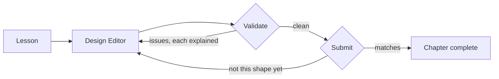

You can follow a system design article completely and still freeze at a blank
canvas. Recognizing a good design and producing one are different skills, and
only the first improves by reading.

ScaleCraft closes that gap by making you build. This chapter teaches the editor
itself, so every chapter after it can teach architecture instead of tooling.

> [!NOTE]
> Think first: what makes an architecture diagram *wrong*, as opposed to merely
> unusual? Commit to an answer before reading on.

## The loop

ScaleCraft is a loop, not a book: read, build, get told what is wrong and why,
fix, move on.

The two backward arrows are the point. Most of your time in a chapter is spent
on them.

## The editor

A canvas, a component picker (`/` or right-click), undo/redo, an opt-in hint,
and two buttons: Validate and Submit. A guided tour walks through it the first
time you open the editor.

## Validate and Submit

| | Validate | Submit |
|---|---|---|
| Asks | Is this structurally coherent? | Is this the design the chapter teaches? |
| Run it | Any time, including half-built | When you think you are done |
| Reports | Each problem, with the reason | Missing, extra, and misconnected components |
| Gates completion | No | Yes |

Submit runs Validate's check first and stops there if it fails. Comparing a
structurally broken graph against a target design produces a meaningless diff,
so you get the structural errors or the comparison, never a blend of both.

A design can be completely valid and still not be what the chapter asked for.
The two buttons are not redundant.

Every result names what the rule saw and why it matters. A failure you cannot
learn from only teaches you to guess again.

## Hints stay closed

Hints never open themselves. Not after a failed check, not after three.

The cost is real: you will sometimes sit stuck longer than a nudge would have
taken. The gain is that you always get to reason your own way out first, which
is the only version of the skill that survives a whiteboard. Opening one when
you want it costs you nothing and is not recorded.

## Four ways to make this harder

- **Treating the issue count as a score.** It is a to-do list. Nothing records
  it.
- **Submitting to find out what is wrong.** Submit runs the same check and
  returns the same list. Validate is faster.
- **Opening the hint before reading the explanation.** The explanation is the
  part written to teach you.
- **Reading a clean Validate as "this is a good design."** It means nothing is
  structurally broken. Whether a design is *good* is a judgment no automated
  check makes.

## Why this resembles an interview

"What happens when that server dies?" is Validate's move: name the problem,
leave the fix to you. Both are training the same reflex, which is why the hint
stays closed.

## Recap

- Validate checks structure. Submit checks structure, then conformance, and
  gates completion.
- Every failure explains itself.
- Hints are opt-in, always, and cost nothing.

## Your turn

The design on the canvas has two deliberate faults. Fix both, get a clean
Validate, then Submit.

The tour walks you through both. To diagnose them yourself instead, press Esc to
pause it - the validation explanations name both faults without it. Resume or
replay from the buttons at the bottom of the lesson sidebar, where Start over
also resets the canvas to the original design.

## Next

"System design" gets used for everything from picking a database to drawing
boxes on a whiteboard, which makes it hard to know when you are getting better
at it. 0.2 replaces the phrase with five forces that every design trades
against: latency, throughput, availability, durability, and cost.
