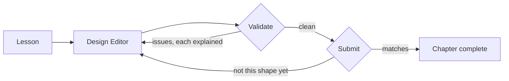

You have probably read a system design article before. Boxes, arrows, a load
balancer in front of two servers, a paragraph about why the database became the
bottleneck. It made sense while you were reading it.

Then someone asks you to design something, and the page stays empty.

## Reading about architecture is not the same skill as producing it

Recognizing a good design when it is shown to you and producing one from a blank
canvas are different abilities, and only the first improves by reading. That gap
is where most system design preparation quietly fails. You finish the article
better informed, which is real, but nothing was ever asked of you.

ScaleCraft is built to close that gap. Every chapter ends by putting you in
front of a canvas and asking for the thing you just read about.

> [!NOTE]
> Think first: what would it mean for an architecture diagram to be *wrong*? Not
> ugly, not unconventional - wrong. Decide on an answer before you read on. The
> editor is about to give you its version.

## The loop

**ScaleCraft is a loop, not a book.** You read a little, build it, get told what
is wrong and why, fix it, and move on.

Notice that two of those arrows point backward into the editor. Those return
trips are not failure states. They are where the learning actually happens, and
most of your time in any chapter is spent on them.

## What the editor gives you

A canvas, a component picker (press `/` or right-click), undo and redo, an
opt-in hint in the sidebar, and two buttons in the top bar: Validate and Submit.
That is the whole surface. A guided tour starts the first time you open the
editor and points at each piece in turn, waiting for you to perform a few of the
gestures yourself.

## What validation actually does

Validate runs a set of rules against your design and reports what they found.
Each rule knows one specific way a design can be incoherent: a component wired
to nothing, a connection pointing the wrong direction, a link of a kind the two
components involved are not allowed to share.

Every result carries an explanation. Not "invalid" and not a red mark, but a
sentence naming what the rule saw and why it matters. That is a deliberate
product commitment rather than a nicety: a failure you cannot learn from is a
failure that only taught you to guess again.

## Validate and Submit answer different questions

They look similar and they are not.

**Validate** is the quick check you run while you are still building. It asks:
is this design structurally coherent? Run it as often as you like, at any point,
including on something half-finished.

**Submit** is the completion gate. It runs the same structural check first, and
only if that comes back clean does it go on to compare your design against the
approach the chapter is teaching. If it does not match, you get a report of the
differences - what is missing, what is extra, which connections are wired
differently - rather than a bare rejection.

The order matters. A design with a component floating unconnected does not get
compared against anything, because a comparison against a broken design would
produce a meaningless list. Fix the structure, then find out whether it is the
design the chapter was after.

A design can be perfectly valid and still not be what the chapter asked for.
That is not a contradiction; the two buttons are answering genuinely different
questions.

## Why hints do not open themselves

Every chapter can carry a hint. It sits in the sidebar, closed, and it never
opens on its own - not after a failed check, not after three failed checks, not
ever.

This costs you something, and it is worth naming honestly. You will sometimes
sit stuck on a chapter longer than a nudge would have taken. The other side of
that trade is that you always get the chance to read the explanation, think, and
reason your way out on your own. Getting there yourself and being told are not
the same experience, and only one of them survives contact with a whiteboard
where nothing is going to nudge you. So the hint stays closed until you decide
otherwise, and opening it costs you nothing when you do.

## Four ways to make this harder than it is

1. **Treating the issue count as a score.** It is a to-do list, not a grade.
   Nothing records how many times you ran Validate.
2. **Submitting to find out what is wrong.** Submit runs the same structural
   check first and hands back the same list. Validate gets you there faster.
3. **Opening the hint before reading the explanation.** The explanation is the
   part written to teach you. The hint will still be there in two minutes.
4. **Reading a clean Validate as "this design is good."** It means nothing is
   structurally broken. Whether it is the design the chapter wanted is Submit's
   question. Whether it is a *good* design is a judgment no automated check
   makes for you.

## Why this loop looks like an interview

An interviewer who asks "what happens when that server dies?" is doing roughly
what Validate does: naming a problem and leaving the fix to you. They are not
going to follow up by telling you to add a second instance.

The habit this chapter builds - read the objection, work out why it is an
objection, then decide the fix yourself - is the habit that question is
testing. It is also the reason the hint stays closed.

## Where this sits

This is the first chapter, so there is nothing behind it to connect back to. It
is the only chapter in the curriculum where that is true.

Ahead of you: you are about to know how this product teaches, without yet having
a definition of the thing it teaches.

## Recap

- ScaleCraft is a loop - read, build, get explained to, fix - and the return
  trips are the point.
- Validate checks structural coherence and always explains what it found.
- Submit is the completion gate: the same structural check first, then a
  comparison against the chapter's approach, reported as differences.
- The hint exists, never opens itself, and costs nothing when you open it.

## Your turn

The design already on the canvas has two real faults in it, put there on
purpose. Fix both, get a clean Validate, then Submit.

The guided tour walks you through both faults. If you would rather diagnose them
yourself, press Esc to pause it - the validation explanations name what is wrong
without it, which is exactly how every chapter after this one works. You can
resume or replay the tour from the pill in the corner of the canvas at any time.

## Next

"System design" gets used to mean everything from choosing a database to drawing
boxes on a whiteboard, which makes it hard to know when you are getting better
at it. 0.2 replaces that vagueness with five specific forces that every design
decision trades against. Every requirement you write for the rest of the
curriculum turns out to be one of those five wearing a number.
