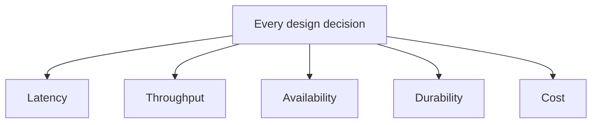

Two engineers look at the same slow endpoint. One says "add a cache." The
other says "add a read replica." Both could be right - the question that
actually decides it is not which fix is cleverer, it's which of a small set
of forces is under pressure here.

> [!NOTE]
> Think first: "system design" is not a list of tools. What is it actually a
> discipline *of*? Commit to an answer before reading on.

## The five forces

Every design decision is a bet about which of five forces matters most right
now: latency, throughput, availability, durability, cost.

The fan-out is the point: a decision does not pick one arrow, it moves all
five at once. The table names each force; the next section shows them
trading.

| Force | What it measures | What failing looks like |
|---|---|---|
| Latency | How long one request takes | A click that used to feel instant now visibly waits |
| Throughput | How many requests the system survives per second | Each request still works alone, but the system falls over under real concurrent load |
| Availability | The fraction of time the system answers at all | An error page, or a spinner that never resolves |
| Durability | Whether data already written is still there later | A write appears to succeed, then is gone after a crash or restart |
| Cost | What the other four are bought with | Nothing is technically wrong - the bill is just bigger than the problem justifies |

Notice these are properties of the *system's behavior*, not names of
components. A load balancer, a cache, a queue - every building block in this
curriculum exists because it moves one of these five, usually at the expense
of another.

The two engineers in the opening are arguing about different forces without
saying so. A cache helps when the same rows are read over and over: it buys
latency, and cost. A read replica helps when the database is simply out of
read capacity: it buys throughput. Which one is right depends on which of
those is true of that endpoint - a question neither engineer has asked.

Five is the working set, not the whole universe: consistency and security are
real design concerns with their own homes later in the course. Until then,
these five carry the reasoning.

## No force moves alone

A cache in front of a database drops read latency sharply and usually cuts
cost, since cache capacity is cheaper than the database capacity those reads
would otherwise need. In exchange, some reads return an answer a few seconds
stale, and you now run one more system. You bought speed with freshness.

Synchronous replication to a second datacenter raises durability sharply: a
whole region can go dark and nothing written is lost. But every write now
waits on a cross-region round trip, so latency rises, and while that second
datacenter is unreachable writes stall rather than complete. Durability here
is bought partly with latency and partly with availability - one decision,
three forces moved.

Both are correct engineering, under different pressure. Neither is free.

## Ways to misread this

- **Treating it as a services checklist.** Knowing what Kafka does is not the
  same skill as knowing when a system needs it.
- **Adding machinery with no force under pressure.** A queue, a replica, a
  cache all cost operational complexity. If nothing is currently slow,
  unavailable, or at risk, that cost has no offsetting benefit.
- **Conflating availability and durability.** A system can be reachable and
  still lose a write (a disk fails mid-write). A system can safely hold every
  byte while being completely unreachable (the network to it is cut).
  Different failures, different fixes - guarding one does not guard the
  other.

## Who picks which force

**Stripe** treats payment writes as durability-first: the write to the ledger
is synchronous, and safe to retry so a repeated request cannot become a
second charge. A lost or duplicated charge costs real money and trust, so
they accept the extra write latency that guarantee requires.

**Netflix** treats streaming metadata as latency- and availability-first:
heavy caching and edge delivery. A slow or unreachable "play" button loses a
viewer immediately, so they accept that a view count or rating can be
briefly stale.

Neither choice is universal. A payments system built like Netflix's cache
would lose money; a video catalog built like Stripe's ledger would grind
under load it doesn't need synchronous durability for. The forces are the
same five - the pressure on each is what differs.

## Why this resembles an interview

Interviewers hand you constraints in disguise. "Assume heavy read traffic"
is a way of saying throughput and latency outrank durability here; "this is
a payments system" says the reverse. Translating the constraint into a force,
out loud, is what separates "I'll add a cache" from a reasoned answer.

What that sounds like at a senior level: *"Reads dominate, and a few seconds
of stale data is acceptable here, so I'll buy read latency with freshness. If
that second assumption is wrong, say so now, because the design changes."*

## Recap

- Five forces: latency, throughput, availability, durability, cost.
- They trade against each other - moving one usually moves another.
- Architecture responds to whichever force is actually under pressure, not
  to whichever component sounds impressive.

## Your turn

No build this chapter - the five forces above are the whole lesson, and the
knowledge check below is where you put them to work: five short systems,
one dominant force each. Read every explanation, including the ones you get
right; the reasoning is the point, not the score.

## Next

You already ran the Reader-to-Editor loop once, in 0.1 - every future build
in that loop is really a bet about which of today's five forces matters most.

The awkward part is that the same design can be the right answer in an
interview and the wrong one in production, because the two reward different
things: visible reasoning about alternatives versus a boring choice that
pages nobody at 3am. 0.3 separates those two registers, so you always know
which one a section of this course is written in.

Further out, in 1.3, the forces stop being adjectives and become numbers you
commit to before designing: an availability target, a latency budget.
