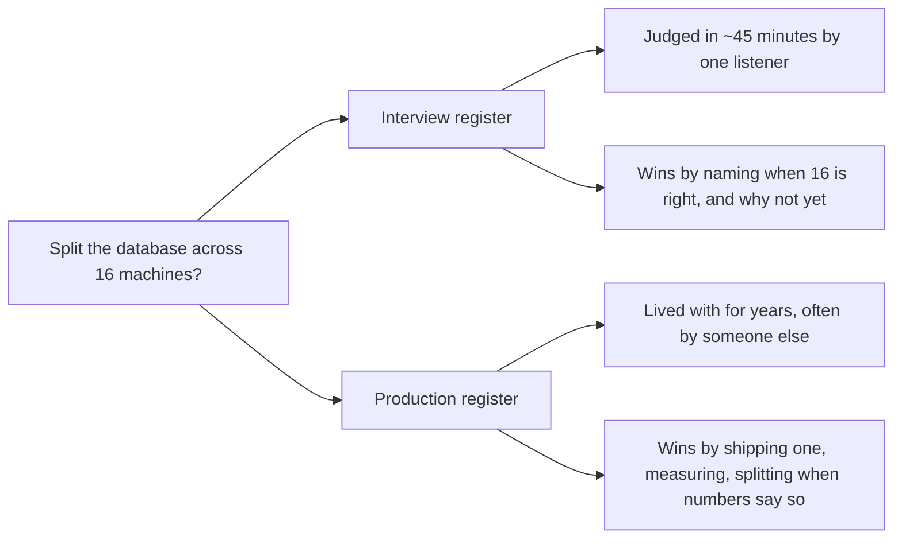

A candidate opens a system design interview by proposing to split the database
across sixteen machines in three regions - minute one, before anyone has said
how many users there are. The interviewer asks the obvious follow-up: "why
sixteen, why now?" There is no answer beyond "to be safe." The same missing
answer follows that habit into production, where the reward for machinery nobody
needed is being woken at 3am by a part of the system that never had to exist.

> [!NOTE]
> Think first: are the right interview answer and the right production
> answer to the same design question ever *different*? Think of one case
> where they'd diverge, and one where they'd match.

## Two registers, one question

A *register* is the setting a decision gets judged in: who judges it, over what
span, and what they count as a good answer. Interview and production are two
registers, asking the same question of any design decision - is this justified -
and rewarding different answers to it.

Nothing about the decision changed between the two branches. Only the judge and
the clock did.

| Dimension | Interview register | Production register |
|---|---|---|
| Time horizon | One conversation, ~45 minutes | Months to years; someone else may run it |
| What's rewarded | Reasoning made visible, trade-offs named aloud | Boring, reversible, well-understood choices |
| Cost of being wrong | A missed signal, not a real outage | A 3am outage: real money and trust lost |
| Default posture | Propose, justify, invite pushback | Don't build it until a force is actually under pressure |

Boring and reversible carry that second column. *Boring* means enough teams have
run this before you that its failures are already written down, so whoever
inherits it at 3am is not the first person to see that error. *Reversible* means
being wrong costs an afternoon, not a migration: one database can move to a
bigger machine later; sixteen are hard to merge back into one.

## Same brief, two registers

Take one brief: a link shortener, 500 new links a day. In the interview register
you reason out loud: "One database, one table mapping short code to long URL. At
500 links a day nothing is under pressure, so anything more is unjustified -
here's the traffic where I'd add a cache, and we're nowhere near it." In the
production register the same engineer ships that one database, puts read latency
and disk usage on a dashboard, and adds the cache only once the dashboard - not
a hunch - shows reads slowing.

Same architecture both times. The interview version has to say the reasoning out
loud, in the room, in one pass; the production version has to leave it behind in
something a stranger can read next quarter.

This is 0.2's five forces again, applied to a decision instead of a system:
neither register lets you add machinery with no force under pressure. The
interview register just makes you say so.

## Production examples

**Stack Overflow** served one of the internet's most-visited sites from nine web
servers and a handful of database machines, long after conventional wisdom said
to spread that job across hundreds. They published the traffic numbers that
justified it. The trade-off: a capacity ceiling to watch for, in exchange for a
system a few people could hold in their heads.

**Discord** replaced the database under its message history once the messages
stopped fitting in memory - around 100 million of them - and reads turned slow
and unpredictable. A named force with a number attached, so the larger, more
complex system won: same register as Stack Overflow, opposite move.

## Ways to misread this

- **Treating "sounds impressive" as the interview goal.** A design built for a
  hundred times the traffic that exists reads as scale theater, not depth - see
  the cold open.
- **Treating "production favors boring" as "never adopt complexity."**
  Discord's migration is the counter-example: boring wins by default, not by
  rule.
- **Bringing interview energy into production.** Proposing a clever fix with no
  operational case for it, shipping it, and then being the person who has to
  keep it alive.

## Why this resembles an interview

An interviewer who asks "now imagine this is actually live - what would you ship
first?" is inviting a register switch, not laying a trap. The senior move is to
notice the switch, answer in the new register on purpose, and say which one
you're in.

The same move rescues "it depends," which is true and useless alone: name the
variable, then commit on both sides of it. "It depends whether reads or writes
dominate - if reads, I'd add a cache first; if writes, a cache doesn't help and
I'd look at the database itself." The branch is the answer; refusing to branch
reads as evasion.

What that sounds like at a senior level: *"So far I've been answering as a
design conversation: one database, because at 500 links a day nothing is under
pressure. If you're asking what I'd deploy Monday, the design is the same - what
changes is that read latency and disk growth go on a dashboard first, so the
decision to split it later is made by a number, not by me guessing."*

## Recap

- Interview and production ask the same question of a decision - is this
  justified - and reward different answers, over different time horizons.
- Production defaults to boring and reversible. Interview rewards visible
  reasoning, and noticing when you're asked to switch registers.
- Unjustified complexity fails in both registers. A real force under pressure
  earns complexity; vocabulary doesn't.

## Your turn

No build this chapter - the knowledge check below is where the two registers
get applied to new scenarios. Read every explanation, including the ones you
get right; the reasoning is the point, not the score.

## Next

0.2 gave you the test underneath this whole chapter: a force under pressure. And
0.1 already put you on the receiving end of the interview register - a validation
failure that names what's wrong without saying how to fix it applies the same
pressure an interviewer's follow-up does.

0.4 previews the whole Interview Loop as a map of Part 1, so you see the
eight-step workflow once before living each step - the natural next question
after this chapter is "so what's the actual step-by-step process a strong
candidate runs?"

Further out, 1.11 puts that loop under a clock, with both registers in play at
once.
