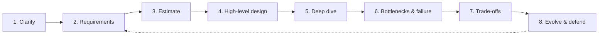

A candidate gets asked to design Twitter. Fifteen minutes in, they have a
client, a load balancer, app servers, a database, and a cache on the board -
a real system, drawn fast. The interviewer stops them: "how many users, and
is this read-heavy or write-heavy?" The candidate doesn't know. Half the
diagram assumes read-heavy, the other half assumes write-heavy, and the next
ten minutes go to redrawing it. Nothing they drew was wrong in isolation.
The order was.

> [!NOTE]
> Think first: what's the very first thing a strong candidate should do when
> handed an open-ended prompt like "design Twitter"? Commit to an answer
> before reading on.

## The loop

The **Interview Loop** is what prevents that failure: eight steps, each
producing what the next one needs, run in the same order every time. It
isn't an interview trick - it's the shape any design conversation takes when
it goes well, whether you narrate it in 45 minutes or write it down over a
week.

The dotted arrow is why it's a loop: a follow-up at step 8 usually sends you
back into an earlier step, not forward into a new one.

## What each step produces

| Step | Produces | You'll live it in |
|---|---|---|
| 1. Clarify | Scope: who uses this, what matters, what's out | 1.1 |
| 2. Requirements | Promises: functional (what it does) and non-functional (how well) - 0.2's five forces, once you can put a number on them | 1.2-1.3 |
| 3. Estimate | Orders of magnitude: users to QPS (queries per second) to storage to bandwidth | 1.4-1.5 |
| 4. High-level design | A first architecture: entry point, compute, data | 1.6 |
| 5. Deep dive | One level down on the one or two subsystems the requirements stress | 1.9 |
| 6. Bottlenecks & failure | What breaks first, and where the single points of failure are | 1.7 |
| 7. Trade-offs | The roads not taken, and their cost | 1.8 |
| 8. Evolve & defend | Answers to follow-ups, without abandoning the design | 1.10-1.11 |

Each row needs the one above it. You can't set a latency budget (2) for a
scope you haven't fixed (1). You can't pick an entry point or a data store
(4) without a scale to design for (3). The cold-open candidate skipped
straight to 4 - the diagram was fine; the ground under it was guessed.

## How far back to go

A follow-up at step 8 rarely means starting over - it means deciding how
much to re-run. "Now make it global" might only touch step 4 (a new entry
point), or it might reopen step 2 (a new requirement, which then forces a
fresh deep dive too). Restarting from step 1 is always safe but costs time
you don't have; patching only the step that obviously changed is fast but
risks leaving an earlier assumption silently wrong. Check requirements
first - they're usually what actually moved. If they didn't, the fix really
is local.

## Same loop, on paper

The two registers from 0.3 run this same loop on different clocks: an
interview compresses all eight steps into one sitting and narrates them
aloud; production stretches them across days and writes them down. Google's
design docs state goals and non-goals (steps 1-2), lay out the design (4-5),
and list alternatives considered and rejected (7) before anyone writes code.
Amazon's "6-pager" does the same job in the form of a narrative memo, read
silently at the start of the meeting, so nobody commits to a solution before
the problem is nailed down. Same loop, same order, different pace.

## Common mistakes

- **Drawing before clarifying.** The cold open's mistake, and the most
  common one. It looks fast and costs more time than it saves.
- **Picking a design without naming what you didn't pick.** Skipping step 7
  silently instead of stating the trade-off out loud.
- **Treating a follow-up as an attack.** Step 8 is the loop's invitation to
  go around again on a narrower slice, not a challenge to what you already
  said.

## In an interview

Silence after your answer usually means "keep going." A follow-up almost
always targets one specific step: "what if this server dies?" is step 6;
"10x the writes" reopens steps 3 and 5, on new numbers. Naming which step
you're in, out loud, is itself a signal - it tells the interviewer you have
a process, not just an answer.

What that sounds like at a senior level: *"Before I draw anything, let me
clarify who's using this and at what scale. Once I have requirements and a
rough estimate, I'll sketch a first design - then we can go deep wherever
you want."* Four steps, named, before a single box gets drawn.

## Recap

- Eight steps, each producing what the next needs: clarify, requirements,
  estimate, high-level design, deep dive, bottlenecks & failure,
  trade-offs, evolve & defend.
- Skipping a step doesn't save time - the step comes back as rework later,
  usually in front of whoever's judging the design.
- The loop isn't linear in practice: a follow-up sends you back into
  whichever earlier step it actually changed.
- Same loop, both registers (0.3): narrated in 45 minutes in an interview,
  written down over days in production.

## Your turn

No build this chapter - one question in the knowledge check below asks you
to place the eight steps in order yourself, then explains each placement.
That ordering is the actual exercise; read every explanation, not only the
ones you get wrong.

## Next

0.2 gave you the five forces; 0.3 gave you the two registers a design
decision gets judged in. This chapter gave you the order the work happens
in - the loop those forces and registers run inside.

1.1 drops you into step 1: clarify. It sounds like the easy step - ask a
few questions and move on - but most candidates either skip it or ask
questions that don't change anything about the design. 1.1 is about the
four questions that would.

Further out, step 4 - high-level design - is where the loop stops being a
conversation and becomes a diagram you actually draw: 1.6 is your first
real build on the canvas.
