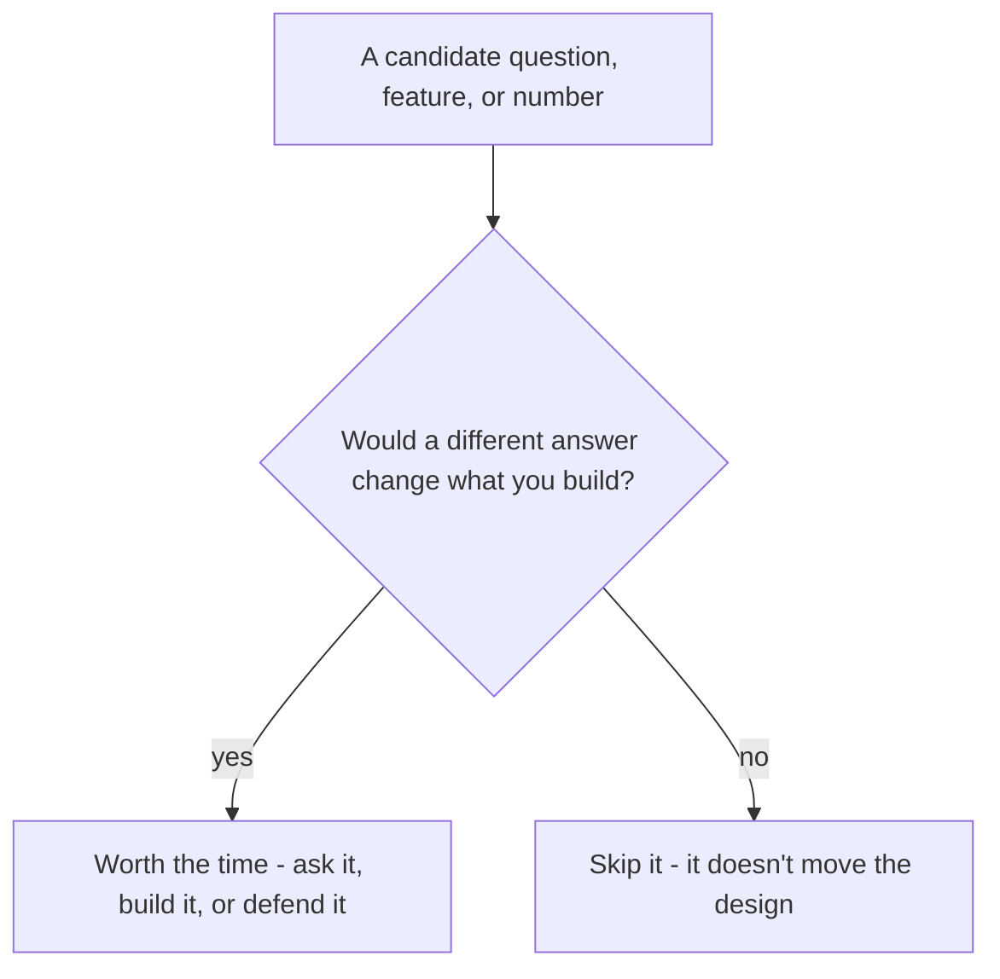
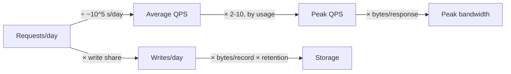

"Design a URL shortener." A candidate draws a full system - client, load
balancer, app servers, a database - in under five minutes, then lists every
feature that comes to mind: create, redirect, custom aliases, click
analytics, QR codes, an API for other teams. "How fast does redirect need to
be?" the interviewer asks. "Fast," the candidate says. "Roughly how much
traffic?" "A lot, probably." Twenty minutes in, nothing is scoped, nothing is
measured, and the diagram already needs to change: it turns out reads
outnumber writes 1000 to 1, a fact that should have shaped the first line
drawn, not the last one.

> [!NOTE]
> Think first: before drawing anything, three separate questions never got
> asked - which features does this system actually need, how fast does
> "fast" mean, and roughly how much traffic is "a lot." What's the one test
> that would answer all three, in under five minutes?

## The test, applied three times

A decision, whether it's a question to ask, a feature to build, or a number
to promise, earns the time it costs only if a different answer would change
what you build. Loop steps 1-3 (clarify, requirements, estimate) are the same
test, run against three different inputs.

Note: the same branch runs three times below - on questions, on features, and
on precision. Different inputs, one test.

## Step 1: Clarify

Four categories cover most of what's worth asking: scope (what's actually
being built), scale (order of magnitude, not a precise number), usage
pattern (which direction the load leans), and non-negotiables (hard
constraints, like whether links expire). A question can sit in a category
and still fail the test - "six-character codes or eight" is a scope question
that changes nothing you'd draw. The category tells you where to look; the
test above still decides.

A good answer collapses part of the design space before anything is drawn.
At a 1000:1 read:write ratio, the read path is where the design work goes;
near 1:1, it flips and the writes get hard. That's why "read-heavy or
write-heavy" is one of the highest-value questions available: one answer,
and an entire branch of the design becomes central or drops out.

## Step 2: Requirements - what it does, and how well

Two lists come out of this step: what the system does (functional) and how
well it has to do it (non-functional). Both run the same test, just aimed
differently.

**Functional - the Must-have list.** A feature earns Must only if the system
fails its core job without it. For the URL shortener, that job is create and
redirect; everything else sorts into three weaker buckets:

| Category | What it means | Example |
|---|---|---|
| Must | Core job fails without it | Create a link, redirect it, expire it (once confirmed) |
| Should | Core job survives, but painfully | Reject a malformed URL before shortening it |
| Could | Real value, nothing core depends on it | Custom aliases, QR codes |
| Won't (this pass) | Deferred, written down, not forgotten | Click-count dashboard, user accounts |

Expiry moved into Must because clarifying confirmed links expire - a Could
becomes a Must the moment an answer settles it. Should, Could and Won't
aren't "no," they're "not this pass," and that distinction only holds if
it's written down: an unwritten cut resurfaces mid-build the moment someone
assumes it was obviously included.

**Non-functional - numbers, not adjectives.** "Fast" and "highly available"
can't be tested; nobody can prove or disprove a feeling. A defensible number
can:

| Force (same five as 0.2) | Stated as | Worked example |
|---|---|---|
| Latency | Milliseconds, at a percentile | p99 under 200 ms |
| Throughput | Requests/sec, a floor | 5,000 req/s at peak |
| Availability | A percentage - uptime nines | 99.9% |
| Durability | Tolerance for lost writes | Near zero, after one node failure |
| Cost | A budget ceiling | Under $2,000/month |

Latency is measured at a percentile because an average hides the requests
that hurt - p99 answers "how bad is the worst 1%," the number that actually
matters to whoever lands in it. Availability has the same problem until it's
converted into time:

| Availability | Downtime/year |
|---|---|
| 99% | ~3.65 days |
| 99.9% | ~8.76 hours |
| 99.99% | ~52.6 minutes |
| 99.999% | ~5.26 minutes |

Each extra nine cuts downtime tenfold, and costs roughly an order of
magnitude more engineering to hold - a todo app doesn't need the machinery a
payments API might need regardless of the bill.

## Step 3: Estimate - order of magnitude, not decimals

Estimation's deliverable is a power of ten, not a decimal place. A day holds
86,400 seconds, close enough to 10^5 that rounding it costs nothing a design
would notice:

Note: storage is the only number that accumulates - it multiplies by a
retention window instead of dividing into a rate.

10 million redirects a day, divided by ~10^5 seconds, is about 100 QPS
average. Average isn't the number that decides anything, though: a launch or
a viral link pushes traffic to 2-10x average, so peak lands between 500 and
1,000 QPS, a real design difference a hundred QPS doesn't have. Storage and
bandwidth, by contrast, land small enough (a couple GB, under a megabyte a
second) that refining either past the first digit is exactly the wasted
precision the cold open's "fast, probably a lot" was hiding from the other
direction.

**Numbers worth memorizing, not deriving.** Some ratios are worth knowing
outright, because working them out live reads to an interviewer the same as
not knowing them, and one pair gets guessed backwards more than any other:

| Operation | Roughly | In practice |
|---|---|---|
| RAM reference | ~100 ns | A cache hit already in memory |
| SSD read | 10-100x a RAM reference | A row your cache doesn't have |
| Same-datacenter round trip | ~50x an SSD read | Calling a service one hop away |
| Disk seek | 10-20x that same-datacenter hop | A traditional spinning-disk database |
| Cross-continent round trip | 150-300x the same-datacenter hop | Serving a user from another region |

The counter-intuitive pair: a same-datacenter network hop is usually
*faster* than a local disk seek. That's the reason a memory cache sits
between an app server and its database at all - moving a read from disk to a
nearby machine's memory is a win even though it "leaves" the machine.

## What ties the three steps together

The loop's steps aren't independent boxes; an answer from one becomes an
input to the next. The read:write ratio from clarify is also step 3's real
traffic split, not just an illustration - 1000 creates a day next to 10
million redirects, the same number, used twice. Requirements' expiry-after-
a-year promise is also the retention window estimate multiplies storage by.
Nothing here is recomputed from scratch at each step; each step spends the
answer the last one already bought.

## The cost of asking, building, and computing

None of this is free. Too little clarifying costs a redraw; too few
Must-haves ship a broken core; a bare adjective rules nothing out; too much
precision spends time a design decision was never going to use. Too much of
any of them eats the interview's clock: clarify and requirements together
get roughly 5-10 minutes of a 45-minute interview, estimation about 5 more -
not because the numbers don't matter, but because five other loop steps
still need the other 30.

## In production

Amazon S3 publishes two separate numbers for the same product: 99.999999999%
durability (an object almost never disappears) and, separately, 99.9%
availability (the service can be briefly unreachable). Losing a customer's
only copy of a file is unacceptable, so S3 replicates for that guarantee at
write time; a brief outage is just a retry. Two different failures, two
different numbers - the exact distinction 0.2's five forces warn against
collapsing into one.

## Common mistakes

- **Drawing before asking anything**, or asking questions that don't pass
  the test - database choice and language feel like design questions but
  are decisions you make, not facts to collect.
- **Treating every feature idea as a requirement**, then owing a design for
  all of them instead of a Must-have list.
- **Stating a feeling instead of a number** ("fast", "reliable") - not
  testable, rules nothing out.
- **Computing storage or bandwidth to the byte** after the order of
  magnitude already answered the question, or skipping the peak multiplier
  entirely.
- **Assuming local disk beats a network hop.** It usually doesn't, inside
  one datacenter.

## In an interview

Each step gets a few sentences, not a monologue. What that sounds like at a
senior level: *"Before I draw anything: roughly how many links a day, and is
this read-heavy? [confirms 1000:1, links expire] Good, so the core is
create, redirect, and honoring that expiry; I'd defer analytics and accounts
for this pass. Redirect latency: p99 under 200 ms, since a click should feel
instant. Traffic-wise, call it a hundred QPS average, a few hundred to a
thousand at peak - storage and bandwidth both stay small here, so I won't
spend more time on either."* Three loop steps, one flowing answer, each
number defended by what it would change.

## Recap

- A decision (a question, a feature, a number, a digit of precision) earns
  its time only if a different answer would change what you build - the one
  test behind all three steps.
- Must/Should/Could/Won't sorts features by whether the core job survives
  without them; write the cuts down or they resurface mid-build.
- Non-functional requirements are numbers, not adjectives - each of the five
  forces (latency, throughput, availability, durability, cost) gets a
  defensible figure.
- Estimation's deliverable is an order of magnitude; get precise only where
  a number sits near a threshold that would flip the design.
- Memorize the RAM/SSD/network/disk ratio ladder instead of deriving it
  live, and remember the one swap: a same-datacenter hop usually beats local
  disk.

## Your turn

No canvas build this chapter - the three primitive components arrive next
chapter, so there's nothing to place yet. The knowledge check below covers
all three steps: picking clarifying questions that pass the test, sorting
features into Must and the rest, matching a promise to the right number, and
estimating an order of magnitude. None of the answers are given away in
advance.

## Next

0.2 named the five forces; 0.4 gave you the loop they run inside, with
clarify, requirements, and estimate as its first three steps. This chapter
turned all three into one test, applied three times.

Designing the System takes what you've scoped and measured here and puts it
on a canvas for the first time: your first client, app server, and database,
and the first validation rule you'll ever meet.
