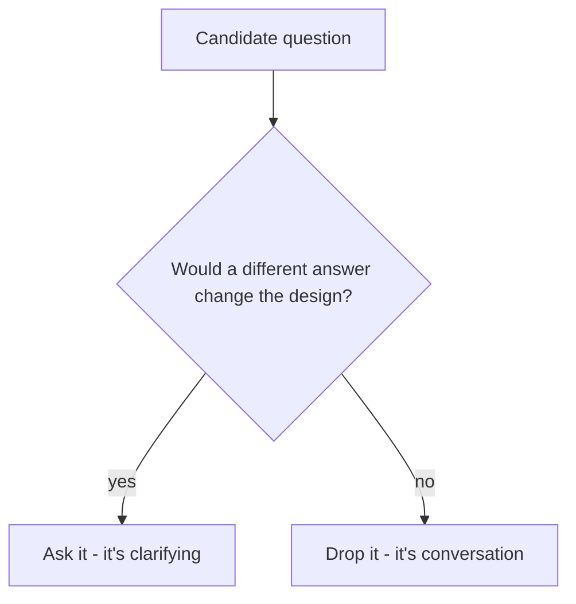

An interviewer says: "Design a URL shortener." A candidate starts drawing
immediately - a client, a load balancer, a couple of app servers, a
database - and has a full system on the board in under five minutes. Ten
minutes later the interviewer asks: "roughly how many links get created a
day, and is this mostly people creating them or people clicking them?" The
candidate doesn't know, and the honest answer changes the design: if it's
almost all clicks, the read path is where the design work goes; if creation
comes in heavy bursts, storage is. The five minutes weren't wasted. They were
spent drawing a shape that now has to change.

> [!NOTE]
> Think first: you have time for exactly three questions before you have to
> start designing. What's the test you'd use to pick which three?

## The test

A clarifying question earns its place only if a different answer would
change the design. "What database should I use?" fails it - not because the
answer is unimportant, but because it isn't a fact about the problem. It's a
decision that's yours to make, handed back to the interviewer. "What's the
read-to-write ratio?" passes: a 1000:1 ratio and a 1:1 ratio lead to
genuinely different architectures.

Note: the branch is the whole mechanism. Almost any question about the
system is interesting; only some are load-bearing.

## Where to look

Four categories cover most of what's worth asking. You don't need domain
expertise to use them - you need to notice which category the brief left
open.

| Category | Pins down | Example |
|---|---|---|
| Scope | What's actually being built vs. assumed | "Is this only link creation and redirect, or also analytics?" |
| Scale | Order of magnitude, not a precise number | "Roughly how many links a day?" |
| Usage pattern | Which direction the load leans | "Read-heavy or write-heavy?" |
| Non-negotiables | Hard constraints that aren't up for debate | "Do links need to expire, or ever get deleted?" |

A question can sit in a category and still fail the test. "Six-character
codes or eight?" is a scope question on its face, but neither answer changes
anything you would draw. The category tells you where to look; the test in
the diagram above still decides whether to ask.

## What a good question actually does

A good clarifying question doesn't only gather a fact - it collapses part of
the design space before you've drawn anything. "Read-heavy or write-heavy?"
is the clearest case. At 1000:1, the read path is where the design work goes
and the write path can stay simple for now. At near-1:1 that flips, and the
writes are the hard problem.

Notice how much that answer settles, and how much it doesn't. 0.2's two
engineers argued cache versus read replica over the same slow endpoint, and
a ratio alone picks neither: a cache pays off when the same rows are read
over and over, a replica when one database is out of read capacity.
"Read-heavy" tells you which question to ask next, not which fix to buy.
That is why the test says *part* of the design space - one answer closes a
branch, it doesn't hand you the design.

## The cost of asking

Clarifying isn't free. Too few questions and you design for the wrong
system - the cold open's mistake, where the redraw costs more than the
questions would have. Too many and the clarifying eats the design: 0.3's
~45 minutes has to cover all eight of 0.4's loop steps, so this one is worth
a couple of minutes, not ten. The four categories exist so you can ask two
or three sharp questions instead of working down a checklist out loud.

## Common mistakes

- **Drawing before asking anything.** The cold open's mistake, and the one
  candidates make most often under time pressure.
- **Asking questions that don't pass the test.** Database choice, language,
  framework - these feel like architecture questions, but they're decisions
  for you to make, not facts about the problem to collect.
- **Reciting a fixed checklist.** The four categories are where to look, not
  a script - a chat app and a URL shortener don't need the same three
  questions.
- **Treating clarify as one-and-done.** New information later ("now make it
  global") can send you back here - 0.4's loop reopens whichever step
  actually moved, and sometimes that's step 1.

## In an interview

The strongest opening move is two or three questions in under a couple of
minutes, taken from whichever categories this brief leaves open. Not a
checklist recited from memory, and not silence followed by a guess. A
follow-up like "why does that matter?" is an invitation to name the branch:
which design decision the answer would flip.

What that sounds like at a senior level: *"Before I draw anything - roughly
how many links a day, and is this mostly reads or writes? And do links ever
expire?"* Three questions, each picked because a different answer would send
the design somewhere else, and each answerable in a sentence.

## Recap

- A clarifying question earns its place only if a different answer would
  change the design - everything else is conversation.
- Scope, scale, usage pattern, and non-negotiables are where to look, not a
  script to recite.
- A good answer collapses part of the design space before anything is drawn -
  it closes a branch, it doesn't hand you the design.
- Too few questions costs a redraw later; too many spends the interview's
  small clarify budget on questions that don't move anything.

## Your turn

No canvas build this chapter - the three primitive components (client, app
server, database) aren't introduced until 1.6, so there's nothing to place
yet. The knowledge check below gives you a brief and a list of candidate
questions; picking the ones that pass the test above, and only those, is
the actual exercise. You aren't told in advance which ones qualify - working
that out is the point.

## Next

0.2 gave you the five forces; 0.4 gave you the loop those forces run inside,
with clarify as step 1. This chapter gave you the one test that decides
whether a question belongs in that step at all.

1.2 takes the answers those questions get back and turns them into a concrete
list of what the system must do - functional requirements. The hard part
there isn't listing features - it's cutting the ones that sound essential and
aren't, before they become architecture you have to defend.

Further out, 1.6 is where scope and requirements finally become a diagram
you draw on the canvas - your first real build.
