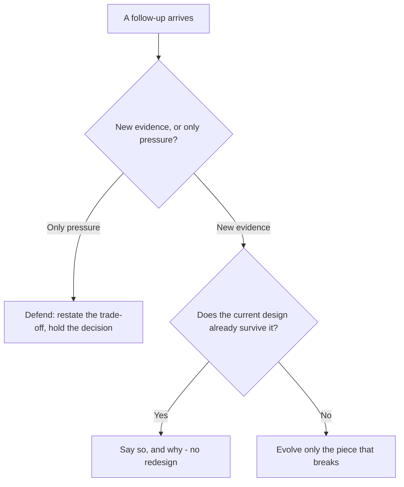

You just resurfaced from the deep dive - the read path, explained, then
reconnected to the rest of the design. "Good," the interviewer says. "Now
what if writes grow 10x?" You freeze, erase half the diagram, and start
redrawing from a blank page with no explanation for why the old design
stopped working. Three minutes later the interviewer has lost the thread,
and so have you.

A follow-up isn't a verdict on what you already drew. It's new input, read
the same way 1.3's requirements and 1.7's ceiling method already taught you
to read pressure. Treating it like an accusation throws away work that is
probably still mostly right.

> [!NOTE]
> Think first: before reading on - when writes grow 10x, what's the very
> first thing to check about the *existing* design, before changing
> anything? Commit to an answer before reading on.

## Reading a follow-up

A follow-up gets a test, not a reaction: is this new evidence or only
pressure, and if it's evidence, does the current design already survive it.

Note: three of the four paths end without a redesign - even the fourth
changes one piece, not the whole diagram.

## Narrate first, defend second

Before any follow-up lands, the design gets said out loud top-down, once:
entry point to compute to data, the same order it was drawn in 1.6, with the
reasoning from 1.7-1.9 attached as it goes. This is the version the
interviewer is reacting to once follow-ups start - skip it, and every
follow-up lands on a design the interviewer never actually heard.

The two-question test above runs on each one:

| Follow-up sounds like | Question 1 says | Move |
|---|---|---|
| "What if writes grow 10x?" | New evidence - a real requirement change | Check whether the write path (1.9's method) already has headroom before changing anything |
| "Why not just use a bigger machine?" | Only pressure - a challenge to a choice already made | Defend: restate what more instances buys and costs (1.8), unless the challenge names something the trade-off missed |
| "What happens if the app server restarts mid-write?" | New evidence - and the current design has no answer | Name the gap honestly; nothing taught so far fixes it |

The third row is a real limitation, not a hypothetical: nothing this
curriculum has taught yet makes a write survive a mid-crash restart. Naming
that honestly - "the write path doesn't handle that yet, and here's
specifically what would need to change" - is a stronger answer than
inventing a fix on the spot or pretending the question didn't land.

## Defending without being defensive

Defending a decision reuses 1.8's own trade-off reflex, extended one clause:
"we chose X, accepting Y, because Z - and Z hasn't changed, so X still
holds." That last clause is the whole difference between defending and
repeating. If the follow-up genuinely changes Z, the honest move is the
opposite: name what changed your mind out loud, then say what's different in
the design.

## Redesign live, or name it and move on?

A follow-up that exposes a real gap doesn't settle how much interview time
to spend fixing it live. Redesigning the write path in real time proves the
fix is understood, but spends minutes that might be needed for the rest of
the loop. Naming the fix conceptually - what changes, roughly what it costs
- proves the same judgment faster, at the cost of never showing the detail.
Neither is automatically right: a real gap with plenty of time left is worth
drawing; the same gap with barely any time left is not.

## In production

Dropbox's 2016 move off Amazon S3 onto its own storage system was publicly
challenged before it shipped - "why not just stay on S3?" was the standing
question from engineers outside the company. Dropbox's answer ran the same
test: the follow-up was real evidence (cost and control at their specific
scale), not only pressure, and the existing setup did not already survive
it. They named the trade-off - more infrastructure to run, in exchange for
cost and control S3 couldn't give them at that volume - and defended it in
public with numbers, rather than caving to the skepticism or refusing to
explain the reasoning.

## Common mistakes

- **Treating every follow-up as an accusation** - reacting to "what if X?"
  as "you got it wrong," instead of new input to test.
- **Caving immediately** - changing the design the moment it's challenged,
  without checking whether the original reasoning still holds.
- **Refusing to budge** - the opposite failure: holding a decision after the
  follow-up has named a real gap in it.
- **Redesigning everything** - the cold open's failure: one piece needs to
  change, and the whole diagram gets erased anyway.

## In an interview

This is loop step 8 (0.4): evolve and defend, the last step before the
conversation is judged as a whole. Interviewers watch specifically for the
difference between defending a decision that still holds and defending one
that doesn't.

What that sounds like at a senior level: *"That's a real change - let me
check the write path against it. It doesn't hold past that volume; I'd add
whatever closes that gap, and the rest of the design is unaffected. If it
turned out the design already had headroom, I'd say that instead and leave
it alone."*

## Recap

- A follow-up gets a test, not a reaction: new evidence or only pressure,
  and if it's evidence, whether the current design already survives it.
- Narrate the whole design top-down once, before follow-ups start - it's
  the version the interviewer is reacting to.
- Defending reuses 1.8's reflex with one clause added: the reason still
  holds, so the decision does too - and the honest opposite when it doesn't.
- A real gap gets named honestly, not invented around or erased into a full
  redesign.

## Your turn

No canvas build this chapter - the palette is still 1.6's three components,
and reading a follow-up doesn't need a fourth. The knowledge check presents
follow-up questions on a design and asks you to pick the strongest response,
reading why the weaker ones fail the test - the exercise this chapter is
built around, run directly in the quiz.

## Next

1.7's ceiling method, 1.8's trade-off reflex, and 1.9's state-the-plan-then-
resurface discipline are the three moves this chapter runs live under
pressure - loop step 8 (0.4) is now covered, and Part 1's eight-step loop is
complete end to end.

1.11 Driving a System Design Interview picks this up directly: the same
eight steps, now run together under a real clock, with the parts that go
wrong when nobody is holding the whole conversation. Further out (2.3): the
write-path gap named here, and its whole class - what a design actually
becomes as scale climbs a full order of magnitude at a time - gets its own
dedicated story there.
