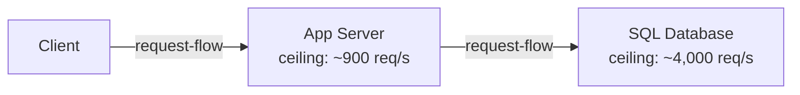
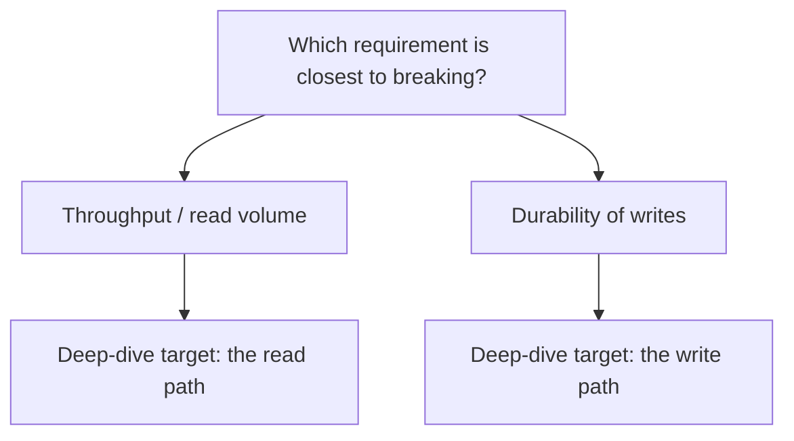

1.1 got you a scoped problem and real numbers. None of that is a diagram yet.
"Walk me through the architecture," the interviewer says, and most
candidates either freeze at the blank canvas or jump straight to naming a
specific database before deciding what any box actually needs to do.

Every real system, at any scale, does exactly three jobs: take a request in,
decide what to do with it, and remember the result. Once that shape exists,
two more questions follow immediately: what breaks first as traffic grows,
and if you had to explain one part of this in more depth, which part? Three
loop steps, in order: high-level design, deep dive, bottlenecks.

> [!NOTE]
> Think first: what is the fewest number of boxes a real, working system
> needs, not a toy, an actual system a user could depend on? Commit to a
> number before reading on.

## The minimal shape

Three jobs, three boxes. A client issues the request. An app server decides
what to do with it. A database remembers the result.

Note: no edge skips the middle box - the app server is the only path to the
database. It also carries the lower ceiling here, which matters later in
this chapter: a system's ceiling is always its lowest number on the path,
not the average, and not the most expensive box.

## What each box does

- **Client** - issues the request. Nothing more is trusted to it.
- **App server** - the only component allowed to reach the database. It
  checks who is asking, applies whatever business rules the product needs,
  and only then reads or writes.
- **SQL database** - durable storage, nothing else. It has no idea who is
  asking or why, only what to store.

`request-flow` is a synchronous edge: whichever component sent it is
waiting on a response before doing anything else.

## Why the database never talks to the client directly

Mediation is the app server's whole job, one level down: it checks who is
making the request (authentication), whether they're allowed to (authorization),
and whether the request itself is legal for the product (business rules - a
banned link, a deleted account, a rate limit). A client wired straight to
the database skips every one of those checks, because nothing is in the way
to ask whether it should. Draw that edge on your canvas later this chapter
and Validate will catch it immediately - that's `no-direct-client-database`,
deliberately your first real encounter with a validation rule protecting
something.

**One instance, for now.** A single app-server instance is the simplest
correct answer at today's scale - 1.1's own estimate sized this system well
within one server's headroom, so this isn't an oversight. The honest cost:
everything depends on that one process.

## Two methods for looking closer

Two questions come up constantly once a design exists: what's the weakest
point, and if asked to go deeper, where? Both reduce to the same underlying
comparison.

**Finding the ceiling.** Every component on a request path has a ceiling:
the maximum load it sustains before requests queue, slow down, or fail. The
system's ceiling is the *lowest* of those numbers, full stop, not the
average and not whichever component sounds more important. In the diagram
above, the app server's ~900 req/s beats the database's ~4,000, so it sets
the system's ceiling today - a fact about today's numbers, not a permanent
property of app servers in general; change the numbers and the answer moves
with them.

A component can also get *slower* without becoming the bottleneck: if the
database's queries take longer as a table grows, every request pays more
latency, but its throughput ceiling may not have moved. That's a slow
problem, fixable with an index or a query rewrite. A component is
*unscalable* when the ceiling itself is the wall - more traffic never
clears no matter how long you wait. Treating one as the other wastes the
fix.

**Picking a deep-dive target.** The same comparison, aimed at a different
question. Two sub-questions, not a guess:

1. Which requirement (1.1's numbers) is closest to its limit right now?
2. Which component on the path is where that pressure actually lands (the
   ceiling method above)?

The intersection is the target - naming what's under pressure, not the fix
for it. Going one level down means stating the plan before diving ("the
read path is where the requirement stresses hardest, so that's where I'd
go") and resurfacing after with one sentence reconnecting the detail to the
whole design. Ten minutes on one component's internals with no return trip
loses the room; the interviewer stops tracking why it matters.

## Two trade-offs, both genuinely two-sided

**Preempt it or wait for it.** Given a known future ceiling, add capacity
before it bites, or wait until it's real and fix it then. Preempt and you
pay complexity today for a wall that might arrive later than predicted, or
not at all. Wait and you risk a scramble under load. Neither is free; the
right call depends on how expensive an outage is versus how confidently you
can predict the growth curve.

**One deep dive or two.** When two requirements are both under real
pressure, splitting the remaining time in half sounds fair and is usually
wrong: two shallow dives read as two things half-understood, where one real
dive plus an honest "I'd go deeper here next" reads as judgment. Split only
when both pressures are genuinely close to breaking.

## What breaks first

An app-server crash and a database crash don't fail the same way. The app
server is the only path to the database, so if it goes down, nothing
responds at all - not slow, gone. A database crash looks different: the app
server is still alive and still answering, every answer is just an error,
because it has nothing left to read or write.

## What changes at 10x and 100x

At 10x today's traffic, whichever component has the lower ceiling starts
queuing first - usually the one already closest to its number. At 100x, the
app server genuinely cannot serve the load on its own, and adding more
instances solves capacity but creates a new question immediately: something
has to decide which instance gets each request. That something is a load
balancer, not needed yet at this chapter's scale, but the next wall once
"one instance" stops being the right answer. If the bottleneck instead sits
on the database side, app-server instances scale close to linearly by
adding more of them - a single database primary doesn't get that option for
free, since every write still goes through the one primary regardless of
how much app-tier capacity sits in front of it.

## In production

Instagram launched in 2010 on exactly this shape: one server running the
application, one Postgres database. As traffic arrived they added app
servers and split Postgres across machines, but never replaced the shape
itself - a client, an application tier, a relational store behind it. The
trade-off they took at the start is the one above, simplicity in exchange
for a single point of failure, paid down when traffic forced it rather than
in advance.

## Common mistakes

- **Naming a specific database or framework before naming the three jobs.**
  The product name doesn't tell you whether the shape underneath it is
  right.
- **Wiring a `request-flow` edge straight from client to database "to save
  a hop."** Exactly what `no-direct-client-database` exists to catch.
- **Guessing the bottleneck by reputation** ("it's always the database")
  instead of comparing today's actual ceilings.
- **Deep-diving the component you know best**, not the one the requirements
  actually stress - the pick becomes a preference instead of a method.
- **Assuming today's answer is permanent.** The bottleneck is a comparison,
  not a fixed property - it moves when the numbers do.

## In an interview

This is loop steps 4-6 (0.4) run back to back: the first architecture, one
deep dive, then bottlenecks. What that sounds like at a senior level: *"I'd
start with three pieces: a client, one app server that's the only thing
allowed to touch the database, and the database itself. At today's scale
one instance is enough, and it's the first thing to run out of headroom as
traffic grows. Given the read-heavy requirement from earlier, I'd go one
level down on the read path first - the write path is untouched by that, so
that's next if we have time."*

## Recap

- Every system does three jobs: receive, decide, store - client, app
  server, database. A direct client-to-database edge is a validation error,
  not a shortcut.
- A system's ceiling is the lowest ceiling on the request path, not the
  average - and it's a fact about today's numbers, not a fixed property of
  any component.
- Slow (higher latency) and unscalable (a hard capacity wall) are different
  problems with different fixes.
- Pick a deep-dive target with the same two-part comparison: which
  requirement is closest to its limit, and which component is where that
  pressure lands. State the plan before diving, resurface after.
- Nothing here survives 10x or 100x unchanged - one instance runs out of
  headroom first, and adding more raises a new question: what decides which
  instance gets each request.

## Your turn

The starter graph on the canvas skips the app server: the client is wired
straight to the database. No tour walks you through this one - run
Validate, read what it reports in your own words, and use that to decide
what to add and what to rewire. Add the missing component, route both edges
through it, get a clean Validate, then Submit.

## Next

0.4 named loop steps 4-6 as the first architecture, the deep dive, and
bottlenecks; this chapter covered all three on one shape. 1.1's traffic
estimate and landmark ratios are what turned "one instance is enough" into
a decision rather than a guess.

Defending the Design picks up right where this leaves off: you've drawn the
shape, found what breaks first, and picked a target to go deeper on - now
the follow-ups start, and naming a trade-off out loud without being
defensive about it is next.
