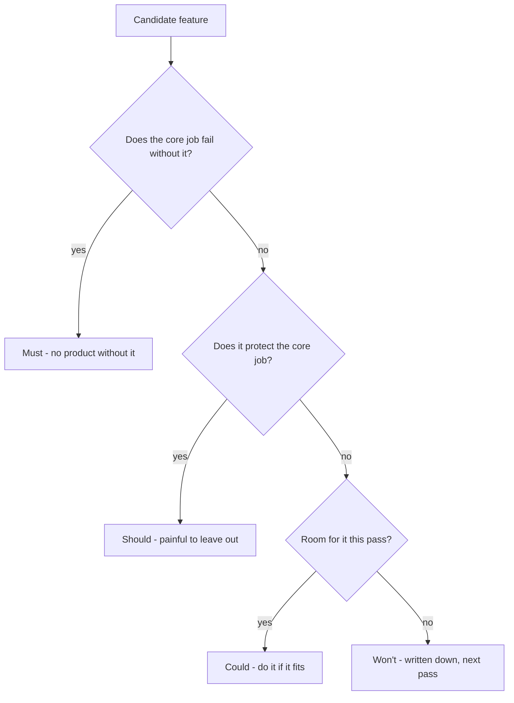

Same URL shortener, one step later. The interviewer confirms what 1.1 only
asked about: heavy read skew, and yes, links expire after a year. "Good. So
what does this thing actually do?" The candidate lists everything that comes
to mind: create a short link, redirect it, custom aliases, a click-count
dashboard, user accounts, QR codes, an API for other teams. Seven features,
nothing ranked, nothing drawn. The candidate now owes a design for all seven,
and the interviewer still can't tell which one they'd protect if the clock ran
out.

> [!NOTE]
> Think first: which of those seven survive if you keep only what the system
> cannot work without? Name the test you used before reading on.

## The test

A feature earns a place on the Must-have list only if the system fails at its
one job without it. For a URL shortener, that job is turning a long URL into a
short one and back - create and redirect. Drop either, and there's no product;
drop anything else on the list, and there's a smaller product, not a broken
one.

That test separates Must from the rest. Two more questions sort what's left:

Note: the first two branches ask about the feature; the third does not. Could
versus Won't is a call about this pass's capacity, and it can flip next pass
with the feature unchanged. Nowhere does the tree ask whether the feature is
useful - almost everything on a candidate list is.

## Sorting the list

Each outcome has a standard name - Must, Should, Could, Won't, usually
shortened to MoSCoW - and a worked example from this brief:

| Category | What it means | URL shortener example |
|---|---|---|
| Must | The core job fails without it | Create a short link; redirect it; expire it once the confirmed date passes |
| Should | Core job survives, but painfully - it protects correctness or usability | Reject a malformed URL before shortening it |
| Could | Real value, nothing in the core job depends on it | Custom aliases, QR codes |
| Won't (this pass) | Explicitly deferred, written down, not forgotten | Click-count dashboard, user accounts |

Automatic expiry is in Must because of 1.1, not because URL shorteners
generally expire links. The confirmed answer changed what the job is: a
shortener that keeps every link forever is not the system that was asked for.
One clarifying question moved a feature out of Could and into Must before
anything was drawn.

## Why the write-down matters

Should, Could and Won't aren't "no" - they're "not this pass," and that only
holds if it's written down. An unwritten cut doesn't disappear; it comes back
mid-build the moment someone assumes it was obviously included ("it's a URL
shortener, of course it tracks clicks"), and now it's competing for time
against a Must-have list that was supposed to be done already.

## Must, or just useful?

Custom aliases is a genuine judgment call. For a marketing team sharing
branded links, it's Must - the product is unusable for its actual audience
without it. For a personal link-shortening tool, it's Could - the core loop
works fine with random codes. Same feature, different bucket. The clarifying
questions from 1.1 are what settle which audience you are building for, and
the audience decides what the system's one job actually is.

## In production

Basecamp builds in fixed six-week cycles, and every project starts with a
short written pitch. One required section of that pitch is "no-gos": the
functionality this project deliberately will not cover. When the deadline
can't move - any dated release, not just a six-week cycle - scope is the only
thing that can, and it gives cleanly only if the cuts were written down before
the work started. The cost they accept: some no-gos are features the team
believes in and ships without anyway.

## Common mistakes

- **Treating every feature idea as a requirement**, then owing a design for
  all of them - this chapter's own cold open.
- **Dropping a feature without saying so out loud.** It resurfaces later as if
  it was never discussed.
- **Confusing "how well" with "what."** "The redirect must be fast" is a
  promise about performance, not a feature - that's 1.3's territory, not this
  chapter's.
- **Sorting by product category instead of by this brief.** "It's a URL
  shortener, so it needs analytics" is a habit, not a test - the brief in
  front of you decides the buckets.

## In an interview

After listing candidate features, name the Must-have list crisply, then name
one or two you are deferring and why, before the interviewer has to ask.
Silence about a feature reads as an oversight; a stated cut reads as a
decision.

What that sounds like at a senior level: *"The core is create and redirect,
plus honoring the expiry we just agreed on. I'd hold off on click analytics
and accounts for this pass - useful, but the system works without them, and
I'd rather have a solid core than a half-built extra."*

## Recap

- A feature earns Must-have only if the system fails its core job without it -
  not because it sounds useful.
- Must/Should/Could/Won't names the four outcomes; Could versus Won't is a
  call about this pass's capacity, not about the feature.
- Write down what's cut - an unwritten cut gets silently re-added mid-build.
- A confirmed answer from clarifying questions (1.1) can move a feature into
  Must; the sort depends on the brief, not the product category.

## Your turn

No canvas build this chapter either - the three primitive components still
arrive at 1.6. The knowledge check gives you a brief and a list of candidate
features; sorting them into Must and everything else is the actual exercise.
Which ones are Must isn't given away in advance.

## Next

1.1 gave you the test for which questions to ask; this chapter gave you the
test for which answers become features. Requirements is step 2 of 0.4's loop,
and a Must-have list is only half of it.

1.3 takes the same Must-have list and asks a different question: not what the
system does, but how well it has to do it - how fast, how available, how
consistent. A feature with no performance promise attached isn't finished
being specified yet.
