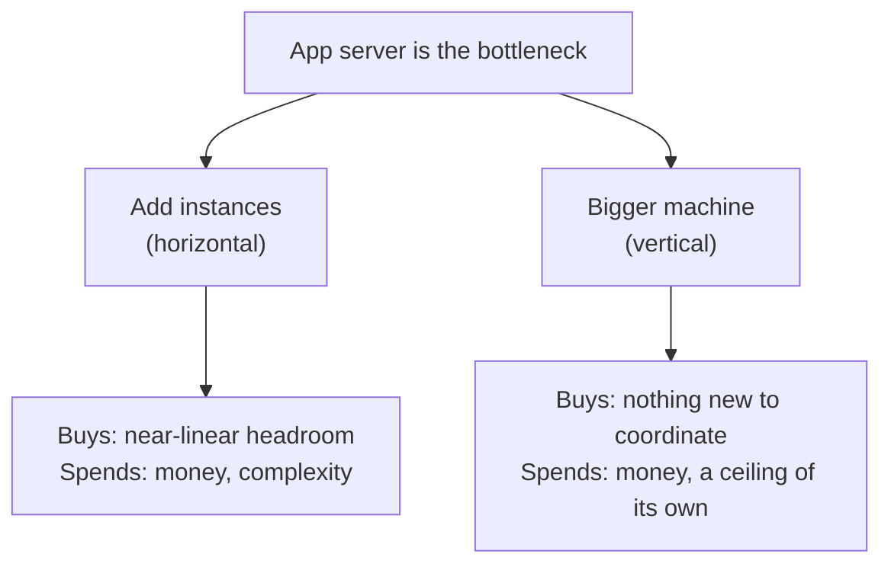
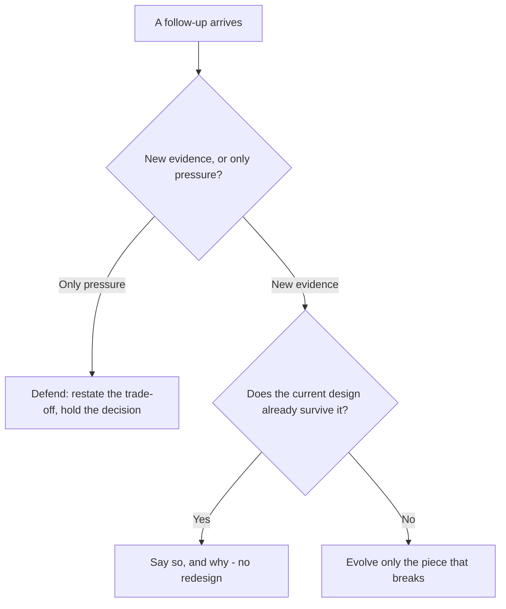

You just told the interviewer the app server is the bottleneck. "So what
would you do?" they ask. "Add more app-server instances," you say. They
wait. You wait. "And what does that cost you?" Silence: you'd thought about
the fix, never about its price. Later, a different question lands: "what if
writes grow 10x?" You freeze, erase half the diagram, and start redrawing
from a blank page with no explanation for why the old design stopped
working. The interviewer has lost the thread, and so have you.

Every real design decision buys something and spends something, and every
follow-up is new input to weigh, not a verdict on what you already drew.
Skipping the first isn't optimism, and reacting to the second isn't rigor -
both are incomplete answers, and they're the two gaps interviewers probe for
most.

> [!NOTE]
> Think first: "add more app-server instances" fixes the bottleneck. Before
> reading on, name one thing this fix spends, not what it fixes. Then: when
> writes grow 10x, what's the first thing to check about the *existing*
> design, before changing anything?

## The reflex: name what you spent

A complete trade-off statement fills three blanks: *we chose X, accepting
Y, because Z.* X is the decision. Z is the reason, usually a fact from
earlier in the design (a ceiling comparison, a requirement). Y is the part
most answers skip: what the decision actually spends.

Note: both branches spend something - there's no branch that costs nothing.

Five dimensions cover most of what a decision spends. Not every decision
spends every one; checking the list beats guessing which applies.

| Dimension | What it measures | What paying this cost looks like |
|---|---|---|
| Latency | How long one request takes | A step that used to feel instant now has a pause |
| Consistency | Whether everyone asking at the same moment gets the same answer | Two people see different versions of the same thing, briefly |
| Complexity | How many moving parts and independent failure modes exist | More things that can break on their own |
| Money | Literal infrastructure and operational spend | A bigger bill |
| Operability | How hard the system is to run day to day | More alerts, more pages at 3am |

Walked against "add more app-server instances": latency and consistency,
unaffected (a stateless app server means which instance answers never
changes the answer); money, complexity, and operability, all spent - more
instances is a bigger bill and more things deployed and monitored. "We
added more app-server instances, accepting more infrastructure cost and
operational surface, because the app server has the lower ceiling today" -
now the statement is complete.

The diagram's other branch, a bigger machine, trades the opposite way: it
buys back simplicity (one thing to deploy, one thing to watch) and spends
money at a worse rate, plus something the diagram doesn't name outright - a
ceiling of its own, since a single machine, however large, still has a
maximum. Neither branch is simply "correct." Steady, predictable growth
favors the bigger machine's simplicity; uncertain growth favors instances,
since the ceiling problem doesn't come back as fast. Stating that choice out
loud, both costs named, is the skill.

## Reading a follow-up

A follow-up gets a test, not a reaction: is this new evidence or only
pressure, and if it's evidence, does the current design already survive it.

Note: three of the four paths end without a redesign - even the fourth
changes one piece, not the whole diagram.

Before any follow-up lands, the design gets said out loud top-down once:
entry point to compute to data, the reasoning attached as it goes - the
version the interviewer is reacting to once follow-ups start. Then each one
runs the test above:

| Follow-up sounds like | Test says | Move |
|---|---|---|
| "What if writes grow 10x?" | New evidence - a real requirement change | Check whether the write path already has headroom before changing anything |
| "Why not just use a bigger machine?" | Only pressure - a challenge to a choice already made | Defend: restate what more instances buys and costs, unless the challenge names something the trade-off missed |
| "What happens if the app server restarts mid-write?" | New evidence, and the current design has no answer | Name the gap honestly - nothing this curriculum has taught yet makes a write survive a mid-crash restart |

Naming that third gap honestly - "the write path doesn't handle that yet,
and here's specifically what would need to change" - is a stronger answer
than inventing a fix on the spot or pretending the question didn't land.

## Defending reuses the same reflex, with one clause added

Defending a decision extends the X/Y/Z statement by one clause: "we chose
X, accepting Y, because Z, and Z hasn't changed, so X still holds." If the
follow-up genuinely changes Z, the honest move is the opposite: name what
changed your mind, then say what's different in the design.

A follow-up that exposes a real gap doesn't settle how much interview time
to spend fixing it live. Redesigning in real time proves the fix is
understood but spends minutes the rest of the loop might need. Naming the
fix conceptually - what changes, roughly what it costs - proves the same
judgment faster, at the cost of never showing the detail. A real gap with
plenty of time left is worth drawing; the same gap with barely any time
left is not.

## In production

Dropbox's 2016 move off Amazon S3 onto its own storage system was publicly
challenged before it shipped - "why not just stay on S3?" was the standing
question from engineers outside the company. Dropbox's answer ran the same
test this chapter teaches: the follow-up was real evidence (cost and
control at their specific scale), the existing setup did not already
survive it, and they named the trade-off - more infrastructure to run, in
exchange for cost and control S3 couldn't give them at that volume -
defending it in public with numbers rather than caving or refusing to
explain.

## Common mistakes

- **Naming the fix, not the cost.** Stopping at "we added more instances"
  without saying what it spent.
- **Vague cost language.** "It's a bit more complex" names no dimension;
  "more operational surface, more things to monitor" does.
- **Treating every follow-up as an accusation** - reacting to "what if X?"
  as "you got it wrong," instead of new input to test.
- **Caving immediately, or refusing to budge.** The opposite failures:
  changing the design the moment it's challenged, or holding a decision
  after a follow-up has named a real gap in it.
- **Redesigning everything.** The cold open's second failure: one piece
  needs to change, and the whole diagram gets erased anyway.

## In an interview

This is loop steps 7-8 (0.4): trade-offs and alternatives, then evolve and
defend - the last two steps before the conversation is judged as a whole.
What that sounds like at a senior level: *"We'd add app-server instances,
accepting more infrastructure cost and operational surface, because the app
server has the lower ceiling today. [Later, a follow-up:] That's a real
change - let me check the write path against it. It doesn't hold past that
volume; I'd add whatever closes that gap, and the rest of the design is
unaffected."*

## Recap

- A complete trade-off statement fills three blanks: we chose X, accepting
  Y, because Z - Y is the part most answers skip.
- Five dimensions cover most of what a decision spends: latency,
  consistency, complexity, money, operability. Check the list; don't guess.
- A follow-up gets a test, not a reaction: new evidence or only pressure,
  and if evidence, whether the design already survives it.
- Defending reuses the trade-off reflex with one clause added: the reason
  still holds, so the decision does too - and the honest opposite when it
  doesn't.
- A real gap gets named honestly, not invented around or erased into a full
  redesign.

## Your turn

No canvas build this chapter - the palette is still the three components
from the previous chapter, and neither naming a cost nor reading a
follow-up needs a fourth. The knowledge check covers both loop steps:
picking the trade-off statement that names both what's bought and spent,
and picking the strongest response to a follow-up while reading why the
weaker ones fail the test.

## Next

The previous chapter gave you the method for finding what's broken and the
target worth going deeper on; this chapter gave you the reflex for stating
what fixing it costs, and for handling what comes next when the
interviewer pushes back. Loop steps 7 and 8 (0.4) are covered end to end.

Driving the Interview picks this up as an optional capstone: the same eight
steps, now run together under a real clock, with the parts that go wrong
when nobody is holding the whole conversation.
