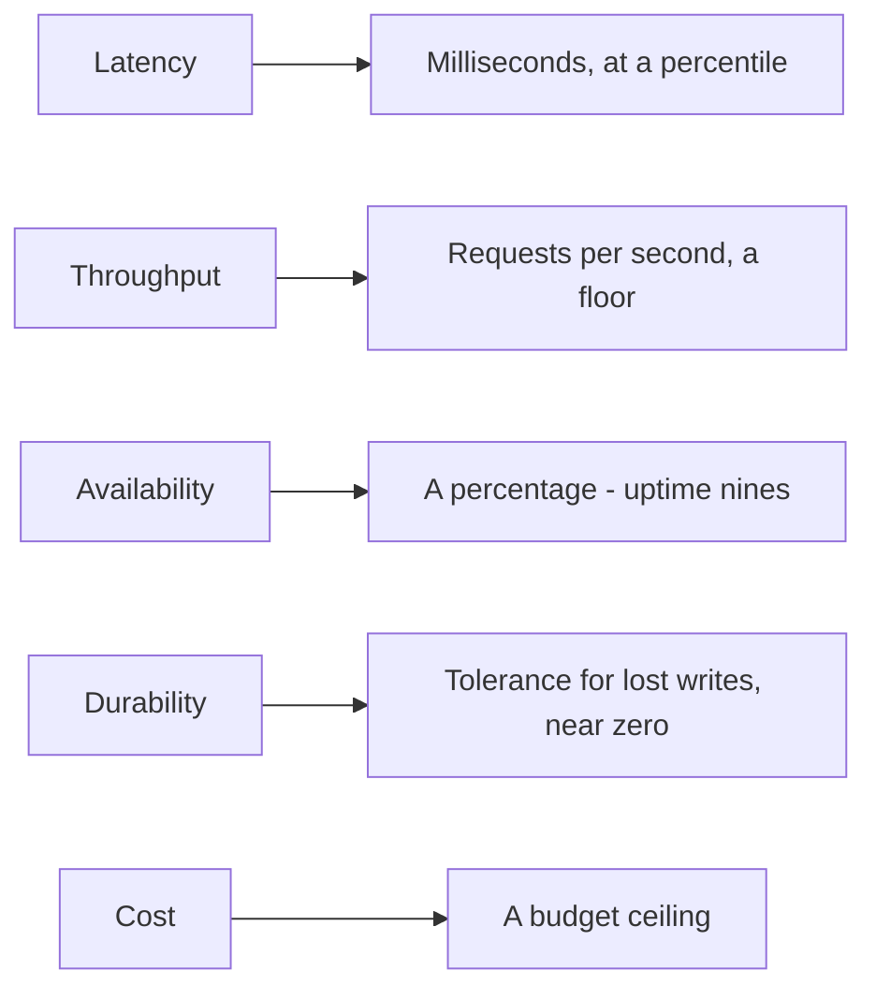

The Must-have list from 1.2 is already on the board: create a link, redirect
it, expire it. "How fast does redirect need to be?" the interviewer asks.
"Fast," the candidate says. "How available?" "Very available." "Give me a
number for each," the interviewer says, "and tell me why not a different
one." The candidate has none - and realizes any architecture already on the
board could honestly claim to be fast and very available. Nothing was
specific, so nothing was ruled out.

> [!NOTE]
> Think first: pick one of those two words - fast, or available - and turn it
> into a number you'd defend if asked "why not slower?" or "why not less?"

## From adjective to number

A non-functional requirement is a functional requirement's *how well*
partner (1.2) - stated as a number you'd defend, not an adjective you'd say.
It's the same five forces 0.2 named; this chapter just gives each one a shape
you can measure.

Note: same five forces as 0.2 - each one just trades a word for a measurable
quantity.

## Turning a force into a number

| Force (0.2) | Worked example |
|---|---|
| Latency | "p99 under 200 ms" |
| Throughput | "survive 5,000 requests/sec at peak" |
| Availability | "99.9% uptime" |
| Durability | "no data loss after a single node failure" |
| Cost | "under $2,000/month at this scale" |

Latency is measured at a percentile because an average hides the requests
that hurt: a 20 ms average with a handful of 3-second stragglers still fails
every user who lands in that tail. p99 is the 99th percentile: 99 of every
100 requests come back faster, so it answers "how bad is the worst 1%?" -
the number that actually matters to whoever hits it.

Availability has the same problem: the percentage sounds precise, and means
nothing until it's converted into time.

| Availability | Downtime per year |
|---|---|
| 99% | ~3.65 days |
| 99.9% | ~8.76 hours |
| 99.99% | ~52.6 minutes |
| 99.999% | ~5.26 minutes |

Each extra nine cuts downtime tenfold - and costs roughly an order of
magnitude more engineering to hold.

## Why the number, not the feeling

"Highly available" can't be tested - nobody can prove or disprove it. "99.9%
uptime, measured monthly" can: someone watches a dashboard and says whether
the promise held. That's the actual job an NFR does - it turns a feeling into
something a design can be checked against, before it ships and after. A 200
ms p99 latency budget rules out real choices a bare "fast" never could: a
chain of three sequential cross-region calls in the hot path is disqualified
before anyone has to argue about it.

## One more nine, one more cost

Going from 99.9% to 99.99% buys back about 8 hours of yearly downtime - and
costs real machinery: a second instance ready to take over, health checks
watching for failure, someone on call to trust the failover. A todo app for
one team doesn't need that cost. A payments API might need it regardless of
the bill. The number isn't free, and picking one nobody asked for spends
0.2's cost force on nothing.

## In production

Amazon S3 publishes two separate numbers for the same product: 99.999999999%
durability (an object almost never disappears once stored) and, in its
service agreement, 99.9% availability (the service itself can be briefly
unreachable). Storing a customer's only copy of a file makes losing it
unacceptable, so S3 replicates every object across multiple facilities for
that guarantee - paid once, at write time. A brief outage is recoverable:
retry the request. A lost byte isn't. Two numbers, two different failures,
two different engineering answers - the exact distinction 0.2 warned against
collapsing into one.

## Common mistakes

- **Stating a feeling instead of a number** ("fast", "reliable", "scalable")
  - not testable, rules nothing out.
- **Picking 99.999% because it sounds serious**, not because losing that
  request actually costs that much - 0.2's cost force, ignored.
- **Quoting a durability number when asked about availability**, or the
  reverse - they answer different questions (0.2).
- **Giving every force a maximum number** instead of naming the one this
  product actually can't survive losing.

## In an interview

A bare adjective in the requirements step is a missed step, not a finished
one. State a number, and the reason a different number wouldn't do, before
moving on to estimation (1.4).

What that sounds like at a senior level: *"Redirect latency: p99 under 200
ms, because a link click is a UI action people expect to feel instant.
Availability: 99.9% is enough here - a rare short outage costs an annoyed
user, not lost money, so I wouldn't pay for the fourth nine."*

## Recap

- A non-functional requirement is a functional requirement's *how well*
  partner (1.2), stated as a number, not an adjective.
- 0.2's five forces each become a specific number shape: latency (ms at a
  percentile), throughput (requests/sec), availability (nines), durability
  (loss tolerance), cost (a ceiling).
- Each extra nine of availability cuts downtime tenfold, and costs roughly an
  order of magnitude more engineering.
- Durability and availability answer different questions - "is it still
  there" versus "can I reach it right now" - and need separate numbers.

## Your turn

No canvas build this chapter either - the three primitive components still
arrive at 1.6. The knowledge check gives you three described products;
matching each to the number that actually dominates its design is the
exercise. Which number dominates which product isn't given away in advance.

## Next

0.2 gave you five forces as words; 1.2 gave you the feature list those forces
attach to. This chapter turned the words into numbers you'd defend.

1.4 takes those numbers and asks where they come from: turning a user count
into the QPS, storage, and bandwidth figures that make an NFR defensible
instead of guessed.
