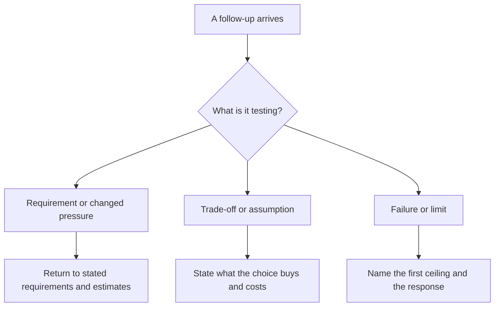

You have a 45-minute system design interview. Five minutes in, you are still
asking questions. At minute 20, you have a beautiful diagram but no estimate.
At minute 40, the interviewer asks what fails first and you have not left
yourself enough time to find out.

None of those moves is individually wrong. The failure is letting the
conversation choose its own shape. An interview is a design problem with one
extra constraint: the room needs to see your reasoning before time runs out.

> [!NOTE]
> Think first: with 45 minutes and an ambiguous brief, which part of the
> design process would you protect from being squeezed out? Commit to a
> choice before reading on.

## The clock is a design constraint

Time does not turn the interview loop into a script. It makes sequencing
visible. Spend too long on a step and a later step loses its evidence. Rush
the early questions and the diagram rests on guesses you never tested.

| Time box | Move | What the interviewer can now see |
|---|---|---|
| 0-5 min | Restate the brief and ask the highest-leverage clarifying questions | You are defining the problem, not accepting ambiguity silently. |
| 5-12 min | Name functional requirements, non-functional requirements, and what is out of scope | You can distinguish the product promise from the forces that constrain it. |
| 12-17 min | Estimate the order of magnitude that changes the design | Your next choices have numbers behind them, not precision theater. |
| 17-28 min | Draw the smallest end-to-end shape that meets the brief | The room has a shared design to reason about. |
| 28-35 min | Find the first ceiling, make a trade-off, and take one justified deep dive | You can prioritize pressure rather than tour every box. |
| 35-45 min | Narrate, handle follow-ups, and reserve a short close | You can evolve the design without losing the thread. |

The table is a budget, not a stopwatch. A brief with one dangerous
requirement deserves more deep-dive time. A simple brief may let you move
faster through the diagram. What must stay true is the order: requirements
create the evidence, estimates calibrate it, and the design answers it.

## Read the question behind the question

Interviewers often ask a short question that tests a longer habit. "What if
writes grow 10x?" can test whether you check headroom before adding machinery.
"Why this database?" can test whether you can name the trade-off you already
made. "What happens when it fails?" can test whether the happy path was all
you designed.

Note: the right response starts from evidence already on the board. A
follow-up is not a request for a new architecture by default.

This is interviewer-intent literacy. You do not need to guess a hidden
answer. Classify the pressure, then use the tool you already earned: 1.1 for
requirements, 1.2 for ceilings, and 1.3 for trade-offs and for deciding
whether the current design survives new evidence.

## Drive the room without performing certainty

Driving means making the next useful move explicit. Say what you are doing
and why: "I have the core read path. Before I go deeper, I want to check
whether reads or writes set the first limit." That sentence keeps the
interviewer oriented and gives them a clean moment to redirect you.

It also makes correction cheap. If the interviewer says the product is write
heavy, do not defend a read-heavy design because it is already drawn. Say
what changed, revise the affected path, and state the new cost. The senior
signal is not uninterrupted confidence. It is a visible chain from evidence
to decision to revision.

Three habits keep that chain intact:

- Park details deliberately. Name a deep-dive target, give the reason, and
  return to it when the basic path exists.
- Check time out loud once or twice. "With ten minutes left, I will validate
  the write path and cover the main failure mode" is control, not panic.
- Close the loop. Recap the requirement that drove the design, the largest
  trade-off accepted, and the next risk you would test with more time.

## Common ways candidates lose the interview

- **Solving before scoping.** A polished answer to the wrong product is not
  evidence of design skill. Ask enough questions to stop guessing, then move.
- **Treating every question as a detour.** A follow-up often tests the
  decision already on the board. Reconnect it before changing the diagram.
- **Spending the whole interview on the favorite subsystem.** A deep dive
  earns its time from pressure, not from how interesting it is to explain.
- **Hiding a correction.** Revising when evidence changes is stronger than
  holding a weak claim. State the changed assumption and the narrow effect.
- **Running out of time without a conclusion.** The interviewer should leave
  with your main architecture, its cost, and the risk you would test next.

## In production

The clock is different in a design review, but the discipline transfers. A
review that opens with the decision, constraints, and unresolved risks lets
the group spend time on disagreements that matter. A review that starts in
implementation detail can consume an hour before anyone knows what decision
is being requested. Production work rewards the same visible reasoning, just
with more time to validate it.

## In an interview

This optional chapter runs all eight steps from 0.4 as one conversation. The
goal is not to recite the table. It is to notice when a step is missing and
put the conversation back on a useful path.

What that sounds like at a senior level: *"I will confirm the user-visible
flows and the scale target first, then sketch the smallest end-to-end design.
I will use the estimates to choose one pressure point to examine, state the
trade-off, and keep time for failures and follow-ups. If an assumption
changes, I will revise the affected part and explain the cost."*

## Recap

- Time is a constraint on the interview process, so protect the evidence
  chain from requirements through trade-offs and follow-ups.
- A follow-up usually tests a requirement, a trade-off, or a failure limit;
  classify it before reacting.
- Driving the room means naming the next reasoning move, not pretending every
  answer is certain.
- A strong close states the design, the accepted cost, and the next risk.

## Your turn

This chapter is optional - skip it if you're on a pure production track,
nothing later depends on it. The full staged interview walkthrough needs
the stages interface, which is not available yet. The knowledge check runs
its decisions as a short, sequenced interview instead: choose the next
move, read the reasoning, and notice where the clock should change your
priority.

## Next

Part 1 taught you how to drive the design conversation. 2.1, *From Browser
to Backend*, follows one request through the system you have been describing,
so its path stops being a diagram and starts being something you can trace.
