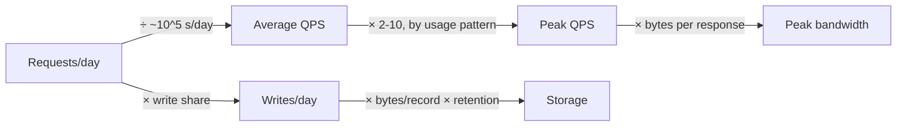

1.3 gave you numbers to defend: p99 redirect latency under 200 ms, 99.9%
uptime. "Good," the interviewer says. "Now, roughly how much traffic are we
actually talking about?" The candidate does the math out loud: "10 million
redirects a day, divided by 86,400 seconds - that's 115.74 requests per
second." The interviewer waits, then asks: "Is your design any different
than if you'd said a hundred?" It isn't. The decimal places took real time
and changed nothing on the board.

> [!NOTE]
> Think first: without a calculator, what's 86,400 rounded to the nearest
> power of ten? That single round number is the shortcut the rest of this
> chapter turns into a habit.

## The shortcut

Estimation's job is an order of magnitude, not a decimal place. A day holds
86,400 seconds - close enough to 10^5 that rounding it costs nothing a
design would ever notice. Everything below runs on that one shortcut: a
daily volume becomes a rate, and volume and rate together become the storage
and bandwidth numbers that decide whether anything here is worth building
differently.

Note: storage is the only number that accumulates - it multiplies by a
retention window instead of dividing into a rate. Both rate branches move
with traffic, so a spike lifts bandwidth as surely as it lifts QPS.

## From requests to QPS

Same brief: 10 million redirects a day, and creates about 1,000x rarer, so
10,000 a day - the same ratio 1.1 used to illustrate its test, confirmed
here as the real number. Divide by ~10^5 seconds a day: about 100 requests
per second on average. Creates land near 0.1 QPS, roughly one every ten
seconds - too small to shape anything yet.

The candidate's 115.74 and this chapter's "call it a hundred" point at the
same design. That's the whole reason 10^5, not 86,400, is the number worth
keeping.

Average isn't the number that decides anything, though. A launch or a viral
link can push traffic to a small multiple of average - usually 2 to 10x,
chosen from how bursty the product's own usage pattern actually is. Call it
5 to 10x here: peak redirect load lands somewhere between 500 and 1,000 QPS.
A hundred QPS and a thousand QPS aren't the same design - this is the number
that would actually change what gets built.

## Where the precision doesn't matter

Storage: creates expire after a year (1.2), so at most a year's worth stays
live - about 3.65 million records. Call each one 500 bytes, code and
destination URL together; the total lands under 2 GB. Move that byte count
up or down by half and the answer is still gigabytes, not terabytes - small
enough for any ordinary database, however careful or sloppy the guess was.

Bandwidth is smaller still: a redirect response is a couple hundred bytes,
so even peak QPS moves well under a megabyte a second - less than a home
internet connection. Neither number sits anywhere near a threshold that
would change anything, and refining either one further is exactly the
wasted precision the cold open started with.

## When precision earns its keep

Spend real time getting a number right when it sits near a threshold that
flips the design. Round it and move on when it's nowhere close to one. At
10x this system's numbers storage is still a rounding error, about 20 GB; at
1000x it reaches a couple of terabytes and peak load nears a million QPS -
and the peak, not the storage, is the one that stops fitting on a single
machine.

## In production

WhatsApp's engineering team measured, rather than guessed, the memory cost
of a single open connection, then used that real figure to push one server
past two million concurrent connections before adding more machines. The
trade-off: the measurement itself cost real engineering time a rougher guess
wouldn't have - time worth spending because the number sat exactly where
this chapter's peak QPS does, close enough to a real ceiling to be worth
getting right.

## Common mistakes

- **Computing storage or bandwidth to the byte** after the order of
  magnitude already answered the question - the cold open's mistake,
  repeated on a different number.
- **Estimating only the average and skipping the peak multiplier**, missing
  the one number that actually forces a decision.
- **Picking a benchmark - seconds a day, bytes a record - without saying it
  out loud**, so nobody else can check the assumption.
- **Treating "I don't know the exact number" as a reason not to estimate**,
  instead of naming a defensible round one and moving on.

## In an interview

Estimation gets the same couple of minutes 1.1 budgeted for clarifying -
0.3's ~45 minutes has eight steps to cover, and this is one of them. State
the benchmark, state the round number, name which one is worth defending,
and move to the next step.

What that sounds like at a senior level: *"Call it ten million redirects a
day, so roughly a hundred QPS average. A launch spike could run five to ten
times that, so I'd want headroom for a few hundred to a thousand QPS.
Storage and bandwidth both come out small here, so I'm not spending more
time on either."*

## Recap

- Estimation's deliverable is an order of magnitude, not a decimal - a day
  is close enough to 10^5 seconds that rounding it costs nothing.
- Peak load is a small multiple (2-10x) of average, chosen from the
  product's own usage pattern, not a fixed constant.
- Not every number matters the same amount: one near a threshold is worth
  defending; one comfortably clear either way isn't worth more precision.
- Say the benchmark out loud - "call it 10^5 seconds a day" - so the
  assumption, not just the answer, can be checked.

## Your turn

No canvas build this chapter either - the three primitive components still
arrive at 1.6. The knowledge check hands you a different product's daily
volume and asks for the right order-of-magnitude bucket, first for its
request rate and then for its stored data. Which bucket is correct for each
one isn't given away in advance.

## Next

0.4 named this as loop step 3: users to QPS to storage to bandwidth. 1.3
gave you the numbers this chapter turned into scale, and 1.1's read:write
ratio turned out to be the real one.

1.5 hands you landmark ratios - RAM versus disk, same-datacenter versus
cross-continent - memorized instead of derived, so the next estimate starts
faster than this one did.
