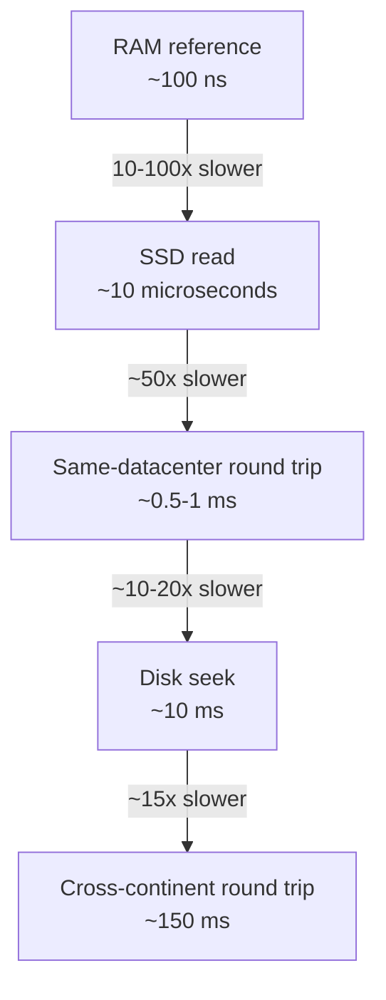

1.4 taught you a shortcut for deriving a number on the spot: divide by ~10^5
seconds a day. Some numbers aren't worth deriving at all - they're worth
knowing outright. "You're proposing a cache in front of the database," the
interviewer says. "Roughly how much latency does that buy you?" The candidate
hesitates. Faster, certainly - but 2x faster and 200x faster are different
answers, and only one of them justifies building the cache. The pause is the
tell: this is a number you're expected to already have, not work out on the
spot.

The gaps between one operation and the next are not intuitive, and one pair
in particular gets guessed backwards. That mistake costs more than an
interview answer: it means skipping a cache layer that would have been faster
than the disk you kept reading from.

> [!NOTE]
> Think first: which is faster - a single seek on a local hard disk, or a
> network round trip to another machine in the same datacenter? Guess before
> reading on.

## The ladder

Line the five operations up as a ladder, fastest at the top: each rung is one
kind of operation, and each step down costs roughly 10 to 100 times the rung
above it. Memorize it, because one pair of rungs sits in the opposite order
to the one most engineers expect.

Note: the same-datacenter round trip sits above the disk seek, so it is the
faster of the two - reaching a nearby machine's memory usually beats reading
your own local disk.

## Each rung, in practice

| Rung | Roughly | What it looks like in practice |
|---|---|---|
| RAM reference | ~100 ns | A cache hit already sitting in a server's memory |
| SSD read | 10-100x a RAM reference | Reading a row your cache doesn't have, from a modern database's storage |
| Same-datacenter round trip | ~50x an SSD read | Calling a cache or another service one hop away |
| Disk seek | 10-20x that same-datacenter hop | Reading from a traditional spinning-disk database - slower than asking the machine next door |
| Cross-continent round trip | 150-300x the same-datacenter hop | Calling a service, or serving a user, from another region |

RAM and SSD are both electrical, with no moving parts; RAM wins because
reading a flash cell costs more than reading a memory circuit, which is the
whole 10-100x gap. A same-datacenter round trip adds queuing and
operating-system overhead on top of the wire, but the wire is only feet long,
so the total stays under a millisecond.

The bottom two rungs are physical. A disk seek moves an arm across a spinning
platter, and that mechanical delay is why a hop to the machine next door
usually beats reading your own disk. A cross-continent round trip is bounded
by distance itself - a signal crossing an ocean and back takes about a
hundred milliseconds, and no code shortens that floor.

## When closing a gap is worth it

You can always climb back up a rung, and it always costs something. Holding
hot data in memory (0.2's cache) closes the gap between a disk read and a RAM
read, and you pay for it in staleness: the copy can go out of date the moment
the source changes. Keeping a copy physically nearer to users closes the
cross-continent gap, and you pay in keeping the copies in sync.

The ratios themselves don't move as traffic grows. What grows is how often
you pay them, and that count is exactly the peak-QPS number 1.4 already
estimates. A cache that saves 10 ms on a request served twice a second isn't
worth building; the same 10 ms at ten thousand requests a second is.

## In production

Large-scale services, Meta among them, keep a layer of ordinary machine
memory between their application servers and their database. The reason is
the ladder's one swap: a network hop to that memory layer is faster than the
database's own disk seek, and at their scale the saving lands millions of
times a second.

The cost they accept: that cached copy has to be kept correct as the
underlying data changes, which is real machinery (0.2), not something free.

## Common mistakes

- **Quoting a raw figure without the ratio to the rung next to it** - "100
  ns" on its own tells you nothing; the gap between rungs is the transferable
  fact.
- **Assuming the network is always slower than local disk** - a
  same-datacenter hop usually beats a disk seek, which is exactly what the
  think-first prompt tested.
- **Measuring a real system's numbers before checking whether the ladder's
  rough answer already settles the question** - the same wasted precision 1.4
  warned about, on a different set of numbers.
- **Treating a single hop as the whole cost** - a request that makes three
  remote calls pays the network number three times, not once.

## In an interview

This is the other half of loop step 3. 1.4 taught you to derive a number from
first principles; this chapter is the set of numbers worth memorizing
instead, because working them out live reads to an interviewer much the same
as not knowing them.

What that sounds like at a senior level: *"A cache hit here costs a RAM
reference, maybe one same-datacenter hop - under a millisecond either way.
Without it we're paying a disk seek or worse on every read, an order of
magnitude slower. That trade is worth it for read-heavy traffic; I'd want to
know the write pattern before I'd say the same for writes."*

## Recap

- The ladder, fastest to slowest: RAM, SSD, same-datacenter network, disk
  seek, cross-continent network - each rung roughly 10 to 100 times the cost
  of the one above it.
- A same-datacenter network round trip is typically faster than a local disk
  seek - "local" doesn't mean "fastest."
- These ratios don't change with scale; what changes is how often you pay
  them, which is the number 1.4 already estimates.
- Memorize the ladder as a fast default; measure a real system's numbers only
  when an estimate lands close enough to a threshold to matter - 1.4's own
  rule, reapplied.

## Your turn

No canvas build this chapter either - the three primitive components still
arrive at 1.6. The knowledge check hands you a short list of operations to
rank fastest to slowest, then describes a request built from two of them and
asks for its rough total latency. Neither the ranking nor the latency
estimate is given away in advance.

## Next

1.4 gave you a shortcut for deriving traffic numbers; this chapter gave you
ratios you never have to derive. Both 0.2's cache force and 1.3's latency
budgets are settled against this ladder: a cache pays for itself when moving
a read up the ladder saves more than the staleness costs.

1.6 puts a client, an app server, and a database on canvas for the first
time - three machines with real hops between them, the exact hops this
chapter just put numbers on.
