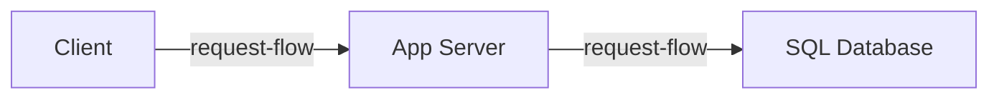

1.1 through 1.5 got you a scoped problem, real numbers, and a feel for what's
fast and what's slow. None of that is a diagram yet. The interviewer asks for
the architecture, and most candidates either freeze at the blank canvas or
jump straight to naming a specific database before deciding what any box
actually needs to do.

Every real system, at any scale, does exactly three jobs: take a request in,
decide what to do with it, and remember the result. Naming a product before
naming those three jobs skips the only question that decides whether the
design is defensible - what does each job actually require.

> [!NOTE]
> Think first: what is the fewest number of boxes a real, working system
> needs - not a toy, an actual system a user could depend on? Commit to a
> number before reading on.

## The minimal shape

Three jobs, three boxes. A client issues the request. An app server decides
what to do with it. A database remembers the result. Give each job its own
component and you have the smallest architecture that is still real.

Note: no edge skips the middle box. The client's `request-flow` edge ends at
the app server, and only the app server's edge reaches the database - that
ordering is the shape this chapter's exercise has to reproduce.

## What each box does

- **Client** - issues the request. Nothing more is trusted to it.
- **App server** - the only component allowed to reach the database. It
  checks who is asking, applies whatever business rules the product needs,
  and only then reads or writes.
- **SQL database** - durable storage, nothing else. It has no idea who is
  asking or why, only what to store.

`request-flow` is a synchronous edge: whichever component sent it is waiting
on a response before doing anything else.

## Why the database never talks to the client directly

"Mediation" is the app server's whole job, one level down: it checks who is
making the request (authentication), whether they are allowed to make it
(authorization), and whether the request itself is legal for the product
(business rules - a banned link, a deleted account, a rate limit). All three
checks live in one place.

A client wired straight to the database skips every one of them. Nothing
stops it from reading or writing anything the database allows, because
nothing is in the way to ask whether it should. Draw that edge on your
canvas later this chapter and Validate will catch it immediately - that is
`no-direct-client-database`, and it is deliberately your first real
encounter with a validation rule that is actually protecting something.

## One instance, for now

One app-server instance is the simplest correct answer at today's scale.
1.4 and 1.5 already sized this system - a modest read:write ratio, requests
well within one server's headroom - so a single instance is not an
oversight, it is the right call for the traffic that actually exists.

The honest cost: everything depends on that one process.

## What breaks first

An app-server crash and a database crash do not fail the same way. The app
server is the only path to the database, so if it goes down, nothing
responds at all - not slow, gone. A database crash looks different: the app
server is still alive and still answering, every one of those answers is
just an error, because it has nothing left to read or write.

Traffic growing changes the picture differently again. At 10x today's
volume, the app server is the first thing to run out of headroom - it is a
capacity problem, not a correctness one, and the single instance simply
does more work per second until it can't. At 100x, one instance genuinely
cannot serve the load, and adding more solves capacity but creates a new
question immediately: something has to decide which instance gets each
request. That something is a load balancer, which 3.4 introduces - not
needed yet at this chapter's scale, but the next wall you will hit once
"one instance" stops being the right answer.

## In production

Instagram launched in 2010 on exactly this shape - one server running the
application and a Postgres database - and grew on it. As traffic arrived they
added app servers and split Postgres across machines, but they never replaced
the shape: a client, an application tier, a relational store behind it. The
trade-off they took at the start is the one above, simplicity in exchange for
a single point of failure, and they paid it down when traffic forced them to
rather than in advance. Their eventual scale is not the lesson here; their
starting point is.

## Common mistakes

- **Naming a specific database or framework before naming the three jobs.**
  The product name doesn't tell you whether the shape underneath it is
  right.
- **Wiring a `request-flow` edge straight from client to database "to save
  a hop."** That is exactly what `no-direct-client-database` exists to
  catch.
- **Assuming an app-server crash and a database crash fail the same way.**
  One answers nothing at all; the other keeps answering, just with errors.
- **Believing more app-server instances alone fixes the single point of
  failure.** Something still has to decide which instance gets each
  request - that problem doesn't exist yet with one instance, and doesn't
  solve itself by adding a second.

## In an interview

This is loop step 4 (0.4): the first architecture, drawn before any deep
dive. The three boxes you just learned are the fastest legitimate answer to
"walk me through your design" - drawing them, and naming each one's job out
loud, is worth more than any amount of hesitation over which specific
database to name.

What that sounds like at a senior level: *"I'd start with three pieces: a
client, one app server that's the only thing allowed to touch the database,
and the database itself. The app server owns authentication and the
business rules. At today's scale one instance is enough - I'd expect it to
be the first thing to run out of headroom as traffic grows, and splitting
traffic across more than one is the next problem, not this one."*

## Recap

- Every system does three jobs: receive, decide, store - client, app
  server, database.
- The app server is the only component allowed to touch the database; a
  direct client-to-database edge is a validation error, not a shortcut.
- One app-server instance is the simplest correct answer at today's scale,
  and also today's single point of failure.
- Nothing here survives 10x or 100x traffic unchanged - the app server
  saturates first.

## Your turn

The starter graph on the canvas skips the app server: the client is wired
straight to the database. No tour walks you through this one - run
Validate, read what it reports in your own words, and use that to decide
what to add and what to rewire. Add the missing component, route both edges
through it, get a clean Validate, then Submit.

## Next

0.4 named this as loop step 4: the first architecture, drawn before any deep
dive. 1.4's traffic estimate and 1.5's latency ladder are what turned "one
instance is enough" into a decision rather than a guess - the first time this
curriculum's numbers chose a component count for you.

1.7 Identifying Bottlenecks turns "what breaks first" from something you
reason about, like this chapter just did, into something you check
systematically - useful again the moment a design has more than three
boxes on it.
