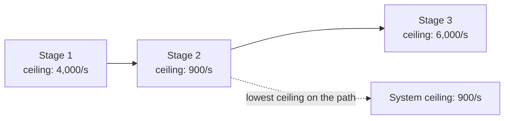

1.6 gave you three boxes and, in passing, one answer: at 10x traffic, the app
server runs out of headroom first. That answer came from reasoning about one
specific shape. The interviewer's next question rarely stays that specific -
"what breaks first?" gets asked about designs you haven't seen before, and
"probably the database, databases always break" is a guess, not a method.

Every request path is only as fast as its narrowest point. Finding that point
is mechanical once you know what to check - not intuition, not reputation, a
comparison of numbers.

> [!NOTE]
> Think first: client, one app-server instance, one database - 1.6's exact
> shape. Traffic keeps climbing. Which of the two real components hits its
> ceiling first, and why that one rather than the other? Commit to an answer
> before reading on.

## The method

Every component on a request path has a ceiling: the maximum load it can
sustain before requests start queuing, slowing down, or failing outright. The
system's overall ceiling is the lowest of those numbers - not the average, not
the most expensive component, whichever one runs out of room first.

Note: Stage 2 has the lowest number, so it sets the whole system's ceiling
even though the other two stages could handle far more - a fast component on
either side of a slow one doesn't raise the slow one's limit.

## Tracing it on a real path

Map that generic picture onto 1.6's shape: client issues the request (no
ceiling of its own - it isn't serving anyone), app server does the work, the
database stores the result. Two real ceilings to compare. Whichever one is
lower is the bottleneck, full stop - not "probably," not "usually," whichever
number is smaller today.

1.6's own answer ("the app server runs out of headroom first") was a fact
about that chapter's numbers, not a rule about app servers in general -
change the numbers and the answer changes with them.

## Slow is not the same as unscalable

A component can get slower without being the bottleneck. If the database's
individual queries take longer as a table grows - more rows to scan, a
missing index - every request pays more latency, but the database's
throughput ceiling (how many requests per second it sustains) may not have
moved at all. That is a *slow* problem: worth fixing, but not a capacity
wall.

A component is *unscalable* when its ceiling itself is the limit - more
traffic doesn't just queue behind it, it never clears no matter how long you
wait, because incoming requests arrive faster than the ceiling permits. Fixing
"slow" often means an index or a query rewrite. Fixing "unscalable" means
more capacity has to exist somewhere on that path. Treating one as the other
wastes the fix.

## Why the bottleneck moves

An app server is stateless: nothing about a request depends on which instance
handled the last one, so its ceiling scales close to linearly by adding
instances - 1.6's `instances` config field exists for exactly this. A single
database primary doesn't get that option for free: every write still goes
through the one primary, so its ceiling stays roughly fixed no matter how
much app-tier capacity sits in front of it.

Scale the app server enough and the database's fixed ceiling becomes the
system's ceiling instead, even though nothing about the database changed -
only the comparison did. This is the moving part most candidates miss:
"what's the bottleneck" doesn't have one answer for a system, it has an
answer for a system *at a given set of numbers*.

## Preempt it or wait for it

Given a known future ceiling, you can add capacity before it bites (headroom
bought in advance) or wait until it's real and fix it then. Preempt and you
pay complexity and cost today for a wall that might arrive later than
predicted, or not at all. Wait and you pay in a scramble under load, possibly
with users watching. Neither is free; the right call depends on how expensive
an outage is versus how confidently you can predict the growth curve. There
is no default answer - stating the trade explicitly is the skill.

## What changes at 10x and 100x

At 10x today's load: whichever component has the lower ceiling starts
queuing first - usually the one already closest to its number, not the one
with the biggest name. At 100x: adding app-server instances, which worked at
10x, stops being enough on its own - the database's fixed ceiling is now the
binding constraint, the same asymmetry from the previous section, further
along the curve.

## In production

Twitter's earliest scaling crisis, well documented publicly, was exactly this
shape: one relational database handling both the writes and the timeline
reads for a fast-growing product. The team didn't rewrite the whole system at
once - they identified that the database was the actual constraint before
deciding what to do about it, the same ordering this chapter teaches: find
the ceiling first, choose the fix second. The specific fix they eventually
built is 3.x material; the diagnosis step is this chapter's.

## Common mistakes

- **Guessing the bottleneck by reputation** ("it's always the database")
  instead of comparing today's actual ceilings.
- **Treating "slow" and "unscalable" as the same problem** - a slow query and
  a saturated ceiling call for different fixes.
- **Fixing the first suspected component** without checking whether it
  actually has the lowest ceiling on the path.
- **Assuming today's answer is permanent.** The bottleneck is a comparison,
  not a property of a component - it moves when the numbers do.

## In an interview

This is loop step 6 (0.4): bottlenecks and failure, the question that follows
almost every high-level design you draw. "What breaks first?" is asked far
more often than "walk me through a failure" - it tests whether you can trace
a path and compare numbers on the spot, not whether you memorized a story.

What that sounds like at a senior level: *"At today's traffic the app server
has the lower ceiling, so it's first - but that's a fact about today's
numbers, not a permanent one. If we scaled app-server instances to clear that,
the database's fixed ceiling becomes the real limit next, since it doesn't
get more capacity just because the tier in front of it did."*

## Recap

- A system's ceiling is the lowest ceiling of any component on the request
  path - not the average, not the most talked-about component.
- Slow (higher latency per request) and unscalable (a hard capacity wall) are
  different problems with different fixes.
- The bottleneck moves as capacities change - it's a comparison between
  today's numbers, not a fixed property of any one component.
- An app tier scales close to linearly by adding instances; a single database
  primary's ceiling stays roughly fixed regardless.

## Your turn

No canvas build this chapter - the palette is still 1.6's three components,
and this method doesn't need a fourth. The knowledge check shows three small
designs, each with stated ceilings, and asks you to name which component
saturates first before revealing the reasoning - the predict-then-check drill
this chapter is built around, run directly in the quiz rather than on canvas.

## Next

1.6 put real numbers on real components for the first time; this chapter
turned "the app server runs out of headroom first" from that chapter's one
answer into a method that works on any design. 1.4 and 1.5's numbers are what
any real ceiling comparison is built from.

1.8 Engineering Trade-offs picks up right where this chapter stops: knowing
what breaks first only tells you what's wrong. Deciding what to do about it,
and naming the cost of that decision out loud, is next. Further out, 2.2
applies this exact method spatially - the same ceiling-comparison question,
asked of a request's full network journey instead of three boxes.
