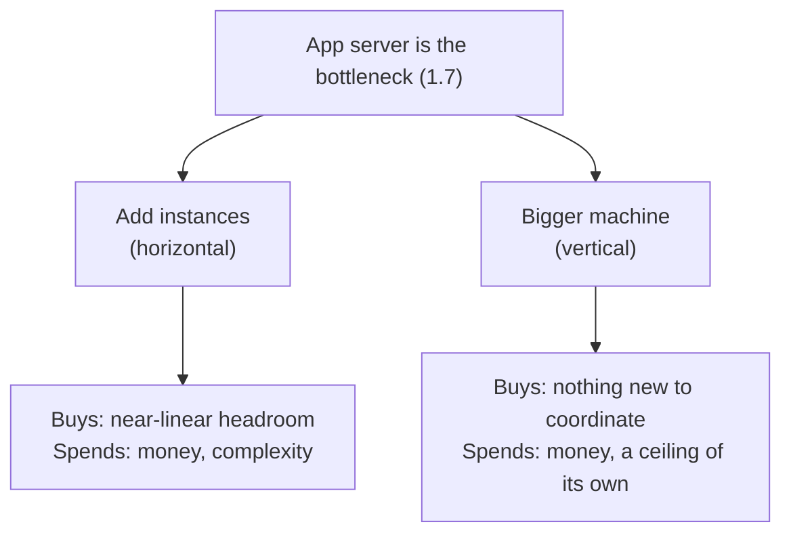

You just told the interviewer the app server is the bottleneck - 1.7's method,
applied correctly. "So what would you do?" they ask. "Add more app-server
instances," you say. They wait. You wait. "And what does that cost you?"
Silence: you'd thought about the fix, never about its price.

Every real design decision buys something and spends something. Skipping the
second half isn't optimism, it's an incomplete answer - and it's the exact
gap interviewers probe for, because it's the one candidates skip most.

> [!NOTE]
> Think first: "add more app-server instances" fixes 1.7's exact bottleneck.
> Before reading on, name one thing this fix spends - not what it fixes,
> what it costs. Commit to an answer.

## The reflex

A complete trade-off statement fills three blanks: *we chose X, accepting Y,
because Z.* X is the decision. Z is the reason, usually a fact from earlier
in the design (1.7's ceiling comparison, an NFR from 1.3). Y is the part most
answers skip: what the decision actually spends.

Note: both branches spend something - there is no branch that costs nothing.

"Add more app-server instances" names X. "Because the app server has the
lower ceiling today and stateless scaling is the cheapest way to raise it"
names Z, straight from 1.7. Y is still missing, and naming it is this
chapter's whole subject.

## The five things a decision can spend

Five dimensions cover most of what a system-design decision spends. Not
every decision spends every one - checking the list beats guessing which
applies.

| Dimension | What it measures | What paying this cost looks like |
|---|---|---|
| Latency | How long one request takes | A step that used to feel instant now has a pause |
| Consistency | Whether everyone asking at the same moment gets the same answer | Two people see different versions of the same thing for a short window |
| Complexity | How many moving parts and independent failure modes exist | More things that can break on their own; harder to onboard, harder to debug |
| Money | Literal infrastructure and operational spend | A bigger bill - more instances, more storage, more traffic |
| Operability | How hard the system is to run day to day | More alerts, more runbooks, more pages at 3am |

## Finding what you spent

Walk the list against the cold open's fix. Latency: unchanged. Consistency:
unaffected - 1.6's app server is stateless, so which instance answers a
request never changes the answer. Money: yes, every added instance is a real
line on a bill. Complexity and operability: yes, more instances means more
things deployed, monitored, and eventually routed across - not yet on this
chapter's palette.

Three dimensions spent, two untouched. "We added more app-server instances,
accepting more infrastructure cost and more operational surface, because the
app server has the lower ceiling today and stateless scaling is the
cheapest way to raise it" - now the statement is complete.

## Bigger machine or more of them

The diagram's other branch: a bigger machine - more CPU, more memory, still
one instance. That buys back operability and complexity: one thing to
deploy, one thing to watch. It spends money at a worse rate than smaller
instances (bigger machines cost more than proportionally more), and it
spends something the diagram doesn't name yet: a ceiling of its own - a
single machine, however large, still has a maximum, 1.7's whole point.

Neither branch is free, and neither is simply "correct." Steady, predictable
growth favors the bigger machine's simplicity today; uncertain growth favors
instances, since the ceiling problem doesn't come back as fast. Stating that
choice out loud, both costs named, is the skill - not picking a winner in the
abstract.

## In production

Uber's rider app has long shown driver locations a few seconds stale, not
perfectly live - a documented, deliberate choice: fast, always-rendering
maps over perfectly synchronized positions, accepting a small consistency
cost, because a pin a few seconds behind costs nothing next to a map that
freezes waiting for a current one. Any live-updating UI faces the same call:
freshness or responsiveness, not both for free.

## Common mistakes

- **Naming the fix, not the cost** - stopping at "we added more instances"
  without saying what it spent.
- **Vague cost language** - "it's a bit more complex" names no dimension and
  commits to nothing; "more operational surface, more things to monitor" does.
- **Assuming the cheaper-sounding option is free** - every real branch spends
  something, even the one that dodges the obvious cost.
- **Picking a winner instead of stating the trade** - declaring "the right
  answer" without naming what was given up is a claim, not a trade-off.

## In an interview

This is loop step 7 (0.4): trade-offs and alternatives, the question that
follows almost every fix you propose. Interviewers who ask "what did that
cost you?" aren't looking for one specific right cost - they're checking
whether you thought past the benefit at all.

What that sounds like at a senior level: *"We'd add app-server instances,
accepting more infrastructure cost and operational surface, because the app
server has the lower ceiling today and stateless scaling is the cheapest way
to raise it. If we'd chosen a bigger machine instead, we'd have kept things
simpler at the cost of hitting a new ceiling sooner."*

## Recap

- A complete trade-off statement fills three blanks: we chose X, accepting
  Y, because Z - and Y is the part most answers skip.
- Five dimensions cover most of what a decision spends: latency,
  consistency, complexity, money, operability. Not every decision spends
  every one.
- Checking the list beats guessing - walk it against a decision to find what
  it actually costs, not what a reader assumes.
- A genuine trade-off has two defensible options with real costs on both
  sides; naming the cost is the skill, not picking the "right" one in the
  abstract.

## Your turn

No canvas build this chapter - the palette is still 1.6's three components,
and naming a cost doesn't need a fourth. The knowledge check presents three
trade-off scenarios and asks you to pick the statement that names both what's
bought and what's spent, not just the benefit - the trade-off drill this
chapter is built around, run directly in the quiz.

## Next

1.7 gave you the method for finding what's broken; this chapter gave you the
reflex for stating what fixing it costs - loop steps 6 and 7 (0.4), which
most candidates keep separate without realizing it. 1.6's `instances` field
is what "add more app-server instances" spends money and complexity on. 0.2
named cost as one of five forces; this chapter broke that single dimension
into the five sharper ones engineers actually argue about.

1.9 Deep Dive Methodology picks up the next question: once you know what
broke and what fixing it costs, which piece of a ten-component design is
worth looking at closely? Further out (3.22): "consistency" here is a
working name, not the full model - strong versus eventual, quorums, and CAP
get their real treatment there.
