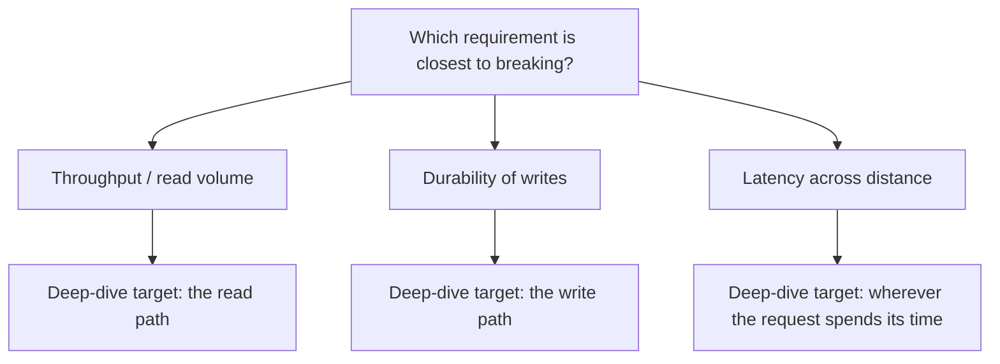

"Add more app-server instances," you said - 1.7's diagnosis, 1.8's trade-off
named out loud. "Good," the interviewer says. "Now pick one part of this
design and go deeper." You start on the app server's request handling, the
part of the stack you know best from your day job. Eight minutes later
you're still there. The database, the part every requirement you were given
actually pointed at, never comes up again.

Every real design has ten things you could explain in more depth and time
for one or two of them. Picking based on comfort instead of evidence is a
quiet, common failure: the deep dive is technically well done, and it
answers the wrong question.

> [!NOTE]
> Think first: in the interview above, which part of the design should the
> candidate have picked to go deeper on, and why? Commit to an answer before
> reading on.

## Where the requirements point

The requirements already say where the pressure is. Deep dive there, not at
the part you find interesting or the part you can talk about longest.

Note: the branch is picked by which requirement is under real pressure, not
by which component looks most interesting.

The method is two questions, not a guess:

1. Which requirement (1.3's promises) is closest to its limit right now?
2. Which component on the path (1.7's ceiling method) is where that
   pressure actually lands?

The intersection is the target. Skip either question and the pick becomes a
preference.

## Matching requirement to target

| Requirement under pressure | Where it lands | Deep-dive target |
|---|---|---|
| A 10x jump in read traffic is coming | The database's read handling, confirmed by 1.7's ceiling check | The read path |
| No write may be lost, even mid-crash | How the database confirms a write actually finished | The write path |
| Users across time zones need sub-200ms responses | Wherever the request spends its time (1.5's cross-continent round trip is a floor no code removes) | The full request path, measured |

None of these name a fix. Naming what's under pressure is this chapter's
job; the machinery that relieves it is later material - the deep dive finds
the target, it doesn't build the solution.

## One level down, without losing the room

Going one level down means stating the plan before diving, not diving
silently: "the read path is where the requirement stresses hardest, so
that's where I'd go deeper" - said out loud, before any detail. Then the
internals, at the depth 1.6-1.8 already established: what actually happens
when a read arrives, where time or risk is spent, what changes under load.

Losing the room is the failure mode this invites: ten minutes on one
component's internals with no return trip. The interviewer stops tracking
why it matters. The fix is a deliberate resurface - one sentence that
reconnects the detail to the whole design ("that's the read path; the rest
of the design is unaffected by this") - before moving on.

## One dive or two

Requirements sometimes stress two things at once - a read-heavy path and a
hard durability promise, say. Splitting the remaining time in half sounds
fair and is usually wrong: two shallow dives read as two things
half-understood, where one real dive plus an honest "I'd go deeper here
next if we had time" reads as judgment. Split only when both pressures are
genuinely close to breaking; otherwise, going deep costs breadth on the
other subsystem, and staying shallow on both costs believable depth on
either.

## In production

Amazon's engineers found, and later published, that every 100ms of added
page latency cost about 1% of sales - a number that turned "where do we
spend performance-engineering time" from a debate into an answer: wherever
the measured latency actually is, not wherever felt slow. Deep-dive time
follows the same rule: evidence names the target, not intuition.

## Common mistakes

- **Deep-diving everything** - a shallow pass over every subsystem instead
  of real depth on the one or two that matter.
- **Deep-diving the familiar one** - the cold open's failure: picking the
  subsystem you know best instead of the one the requirements stress.
- **Never resurfacing** - going deep and never reconnecting the detail to
  the rest of the design, so the interviewer loses the thread.
- **Choosing the flashiest-sounding piece** - impressive to describe is not
  the same as under pressure.

## In an interview

This is loop step 5 (0.4): the deep dive, right after the first
architecture and before bottlenecks get named explicitly. Interviewers
watch two things here: did you pick a defensible target, and did you come
back up for air.

What that sounds like at a senior level: *"The read:write ratio here is
what worries me most, so I'd go one level down on the read path:
[detail]. Zooming back out, the write path is untouched by any of this - if
we have time, that's the one I'd look at next given the durability
requirement."*

## Recap

- Pick the deep-dive target with two questions: which requirement is
  closest to its limit, and which component is where that pressure lands
  (1.3 + 1.7's method).
- Going one level down means stating the plan before diving and resurfacing
  after - never disappearing into one component's internals.
- When two requirements are both under real pressure, name both and commit
  to one for now rather than splitting shallowly across both.
- Deep-diving everything, diving on familiarity, and never resurfacing are
  three failure modes that look like effort but answer the wrong question.

## Your turn

No canvas build this chapter - the palette is still 1.6's three components,
and picking a target doesn't need a fourth. The knowledge check shows a
design with its requirements and asks you to pick the right deep-dive
target from four candidates, reading why each of the others misses - the
exercise this chapter is built around, run directly in the quiz.

## Next

1.3 gave you the requirements this chapter reads for pressure; 1.7 gave you
the ceiling method that finds where that pressure lands; 1.8 gave you the
trade-off reflex this chapter reuses when two requirements compete for the
same dive. Loop step 5 (0.4) is now covered end to end: pick the target, go
one level down, come back up.

1.10 Communicating & Defending a Design picks up right where this leaves
off: you've chosen what to go deep on and come back up - now the follow-ups
start, and the same "name it, commit, defend without defensiveness" habit
gets tested live. Further out (3.12): the read path's actual relief - a
second copy of the data that absorbs read traffic - gets its full treatment
there; this chapter only finds that the read path is where to look.
