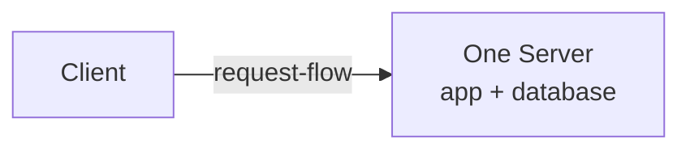
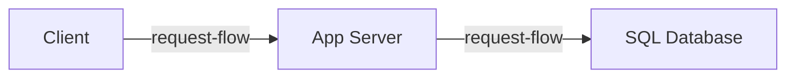
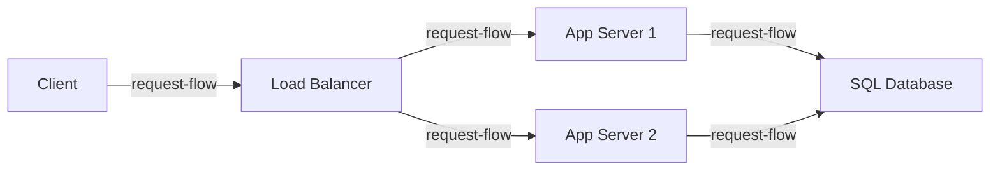
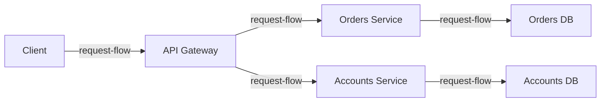

"Walk me through the architecture," the interviewer says, and you draw what a
real system looks like: a load balancer, three app servers, a cache, a read
replica, a queue. "Why is the cache there?" Because real systems have caches.
That answer ends the conversation you were trying to have.

Every box in that diagram went in on a specific day, because something specific
stopped working. Part 3 is twenty-six chapters about those boxes,
ordered as a system acquires them rather than alphabetically. This chapter is that order:
four shapes, three forced moves, and what each move cost.

> [!NOTE]
> Think first: your product runs on one machine, app and database together, and
> traffic is doubling every month. Name the first thing you would split off,
> and name one new way the system can fail once you have. Commit to both before
> reading on.

## Nothing here was designed

No mature architecture was drawn in one sitting. Each box is the residue of a
limit that was actually reached, and it went in on the day the limit started
hurting, not before.

One cycle produces all of them. A ceiling gets close - 1.2's ceiling, the
lowest number on the path. The cheapest split that relieves it gets made. The
ceiling then *moves* to whatever is now the lowest number, because relieving a
ceiling never removes one. Read any diagram through that cycle and it stops
being a parts catalog: each box names a limit somebody hit, and the order the
boxes appeared in is the order the limits arrived.

## Shape one: one machine

Note: there is no network between the application and its data, which is both
the fastest this system will ever be and the fewest things it will ever have
that can break.

This shape is not a toy; it carries real products for years. One deploy, one
machine to watch, and none of 2.2's path failures inside it, because there is no
path between the parts.

What ends it is usually not traffic. It is that one machine is one failure
domain: a backup competes with live requests for the same CPU, a bad deploy can
take the data with it, and headroom is purchasable only in whole machines, for
both jobs at once.

## Shape two: split the tiers

Note: this is 1.2's three-box shape, and the arrow between the last two boxes
is now a network hop rather than a function call.

**Buys:** each side is sized, tuned, restarted and deployed on its own. The
database gets a machine chosen for memory and disk; the app gets one chosen for
CPU. A deploy stops being able to endanger the data.

**Spends:** a network round trip on every query, and a state that could not
exist before - the app healthy while its database is unreachable. Every symptom
2.2 taught now has a home inside a system you own, including the ambiguous one
where a write commits and the answer never comes back.

## Shape three: copies of the app tier

The app server hits its ceiling first, which is the ordinary case: application
work is CPU-hungry and a database serving indexed reads is not. 1.3 already
priced both answers - a bigger machine buys simplicity and spends money at a
worsening rate, more instances buy near-linear headroom and spend complexity and
operability. The bigger machine wins for a while, then stops, because eventually
there is no larger machine to buy.

Note: the two app servers are identical, and both arrows land on the same
database - the shape solves one ceiling and hands the pressure to the next box
along.

**Buys:** headroom that grows by adding machines, and the end of one instance
being fatal. 2.1 called the router in front a force that showed up rather than a
default; this is that force.

**Spends:** something new in front to run and keep healthy (3.4), and a
constraint on your own code. Identical instances only work if any of them can
answer any request, so nothing a user depends on may live in one instance's
memory. That constraint is a chapter of its own (3.6), and where the displaced
state goes is another (3.7).

**Where the ceiling went:** every instance reads and writes the same database,
and you just multiplied the number of things asking it. The moves available
there - copies for reads (3.12), a faster layer in front (3.14), splitting the
data itself (3.13) - each spend correctness rather than money, which is why
Groups C and D are the longest stretch of Part 3.

## Shape four: split the application

Note: the two halves now reach their own stores, which is the point - and the
arrows from the gateway are network calls between parts of one product.

Shapes one through three are all a **monolith**: one application, built and
deployed as a single unit, however many machines it runs on. Shape four splits
that unit into **services**, each deployed on its own and each owning its own
data.

The pressure here is usually not traffic either. One codebase and one deploy
pipeline serve many teams, so shipping anything means coordinating with
everyone, and one component's scaling needs diverge far enough from the rest
that sizing them together wastes most of what you buy.

**Buys:** independent deploys, independent scaling, and a blast radius per
service rather than per product.

**Spends:** a network in the middle of what used to be function calls. Every
failure class from 2.2 now applies between two pieces of your own system, and
the operational surface it adds - services finding each other (3.9), policy at
the front door (3.5), work that should not block a request (3.17) - is a
permanent tax that needs people to pay it.

## Why the moves come in this order

Compute copies for free; state does not. Two identical app servers need no
agreement, because they remember nothing worth disagreeing over. Two copies of a
database hold the same rows and must agree on them, and agreement costs either
latency (wait for every copy before answering) or correctness (do not wait, and
let a reader see an old value).

That asymmetry sets the order of every architecture in this chapter, and of Part
3 itself. Scale the tier with no state first, because that move is cheap and
buys the most. Touch the data tier later, because every option there spends
correctness, and the design work is deciding how much. Split the application
last, because it is the one move that is genuinely hard to undo.

| Group | The pressure that produces it | Chapters |
|---|---|---|
| A - Core Infrastructure | 2.1's edge: traffic has to be resolved, admitted and routed before your code sees it | 3.1-3.5 |
| B - Compute | Copies of the app tier only work if a request can land anywhere | 3.6-3.9 |
| C - Data | Every instance reaches one database, and it is now the ceiling | 3.10-3.13 |
| D - Performance | The database is answering reads it should not have to: the same ones over and over, and ones it is the wrong tool for | 3.14-3.16 |
| E - Async | Work sits on the request path that the user has no reason to wait for | 3.17-3.19 |
| F - Storage | Files and blobs stop fitting in rows | 3.20-3.22 |
| G - Reliability | Enough boxes that something is always broken, and enough traffic that some of it is hostile | 3.23-3.26 |

## When the answer is "don't"

Every move above is available today, and the boring shape is the right answer
far more often than architecture diagrams suggest. This is 1.2's preempt-or-wait
trade-off at whole-system scale: move before the force arrives and you pay
complexity, operability and new failure modes for a ceiling you might not reach
this year; wait until it arrives and you make the move under pressure, badly,
while users feel it.

Neither is universal, and team size moves the answer as much as traffic does. A
two-person team on shape one has one thing to run and can fix anything in an
afternoon; the same shape at a hundred engineers is a permanent traffic jam. In
1.3's terms: we stayed on one machine, accepting that a hardware failure is a
full outage, because at 400 requests a second we are nowhere near the wall and
nobody is on call to run anything more. Change the estimate and the reason
changes with it.

The question is never "which architecture is best." It is "which limit have we
actually hit," and the honest answer is often "none yet."

## In production

**Stack Overflow** served one of the most-read sites on the web from a handful
of servers, a monolithic application and one primary database, on purpose: their
workload is overwhelmingly repeated reads of the same content, which one large
machine with a lot of memory answers extremely well. They accepted a shape that
depends on vertical headroom continuing to exist. It applies whenever your
traffic is large but your working set is small.

**Amazon** split its monolith into services in the early 2000s for a reason
unrelated to request volume: every team shipped through one codebase and one
release, so teams spent their time waiting on each other. The move bought
independent deploys and cost an internal network in the middle of what used to
be method calls, plus the tooling to operate it. It applies when your bottleneck
is the org chart rather than the CPU.

## Common mistakes

- **Drawing the end state.** Opening step 4 with a load balancer, a cache and
  replicas already on the board invites one question you cannot answer: what
  forced each of them. A box you cannot attribute to a pressure is a box that
  will be asked about.
- **Copying a company's shape instead of its forces.** Netflix's architecture is
  an answer to Netflix's constraints. You are borrowing the answer to a question
  nobody asked you.
- **Treating state like compute.** "The app tier scaled by adding copies, so we
  will add copies of the database" is the single most common version of this
  chapter's asymmetry being missed.
- **Reading the four shapes as a ladder to climb.** Most systems stop at shape
  two or three and are correct to. Progress is not measured in boxes.

## In an interview

"Walk me through the architecture" is step 4 of the loop (0.4), and the answer
that separates candidates is narrative rather than inventory. Anyone can name
boxes. The strong version starts at the simplest shape today's numbers justify,
names the first thing that breaks, and says what the move would be when it does
- which answers the bottleneck and trade-off follow-ups before they are asked.

What that sounds like at a senior level: *"At the volume we estimated this is
one app tier behind a load balancer and one database, and I would not add a
cache yet - nothing is slow. The first ceiling is read volume on that database,
somewhere around five times today's traffic. The move then is read replicas, and
the price is that a user can write something and not see it on the next page
load: fine for a feed, not fine for a balance. If growth went ten times further
I would ask which part of the product actually has to split, rather than
splitting all of it."*

## Recap

- No architecture was designed in one sitting. Each box is a limit somebody hit,
  and their order is the order the limits arrived.
- The cycle repeats: a ceiling gets close, the cheapest split relieves it, the
  ceiling moves to the next lowest number.
- Four shapes: one machine, split tiers, copies of the app tier behind a router,
  the application split into services.
- Compute copies for free and state does not. That is why compute scales out
  before the data tier does, and why Part 3 runs Compute, then Data, then
  Performance.
- Most systems are right to stop at shape two or three. Every move buys
  something specific and permanently spends complexity, operability and new ways
  to fail.

## Your turn

No canvas build this chapter, and no new components on your palette. The
exercise is the sequence itself: the knowledge check asks you to put the shapes
in the order a system reaches them, then to judge two situations where the right
move is not the bigger diagram. Read every explanation, including the ones you
get right.

## Next

2.1 mapped the request in space and 2.2 broke it at every stop; this chapter
mapped it in time. 2.1's line that the load balancer, gateway and firewall
"exist because a specific force showed up" is now the whole story rather than an
aside. 1.2's ceiling method supplied the trigger for every move, 1.3's reflex
supplied the price of each, and 0.2's forces are what has been doing the forcing
all along.

Part 2 ends here, and Part 3 starts by making the arrows real. You have drawn
network hops between three shapes without once asking what an arrow costs, who
can read what crosses it, or who is allowed to send one at all. 3.1 Networking
Fundamentals starts there, at the perimeter, with the first component whose
entire job is deciding which traffic never gets in.
