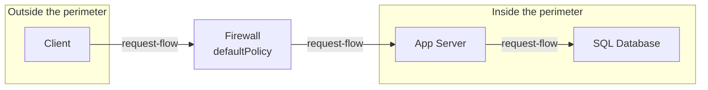

Every system this curriculum has built so far has one address, and anything
on the internet that knows it can reach it directly. Point a port scanner at
a freshly launched app server and it finds every open port within minutes -
not because anyone attacked it, because nothing was ever asked to say no.

2.1 mapped the request path and 2.3 named the pressure that produces Group A:
traffic has to be resolved, admitted and routed before your code sees it.
Admitted is this chapter. Nothing you've built yet decides whether a piece of
traffic is even allowed to knock.

> [!NOTE]
> Think first: what is the simplest rule you could put in
> front of every system you build, once, so an open port stops being a free
> invitation? Commit to an answer before reading on.

## The trust perimeter

A firewall is a bouncer, not a lock: it never checks who you are, only
whether your traffic is even allowed to approach the door. Everything on one
side of it is outside and unproven; everything on the other side is inside
and reachable only through it.

Note: the firewall doesn't add a capability the app server lacked - it
removes one. Before it existed, the app server was reachable by anything
that had its address. After, only traffic the firewall admits gets that far.

## What it's actually filtering

A firewall decides using three fields on every piece of traffic: source
address, destination port, and protocol. "Admit anything from anywhere on
port 443, deny everything else" is a complete, real policy stated in one
sentence.

Two protocols carry that traffic, and the choice is a real design decision,
not a default. **TCP** confirms delivery, keeps things in order, and resends
what gets lost - at the cost of a handshake before the first byte moves.
**UDP** sends and forgets: no ordering, no resend, no handshake. Almost every
request-response API rides on TCP, because losing or reordering a request
silently is worse than the handshake cost; UDP earns its place where a late
packet is worthless anyway (live video, some real-time telemetry) and the
application would rather drop it than wait.

TCP is also what a TLS handshake runs over. 2.1 already priced the round
trips; what matters here is what the handshake buys: the channel gets
encrypted, and the client gets proof the server is who it claims to be. A
firewall filtering by port and protocol generally can't see what's inside
that encrypted channel - it operates one layer down from TLS, which is why
perimeter filtering and everything a reverse proxy or gateway later does to
the request itself are different jobs, not the same job twice.

The Firewall component's `defaultPolicy` field is exactly this decision,
made concrete: `allow-all`, `deny-all`, or `allow-listed`.

## Two policies, both real, one usually wrong here

**Default-deny, allow-list what's needed.** Nothing gets through unless a
rule names it. Adding a legitimate new service costs an explicit rule every
time - real operational tax - but nothing reaches the inside by omission.

**Default-allow, block what's known-bad.** Nothing new needs a rule, so
onboarding a service is free. It also means anything nobody has thought to
block yet gets through, including everything a scanner tries in its first
sixty seconds. This is `allow-all`, and it is not a lighter version of a
firewall - it's a firewall doing nothing while still occupying the diagram.

Default-deny is the right call for a perimeter almost everywhere: the cost
of a missed allow-rule is a support ticket; the cost of a missed deny-rule
is the cold open above.

## When the perimeter itself breaks

A firewall left at `allow-all` fails silently - nothing crashes, nothing
alerts, the diagram still shows a box doing its named job. The only sign is
what does reach the app server that shouldn't.

The opposite failure is louder and more common in practice: a deploy adds a
new internal service or a teammate opens a new port, forgets the matching
rule, and the firewall - working exactly as configured - blocks it. From the
user's side this looks identical to any other outage; from an engineer's
side, "what changed" and "check the firewall rules for what changed with it"
is the first thing to reach for before assuming the code broke.

Neither failure is the firewall being buggy. Both are the firewall doing
precisely what its configuration says, which is the entire point of treating
configuration as part of the architecture rather than a detail behind it.

## At scale, the rule list is the system

At 10x traffic, a single default-deny firewall with a short allow-list costs
nothing extra - it's a lookup, not a bottleneck. At 100x, with dozens of
services each needing their own rule, the rule list itself becomes something
that has to be reviewed, versioned, and trusted not to have accumulated a
rule nobody remembers the reason for. Cloud environments answer this by
moving the firewall from one box to a managed, per-service policy (security
groups, in AWS's own naming) rather than one shared list everything argues
over - the perimeter concept survives, the "one box" doesn't have to.

## In production

**AWS** ships every new resource inside a default-deny security group -
nothing is reachable until an owner explicitly opens a port. That default
exists because the failure mode of a forgotten allow-rule (a ticket) is
cheap and the failure mode of a forgotten deny-rule (the cold open above, at
their scale) is not; a new customer who wants "reachable from anywhere"
has to say so, on purpose, per port.

## Common mistakes

- **Leaving the default permissive "to keep things flexible."** This is the
  chapter's own namesake failure - a firewall that filters nothing is a box
  on the diagram doing no work.
- **Treating the firewall as authentication.** It answers "should this
  traffic reach the perimeter at all," never "is this specific request
  legitimate" - that's a different layer's job.
- **Setting rules once and never revisiting them.** Every rule that outlives
  the service it was written for is a wider hole than anyone intended.
- **Assuming the perimeter is the only defense.** A firewall that fails open
  should be a bad day, not the only thing standing between the internet and
  the database.

## In an interview

This is loop step 4 (0.4), and it surfaces again at step 6: "what stops
someone from just connecting straight to your database?" is a fair follow-up
to any diagram that draws a straight line from the internet inward.

What that sounds like at a senior level: *"Nothing behind the firewall is
reachable by default - I'd default-deny and only allow-list the ports that
actually need to be public. Most of my request-response traffic rides on
TCP for the delivery guarantees; the firewall itself is filtering on
address, port and protocol, not on what's inside the request, so it's one
layer of several, not the whole defense."*

## Recap

- A firewall decides what's allowed to approach, based on source, port, and
  protocol - it doesn't check who's asking or what they're asking for.
- TCP guarantees ordered, resent delivery at the cost of a handshake; UDP
  skips both. Most request-response traffic needs TCP's guarantees.
- Default-deny costs a rule per new service and is right almost everywhere;
  default-allow (`allow-all`) is a firewall filtering nothing.
- A misconfigured perimeter fails two ways: silently open (nothing alerts)
  or loudly closed (a forgotten rule blocks something real) - both are the
  firewall doing exactly what it was told.

## Your turn

The starter graph is the client, app server, and database you've built
before - nothing sits between the client and the app server yet. Add a
Firewall, wire it in between them, and give it a policy that actually
filters something before you Submit. Which specific check fires if you
don't, and how many findings a permissive policy produces, isn't previewed
here - run Validate and read what it says.

## Next

3.2 DNS picks up the phase that happens before any of this: how a client
gets an address to send that first packet to in the first place.
