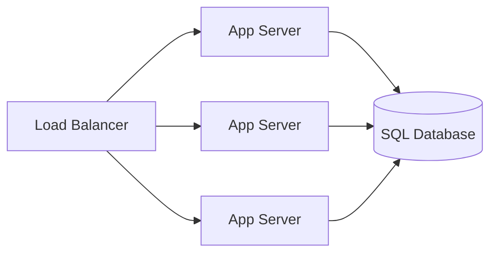
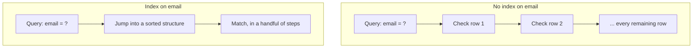

Every service you've built since 1.2 ends at the same place: one SQL Database.
3.6 through 3.9 let you scale the app tier by adding identical, interchangeable
copies - a second instance costs a config value, and the load balancer routes
around it for free. The database never got that treatment. It's the one box
every other block in this curriculum exists to protect: read replicas (3.12),
a different storage shape (3.11), sharding (3.13), and caching (3.14) are all
answers to the same fact - you can't just duplicate this one the way you
duplicated the app tier.

This chapter asks what the database actually promises, and why the moves that
come after it spend correctness, not money.

> [!NOTE]
> You scaled the app tier by adding identical copies behind a load balancer.
> Why doesn't the same move work here - just point half the app servers at a
> second, independent database and call it solved? Commit to an answer before
> reading on.

## The one box that doesn't get to just duplicate itself

Caption: 3.8 let you add app-server copies for free - the load balancer
absorbs each one. Every copy still ends at the same single database, the one
node in this diagram that can't be duplicated the same way without answering
a much harder question first: which copy is the real one when they disagree?

## What a database actually promises

| Guarantee | What it means |
|---|---|
| Atomicity | A multi-step write finishes completely or not at all - no half-applied state left behind |
| Consistency | Every write leaves the data obeying its own declared rules (a constraint that forbids a negative balance keeps holding) |
| Isolation | Two transactions running at the same moment can't see each other's unfinished work |
| Durability | Once a write is acknowledged, it survives a crash the instant after |

These four (ACID) are what makes "the database said yes" trustworthy enough
to build everything else on top of. Naive duplication breaks all four at
once: two independent databases accepting writes have no way to agree on
which write happened first, so consistency and isolation stop meaning
anything. That's why 3.11-3.13 spend a full three chapters on how to add
copies and splits without losing these guarantees, instead of one config
field.

## Why an index turns a scan into a lookup

Caption: with no index, a lookup costs one check per row - a scan. An index
maintains a sorted structure that turns that scan into a small number of
jumps, at a real cost: every write has to update the index too, and the
index itself takes disk space. Indexing is a trade, not a free upgrade -
index the columns your actual queries filter or sort on, not every column
"just in case."

Disks are the reason any of this matters. Reading a random row costs far
more than reading the next one in sequence, and a table scan on a large
table means paying that cost once per row. An index exists to convert most
of that random reading into a small, targeted amount - the single highest-
leverage lever a database gives you, cheaper than any of the components
later chapters add on top of it.

## What it costs to get this wrong

- **A query that scans instead of using an index is invisible at 10k rows
  and unusable at 100M.** The code never changed - only the row count did,
  and cost grows with it.
- **A write "acknowledged" before it's actually flushed to disk looks
  identical to a real commit until the machine crashes.** Then the
  acknowledgment was a lie, and durability was traded away without anyone
  deciding to.

## What changes at scale

A single, well-indexed, well-resourced database goes further than most
engineers expect before it becomes the ceiling - bigger disks and more
memory buy real headroom here, the same way they did for the app tier. Past
that ceiling, the moves are the ones 2.3 already named: copies for reads
(3.12), a different storage shape entirely (3.11), splitting the data itself
(3.13), and a faster layer in front so the database stops answering the same
question twice (3.14). Named here, not yet taught.

## In production

Stack Overflow ran its entire site on a small number of powerful SQL Server
machines for years, well past the point most teams reach for sharding or a
NoSQL store - not from lack of ambition, but because a well-indexed
relational database on serious hardware carries far more load than
"eventually you'll outgrow SQL" folklore suggests. The lesson wasn't "never
shard." It was: exhaust indexing and vertical headroom first, because
they're cheaper than anything that follows.

## Common mistakes

- **Treating an index as free.** Every index adds work to every write and
  consumes disk - index the access patterns that actually exist, not every
  column.
- **Not checking whether a slow query is scanning** before reaching for more
  hardware, a replica, or a cache. The cheapest fix is often still available.
- **Trading durability for speed without deciding to.** A write that returns
  fast because it hasn't actually hit disk yet is a choice, not a bonus.
- **Reaching for sharding or a new storage engine before indexing and
  vertical headroom are exhausted** - 3.13's own lesson is that sharding
  buys capacity at a permanent complexity cost the earlier levers don't.

## In an interview

High relevance - this is the step 5 deep-dive staple the moment a design has
any real data behind it. "How would you make this query fast at scale?" is
one of the most common single follow-ups in the loop.

What that sounds like at a senior level: *"Before I add anything new, I'd
check whether the slow query is scanning - an index usually buys an order of
magnitude for a fraction of the cost of a replica or a cache. I'd only reach
past that once indexing and the machine's own headroom were actually
exhausted."*

## Connections

This deepens the SQL Database you've had since 1.2 and used as a session
store in 3.7 - a faster layer for reads like that still arrives, on schedule,
in 3.14. It closes the bridge 3.9 opened: every request you've traced through
this system lands here, and this chapter is where that landing spot finally
gets examined instead of assumed.

## Recap

- ACID is what makes "the database said yes" safe to build on - atomicity,
  consistency, isolation, and durability, all at risk the moment you
  duplicate a database naively.
- An index turns a scan into a lookup, paid for with extra work on every
  write - the single highest-leverage lever before reaching for anything
  else.
- A query's cost tracks table size, not code - fine at 10k rows says nothing
  about 100M.
- The database is the ceiling every later Group C/D chapter exists to move,
  and each of those moves spends correctness, not money.

## Your turn

This chapter doesn't add a new box to the canvas - the SQL Database you've
been running since 1.2 doesn't change shape, only your understanding of what
it's already promising and what it costs to ask it the wrong question. No
build this time: the knowledge check is whether you can read a query's cost
off its own access pattern, and defend the guarantees you're relying on
without being able to see them.

## Next

3.10 assumed the answer was always a relational store. 3.11 SQL vs. NoSQL is
where that assumption gets defended - or found wrong for the workload in
front of you.
