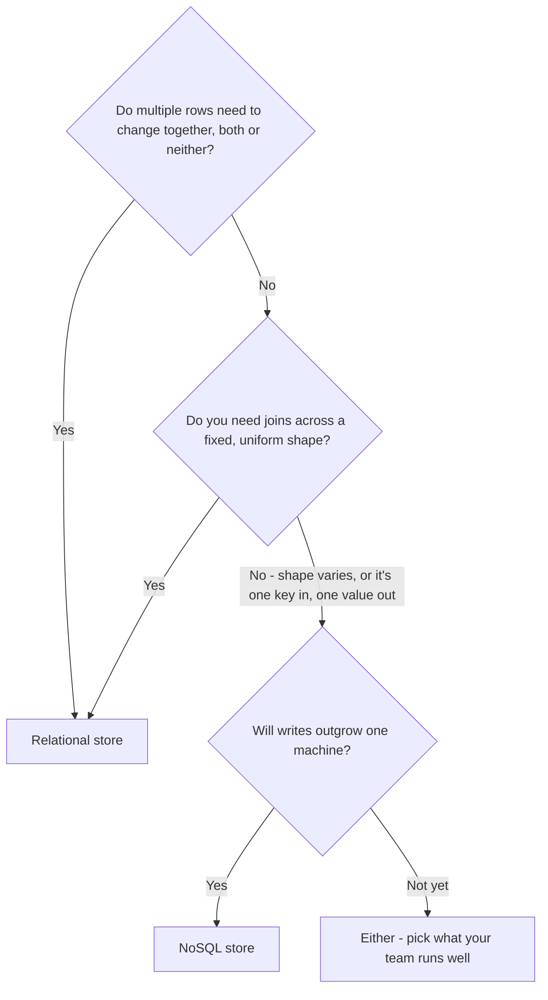

3.10 assumed the answer was always a relational store, and never defended it.
Every chapter since 1.2 has stored its data the same way - one table, one
fixed shape - for every kind of thing that shape didn't quite fit. A product
catalog is the usual place this breaks: books need an ISBN and a page count,
electronics need a wattage and a warranty length, and merchandising adds a new
attribute most sprints. Force that into fixed relational columns and you
either leave most columns NULL for most rows, or run a schema migration every
time someone adds a field.

This chapter isn't SQL versus NoSQL as a rivalry. It's a decision procedure:
look at the data's shape, how it's actually queried, and how it needs to
scale - and the store picks itself.

> [!NOTE]
> The catalog above is one table, fighting its own shape every sprint. Before
> reading on: would you reach for a different kind of database here, or fix
> it some other way? Commit to an answer.

## The three questions that pick a store

The procedure asks three questions, roughly in this order: does this data
need multi-row transactions or joins across entities? does its shape vary row
to row? will writes outgrow what one machine can hold? Two of the three
usually decide it before scale ever enters the conversation.

Caption: shape and access pattern get asked before scale - a workload that
needs cross-row transactions or joins is decided immediately; scale only
breaks the tie for what's left.

## What NoSQL actually trades away

| Gives up | Gains |
|---|---|
| Multi-row transactions across entities (debit here, credit there, both or neither) | A schema that can vary row to row, with no migration to add a field |
| Ad-hoc joins across tables | Horizontal write scale built in - data partitions across machines by design, not by later surgery |
| One shared query language and guarantee set for everything | A store shaped for exactly the access pattern it's built for |

A NoSQL Database's `model` field names which shape: key-value (a value
fetched by exact key, nothing else), document (a JSON-shaped record that can
vary field to field), wide-column (huge tables keyed by partition and range,
built for write volume), graph (relationships as first-class edges, not join
tables). Picking the wrong one loses the exact benefit the choice was
supposed to buy - a key-value store has no room for a catalog item's varying
attribute set; that's a document's job.

## Two philosophies, one decision

| Scenario | Store | Why |
|---|---|---|
| A checkout ledger: debit one account, credit another, both succeed or neither does | SQL | Needs multi-row transactions across entities - forcing this into NoSQL means hand-rolling the atomicity a relational store gives for free |
| Device telemetry: keyed by device and timestamp, written constantly, read only as "this device's recent readings," never joined | NoSQL | Pure key-and-range access at a write volume no single relational primary partitions on its own |
| A session token looked up by one key, no joins, moderate volume | Either | Both handle this correctly - the real decision is what your team already operates well, not a technical wall |

The third row is the one candidates get wrong most often, by inventing a
technical reason where none exists. Naming "either, and here's why" is a
stronger answer than picking a side on vibes.

## What happens when you guess wrong

- **NoSQL for data that needed transactions.** The application ends up
  hand-rolling the atomicity the database used to give for free - a crash
  mid-sequence leaves inconsistent state with no single guarantee to fall
  back on.
- **SQL for a workload with no ceiling in sight.** Writes queue behind one
  primary; the fix becomes replication (3.12) or sharding (3.13) glued on
  after the fact, instead of a store that partitioned from day one.

## What changes at scale

At moderate load, either shape works for most teams - 3.10's own
well-indexed single machine goes further than the decision procedure above
suggests. The choice is forced by access pattern first, not size. Only once
writes genuinely can't fit on one machine does it matter which side you're
on: a relational store reaches for copies (3.12) and eventually splits the
data itself (3.13, not yet taught) to keep up, while a NoSQL store like this
chapter's was built to partition writes across machines from the start.

## In production

Discord stores its chat messages - trillions of them - in a wide-column
NoSQL store, not a relational database. Messages are looked up almost always
by channel and time range, never joined against anything else, and write
volume grew past what one relational primary could keep pace with as the
product scaled. The access pattern decided the store, not a belief that
NoSQL is generally faster.

## Common mistakes

- **Treating this as a permanent, whole-system choice.** Most real systems
  run both, for different data - a catalog in one store, a ledger in
  another.
- **Reaching for NoSQL because "it scales"** without checking whether the
  workload needs the transactions or joins it gives up.
- **Assuming NoSQL means no consistency guarantees.** Most NoSQL stores are
  strongly consistent per key - what's actually given up is guarantees
  *across* entities, not correctness within one.
- **Picking a model that doesn't match the access pattern** - a document
  store doesn't help a workload that actually needs graph traversal.

## In an interview

High relevance - this is arguably the single most commonly asked
system-design question, almost always as a follow-up the moment any real
data enters the design.

What that sounds like at a senior level: *"I'd start from the access
pattern, not the label: if this data needs multi-row transactions or joins
across entities, that's a relational store's job. If it's simple lookups by
a known key at a write volume no single machine keeps up with, NoSQL's
built-in partitioning is what's actually being bought. If neither pressure
is there yet, I'd default to what the team already runs well."*

## Connections

This is 3.10's own deferred question, answered: 3.10 assumed a relational
store and moved on; this chapter is where that assumption gets defended or
overturned per workload. The SQL Database itself goes back to 1.2, and the
pressure driving this whole chapter is 2.3's own Group C row - every
instance reaching one database, and that database now being the ceiling.

## Recap

- The decision procedure: does this data need transactions or joins across
  entities, does its shape vary row to row, will writes outgrow one machine
  - roughly in that order.
- NoSQL trades multi-row transactions and joins for a flexible schema and
  horizontal write scale built in from the start.
- Most systems run both, for different data, not one whole-system choice.
- The most common wrong answer is reaching for either store on vibes instead
  of checking what the workload actually needs.

## Your turn

The starter graph is 3.10's own passing system, unchanged - orders and
accounts still need everything the SQL Database already promises, and
nothing here asks you to remove it. The catalog problem from the top of this
chapter is already on the canvas as a NoSQL Database, disconnected, with a
`model` value that doesn't fit its own data. Nothing here names which of the
four values is correct - that's this chapter's decision procedure, applied
for real. Fix the model, wire it in from the Application Server, then
Validate and Submit.

## Next

3.11 asked which store to reach for. 3.12 Replication is where copies of
that store enter the picture - for reads, and for the first guarantee that
isn't there for free: read-your-writes.
