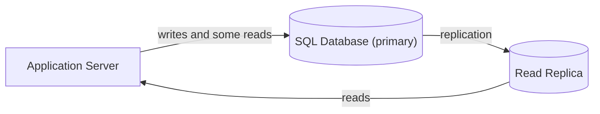
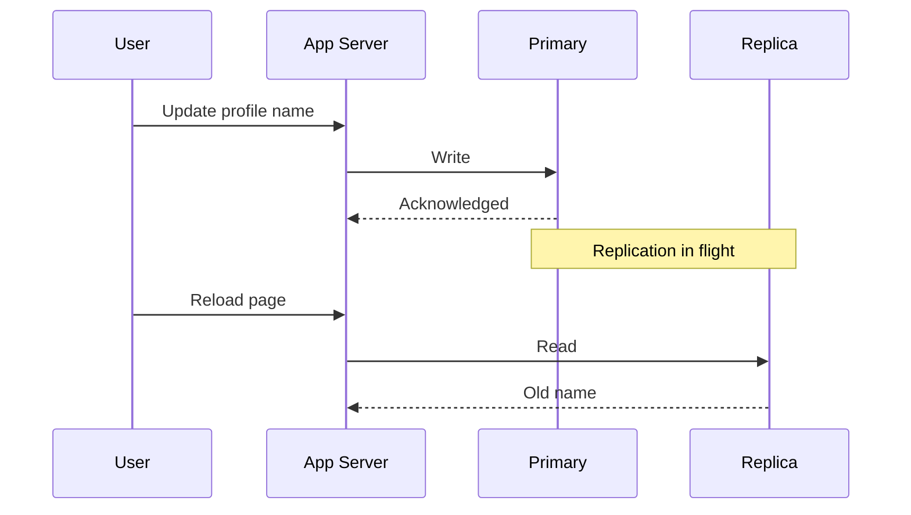

3.11 asked which store to reach for. Whichever one you picked, every request
since 1.2 has read and written through the exact same primary - and reads
usually outnumber writes by an order of magnitude or more (1.1's own landmark
ratio). A user updates their profile, immediately reloads the page, and sees
their old name.

The database isn't broken - the write actually landed. The problem is where
the read that followed it went looking. This chapter is about giving reads
somewhere else to go, and about the one guarantee that gets genuinely harder
the moment they do: seeing your own write, right after you make it.

> [!NOTE]
> Before reading on: if you added a second copy of the primary database, just
> to absorb read traffic, what could go wrong that adding a second app-server
> copy (3.8) never had to worry about? Commit to an answer.

## One primary, any number of copies

A Read Replica holds a copy of the primary's data, kept current by a one-way
stream of every write the primary accepts - never the other way around. Any
number of replicas can exist; exactly one primary accepts writes, always.

Caption: the replication edge only flows primary to replica - a write never
travels the other way. Reads flow back out to the Application Server from the
Replica; nothing but the primary ever accepts one.

## The gap between write and copy

Replication takes real, nonzero time - the write has to leave the primary,
cross the network, and apply on the replica before that replica's copy
agrees with the one that changed. That gap is replication lag, and it's the
reason the profile update at the top of this chapter came back stale: the
write finished on the primary before the reload's read ever touched the
replica.

Caption: the write is acknowledged before replication catches the replica up
- a read landing in that window sees the value the row had before the write,
not after. This is read-your-writes: the first consistency guarantee in this
curriculum that isn't free.

## Sync or async - the trade you're actually making

Two ways to run the replication stream, with an honest cost either way:

| | What it buys | What it costs |
|---|---|---|
| Synchronous | The primary won't acknowledge a write until at least one replica has it too - no lost writes | Every write waits on the slowest replica, and the primary's own availability is now coupled to the replica's |
| Asynchronous | Writes acknowledge immediately, at the primary's own speed | A real loss window - a replica can be behind at the exact moment the primary fails |

Most systems default to async, because losing a few milliseconds of the
newest writes on a rare primary failure is a smaller cost than paying replica
latency on every single write. Sync earns its keep only when losing an
acknowledged write is unacceptable at any cost - the trade-off in miniature.

## What breaks

- **Replication lag spikes under a write burst** - the replica falls further
  behind exactly when the primary is busiest, which is also usually when
  read traffic is highest.
- **Writing directly to a Replica.** Its whole identity is being a copy - a
  write there either fails outright or forks the data into two histories
  with no path back to one.
- **A Replica goes down mid-read.** Reads routed to it need somewhere else to
  land - the primary, or another replica - or they simply fail.

## What changes at scale

Read scale-out is close to linear: add a replica, absorb roughly its own
share of read traffic, the same shape 3.8 already taught for the app tier.
Write scale-out doesn't move at all - every replica still gets its one copy
from the same single primary, so adding more of them does nothing for write
throughput. That ceiling is exactly where splitting the data itself (3.13,
not yet taught) becomes the next lever, not more copies. At real scale the
topology itself gets more complex too - replicas chained off other replicas,
or placed across regions to shorten a read's own network hop - named here,
not modeled.

## In production

GitHub serves the large majority of its read traffic - repository pages,
issue lists, search results - from MySQL read replicas, keeping writes
concentrated on a single primary. The split works because GitHub's read
volume dwarfs its write volume by a wide margin, and a moment of replication
lag on a repository page costs almost nothing most users would ever notice.

## Common mistakes

- **Reading your own write immediately after and expecting the replica to
  already have it** - route that specific read to the primary instead.
- **Writing to a Replica because it looks like just another database** - it
  isn't; nothing reconciles two copies that both accepted writes.
- **Treating "eventually consistent" as "no guarantee at all"** - lag is
  normally small and bounded, not undefined.
- **Adding replicas to fix slow writes** - they scale reads; the primary is
  still the only thing that accepts a write.

## In an interview

High relevance - this is a step 5 and step 6 staple the moment any design has
enough read traffic to matter.

What that sounds like at a senior level: *"I'd offload reads onto replicas
fed asynchronously from the primary, and name read-your-writes explicitly -
anywhere a user needs to see their own write immediately, like this profile
update, I'd route that one read to the primary instead of trusting the
replica pool. Replicas fix a read problem, not a write one; if writes are
still the bottleneck, that's a different lever."*

## Connections

This deepens 3.10's own guarantees - a Replica gets the same promises for its
own copy, but for a window measured in lag, two copies of the same row can
legitimately disagree, which the single primary in 3.10 never allowed. It's
the same offload move 3.8 taught for the app tier, applied to a component
with a rule app-server copies never needed: only one of these is allowed to
accept writes. And it works identically regardless of which store 3.11
pointed you toward - a Read Replica takes its feed from a SQL Database or a
NoSQL Database exactly the same way.

## Recap

- A Read Replica is a copy, kept current by a one-way replication stream from
  the primary - never the reverse, and never a second place writes can land.
- Replication lag is the gap between a write landing on the primary and that
  same write reaching a replica - and it's what read-your-writes actually
  costs.
- Sync trades write latency and coupled availability for no lost writes;
  async trades a real loss window for fast writes. Most systems default to
  async.
- Replicas scale reads roughly linearly. They do nothing for writes - the
  primary is still the only thing that accepts one.

## Your turn

The starter graph is 3.11's own passing system, unchanged, plus a Read
Replica already on the canvas - and one edge already drawn into it, straight
from the Application Server. That's the same move that wired every other
data component in this system so far, pointed at a component built to refuse
it: a Replica's only legal input is a replication feed from a database, not
a query. Remove that edge, then give the Replica what it actually needs - one
edge in, one edge out - and Validate and Submit.

## Next

3.12 gave every copy of the primary a job: one accepts writes, any number of
the rest absorb reads. 3.13 Sharding is what happens once that stops being
enough - once even the primary's own writes have outgrown one machine, and
the data itself has to split, not just copy.
