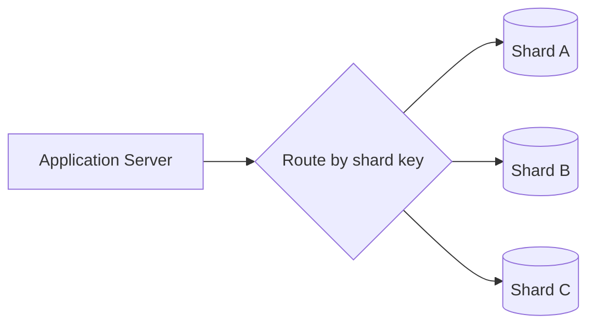

3.12 gave every copy of the primary a job: one accepts writes, any number of
replicas absorb reads. That fixes a read problem completely - and does
nothing for a write problem. If the primary's own writes have outgrown what
one machine can hold, more replicas don't help; they just copy the same
overloaded primary faster.

Indexing (3.10) buys headroom by making each query cheaper. A bigger machine
buys headroom by making the machine itself bigger. Both run out. Sharding is
what's left once they do: splitting the data itself across independent
machines, so no single machine has to hold all of it.

> [!NOTE]
> Think first: if replicas don't touch write throughput, and a bigger machine
> eventually runs out of room to grow, what's actually left? Commit to an
> answer before reading on.

## Splitting the data, not copying it

A shard is an ordinary database - the same SQL Database you've had since
1.2, or the NoSQL Database from 3.11 - holding only a slice of the full
dataset. A **shard key** decides which slice a given row belongs to; the
same key always resolves to the same shard, so nothing has to search
everywhere to find one row.

Note: each shard is a normal database holding a fraction of the rows -
nothing here is a new kind of component, only a configuration decision about
which rows live where. Contrast this with 3.12's diagram: that one drew
copies of the same data; this one draws slices of different data.

## Range vs. hash - the shard key decision

| | How it splits | What breaks |
|---|---|---|
| Range (e.g. by timestamp or ID range) | Contiguous key ranges to contiguous shards | An ever-increasing key sends every new write to the newest shard - a permanently moving hot spot, not one that settles |
| Hash (a hash of the key mod shard count) | Keys spread pseudo-randomly across shards | Writes spread evenly, but a contiguous range scan ("everything from last week") now touches every shard instead of one |

Range keeps range scans cheap and pays for it with a moving write hot spot on
any monotonically increasing key. Hash keeps writes even and pays for it by
scattering what used to be a cheap range query across the whole cluster.
Neither is wrong in general - the access pattern decides, the same procedure
3.11 taught for the store itself.

A **hot partition** is the other way a shard key fails: pick a key that
concentrates real-world load unevenly - user ID for a social app, say, when
one account has 100M followers - and that one shard absorbs traffic the rest
sit idle for, no matter which family you chose.

## When sharding is the wrong move

Sharding buys capacity at a cost none of the earlier levers carry: cross-shard
queries, and a resharding process if the key stops fitting. That cost is
worth paying only once cheaper levers are actually exhausted - an index
(3.10), then a replica for read pressure (3.12), then a cache (3.14, not yet
taught). Reaching for sharding first, "to be ready," pays a permanent
complexity tax for a problem that indexing or a replica might have solved for
free.

## What a query that touches every shard costs

A query confined to one shard is unaffected - same cost as before. A query
that needs data spread across shards (a global count, a search with no shard
key filter) becomes **scatter-gather**: fan out to every shard, wait for the
slowest one, merge the results. Latency becomes the p99 of N machines instead
of one, and gets worse as shard count grows. The fix isn't to avoid sharding -
it's to design the shard key so the queries that matter most stay confined to
one shard, and accept that the rest pay this cost.

## In production

Instagram shards its Postgres data by a custom ID scheme that encodes shard
number directly into every row's ID, so looking up a row never needs a
cross-shard search - only writing new data or building an index outside the
key needs the harder path. The scheme exists because Instagram's write volume
had genuinely outgrown a single Postgres primary; encoding the shard into the
ID was chosen specifically to keep the common case (fetch by ID) confined to
one shard.

## Common mistakes

- **Reaching for sharding before indexing, replicas, or caching are
  exhausted** - the most expensive lever in the data tier, reached for first
  instead of last.
- **Picking a shard key that doesn't match the access pattern** - if most
  queries need to join or filter across a dimension the key doesn't align
  with, nearly every query becomes cross-shard.
- **Assuming resharding is a config change.** Moving rows between shards
  after picking the wrong key is a real migration, not a value flip.
- **Assuming range sharding is always the wrong choice.** It isn't - it's
  wrong specifically when the key increases monotonically. A key with no
  such trend doesn't create a moving hot spot.

## In an interview

High relevance - a senior-level differentiator. Most candidates can say "you
can shard it"; naming the shard key's own consequences (which queries stay
cheap, which become scatter-gather, what a bad key costs to fix) is what
separates a senior answer.

What that sounds like at a senior level: *"I'd exhaust indexing and replicas
first - sharding is the most expensive lever here. If writes genuinely need
it, I'd pick a shard key that keeps the hottest query path on one shard, name
which queries become scatter-gather as a result, and flag that changing the
key later means a real data migration, not a config edit."*

## Connections

This is where 3.10's own ladder (index, then replica, then shard) finally
reaches its last rung - 3.12's replicas fixed reads completely and writes not
at all, which is exactly the gap this chapter closes. It applies identically
to either store 3.11 pointed you toward: a shard key partitions a SQL
Database or a NoSQL Database the same way, though a NoSQL store's own
built-in partitioning (3.11) often makes this decision for you already.

## Recap

- A shard holds a slice of the data, not a copy - the shard key decides which
  slice, and the same key always resolves to the same shard.
- Range sharding keeps scans cheap and risks a moving write hot spot on an
  increasing key; hash sharding spreads writes evenly and loses cheap range
  scans.
- Shard only once indexing, replicas, and caching are actually exhausted -
  it's the most expensive lever, not the first one.
- A query that spans shards becomes scatter-gather: latency tracks the
  slowest of N machines, and grows with shard count.

## Your turn

No build this time - sharding is a configuration decision on a database you
already have, not a new component, and the engine doesn't yet expose a
shard-key field to configure on canvas. The knowledge check is whether you
can pick a shard key for a stated access pattern and defend what it costs,
the same judgment the diagram and quiz below ask for directly.

## Next

3.13 was the last lever for a write-bound database. 3.14 Caching is the
highest-leverage tool in this curriculum for the opposite problem - read
load - cheap enough to reach for long before any of this chapter's own
machinery is warranted.
