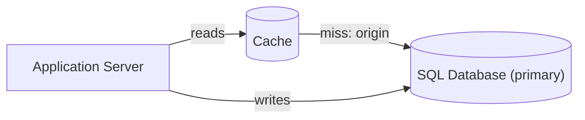
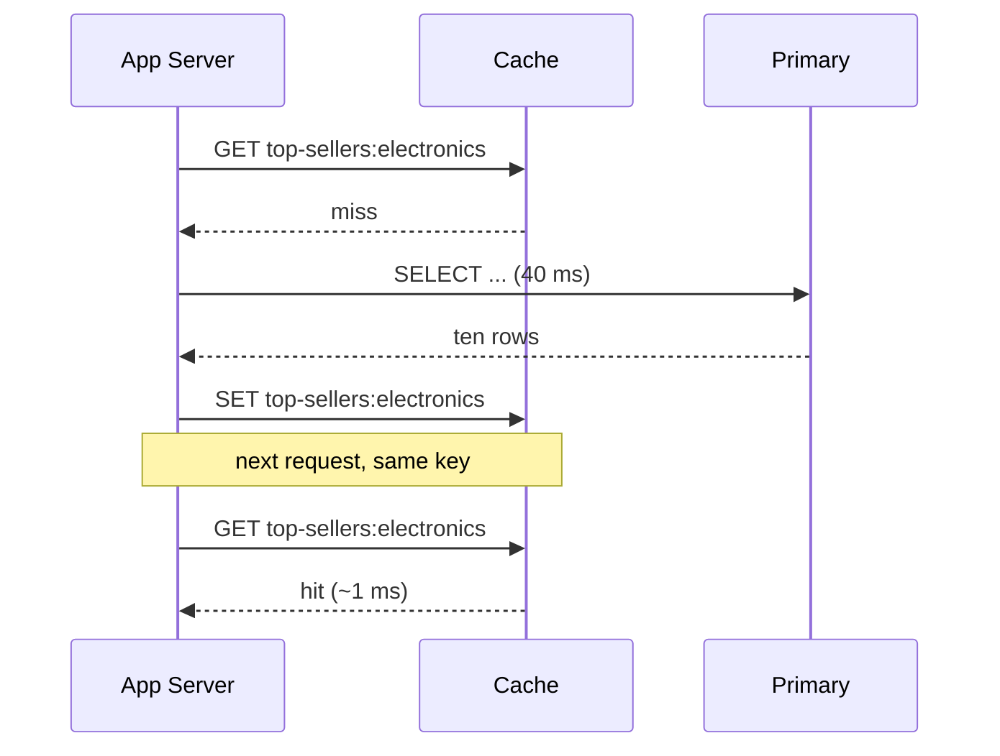

3.13 was the last lever for a write-bound database, and the most expensive one
in this curriculum. This chapter is the opposite problem and the cheapest lever
in it.

Your product page runs one aggregate query - the top ten sellers in a category
- costing about 40 ms on the primary, returning the same ten rows to every
visitor, changing maybe twice an hour. At 5,000 page views a second it is most
of what the database does, and 4,999 times out of 5,000 it is recomputing an
answer it already has. Nothing is broken. The query is correct, the index is
right, 3.12's replica is absorbing its share. The database is only doing work
it has already done.

> [!NOTE]
> Think first: the database is at 85% CPU and 95% of its reads return a value
> that has not changed since the last time it was asked for. 3.12's answer was
> another replica. What does that buy you here, and what does it leave
> untouched? Commit to an answer before reading on.

## A cache is a bet

A cache is a bet that the same answer will be asked for again before it stops
being true. When the bet pays, you skip the work entirely.

Note: the Cache sits beside the database, not in front of the application tier
- reads reach it from the app, and its only path onward is the origin it is
caching. Writes never travel through it.

## Cache-aside

Three steps, all three living in your application code. The cache does not know
what the database holds and never fetches anything on its own initiative.

| Step | What happens |
|---|---|
| Read | The app asks the cache for a key, e.g. `top-sellers:electronics`. |
| Hit | The cache has it. Return it. The database is never touched. |
| Miss | The cache doesn't. The app reads the origin, stores the result under that key, returns it. |

On canvas, a Cache's outgoing edge points at its origin. Read that edge as
*this is the store this cache falls back to*, not as the cache going and
fetching on its own - in cache-aside the application does the fetching, and the
edge is how the canvas records which store it falls back to.

Note: the miss path costs *more* than having no cache at all - a lookup plus
the full query. Caching only ever pays because the last line of that diagram
happens far more often than the first.

Which makes hit ratio the number that decides whether any of it was worth
doing. 100 requests a second at 30 ms, at a 95% hit ratio, leaves 5 requests a
second reaching the database. The hit ratio, not the cache's speed, is what
turns a cache into headroom.

## Two knobs, two different questions

`evictionPolicy` and `ttlSeconds` look like the same setting and are not.

- **`evictionPolicy`** answers *memory is full, what gets dropped* - `lru`
  (least recently used) for a hot subset, `lfu` (least frequently used) when
  popularity is stable, `ttl` when age is the only thing that matters.
- **`ttlSeconds`** answers *how long may this value be wrong*. A correctness
  decision, not a capacity one.

Every cache is a staleness contract with the rest of the business, and the TTL
is where the number gets written down. "Prices may be up to 60 seconds behind"
is an answer; "prices are cached" is not.

## The wrinkle that makes it a tier

3.6 turned the app tier into interchangeable instances and 3.4 put a load
balancer in front of them. Now put the cache inside each instance's own memory,
which is the cheapest thing to reach for.

Two consecutive requests from one user land on two different instances, each
holding its own copy of the key, populated at a different moment and expiring
at a different one. The value flips between old and new on every refresh, and
no individual instance is wrong - each is faithfully serving what it cached.
That is why the cache is drawn as its own node: one tier every instance reaches
identically, so there is one copy of the answer instead of one per instance.

That is 3.7's argument about sessions arriving from a different direction, and
this is the faster purpose-built store 3.7 said was coming - a session lookup
on every authenticated request is the purest repeat read in the system.

Once that tier's working set outgrows one machine's memory, or losing the box
would take the database down with it, the tier is itself partitioned and
replicated: the Distributed Cache component, with `replicationFactor` (how many
nodes hold each key) and `consistency` (whether a read may see a node that
hasn't caught up).

## Trade-offs

| Decision | What it buys | What it costs |
|---|---|---|
| Longer TTL | Fewer origin reads, higher hit ratio | A wider window where users see the old value |
| Shorter TTL | Fresher data | More misses, and misses are the expensive path |
| Cache-aside | Only caches what is actually read; losing the cache is survivable | The first read after a write is stale until the TTL expires or something invalidates the key |
| Write-through (write to cache and origin together) | The cache is never behind the origin | Every write pays the cache write, and you cache data nobody reads |

Cache-aside is the usual default because its failure mode is degraded latency,
where write-through's is a write path with one more thing in it that can fail.

## What breaks

- **Cache stampede.** A hot key expires while traffic is heavy and every
  in-flight request misses at the same instant, so all of them hit the origin
  together. The database's worst second is the one right after the cache stops
  helping. Fixes: serve the stale value while one request refreshes, lock the
  refresh so only one caller does it, or jitter TTLs so keys don't expire in
  lockstep.
- **The write nobody invalidated.** A price changes and the cached copy sits
  there until its TTL runs out. Not a bug - the contract you signed.
- **The cache becomes load-bearing.** After six months the database is sized
  for post-cache traffic. The cache restarts, arrives empty, and the full
  uncached load lands on a database that hasn't seen it in half a year.

## What changes at scale

At 10x, one cache absorbs it and what you tune is hit ratio, not size - a
better key or a longer TTL beats a bigger box. At 100x the working set stops
fitting in one machine's memory, and that machine is now a single point of
failure in front of your whole read path, so the tier gets partitioned and
replicated. At 1000x popularity concentrates: whichever partition owns the
hottest key takes a wildly disproportionate share, which is 3.13's
hot-partition problem in a second store. Past that the remaining win is not a
bigger cache but a closer one.

## In production

Reddit serves most listing and comment-tree reads out of memcached rather than
recomputing them per request - the same listing is requested thousands of times
between the votes that actually change it, so nearly all of that recompute is
waste. The accepted cost is that a score can read a few seconds behind reality,
which is fine for a comment ranking; the flows where it wasn't fine read the
origin directly instead.

## Common mistakes

- **Adding a cache before checking that reads repeat.** A cache in front of
  queries that are all different is a hop with a 0% hit ratio.
- **Calling per-instance memory a cache tier.** Behind a load balancer that is
  N caches disagreeing, which reads to users as a bug, not as staleness.
- **Treating the cache as a source of truth.** It is allowed to be empty at any
  moment, and the system has to be correct when it is.
- **Never stating the staleness bound.** If nobody can say how far behind the
  cached value may be, nobody decided - the TTL decided for them.

## In an interview

High relevance - caching lands at step 4 (part of the first architecture for
any read-heavy system), step 5 (the deep dive interviewers most often steer
toward) and step 7 (staleness is the trade-off you're expected to name
unprompted).

What that sounds like at a senior level: *"Reads outnumber writes here by
something like 50 to 1 and most of them are the same handful of keys, so I'd
put a shared cache tier in front of the primary with cache-aside in the
service, not per-instance memory - behind a load balancer that would be N
caches disagreeing. TTL comes from the freshness the product actually needs, say 60
seconds for a listing, and I'd name that staleness as what we're buying the
read reduction with. The failure I'd design for is the stampede when a hot key
expires under load, not the steady state."*

## Connections

This pays off 3.7 directly: sessions went onto the SQL database because it was
the store the app tier already reached, with a note that a faster one was
coming. It is also the honest comparison to 3.12 - a replica scales reads by
adding a machine that does the same work again, a cache scales reads by not
doing the work at all, which is why the cache is the cheaper first move and the
replica is still what serves the reads that must be current. And the
multi-instance wrinkle is only predictable because 3.4 and 3.6 established that
consecutive requests from one user land wherever the load balancer sends them.

Coming in 3.15: the same bet, moved from beside your database to the far side
of the network, next to the user.

## Recap

- A cache is a bet that the same answer will be asked for again before it stops
  being true. Hit ratio is whether the bet is paying.
- Cache-aside lives in application code: check the cache, on a miss read the
  origin and populate it. The cache never pulls on its own.
- `evictionPolicy` is memory pressure; `ttlSeconds` is how wrong a value may
  be. The TTL is the staleness contract, written as a number.
- Per-instance caches behind a load balancer disagree with each other. A cache
  is a tier every instance reaches, not memory inside each one.
- The stampede is the failure to design for: a hot key expiring under load
  sends every miss to the origin at once.

## Your turn

The starter graph is the system as built through 3.12 (3.13 added no
components), with a Cache already on the canvas and its miss path already drawn
to the primary. Every component is present and correctly configured, and the
database's read load has not moved at all. Validate will name exactly one
problem, and it is a wire, not a config field - there is no setting anywhere on
this canvas that would fix it.

## Next

3.14 put the answer one hop from the code that needs it. 3.15 CDN asks the
harder version of the same question: that cache is 5 ms from your app server
and 150 ms from a user in Sydney, and for the things everyone downloads
identically, those 150 ms are now the entire latency budget.
