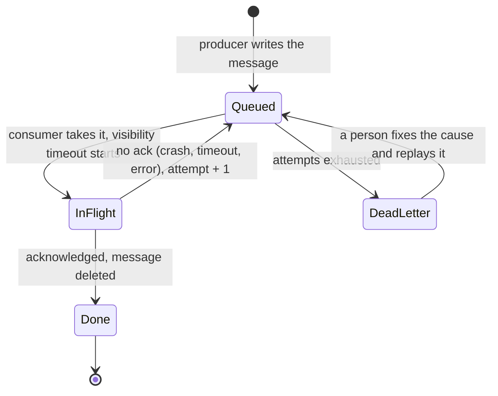

The job board from R1 is live, and publishing a listing takes 4.2 seconds at
p95. The insert is 40 ms of that. The rest is the publish handler doing four
more things before it answers: emailing the 900 seekers whose saved search
matches, generating three thumbnail sizes of the company logo, updating the
search index, and appending a row to the analytics table. The recruiter waits
for all of it. Last Tuesday the mail provider was down for twenty minutes and
every publish returned a 500 - for listings that were already in the database.

> [!NOTE]
> Think first: of those four jobs, how many does the recruiter need finished
> before the page can say "Published"? Then the harder half - if the answer is
> none of them, what has to be true before you are willing to say "published"
> while the emails have not been sent? Commit to an answer before reading on.

## Hand off the work instead of doing it

A queue turns a call into a note. The caller writes down what needs doing, hands
the note to something that will not lose it, and goes back to answering the
user. A worker picks the note up later. A kitchen works this way: the
server does not cook, they put a ticket on the rail and go take the next table.

<Walkthrough
  title="One publish, with the work moved off the request path"
  description="A listing is published, a job is retried, and a job that always fails is set aside."
  nodes={[
    { id: "browser", kind: "component", componentId: "browser", label: "Browser" },
    { id: "app", kind: "component", componentId: "app-server", label: "App Server" },
    { id: "db", kind: "component", componentId: "sql-database", label: "SQL Database" },
    { id: "queue", kind: "component", componentId: "message-queue", label: "Message Queue" },
    { id: "worker", kind: "component", componentId: "worker", label: "Worker" },
    { id: "dlq", kind: "component", componentId: "dead-letter-queue", label: "Dead Letter Queue" },
  ]}
  edges={[
    { id: "ask", source: "browser", target: "app", kind: "request-flow" },
    { id: "write", source: "app", target: "db", kind: "request-flow" },
    { id: "enqueue", source: "app", target: "queue", kind: "async" },
    { id: "consume", source: "queue", target: "worker", kind: "async" },
    { id: "record", source: "worker", target: "db", kind: "request-flow" },
    { id: "dead", source: "queue", target: "dlq", kind: "async" },
  ]}
  steps={[
    {
      caption: "A recruiter publishes a listing. The Browser's POST reaches the App Server, which writes the listing row to the SQL Database. That write is the recruiter's own work, and it stays on the request path.",
      focus: ["ask", "write"],
    },
    {
      caption: "The emails and the thumbnails do not run next. The App Server writes one message per job to the Message Queue, which stores it durably, and returns 200 to the Browser here - four seconds earlier than before.",
      focus: "enqueue",
    },
    {
      caption: "Everything after that response happens with nobody waiting. The Worker pulls messages off the Message Queue at whatever rate it can manage: arrival rate and processing rate are now two separate numbers.",
      focus: "consume",
    },
    {
      caption: "The Worker does the job and records the result in the SQL Database. When a thousand messages arrive in a second, the queue grows and drains instead of failing the recruiter's publish.",
      focus: "record",
    },
    {
      caption: "The mail provider times out mid-job. The Worker never acknowledges that message, so the Message Queue hands it back for another attempt - which is why a job that runs twice must not have twice the effect.",
      highlightNodeIds: ["queue", "worker"],
      highlightEdgeIds: ["consume"],
    },
    {
      caption: "A message that fails every attempt would loop forever. Once its retries are spent the Message Queue routes it to the Dead Letter Queue, where it waits for a person instead of starving the jobs behind it.",
      focus: "dead",
    },
  ]}
/>

Note: the response goes out at step 2, not at the end - everything to the right
of the Message Queue happens after the recruiter is already reading the page.

The dashed edges are a new kind. `request-flow` means a caller is blocked
waiting for an answer; `async` means the caller handed something off and moved
on. This is the edge 3.16 could not draw, and the reason its index write had to
sit on the same line as its query.

## What the queue actually promises

Three properties, and the work is in the third.

**Durability.** The message survives the process that wrote it. This is the
answer to the Think-first question: you may tell the recruiter "published"
before the emails are sent, because the instruction to send them is written down
somewhere that outlives a crash. A queue that holds messages only in memory
trades that away for latency, which is rarely the trade you want here.

**Decoupling in rate.** The producer's speed and the consumer's speed - the
worker's, in the diagram above - stop being the same number. A burst does not
have to be served at the rate it arrives, it has to be *absorbed*: depth grows,
then drains. That is also the failure mode:
if arrivals exceed processing on average rather than in bursts, depth grows
without bound and every job gets later forever.

**Delivery semantics.** What happens when a consumer takes a message and then
dies:

| Guarantee | What it means | What it costs you |
|---|---|---|
| At-most-once | The message is delivered zero or one times. A crash loses the job | Nothing to build, and jobs disappear with no trace |
| At-least-once | The message is redelivered until a consumer acknowledges it | Consumers must be idempotent, because duplicates are certain at scale |
| Exactly-once | Delivered and processed precisely once | Not something a queue can hand you across a network boundary |

The mechanic underneath all three: a consumer does not remove a message when it
reads one. The queue hides the message for a visibility timeout and deletes it
only on an explicit acknowledgement. No ack, for any reason - crash, timeout,
deploy - and the message reappears for someone else. At-least-once is what "try
again" actually means when written down.

So the consumer carries the duplicate problem, and "exactly-once processing" is
what you build on top: make the effect idempotent, or make the job carry an id
you can check. `UPDATE listing SET indexed_at = now()` run twice is the same as
run once. `INSERT INTO emails_sent` twice is two rows and two emails. Charging a
card twice is an incident. Match the strength of your deduplication to what a
second run actually costs.

## When the work keeps failing

A retry that fires immediately, from every consumer, against a service that is
already struggling, multiplies the load on it at the exact moment it can least
afford that. Exponential backoff spaces attempts out (1s, 2s, 4s, 8s); jitter
randomizes each delay so that a thousand consumers that failed together do not
retry together.

Backoff only helps failures that are worth retrying. A 503 or a connection
timeout is transient and deserves another attempt. A malformed email address is
not going to become well-formed, and retrying it is a slower way of losing the
message. A message that fails every attempt for a reason no attempt can change
is a **poison message**, and without somewhere to put it, it either loops
forever or gets dropped silently - and a consumer stuck in a crash loop on one
message is a consumer doing none of the work behind it.

Note: the only edge out of the retry loop is the one to the dead letter queue,
and the only edge back out of the dead letter queue is a human decision.

That is the whole role of the Dead Letter Queue: a message that has spent its
attempts is moved off the working path and kept. It is an operational contract,
not a topology box. Someone owns it, an alert fires on its depth, and the work
is real - read the message, find the bug or the bad data, fix it, then replay or
discard deliberately. A dead letter queue nobody watches is a wastebasket with
extra steps.

## Trade-offs

| Decision | What it buys | What it costs |
|---|---|---|
| Move a job off the request path | The user waits for their own work only, and a downstream outage stops failing their request | The result is no longer immediate, and "done" becomes a state the UI has to represent |
| At-least-once over at-most-once | No job is lost to a crash or a deploy | Every consumer must be safe to run twice, forever, including the ones you write later |
| Exponential backoff over immediate retry | A struggling dependency gets room to recover | A transient blip now takes seconds to clear instead of milliseconds |
| One queue for every job type | One thing to build, run and monitor | A slow bulk job blocks a latency-sensitive one behind it; queue depth stops meaning anything specific |

The decision under all four: whether this job belongs off the request path at
all. The test is not "is it slow", it is "does the user's success depend on it".
A password reset email is slow and the user is waiting for exactly that -
queueing it moves the latency somewhere the user still feels it, and adds a
failure mode. Work that fails this test is work you should be making faster, not
moving.

## What breaks

- **The queue that never drains.** Depth is a rate problem in disguise. If
  arrivals exceed the consumers' throughput on average, the backlog grows
  forever and the visible symptom is jobs completing hours late, not errors.
  Depth and oldest-message age are the two numbers to alert on, not CPU.
- **Duplicate side effects.** At-least-once plus a non-idempotent consumer is a
  bug that hides at low volume and appears as a second email, a double refund,
  or a duplicate row exactly when traffic is highest.
- **The poison message crash loop.** A consumer that dies on a message it can
  never process comes back, takes the same message, and dies again, doing no
  other work in between. This is what a dead letter queue exists to stop, and it
  is why the queue in your palette warns when there is nothing to catch failures.
- **Lost ordering.** One producer and three consumers means three jobs in flight
  at once, in no guaranteed order. "Update profile" then "delete profile" can be
  processed in either sequence. If two jobs must not race, they cannot be two
  independent messages.

## What changes at scale

At 10x you add consumers, and the thing that makes that work is that they pull.
Nothing routes to them and nothing tracks them - a new one starts, takes
messages, and the queue is the distributor. That is 3.8's horizontal scaling
without a load balancer, because the work is already sitting in a durable list
instead of arriving as connections.

At 100x one queue for everything stops being tenable: the nightly analytics job
and the password reset sit in the same line, and the slow one decides the fast
one's latency. Queues split by job class, each with its own consumers and its
own depth alarm, and the split is by latency requirement rather than by team.

At 1000x the queue is a tier with its own capacity planning, its own failure
domain, and a broker outage that is now an outage of everything asynchronous.
Consumers get bulkheaded so one poisoned class cannot exhaust the whole pool,
and every queue has a named owner for its dead letter queue, because at that
size "nobody was watching" is measured in days of lost work.

## In production

**Amazon** decoupled order intake from fulfilment with queues, and SQS is that
internal pattern turned into a public service: accepting an order writes a
message, and inventory, payment and shipping consume it at their own pace, so
intake does not require every downstream system to be up. The trade-off they
took is the honest one: an order accepted into a queue and later found
unfulfillable becomes a compensating action - an apology email, a refund -
rather than a rejection the customer saw at checkout.

**Stripe** delivers webhooks asynchronously and retries a failing endpoint with
exponential backoff for up to three days, and tells integrators outright to
expect the same event more than once and to deduplicate on its id. That is
at-least-once made a public contract: the sender guarantees it will not give up
quickly, and pushes idempotency onto the receiver, because that is the only
place it can actually be enforced.

Neither is a reason to start here. A two-person team's first queue is a `jobs`
table with a `status` column and a process that polls it every few seconds. It
is durable, it is inspectable with SQL, it retries by leaving the row alone, and
it stops being enough at a specific point - polling latency, contention between
consumers taking the same row, backlog you cannot see. Reach for a broker when
you are near that, not before.

## Common mistakes

- **Queueing to make slow code fast.** The work still takes four seconds; the
  user just is not watching. If the user needs the result, you have moved the
  latency, not removed it, and added a delivery problem on top.
- **Trusting an "exactly-once" label.** Where a broker offers it, it covers
  what happens inside the broker, not what your consumer did to the outside
  world before it crashed. The guarantee you can actually enforce lives in the
  consumer.
- **Retrying everything, forever, immediately.** No backoff turns a blip into an
  outage; no distinction between retryable and permanent failures turns a bad
  input into an infinite loop.
- **Treating the dead letter queue as done.** Adding one satisfies the topology
  and none of the point. Without an owner and an alert on its depth, failures
  are still silent - they are just silent in a different place.

## In an interview

High relevance, and it lands early. At step 4, drawing the first architecture,
the signal is that you split the write path yourself: "publish writes the row
and enqueues the notification work" is a sentence that says you know what a user
is actually waiting for. Step 5 is where it gets interesting, and the follow-up
is always some version of "what happens when the consumer fails" - which is a
test of whether your queue was a box you drew or a design you thought about.

What that sounds like at a senior level: *"The publish request writes the
listing and enqueues the rest. I'd run at-least-once delivery, which means the
consumers have to be idempotent - the index update is naturally idempotent, and
the email consumer dedupes on a job id so a redelivery doesn't send twice.
Failures retry with exponential backoff and jitter, and after five attempts the
message goes to a dead letter queue that pages whoever owns that job class. The
number I'd watch isn't consumer CPU, it's queue depth and oldest-message age -
those are what tell me the consumers have fallen behind arrivals rather than
just being busy."*

## Connections

3.16 ended with one edge doing two jobs, because the palette had no way to say
"after the response is sent". That is this chapter's `async` edge, and the
indexing work it described is exactly a job for a consumer. 3.6's stateless
services are why consumers scale by adding more of them: a consumer holds
nothing between messages, so a second one is not a new design. And 3.8's
horizontal scaling reappears in a different shape - the same "add capacity by
adding copies" move, distributed by the queue rather than by a load balancer,
because the work is durable and waiting instead of arriving live.

Coming in 3.18: a queue delivers each message to exactly one consumer, which is
correct for work and wrong the moment three different services each need to know
that the same thing happened.

## Recap

- Work belongs off the request path when the user's success does not depend on
  it. "Slow" is not the test; "is the user waiting for this result" is.
- A queue's real promise is durability plus decoupled rates: the response can go
  out before the work is done, because the instruction is written down somewhere
  that survives a crash.
- At-least-once is the default and it means duplicates are certain. Idempotent
  consumers are the price of not losing jobs.
- Retries need exponential backoff with jitter, and a distinction between
  failures another attempt could fix and failures it never will.
- A dead letter queue catches messages that exhaust their retries. It is an
  operational contract with an owner and an alert, not a box on the diagram.

## Your turn

The starter graph is the system R1 left you, and Validate is clean. What it
cannot see is the publish handler: a recruiter waits 4.2 seconds for a listing
whose own database write took 40 ms, because the same request also mails 900
subscribers, builds thumbnails and updates the index before it answers. When the
mail provider went down last Tuesday, publishes returned 500 for listings that
had already been saved.

Get the recruiter their answer as soon as their own work is durable, and give
the rest of that work somewhere to live where a slow or broken dependency delays
it instead of failing the publish. Jobs must not be lost when a machine dies
mid-task, and a job that fails every single attempt must end up somewhere a
person can find it rather than retrying until someone notices.

## Next

3.18, Event-Driven Architecture, starts from the limit built into what you just
drew: the queue hands each message to one consumer, which is exactly right when
the message is a task and exactly wrong when it is a fact. Three services that
all need to know a listing was published cannot each take the message - they
would steal it from each other.
