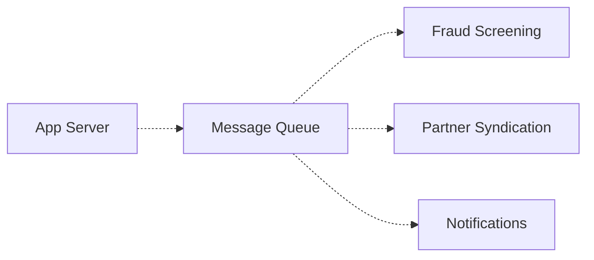
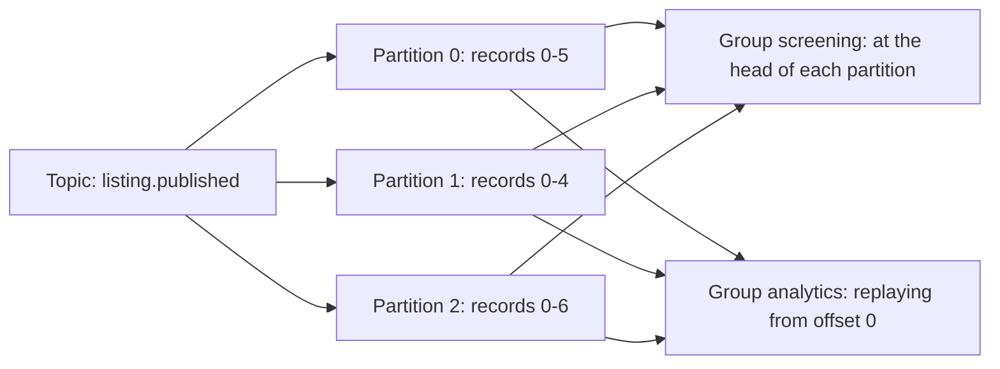

Fraud screening went live on the job board three weeks ago: every new listing
is held from public view until the screening service clears it. Last Tuesday a
listing that should have been held went straight to the front page. It was not
a bug in the screening rules. Pulling the week's numbers, screening had looked
at 31% of publishes. Partner syndication, shipped the same sprint, had looked
at 34%. The notification consumer took the rest. Nothing was lost and nothing
errored. The three services were reading from the same queue, and a queue gives
each message to exactly one consumer.

Note: this picture is not wrong about the wiring - every one of those edges is
legal, and each service really is connected. It is wrong about the arithmetic.
Three consumers on one queue means each publish is handled once, by whichever
of them got there first.

> [!NOTE]
> Think first: the obvious repair is one queue per service, each fed by the
> publish handler. Commit to whether you would do that - then say who has to
> change when a fourth service needs the same publishes, and what the publish
> handler now knows that it did not know before.

## A task is addressed; a fact is announced

3.17's queue carries a **task**: "send these 900 emails." A task has exactly
one correct owner, and handing it to two workers would send the emails twice.
Competing consumers are not a flaw there, they are the feature - they are how
you add capacity.

"Listing 4471 was published" is not a task. It is a **fact**, and a fact has no
owner. It has an audience, and the audience is not the publisher's business.
The publish handler should not be maintaining a list of everyone who cares that
a listing exists, because that list changes every time another team ships
something, and it changes in the publisher's code.

That is the answer to the Think-first prompt. One queue per service works, and
it works by moving the fan-out into the producer: now the publish handler names
three destinations, and the fourth service is a pull request against a file
nobody on that team owns. The alternative is to invert who knows about whom.
The producer announces; interested parties subscribe.

<Walkthrough
  title="One event, three subscribers"
  description="A published listing is announced once and delivered to every service that asked for it."
  nodes={[
    { id: "app", kind: "component", componentId: "app-server", label: "App Server" },
    { id: "bus", kind: "component", componentId: "event-bus", label: "Event Bus" },
    { id: "screen", kind: "component", componentId: "worker", label: "Fraud Screening" },
    { id: "syndicate", kind: "component", componentId: "worker", label: "Partner Syndication" },
    { id: "rollup", kind: "component", componentId: "worker", label: "Analytics Rollup" },
    { id: "store", kind: "component", componentId: "nosql-database", label: "NoSQL Database" },
  ]}
  edges={[
    { id: "publish", source: "app", target: "bus", kind: "async" },
    { id: "to-screen", source: "bus", target: "screen", kind: "async" },
    { id: "to-syndicate", source: "bus", target: "syndicate", kind: "async" },
    { id: "to-rollup", source: "bus", target: "rollup", kind: "async" },
    { id: "write", source: "rollup", target: "store", kind: "request-flow" },
  ]}
  steps={[
    {
      caption: "The App Server has already stored the listing and answered the recruiter. It now publishes one event, ListingPublished, to the Event Bus - and it does not know who is listening.",
      focus: "publish",
    },
    {
      caption: "The Event Bus delivers a copy to Fraud Screening, which is the subscriber holding new listings back from public view until they clear.",
      focus: "to-screen",
    },
    {
      caption: "It delivers another copy of the same event to Partner Syndication, which pushes the listing to external aggregators. Screening did not lose it - nothing was taken from anybody.",
      focus: "to-syndicate",
    },
    {
      caption: "And a third copy to the Analytics Rollup, which counts it into the NoSQL Database. One publish, three deliveries, three services that never competed for the same message.",
      focus: ["to-rollup", "write"],
    },
    {
      caption: "Fraud Screening is down for an hour. Only the paths that still run are lit: Partner Syndication and the Analytics Rollup carry on, because neither ever depended on screening having finished.",
      highlightNodeIds: ["bus", "syndicate", "rollup", "store"],
      highlightEdgeIds: ["to-syndicate", "to-rollup", "write"],
    },
    {
      caption: "Count the lines leaving the App Server: one. Three services got the news and the publisher knows about none of them, so adding a fourth subscriber next month is a change to the Event Bus, not to the publish handler.",
      focus: "publish",
    },
  ]}
/>

Note: the fan-out happens on the right of the Event Bus, not the left. The
publish handler emits one event no matter how many services care.

This is the trade the pattern makes. A synchronous call, and a queue too, is
addressed: the caller names the callee. Publish/subscribe removes the address,
and with it the producer's dependency on the consumer list. What you give up is
the ability to answer "did it happen?" from the producer's side - the publish
handler returns successfully whether three subscribers ran or zero did.

## The bus has no memory

Events are published to a named **topic** (`listing.published`), and a service
registers a **subscription** to that topic to start receiving them. The
producer names the topic; it never names a subscriber.

A bus delivers to whoever is subscribed at the moment of publish, and keeps
nothing afterwards - the events were routed, never stored. Bring up an
analytics service today and the most it can ever tell you about is listings
published from today onward, because the previous six months were delivered to
a set of subscribers it was not in.

A **log** removes that limitation by changing what the middle box is. Instead of
routing records and forgetting them, it appends them to a file kept for a
configured **retention** window, and each consumer tracks its own **offset** -
the position it has read up to. Nothing is deleted when it is read. Kafka is the
canonical implementation, and the shift is worth stating plainly: a queue and a
bus are both about *delivery*; a log is about *storage*, and delivery is what
consumers do to it.

Note: both groups read the same three partitions and neither one's position
affects the other. Analytics rebuilding from offset 0 costs nothing except its
own reading time, and screening never notices.

Three consequences follow from that picture, and all three get probed in
interviews:

- **Consumer groups give you both shapes at once.** Inside one group each
  partition is assigned to exactly one member, so members compete - queue
  semantics, and how you add throughput. Across groups everybody reads
  everything - pub/sub semantics, and how you add a subscriber. One piece of
  infrastructure, both behaviours, chosen per consumer.
- **Ordering is guaranteed within a partition, and nowhere else.** Events on
  partition 0 are read in the order they were written. An event on partition 0
  and an event on partition 2 have no defined order at all.
- **Retention is a knob, not a promise.** Seven days of retention means a
  consumer that has been down for eight days has a gap it cannot recover, and
  that replaying "from the beginning" means the beginning of the window.

The ordering rule is the one that changes a design. If a listing's `created`,
`edited` and `closed` events must be processed in that order, they have to land
on the same partition, which means partitioning by listing id. That is 3.13's
shard-key reasoning on a different substrate: pick the key whose values must
stay together, and spread everything else for parallelism. Partition by
timestamp and every consumer races; partition by a single constant and you have
one partition, one consumer, and no parallelism at all.

## Three shapes, three jobs

| | Delivers to | Keeps history | Reach for it when |
|---|---|---|---|
| **Queue** | One consumer per message | No | The message is a task with one right owner, and you care that it was done |
| **Bus** | Every current subscriber | No | The message is a fact, the audience changes independently, and live delivery is enough |
| **Log** | Every consumer group, at its own offset | Yes, for the retention window | Consumers need to replay, join streams, or be added after the fact |

The cost climbs left to right. A queue is a line with a depth number on it. A
bus adds a routing layer you operate and an event contract several teams depend
on. A log adds partitions, offsets, retention, and rebalancing - reassigning
partitions when a consumer joins or leaves the group - plus the operational
reality that lag is now a number somebody watches per partition.

One question decides whether to climb: does anything need to read this twice?
If no consumer will ever replay and none will ever arrive late, the log's
storage buys a capability you are not using, and plenty of systems run pub/sub
for years without ever wanting history. Ask it early, though. Bus to log is a
migration nobody enjoys, and two backfill jobs on next year's roadmap are worth
more than a guess about traffic.

## What breaks

- **The event nobody received.** A subscriber that was down, or not yet
  subscribed, simply does not get the event, and nothing anywhere records that
  it missed one. On a queue an unprocessed message is visible as depth; on a bus
  it is visible as nothing. This is the failure mode that sends teams to a log.
- **The schema change that breaks three consumers.** Renaming a field in a
  published event is a breaking change to every subscriber at once, and you may
  not know who they all are - which is the price of the decoupling. Events get
  versioned and fields get added rather than renamed, or the fan-out becomes a
  fan-out of incidents.
- **Fan-out amplification.** One publish is now N pieces of work. A retry storm
  behind a bus is N times the storm behind a queue, and a poison event is
  poisonous in every subscriber that cannot parse it, independently.
- **The distributed monolith.** Service A publishes an event and then waits for
  service B's reply event before answering the user. That is a synchronous call
  with two extra network hops and no timeout you control. Asynchronous
  machinery does not make a synchronous dependency asynchronous; only removing
  the dependency does that.
- **Ordering assumed rather than arranged.** "Update profile" and "delete
  profile" land on different partitions and are processed in either order. The
  fix is a partition key, and it has to be chosen before the first event is
  written.

## What changes at scale

At 10x you add partitions and consumer instances, and the second is only useful
up to the first: a topic with three partitions cannot usefully run four
consumers in one group, because the fourth gets no assignment. Partition count
is a capacity decision made early and awkward to change later, since
repartitioning moves keys between partitions and breaks the ordering guarantee
during the move.

At 100x the problem stops being throughput and becomes contracts. Dozens of
topics, dozens of teams consuming events they did not design, and no way to
deploy a producer change safely without knowing who reads it. This is where
schema registries and explicit event versioning stop being ceremony, and where
"one topic per event type" beats "one firehose everyone filters".

At 1000x the log is the system of record for derived data, and rebuilding a
consumer's entire state by replaying from offset 0 is a normal operational move
rather than an emergency. That is also the point where retention becomes a real
storage bill and a real compliance question, because a deletion request now has
to reach every copy of an event that has been fanned out.

## In production

**LinkedIn** built Kafka because every derived dataset it had - search index,
recommendations, newsfeed, analytics, security monitoring - needed the same
stream of member activity, and the point-to-point pipelines between them had
become the organizational bottleneck rather than a technical one: every new
consumer meant a change in every producer. The trade they accepted is the one
this chapter names - the producer stopped knowing whether anything downstream
had processed its data, and that verification moved to the consumers' own lag
metrics.

**Uber** streams trip lifecycle events to consumers with genuinely different
needs: dispatch reacts in milliseconds, driver payouts reconcile in batches,
and the machine-learning pipelines replay months of history to retrain. That
mix is the case for a log specifically - the same events read live by one
consumer and from the beginning by another, with no second copy of the data
and no coordination between the two.

Neither is a reason to start here. Three consumers of a fact, inside one team,
is three function calls in one transaction, and it will be correct and easy to
debug for a long time. The bus earns its place at the moment the list of
interested parties starts changing without the publishing team being involved -
that is an org-chart threshold as much as a traffic one, and it is why a
five-engineer company running Kafka is usually paying for coordination it does
not have.

## Common mistakes

- **Publishing commands dressed as events.** `SendWelcomeEmailEvent` is a task
  with a fact's name. If exactly one subscriber may act on a message, and
  acting twice is wrong, it is a task - put it on a queue where the semantics
  match the intent.
- **Treating the bus as a database.** "We can always reprocess from the bus"
  is true of a log and false of a plain pub/sub bus, and the difference is
  discovered during an incident.
- **One topic for everything.** A single `events` topic makes every consumer
  read and discard everybody else's traffic, and makes per-consumer lag
  meaningless as a signal.
- **Assuming fan-out removed the idempotence obligation.** It multiplied it.
  Every subscriber is independently at-least-once, so every subscriber
  independently needs to be safe to run twice - 3.17's rule, now owed three
  times over.

## In an interview

High relevance, and it is a senior differentiator rather than a checkbox. At
step 4 the signal is that you reach for a queue and a bus for different reasons
in the same design and can say which message is which. At step 5 the probe is
almost always one of three: "what happens if a consumer is down for a day",
"how do you guarantee ordering", or "what happens when you add a fourth
consumer" - and each one separates somebody who has drawn the box from somebody
who has run it.

What that sounds like at a senior level: *"A listing being published is a fact,
so it goes on a topic rather than a queue - screening, syndication and the
analytics rollup all need every one of them, and I don't want the publish
handler holding the list of who cares. I'd partition by listing id so a
listing's create, edit and close events stay ordered relative to each other, and
accept that there's no global ordering across listings, which nothing here
needs. The emails stay on the queue
from before, because that's a task with one owner and I want a dead letter queue
on it. The number I'd watch is consumer lag per group - that's what tells me a
subscriber is falling behind, and on a bus with no history that's the only
warning I get before events are unrecoverable."*

## Connections

3.17 built the queue and stated its delivery rule as a property: one message,
one consumer. That rule is this chapter's entire problem, and it is why the
notification work stays exactly where it is while the fan-out goes somewhere
else - the two coexist because they carry different kinds of message. 3.16
introduced derived data, a second store rebuilt from a first; the analytics
rollup is the same idea with the sync arrow drawn as a subscription, which is
how derived stores are actually kept current once more than one of them exists.
And 3.13's shard key returns as the partition key, doing the same job under a
different name - deciding which things must stay together and which may spread.

Coming in 3.19: everything in this chapter and the last one is triggered by
something a person did. Some work is triggered by nothing at all.

## Recap

- A task has one right owner and belongs on a queue. A fact has an audience
  and belongs on a bus or a log. The failure in the cold open was a fact
  travelling on task infrastructure.
- Publish/subscribe inverts who knows about whom: the producer stops naming
  destinations, so adding a consumer stops being a change to the producer.
- A bus routes and forgets. A log stores, so consumers hold their own offsets
  and can replay within the retention window - which is what lets a consumer
  arrive late or rebuild its state.
- Consumer groups give you competing consumers inside a group and fan-out
  across groups, from one topic.
- Ordering exists only within a partition. Choosing the partition key is the
  same decision as choosing a shard key, and it has to be made before the
  first event is written.

## Your turn

The starter graph is the system you finished 3.17 with, plus three services
that are running and connected to nothing: fraud screening, partner syndication
and the analytics rollup. The first two were unplugged on Tuesday, for the
reason the numbers at the top of this chapter gave. The third was deployed this
morning and has never received anything at all. Validate will say all three are
unconnected, which you already know.

Every one of them has to see every published listing, and none of them cares
what the others do. Give the publish a way to reach all three at once without
the application tier holding a list of who they are, so that the fourth service
next quarter is somebody else's change rather than a change to the publish
handler. Leave the notification path exactly as it is: it carries the one kind
of message on this board that genuinely has a single owner.

## Next

3.19, Background Jobs & Scheduling. Every piece of work in the last two chapters
started with a person: a recruiter pressed publish, and a queue or a topic
carried the consequences. Now the finance team wants the reconciliation report
on their desk at 06:00 whether or not anybody has touched the site since
midnight, and there is nothing on your canvas that a clock can talk to.
