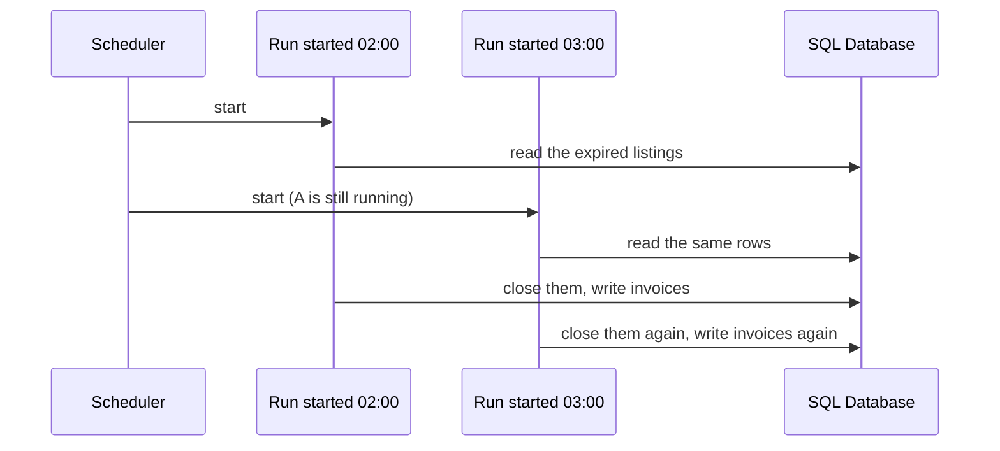

The month's close was written as a timer inside the application server: wake at
02:00, close out expired listings, write the invoice rows, sleep. It ran
correctly - three times, because the pool runs three instances and each one woke
up holding the same timer. Three identical invoice sets, no error anywhere, and
a finance team that no longer trusts the number.

The bug is not in the reconciliation. It is that a schedule was stored inside a
thing that exists N times.

> [!NOTE]
> Think first: the quick repair is a flag - only the instance holding id 0 runs
> the timer. Commit to whether you would ship that before reading on, then say
> what happens on the night instance 0 is the one being replaced by a deploy.

## Don't ask what the code does, ask what wakes it up

Everything on this board so far was started by a request, or by a message a
request produced. Two triggers - which is why the application server has quietly
become the answer to everything, since it is already running and anything you
put inside it is free to start.

There are four triggers, and each has a shape that fits it:

| What wakes it up | Shape | Why that shape |
|---|---|---|
| A request someone is waiting on | Application server | Has to be up before the request arrives |
| A message another service handed off | Worker | Has to be up while the queue has depth |
| A clock | Cron job | Nothing to be up *for* between runs |
| An event that is rare and bursty | Serverless function | Nobody should pay for a machine to sit waiting |

The reconciliation's trigger is a clock. It went into the application server on
a convenience argument, and convenience is exactly how a schedule ends up inside
a pool that scales.

<Walkthrough
  title="Four triggers, one system"
  description="A request, a clock, and a burst of uploads, each reaching the shape that fits it."
  nodes={[
    { id: "gateway", kind: "component", componentId: "api-gateway", label: "API Gateway" },
    { id: "app", kind: "component", componentId: "app-server", label: "App Server" },
    { id: "db", kind: "component", componentId: "sql-database", label: "SQL Database" },
    { id: "cron", kind: "component", componentId: "cron-job", label: "Cron Job" },
    { id: "fn", kind: "component", componentId: "serverless-function", label: "Serverless Function" },
    { id: "nosql", kind: "component", componentId: "nosql-database", label: "Listing Store" },
  ]}
  edges={[
    { id: "serve", source: "gateway", target: "app", kind: "request-flow" },
    { id: "write", source: "app", target: "db", kind: "request-flow" },
    { id: "close", source: "cron", target: "db", kind: "request-flow" },
    { id: "upload", source: "gateway", target: "fn", kind: "request-flow" },
    { id: "record", source: "fn", target: "nosql", kind: "request-flow" },
  ]}
  steps={[
    {
      caption: "A recruiter loads their dashboard. The API Gateway routes it to the App Server pool, which reads and writes the SQL Database. This is the only trigger the board has had so far: somebody asked.",
      focus: ["serve", "write"],
    },
    {
      caption: "02:00, and nobody is on the site. The Cron Job starts on its own schedule and runs the nightly close against the SQL Database. No request started it, and no caller is waiting for it to finish.",
      focus: "close",
    },
    {
      caption: "09:14. A recruiter uploads a company logo. The API Gateway sends that one path to the Serverless Function instead of the App Server pool - same front door, different thing behind it.",
      focus: "upload",
    },
    {
      caption: "The function resizes the logo into the three sizes the site needs, records them against the listing in the Listing Store, and exits. Nothing of it is left running afterwards.",
      focus: "record",
    },
    {
      caption: "09:15. Forty recruiters upload at once and forty copies of the function run side by side. The App Server pool never sees the burst, because that path stopped reaching it.",
      focus: ["upload", "record"],
    },
    {
      caption: "11:00, an hour with no uploads: the function is at zero copies and costs nothing. The App Server pool is still up, because a request could arrive any second and something has to be there to take it.",
      highlightNodeIds: ["gateway", "app"],
      highlightEdgeIds: ["serve"],
    },
  ]}
/>

Note: the Cron Job is the only card with no incoming arrow. Nothing calls it,
which is the whole difference between it and everything else you have built.

## A schedule is state

That missing arrow answers the Think-first prompt. The instance-0 flag holds
until the night instance 0 is mid-deploy at 02:00, and then the close does not
happen and nothing says so. You have not moved the schedule out of the pool. You
have written by hand the rule that decides which instance is in charge, and
given it no way to notice when that instance is gone.

Holding the schedule outside the pool buys three things the timer never had:

- **It fires once**, whatever the instance count. Scaling the pool goes back to
  being a capacity decision instead of a decision about how many invoices finance
  receives.
- **It has an identity to watch.** A timer inside a process has no run history. A
  scheduled job has a last-run time and an exit status, which is what makes "the
  close did not run last night" something you can be paged about.
- **It survives the pool.** Deploys, restarts and autoscaling stop being events
  that can silently eat a night's work.

What it does not buy is a caller. Scheduled work has nobody on the other end, so
a failure returns a status code to a machine rather than a 500 to a person.
Nothing complains - which is how a nightly job is found to have been broken for
six weeks.

## Scale to zero, and what it costs

The logo resize is the other half, and it is a bad fit for the pool for a
different reason: a few hundred runs a day, in bursts, two seconds of CPU each,
and the pool sized for that spike around the clock to absorb four minutes of it.

A serverless function is compute with no floor. The platform starts a copy when
a trigger arrives, runs it, and tears it down when it goes idle, so a path that
is quiet for twenty-three hours costs nothing for twenty-three hours and forty
simultaneous uploads become forty copies nobody planned capacity for. Three
constraints come with that:

| Constraint | What it means in practice |
|---|---|
| **Cold start** | The first invocation after an idle period creates a runtime before your code runs. Invisible on a nightly job, visible to a person waiting on an upload. |
| **Timeout ceiling** | One invocation is capped, commonly around fifteen minutes. Longer work has to be split into chunks that can each be retried. |
| **No local state** | The copy that handled the last upload is gone. Anything that must persist goes to a store, every time. |

The timeout decides shapes. "Make the nightly close serverless, it only runs
once a day" fails on arithmetic, not taste: forty minutes does not fit in one
invocation.

## When the application server is still right

Neither shape is an upgrade. Both are narrower, and narrow costs something.

A scheduled job is one more piece of infrastructure with its own alerting and
credentials. Below a handful of jobs, cron on a box is fine; the argument for a
real scheduler starts when jobs depend on each other - "run the rollup only
after the close succeeded" - which a crontab cannot express, so the chain
becomes each job guessing at the previous one's duration.

A function is cheap idle and expensive busy. Per-invocation billing beats an
always-on machine at low, spiky volume, and above some crossover rate the
machine you were avoiding is simply cheaper - so "we moved it to functions to
save money" has an expiry date set by your own traffic. Twenty functions are
also twenty deploy targets and twenty log streams.

## What breaks

The dominant failure of scheduled work is that the schedule is a guess about
duration, and the guess goes stale.

Note: nothing failed here. The scheduler fired on time twice and the second run
was the same correct code - it just could not see that the first one was halfway
through the same rows.

- **Overlap.** A job that grew from 20 minutes to 70 on an hourly schedule has
  two runs mutating the same rows. The fix is mutual exclusion: something outside
  both runs that only one can hold.
- **The missed run.** A schedule is not a queue. If the box was down at 02:00,
  there is no backlog and no catch-up, and unless something watches for the run
  that should have appeared, nobody learns.
- **Silent failure.** No caller, no error page, no support ticket. Alert on "did
  not complete", not only on "crashed".
- **Cold start where someone is waiting.** Fine on an upload, not on the endpoint
  that renders the listing page.
- **The timeout mid-write.** A function killed at its ceiling halfway through a
  batch leaves it half-applied, and the retry re-applies the first half. 3.17's
  idempotence rule, owed again.

## What changes at scale

At 10x you have thirty scheduled jobs, all running between 01:00 and 04:00,
contending for the same database, with nothing expressing which depends on
which. Schedules become a dependency graph rather than a list of times.

At 100x the quiet window stops existing: no hour is idle enough for a heavy
batch, so batch work moves to reading the stream 3.18 built rather than scanning
the tables the application is serving from.

At 1000x "nightly" is a reporting convention and the work underneath is
continuous. The taxonomy survives, the cron does not.

## In production

**Airbnb** built Airflow because a growing set of nightly jobs on cron had no way
to say "run this only after that one succeeded", no retry semantics, and no
single place to see which had failed last night. The schedule moved out of
crontab into a scheduler that owns job state and dependencies. The accepted cost
is one component whose failure stops every batch job in the company.

**Coca-Cola** moved vending telemetry onto serverless functions because the
machines phone home in bursts and the fleet receiving them sat idle most of the
day. The part worth copying is not the choice but the arithmetic: they modelled
the request volume above which an always-on fleet is cheaper, so the decision had
a number behind it and a point at which to revisit it.

Neither is a starting position. A two-person team with one nightly job puts it in
crontab on one box, alerts on a run that does not appear, and stays correct for
years. The threshold is not traffic - it is the second job that depends on the
first.

## Common mistakes

- **Scheduling inside the thing you scale.** Any timer or in-process scheduler
  inside a pool of N runs N times.
- **Treating cron as a queue.** A missed run is gone. If the work must eventually
  happen, the schedule triggers an enqueue and the durability lives in the queue.
- **Reaching for serverless because it is cheap.** It is cheap while idle. On a
  path busy all day it is an always-on machine with worse economics and a cold
  start.
- **Picking a schedule with no margin.** Hourly for a job that takes 50 minutes is
  one slow night from overlap. The interval tracks the worst run you have seen,
  not the average.

## In an interview

Medium relevance, and it arrives as a follow-up rather than a section: you have
drawn a design and the interviewer asks where the daily report, the cleanup or
the thumbnail generation lives. The signal is placing work by its trigger instead
of defaulting to the service tier, and naming what scheduled work gives up - no
caller, no error path, no retry unless you build one. It also lands at step 7,
where "why not serverless for all of it" is a real trade-off and enthusiasm in
either direction is the wrong answer.

What that sounds like at a senior level: *"The reconciliation is triggered by a
clock, so it goes on a scheduler rather than inside the service - otherwise it
runs once per instance and disappears during a deploy. I'd alert on the run not
completing rather than only on it failing, because there's no user to notice
either way. Thumbnails are bursty and short, so a function per upload beats
sizing the pool for the spike, and I'd keep the cold start off anything a user
waits on. And I'd watch that job's duration against its interval - the day
those cross, two runs overlap on the same rows, and I want something that lets
only one of them proceed before that happens rather than after."*

## Connections

3.6 and 3.8 argued that instances must be interchangeable; the triple invoice is
the bill for putting something non-interchangeable inside them. 3.17's worker and
this chapter's scheduled job are both off the request path, and the only
difference is the trigger - one waits for a message it was handed, the other for
a time. And 3.5's gateway takes a second job here, routing one path to something
that is not the application pool at all: the same component doing something new
rather than a new component.

Coming in 3.23: two runs of the same job, on the same rows, with no way to tell
each other apart. What stops the second one from starting is a component of its
own, and it is the one item on this chapter's failure list that no better shape
can fix.

## Recap

- The trigger picks the shape: a request, a handed-off message, a clock, or a
  rare burst. The application server is the default only because it is already
  running.
- A schedule held inside a pool of N fires N times, and vanishes when that
  instance is replaced. It belongs outside anything that scales.
- Scheduled work has no caller, so failure is silent. Alert on the run that did
  not appear.
- A function costs nothing idle and is capped per invocation, which is why it
  fits a bursty upload and not a forty-minute batch.
- A job whose duration grows toward its own interval is on a timer to overlap.

## Your turn

The starter graph is the system you finished 3.18 with, and it is correct -
Validate has nothing to report. What it cannot report is that two pieces of work
are running inside the application pool with no business being there.

The 02:00 close is still a timer in the pool, which is why finance received three
of everything; it needs somewhere to live where it starts on its own and runs
once, whatever the instance count. Logo uploads are 4% of requests and about 60%
of the pool's CPU, in bursts, so the pool is sized all day for four minutes of
work - that path should come off the pool and land somewhere that costs nothing
during the hours nobody uploads. The front door that already decides which path
goes where does not change; what sits behind one of its paths does.

## Next

3.20, Object Storage. The resized logos you just wired up are written into the
listing's own document, beside its title and salary band - a few hundred
kilobytes of image bytes inside a record the catalogue reads on every page load.
It works at a few hundred logos, and it is still the wrong home for bytes.
