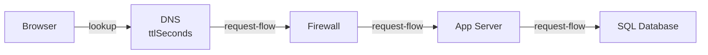

2.1 compressed the resolve phase to one line: DNS answers are cached, so a
name change is never instant. What it skipped: how a resolver finds an
answer it doesn't already have, and what happens when the answer it hands
out is simply wrong.

3.1 built the perimeter that decides what's allowed in. This chapter builds
what happens one step before that - the lookup that has to succeed before a
single packet from your browser has anywhere to go.

> [!NOTE]
> Think first: when a resolver has no cached answer for a name, does it ask
> one server to find out, or several? Commit to an answer before reading on.

## Turning a name into an address

2.1 drew this lookup as a `control` edge, beside the request path rather
than on it: the resolution and the request stay two separate exchanges. A
**DNS resolver** takes a name and returns an address - nothing about the
request itself is involved.

Note: DNS is drawn inline here so the canvas can validate the chain - the
resolution and the request are still two separate exchanges, not one
continuous pipe, the way 2.1 drew it as a control edge off to the side.

## Finding an answer nobody has cached

2.1 named the recursive resolver and moved on. Here's the walk it actually
runs on a cold cache: it asks a **root server** which organization runs the
domain's top-level suffix (`.com`, `.org`); that **TLD server** names the
**authoritative server** for the exact domain; the authoritative server
finally returns the address. Three hops, once - then the resolver caches
the answer for its TTL, which is exactly why 2.1 could call resolution
"usually free": a cold lookup like this is rare, most requests hit a warm
cache at some layer along the way.

The `dns` component's `recordType` field names what kind of answer comes
back: an `A` record is a literal address; a `CNAME` or `ALIAS` instead names
another host to resolve, one more hop before an address exists at all.

## The cost of choosing a TTL

2.1 told you a DNS change is never instant, bounded by whatever TTL was
already set. Left open: what TTL to set is a real decision, and it cuts
both ways. A short TTL (seconds) means a migration or failover finishes fast
- at the cost of asking a resolver fresh, for nearly every request, forever,
not just during the change. A long TTL (hours) means almost no ongoing
lookup traffic - at the cost of a slow cutover whenever the answer actually
needs to change.

Nobody runs a short TTL permanently on a system that rarely moves; the
failover benefit gets used once a year, the traffic tax gets paid every day.
Teams shorten it on purpose, right before a planned change, then lengthen it
back after.

## When the answer itself is wrong

2.2 already covered DNS being globally down: complete, immediate failure,
nothing downstream ever touched. A quieter failure sits next to it - a
record that resolves, but to the wrong address (a stale answer, still
inside its TTL) or to nothing at all (a typo in the record, an expired
domain). Both look identical to the user, the site is simply gone, but the
fix lives in the DNS record itself, not in anything the rest of this
curriculum has taught you to touch.

## At scale, resolution becomes routing

At 10x traffic, nothing about DNS changes: resolver caching means most
requests never reach an authoritative server at all, so lookup volume
barely tracks user growth. At 100x, or mid-incident, DNS becomes something
you actively lean on - changing what a name resolves to moves traffic
across regions, or away from a failing one, without touching a single
server. It's the first tool reached for, not the last, and why 3.15's CDN,
several chapters out, is steered by DNS rather than by anything downstream
of it.

## In production

**Netflix** steers traffic away from a degraded AWS region by changing what
its own DNS records resolve to, moving users before a single server is
touched - a documented part of their regional-failover practice, and a
direct payoff of treating DNS as routing rather than fixed plumbing.

## Common mistakes

- **Assuming a DNS change propagates all at once, the instant its TTL
  "expires."** Different resolvers cached the old answer at different
  moments, so their TTLs run out at different moments too - the cutover is
  staggered across your users, not simultaneous.
- **Setting TTL as low as possible "to be safe," permanently.** Trades a
  benefit used rarely (fast failover) for lookup traffic paid on nearly
  every request, always.
- **Treating a DNS outage as someone else's infrastructure problem.** It's
  a first-class failure mode of your own system, with its own signature:
  complete, immediate failure, not degradation.
- **Confusing a resolver's DNS cache with a browser's HTTP cache.**
  `dns`'s `ttlSeconds` and `browser`'s `honorsCacheControl` cache two
  different things at two different layers - clearing one does nothing to
  the other.

## In an interview

This is loop step 4 territory (0.4) and it resurfaces at step 6: "your
dashboards are green, but users in one region say the site is down" is
2.2's own failure class, now with a specific first hypothesis to reach for.

What that sounds like at a senior level: *"If it's a complete, immediate
failure rather than a slow one, I'd suspect resolution before I suspect the
servers - the name never became an address, so nothing downstream was ever
touched. I'd also ask what TTL is set on that record, since that bounds how
fast any fix propagates, and whether the record itself is simply wrong
rather than stale."*

## Recap

- DNS resolves a name to an address through a short hierarchy walk (root,
  TLD, authoritative) on a cold cache, then caches the answer for its TTL.
- The TTL you choose is a real trade-off: short costs ongoing lookup
  traffic; long costs cutover speed.
- A DNS failure can be total (2.2) or partial - stale or simply wrong - and
  both fixes live in the record, not your infrastructure.
- At scale, changing what a name resolves to IS how you route traffic - the
  mechanism 3.15's CDN builds on.

## Your turn

The starter graph has the firewall, app server, and database from 3.1,
already wired to each other - nothing feeds into the firewall yet. Add a
Browser and a DNS node, wire the lookup before the request path, and get a
clean Validate before you Submit. Which specific gap the validator names
until you do isn't previewed here.

## Next

3.3 Reverse Proxy takes the request DNS just pointed you to and asks what
should happen the instant it actually arrives - one address for everything
hiding behind it.
