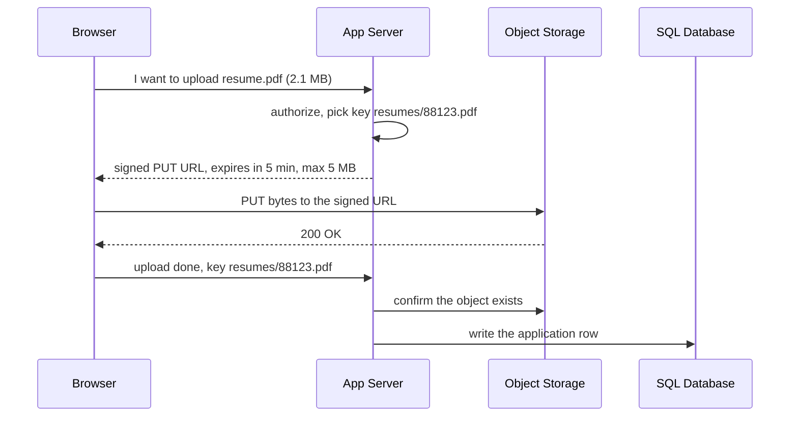

The job board shipped résumé uploads in the spring. Each PDF went into a
`resume_pdf` bytes column on the applications table, and company logos went
inline into each listing document beside its title and salary band. Five months
later the primary SQL database is 2.4 TB, of which 2.2 TB is PDF bytes. The
nightly backup takes eleven hours and now runs into the morning peak, and every
time a career fair's worth of résumés lands, replica lag jumps to forty seconds
and the recruiters' reports show applications that seem to have vanished.

Every query still returns the right answer. The database is doing a job it was
never the right shape for.

> [!NOTE]
> Think first: the DBA's proposal is a bigger instance with faster disks. Of the
> three symptoms - backup time, replica lag, slow listing pages - commit to which
> one that fixes before reading on, and which it leaves exactly where it was.

## The database stores facts about a file, not the file

A database earns its cost through what it does to rows: indexes, transactions,
an in-memory buffer of hot pages, replication, backups. Hold a 2 MB résumé up
against that list and it uses none of it.

| What the database does | What a 2 MB PDF gets out of it |
|---|---|
| Indexes and `WHERE` clauses | Nothing - nobody queries the inside of a PDF |
| Transactions across rows | Nothing beyond the one row that describes it |
| Buffer cache | Evicts hot index pages to hold bytes read once |
| Replication | Every byte streamed to every replica, ahead of the rows queued behind it |
| Nightly backup | Every byte copied again, unchanged since the day it was uploaded |

That table answers the Think-first prompt. Faster disks shave the backup
somewhat and leave the other two alone: the lag is the replication stream
carrying 2.2 TB of bytes, and the slow pages are hot index pages evicted by PDFs.
None of it is a capacity problem. It is a placement problem.

**Object storage** is the store shaped for bytes. A flat namespace maps keys
(`resumes/2026/88123.pdf`) to opaque blobs, read and written whole over HTTP with
`PUT` and `GET`. There is no query language and no partial update: to change an
object you write a new one. In exchange it is priced per GB-month at a small
fraction of database storage, replicates every object across machines for
durability without you operating anything, and scales capacity without anyone
resizing an instance.

The split is the chapter's one idea: **metadata in the database, bytes in object
storage, and a key joining them.** The applications row keeps `resume_key`,
size, content type, uploader and upload time - a few hundred bytes the database
is good at. The bucket keeps the 2 MB under that key.

<Walkthrough
  title="One logo, two stores"
  description="A recruiter uploads a company logo and a seeker later loads the listing that shows it."
  nodes={[
    { id: "browser", kind: "component", componentId: "browser", label: "Browser" },
    { id: "cdn", kind: "component", componentId: "cdn", label: "CDN" },
    { id: "app", kind: "component", componentId: "app-server", label: "App Server" },
    { id: "db", kind: "component", componentId: "sql-database", label: "SQL Database" },
    { id: "bucket", kind: "component", componentId: "object-storage", label: "Object Storage" },
  ]}
  edges={[
    { id: "in", source: "browser", target: "cdn", kind: "request-flow" },
    { id: "origin", source: "cdn", target: "app", kind: "request-flow" },
    { id: "row", source: "app", target: "db", kind: "request-flow" },
    { id: "bytes", source: "app", target: "bucket", kind: "request-flow" },
  ]}
  steps={[
    {
      caption: "A recruiter uploads a 340 KB logo. The request passes the CDN, which has nothing to cache for an upload, and reaches the App Server.",
      focus: ["in", "origin"],
    },
    {
      caption: "The App Server writes the bytes to Object Storage under a new key, logos/8812-v1.png. Bytes first: until they exist, nothing should point at them.",
      focus: "bytes",
    },
    {
      caption: "Then it writes the row to the SQL Database: listing 8812, logo key, size, content type. Two hundred bytes the database is built for.",
      focus: "row",
    },
    {
      caption: "A seeker opens listing 8812. The App Server reads the row from the SQL Database and renders the page with the logo's URL in it - not the logo.",
      focus: ["in", "origin", "row"],
    },
    {
      caption: "The browser fetches that URL. The CDN misses once and pulls the bytes from its origin - on this board, through the App Server from Object Storage - then keeps them.",
      focus: ["in", "origin", "bytes"],
    },
    {
      caption: "The next 40,000 seekers get the logo from the CDN. Neither the SQL Database nor Object Storage hears about any of them.",
      highlightNodeIds: ["browser", "cdn"],
      highlightEdgeIds: ["in"],
    },
  ]}
/>

Note: the SQL Database never sees a byte of the logo, and after the first miss
neither does anything behind the CDN. The row is the only thing the page load
reads from the store that owns the listing.

## Getting the bytes off your servers entirely

The walkthrough still routes upload bytes through the App Server, and on this
canvas that is the only legal drawing: Object Storage accepts connections from
compute only, so neither a browser nor a CDN can be wired to it directly. In
production you usually go one step further, because an App Server streaming
2 MB uploads is a pool sized for bandwidth rather than for requests.

A **presigned URL** is the fix: a URL the App Server signs with its own
credentials, scoped to one key, one verb and a few minutes. The App Server
decides *whether* you may upload; the bytes go straight from the browser to the
bucket.

Note: the 2.1 MB crosses exactly one hop, browser to bucket. The App Server
handles three small requests and never holds the file.

Reads split by audience. Logos are public, so the CDN's origin points at the
bucket and the bytes are cached at the edge for as long as you like. Résumés are
personal data, so they are never public-cached: the App Server checks that this
recruiter may see this application, then returns a signed `GET` URL that expires
in minutes. Same mechanism, opposite policy, and a reason to keep the two in
separate buckets.

## What you give up

The split costs you the one guarantee the bytes column had for free: the row and
the bytes no longer commit together. Two stores, no transaction across them.

- **Write order decides which failure you get.** Bytes first, row second, and a
  crash in between leaves an orphaned object nobody points at - wasted storage,
  swept later by a lifecycle rule or a reconciliation job. Row first leaves a row
  pointing at nothing, which is a broken page. Pick the failure that is only a
  cost.
- **Objects are immutable.** A new logo is a new object. Write it under a new key
  (`8812-v2.png`) and update the row, rather than overwriting `8812.png` behind a
  CDN that will keep serving the old one until its TTL runs out.
- **First-byte latency is tens of milliseconds**, not the sub-millisecond of a
  buffer-cache hit. Fine for a file, wrong for a 200-byte value read on every
  request, which belongs in a row or a cache.

The boring alternative sometimes wins. A few thousand avatars at 20 KB each is
under 100 MB, and keeping them in the database costs one less system to operate,
one less credential and one less failure mode. The bytes column becomes the wrong
call when blobs dominate the database's size, its backup window or its
replication stream - which is exactly where the job board is.

## What breaks

- **The public bucket.** A bucket policy set to public "just for the logos" with
  résumés in the same bucket is one of the most common data leaks on record.
  Separate buckets by audience; default every bucket to private.
- **A signed URL that lives too long.** Expiry is the access control. A link valid
  for a week is a résumé anyone can open for a week once it is forwarded.
- **An unbounded upload.** A presigned `PUT` with no size or content-type limit in
  its policy lets a client park 5 GB in your bucket on your bill.
- **Orphans and dangling rows**, from the write-order trade-off above, both
  invisible until someone audits storage cost or a page shows a broken image.

## What changes at scale

At 10x the storage bill is the line item, so objects move between storage
classes by age: résumés older than two years drop to infrequent-access and then
archive, where they are cheaper to keep and slower and costlier to read.
Lifecycle rules do this without code.

At 100x uploads get large and networks get unreliable, so files go up in
independently retried parts (multipart upload) rather than one request that
restarts from zero at 90%. Egress becomes a bigger bill than storage, which is
when 3.15's CDN stops being a latency feature and becomes a cost one.

At 1000x the question is whether to keep renting the store at all - the build
versus buy decision 1.3 walked through with Dropbox. The metadata/bytes split
survives every one of these steps unchanged.

## In production

**Pinterest** kept images in object storage and their metadata in MySQL from its
early scaling years: images were nearly all of the bytes and none of the
queries. The cost they accepted was keeping two systems consistent by
application convention rather than by transaction, with the CDN hiding the
bucket's latency from users.

**Discord** stores attachments in object storage and moved its attachment links
to expiring signed URLs, after permanent links had turned its CDN into a free
host for malware. The decision worth copying is that expiry was the control:
nothing about storage changed, only how long a URL stays valid.

Neither is a reason to build anything. A two-person team with user uploads uses
a managed bucket behind a CDN from the first day, writes one presigned-URL
endpoint, and never thinks about storage again until the bill says to.

## Common mistakes

- **Proxying every byte through the app tier "for auth".** Authorization is a
  decision, not a data path. Sign a URL and stay out of the transfer.
- **One bucket, one policy, two audiences.** Public logos and private résumés
  need opposite defaults.
- **Overwriting objects under a stable key behind a CDN.** Version the key.
- **Writing the row before the bytes**, so a failed upload leaves a page pointing
  at nothing.

## In an interview

High relevance for any system with media: it lands at step 4, where "where do
the photos live?" is asked of nearly every high-level design, and at step 3,
where the estimate decides it for you - a million 2 MB uploads a day is 2 TB a
day, and no interviewer expects that in a relational table. Instagram, YouTube,
Google Drive and Strava, all later in this course, turn on this split. The
follow-up is the upload path: candidates who route bytes through their API
servers get asked what that pool is sized for.

What that sounds like at a senior level: *"Photos go to object storage keyed by
ID; the database row holds the key and the metadata, never the bytes. Uploads
use a presigned URL, so the API tier authorizes and never carries the file,
and reads go through the CDN with the bucket as origin. I'd write the object
before the row so a failure leaves an orphan rather than a dangling pointer, and
sweep orphans with a lifecycle rule. Private files get short-lived signed reads
instead of public caching."*

## Connections

3.15 put a CDN in front of the board for logos and bundles; here it finally
fronts the store those logos belong in. 3.12's replica lag had a cause nobody
expected - the replication stream carrying PDFs - and moving the bytes out of
the primary removes it rather than tuning around it. 3.14's warning about
filling a cache with values read once is the same thing the résumés did to the
database's buffer cache.

## Recap

- A database row is the wrong home for bytes that use none of its powers but
  still pay for its backup, replication and memory.
- Metadata in the database, bytes in object storage, a key joining them.
- Objects are whole and immutable: version the key, never overwrite behind a
  cache.
- Presigned URLs let the app tier authorize a transfer without carrying it.
- Two stores, no shared transaction: write bytes first, row second, sweep
  orphans.

## Your turn

The starter graph is the system you rebuilt in Checkpoint R1, with the listing
document store from 3.11 beside the SQL database. Validate has nothing to report,
because the fault is in what the rows contain, and the canvas does not draw the
inside of a row.

Résumé PDFs are bloating the SQL database's backup and replication, and logos
are riding along inside every listing document the catalogue reads. Give the
bytes a home of their own, reachable from the tier that already handles uploads,
and leave both databases holding only the facts about each file. On this canvas
the new store takes connections from compute only, so the bytes path is drawn
from the application tier, not from the browser or the CDN.

## Next

3.21, File Storage. A teammate points out that the old version of this product
wrote uploads to a disk mounted on every server, and it worked for years with
no bucket, no keys and no signed URLs. They are right that it worked. The
question is what it was quietly assuming about how many servers there were.
