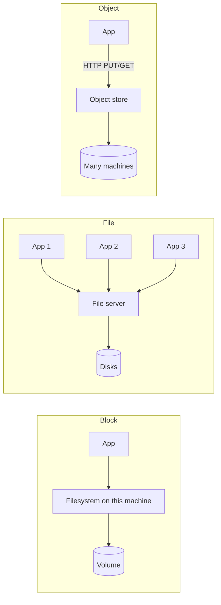

Before the bucket, the job board wrote uploads to `/var/uploads`. When it went
from one server to three, someone mounted that directory from a network file
server on all three, and it kept working. Then two instances regenerated the
sitemap file at the same moment and a search crawler indexed a half-written
one. A month later the file server rebooted for a patch, and all three app
instances hung for six minutes - including on pages that never touch a file.

Nothing in the code changed between "works" and "broken". What changed is that a
disk built for one machine was now being shared by three.

> [!NOTE]
> Think first: the obvious repair is a better file server with automatic
> failover. Commit to which of the two incidents that fixes before reading on,
> and which one it leaves exactly as it was.

## Three shapes, told apart by what you are allowed to do

Every storage product sits on one of three shapes. The difference is not
where the bytes are or how fast the disks are. It is the unit you address and the
operations you are promised on it.

| | Block | File | Object |
|---|---|---|---|
| You address | A numbered block on a volume | A path in a directory tree | A key in a flat namespace |
| You may | Read or write any block in place | Open, seek, write mid-file, append, rename, lock, list a directory | `PUT` a whole object, `GET` it, delete it |
| Shared by | One machine at a time | Many machines, through a file server | Anyone with HTTP and a credential |
| Typical use | A database's data volume, a boot disk | Shared home directories, tools that expect paths | Uploads, backups, media, datasets |
| Example | AWS EBS | NFS, AWS EFS | S3 (3.20) |

Note: only the middle shape has many machines sharing one namespace through one
server. That server is where both of the cold open's incidents came from.

## What a file promises, and what that costs over a network

A local filesystem makes promises you rarely notice: a write is visible to the
next read, `rename` is atomic, two processes can append to the same log, a lock
excludes everyone. On one machine they are cheap, because one kernel sees every
operation.

A network file system has to keep those promises for many machines at once, and
every one of them becomes coordination with the file server:

- **Metadata is a round trip.** `open`, `stat` and listing a directory each
  cross the network. Code written against a local disk does thousands of these
  without thinking; over NFS each one costs a millisecond instead of a
  microsecond.
- **Visibility is weaker than it looks.** NFS clients cache, and a common
  guarantee is close-to-open: you see another machine's writes only after it
  closes the file and you open it. Two instances writing the sitemap at once
  each saw a consistent file. The crawler read the interleaving.
- **Locks are fragile.** Network file locks depend on the server, the client and
  the network all agreeing about who holds what. A client that pauses or loses
  its connection can lose a lock it believes it still has.
- **The server is in every instance's critical path.** A hard-mounted share
  blocks a process on file I/O until the server answers, so the server's reboot
  froze request threads all over the pool. That is the second incident, and it is
  why a better file server fixes it at best partly: failover shortens the freeze,
  but the pool still depends on one shared thing.

That also answers the Think-first prompt. The sitemap corruption was never an
availability problem: it was two writers sharing mutable state, and a sturdier
server shares it just as faithfully.

## Why "just mount a disk" stops working

3.6 took state out of the application tier so any instance could answer any
request, and 3.8 added and removed instances freely on that basis. Both moves of
"just mount a disk" quietly undo that.

- **Mount a block volume** and it attaches to one machine. The file lives on
  instance 2, instance 3 cannot see it, and when instance 2 is replaced the file
  goes with it. That is 3.6's sticky state, moved from memory to disk.
- **Mount a shared file system** and every instance sees the same files - which
  is shared mutable state with POSIX semantics, the hardest kind there is to
  distribute. It works at three instances and degrades with each one you add,
  because every instance adds load to one namespace that has to stay coherent.

The way out is to change the data's shape rather than the disk: whole immutable
objects plus metadata in a database (3.20), or a service that owns the data and
exposes operations on it instead of a mount.

## When file storage is still right

The boring alternative wins more often than the last section suggests:

- **Software that speaks paths and that you cannot change.** A CMS writing
  media to a directory, a training framework reading datasets by path, a build
  tool with a shared cache. Rewriting them for keys and HTTP costs more than a
  managed shared file system.
- **Many readers of large, rarely changing files.** Eight GPU machines reading
  the same training set, a render farm reading the same textures. Reads scale
  well; contended writes are what does not.
- **In-place edits to large files.** Changing 4 KB of a 10 GB file is one
  operation on a file and a 10 GB rewrite on an object.

And block storage is the right answer under every database you have drawn so
far. A database needs to overwrite pages in place and know when a write is
durable, and that is exactly the block contract. Running one on a network file
share or an object store trades its durability guarantees for convenience.

| Workload | Shape | Why |
|---|---|---|
| A relational database's data files | Block | Page-level in-place writes, one owner |
| Uploads served to millions of users | Object | Written once, read whole, shared by everyone |
| A dataset read by eight training machines through path-based tooling | File | Many readers, tooling that expects paths |
| A log many processes append to | Neither shared file nor object | Shared appends contend; give each writer its own file and merge later |

## What breaks

- **A hung server hangs the pool**, the cold open's second incident. Every
  client blocks on a hard mount, including request paths that never asked for a
  file.
- **Concurrent writers interleave.** Two machines writing one file produce a
  file neither of them wrote.
- **Lock files that lie.** A `.lock` file used as a mutex between machines
  outlives a crashed holder or vanishes under a client that lost its session.
- **Stale handles after failover.** Clients holding open files on the old server
  get errors they were never written to handle.

## In production

**Facebook** stored photos as files on network-attached storage and found that
reading one photo cost several disk operations just to resolve directories and
file metadata - permissions, timestamps, inode lookups the photos never used. At
billions of photos that metadata no longer fit in memory. Their replacement,
Haystack, packed many photos into large files and kept a small in-memory index,
bringing a read down to roughly one disk operation. The accepted cost was giving
up per-photo filesystem features entirely, which photos never needed.

**GitLab** kept Git repositories on NFS shared across its application servers,
and NFS latency and file-server incidents became site-wide outages. They built
Gitaly, a service that owns repositories on local disk and exposes Git
operations over the network, and removed NFS from the path. The decision worth
copying is the shape: stop sharing a filesystem and put a service in front of
the data. The cost was writing and operating that service.

Neither is a reason to avoid file storage. A small team running a CMS on three
instances puts its media directory on a managed shared file system and is right
to, until the instance count or the write contention says otherwise.

## Common mistakes

- **Using a shared directory as a coordination mechanism** - lock files, marker
  files, "processing" folders. That is a distributed lock with none of the
  guarantees.
- **Treating a network mount as a local disk.** Code that stats a thousand files
  per request was fine on SSD and is a second of latency on NFS.
- **Putting a database on a network file share** to make it "shared". It
  becomes slower and less durable, and still is not shared safely.
- **Forcing objects onto an append-or-edit workload.** Appending a line to a log
  object means rewriting the object.

## In an interview

Low to medium relevance, concentrated in one family: design Google Drive or
Dropbox, which sits later in this course. The trap is that users think in files
and folders, so candidates reach for a shared file system. The strong answer
implements file semantics on top of 3.20's split: folders, names and paths are
metadata rows, file contents are objects, so renaming a folder of 10,000 files
is one row update and no bytes move.

What that sounds like at a senior level: *"Users see files and folders, but I
wouldn't store them in a filesystem. The folder tree and file names live in a
metadata database, and contents are immutable objects keyed by ID, so a rename
or a move is a metadata change and never touches the bytes. Block storage only
shows up under the metadata database itself. I'd reach for a shared file system
only for tooling that has to see paths, and keep it off the request path."*

## Connections

3.20 gave you the object shape; this chapter is the reason it, rather than a
shared disk, is the default for uploads. 3.6 and 3.8 made the app tier
stateless so instances are interchangeable, and a shared mount is that state
coming back through the storage layer. And 3.10's database has been running on
block storage all along, which is the one shape no database you have drawn could
do without.

## Recap

- Block, file and object differ in what you may do: in-place blocks, POSIX
  files, whole immutable objects.
- A shared file system shares mutable state, and keeping POSIX promises across
  machines makes its server a bottleneck and a dependency of every client.
- "Just mount a disk" either pins state to one instance or reintroduces shared
  state; changing the data's shape is the fix, not changing the disk.
- File storage is still right for path-bound tooling and many readers of large
  files; block storage is right under databases.

## Your turn

No build this time. Block and file storage have no component in ScaleCraft's
registry, and adding one to draw the wrong answer would teach the canvas, not
the decision. The exercise - three workloads, pick the shape for each - is the
knowledge check below, along with the shared-mount failure from the cold open.

## Next

3.22, Distributed Storage Concepts. Every store since 3.12 has kept copies of
your data on more than one machine: the replica, the cache, the CDN, the bucket.
Each time, the copies disagreed for a while and you accepted it. The next chapter
asks what "written" means when they disagree on purpose, and who decides which
machine a piece of data lives on in the first place.
