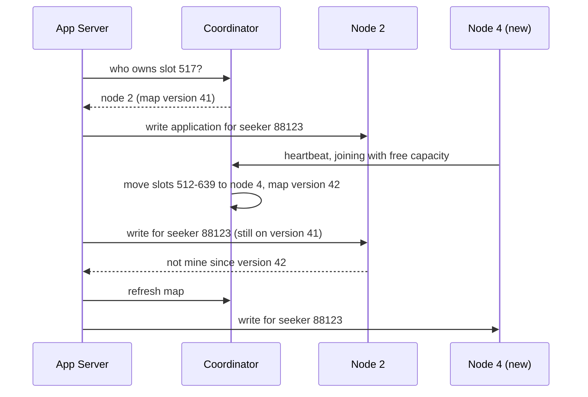
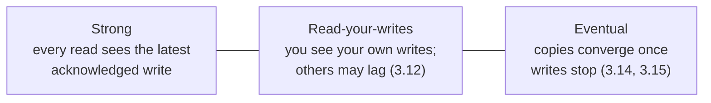
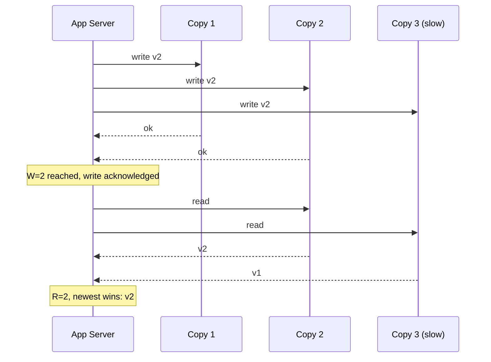

The applications store is split across three NoSQL nodes by seeker ID, the way
3.13 split a write-bound database. Last night operations added a fourth node.
The table saying which IDs live on which node is compiled into the app, so
adding the node meant redeploying every app instance, and the rollout took forty
minutes. For those forty minutes, two instances sent seeker 88123's writes to
the new node and one still sent them to the old one. The seeker submitted an
application, refreshed, saw it gone, refreshed again, and saw it back.

Two questions were left unanswered when the data first spanned machines, and
this is both of them failing at once: who knows where a piece of data lives, and
what "written" means when more than one machine might hold it.

> [!NOTE]
> Think first: during the rollout, one instance wrote to node 4 and another read
> from node 2. Commit to an answer before reading on: is that a bug in the
> rollout, or a decision every system with data on several machines has to make
> somewhere?

## Somebody has to hold the map

A hash of the seeker ID chooses a slot, and something has to say which node owns
that slot today. When that answer is compiled into each app instance, there are
as many copies of the map as instances, and changing it means they disagree
until the last deploy lands.

A **coordinator** holds the map in one place. It does three jobs:

| Job | What it means |
|---|---|
| **Placement** | Which range of keys lives on which storage node |
| **Membership** | Which storage nodes are alive, learned from their heartbeats |
| **Reassignment** | Moving ranges when a node joins, fills up or dies, and publishing the new map |

The coordinator is the **control plane**: it decides where data goes but never
carries it. App instances fetch the map, cache it and send reads and writes
straight to the storage node that owns the key. If a cached map is stale, the
storage node refuses a key it no longer owns, and the app refreshes and retries.

Note: there is one moment of truth, version 42, and a stale reader is told it is
stale. During the old rollout there was no version and no refusal - each
instance believed its own map.

The coordinator's own answer has to survive the loss of a machine, so it runs
as a small replicated group, three or five members, that agree on every change
to the map through a **consensus** protocol (Raft, Paxos or ZAB - the Coordinator
card's one config field names which). Consensus needs a majority, so three
members survive one failure and five survive two. Its internals are well beyond
this chapter; what matters here is that the map changes in one place, in one
order, and everyone sees the same versions.

## What "written" means once there are copies

Every store since 3.12 has kept copies, and the copies have disagreed: the
replica that lagged the primary, the cache entry that outlived its source, the
CDN serving yesterday's file for an hour. Each time you accepted it. That
acceptance has a name, and it sits on a spectrum.

Note: moving right buys latency and availability and costs certainty. Nothing on
the right is broken - it is a weaker promise, chosen.

**Strong** behaves as if there were one copy. **Eventual** promises only that
the copies stop disagreeing once writes stop - not when, and not what a read sees
in the meantime. The seeker's vanishing application was neither: two machines
each sure they owned the same key, which no point on this spectrum allows. The
coordinator fixes that, and then the spectrum is a choice rather than an
accident.

## Quorums: tuning where you sit

With **N** copies of each key, a write is acknowledged after **W** of them
confirm it and a read asks **R** of them and takes the newest answer. If
`W + R > N`, every read set overlaps every write set in at least one copy, so a
read sees the latest acknowledged write.

| N=3 setting | Reads | Writes | One node down |
|---|---|---|---|
| W=3, R=1 | Fast, and current | Wait for the slowest copy | Writes fail |
| W=2, R=2 | Overlap guaranteed | Wait for the second-fastest | Both still work |
| W=1, R=1 | Fastest | Fastest | Both work, reads may be stale |

Note: the read touched one copy that had the write and one that did not, and the
overlap is what made the answer right. With R=1 it could have asked only copy 3.

The cost of overlap is latency coupled to your slower replicas on every request,
and an operation that fails outright when too few of them can be reached.

## CAP, stated honestly

A **network partition** is machines that are each running but cannot reach each
other. You do not choose whether one happens. When one does, a node cut off from
the others has two options for a request it receives:

- **Refuse**, because it cannot confirm it has the latest data: consistent,
  unavailable to that caller. A CP-ish posture.
- **Answer with what it has**: available, possibly stale, possibly diverging
  from the other side until the partition heals. An AP-ish posture.

That is CAP. The popular "pick two of three" version is wrong, because partition
tolerance is not optional: a system that cannot tolerate partitions simply
fails in some unplanned way when one happens. The real choice is what each kind
of data does during one.

**PACELC** finishes the thought: if there is a Partition, choose Availability or
Consistency; Else, choose Latency or Consistency. Partitions are rare. The
quorum table above is the everyday version of the same trade, paid on every
request whether or not the network ever splits.

## The posture belongs to the data, not the system

One system holds data that wants different answers, so the decision is made per
data class:

| Data | Posture | Why |
|---|---|---|
| Interview slot booking | CP-ish | Two candidates in one slot is worse than "try again in a minute" |
| Listing view counter | AP-ish | Off by a few hundred is harmless; refusing the page view is not |
| Username uniqueness | CP-ish | Two accounts claiming one name cannot be reconciled after the fact |
| Search index (3.16) | AP-ish | It is derived and rebuildable, and seconds stale is normal |

When AP-ish data diverges, something must merge it later. "Last write wins" is
the easy merge and silently discards the losing write; merging by meaning, such
as taking the union of two diverged sets, keeps both at the cost of logic you
write per data type.

## What breaks

- **Two owners for one key**, the cold open. Any placement change that is not
  versioned and enforced by the storage nodes produces it.
- **A coordinator outage** stops placement changes, not traffic: app instances
  keep their cached maps, and reads and writes continue until a node joins or
  dies. That property is why the coordinator stays off the data path.
- **A quorum set below overlap.** W=1, R=1 configured for speed, on data
  someone believes is strongly consistent.
- **Merges that lose data.** Last-write-wins between two clocks that disagree
  keeps the wrong write, and nothing reports it.
- **A coordinator group of two.** A majority of two is two, so losing either
  member stops every map change. Run three or five.

## What changes at scale

At 10x you add nodes weekly, so reassignment is routine, and moving a range has
to happen while it is being written - copy, catch up, flip ownership at one map
version.

At 100x data spans regions 70-150 ms apart, and a strongly consistent write that
must cross an ocean costs that on every write. That is when per-data-class
postures stop being an interview answer and become the architecture: bookings
confirmed in one home region, view counts accepted locally and merged.

At 1000x the map itself is large and hot enough to need its own design, and
placement decisions start following load and cost rather than only key hashes.

## In production

**Amazon's Dynamo** was built so the shopping cart could always accept an
add-to-cart, even during failures between datacenters. It chose the AP side:
conflicting versions of a cart are kept and merged when read. The cost Amazon
accepted, and published, is that an item deleted on one side of a split can
reappear after the merge.

**Google's Spanner** went the other way for data such as ad billing, where two
answers to "what was charged" is unacceptable: strongly consistent transactions
across regions, using tightly synchronized clocks so each commit waits out the
clock uncertainty. The cost is a few milliseconds on every commit and
specialized time infrastructure.

Neither is a starting point. A two-person team on one Postgres primary gets
strong consistency for free and never makes this choice - it appears only when
data spans machines, and a single primary is a deliberate way to postpone it.

## Common mistakes

- **"Pick two of CAP."** Partitions are not optional, so the choice is only made
  during one, per data class.
- **One posture for the whole system.** "We're AP" for payments, or "we're CP"
  for like counts.
- **Assuming copies agree because reads usually look right.** Disagreement shows
  up under load and failure, which is when it matters.
- **Routing data through the coordinator.** It holds the map; traffic goes to
  the storage nodes.

## In an interview

High relevance: this is where senior follow-ups live, at steps 6 to 8. "What
happens during a partition?", "is that read consistent?", "how does a new node
get data?" are each a probe for whether you can name a posture per data class
and its cost. Payment systems, Uber, WhatsApp and Google Docs later in this
course each turn on a different answer.

What that sounds like at a senior level: *"I'd split it by data. Bookings are
CP-ish: during a partition the minority side refuses rather than double-book,
and I'd run N=3 with W=2, R=2 so a read always overlaps the last write. View
counts and the feed are AP-ish: accept locally, merge later, and nobody notices.
Placement lives in a small coordinator group with versioned maps, so adding a
node is a map change the storage nodes enforce, not a redeploy. And even with no
partition, those quorums cost latency on every write, so I'd only pay it where a
wrong answer is worse than a slow one."*

## Connections

3.12's replica lag was eventual consistency, and read-your-writes was the first
point on this spectrum you ever chose. 3.13 split data by key and never said who
remembers which key went where; the coordinator is that missing piece. 3.14's
and 3.15's TTLs were staleness you configured deliberately. And 3.20's bucket
replicates every object for durability, which is a separate property from
consistency: a store can be down but durable, or up but one disk from loss.

## Recap

- Data on many machines needs one owner of the map: placement, membership,
  reassignment, versioned and enforced.
- Consistency is a spectrum from strong to eventual; every copy you have added
  so far sat somewhere on it.
- Quorums tune the position: `W + R > N` buys overlap and costs latency and
  availability.
- CAP: partitions are not optional, so the choice is refuse or answer stale -
  per data class. PACELC: without a partition you still trade latency for
  consistency.

## Your turn

The starter graph is the sharded applications store from the cold open: three
NoSQL nodes taking traffic and a fourth, added last night, that nothing sends
anything to. Validate will warn about that fourth node, and the warning is the
symptom, not the fix: wiring it in by hand is what the forty-minute redeploy did.

Give placement one home that every app instance consults, and get the new node
taking its share of seekers. Ask what kind of signal the app's question about
placement is - it is not a request for data.

## Next

3.23, Reliability Patterns, once Group E is complete as well. Every mechanism in
this chapter assumed a call to another machine either succeeds or fails. Across a
network there is a third outcome - you waited and heard nothing - and whether you
retry, and how often, decides whether a slow node becomes an outage.
