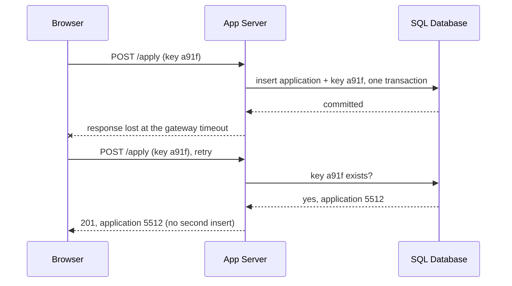
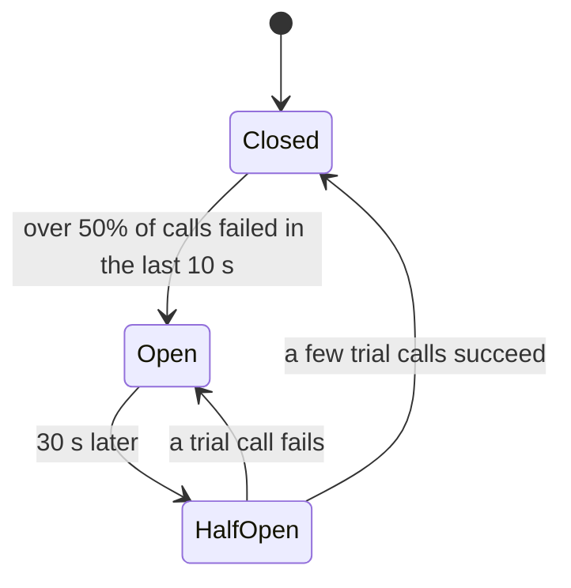
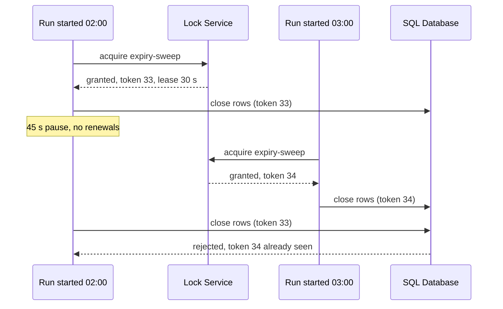

At 11:02 one of the search engine's three shards started answering in 4
seconds instead of 40 ms - a disk on its way out. Search is 10% of the job
board's traffic. By 11:04 the job-detail page, which never calls search, was
timing out for everyone.

Nothing returned an error. One dependency got slow, the search client had no
timeout and three retries, and everything else on the site queued behind it.

> [!NOTE]
> Think first: search was 10% of requests and one shard of three. Commit to an
> answer before reading on: what is the smallest change that would have kept the
> job-detail page up?

## Slow is worse than dead

Every call to another machine ends one of three ways: it succeeds, it fails, or
you are still waiting. 2.2 called the third one an unknown. The first two release
whatever the caller was holding - a thread, a connection, a slot in the pool. The
third holds it for as long as you are willing to wait.

How many slots a dependency occupies is its request rate times how long each
call takes (Little's law). The app pool has 600 request slots across three
instances, and search runs at 150 calls a second:

| Search latency | Slots held by search | Left for everything else |
|---|---|---|
| 40 ms | 6 | 594 |
| 400 ms | 60 | 540 |
| 4 s | 600 | 0 |

A dead shard refuses a connection in a millisecond and costs nothing to wait
for. A slow one turns a 10% feature into a 100% outage. Every pattern in this
chapter stops one dependency's latency from spending capacity that belongs to
everything else.

<Walkthrough
  title="How a slow shard takes down a page that never calls it"
  description="One request path, one slow dependency, and the patterns that keep the rest of the site up."
  nodes={[
    { id: "browser", kind: "component", componentId: "browser", label: "Browser" },
    { id: "gateway", kind: "component", componentId: "api-gateway", label: "API Gateway" },
    { id: "app", kind: "component", componentId: "app-server", label: "App Server pool" },
    { id: "search", kind: "component", componentId: "search-engine", label: "Search Engine" },
    { id: "db", kind: "component", componentId: "sql-database", label: "SQL Database" },
  ]}
  edges={[
    { id: "enter", source: "browser", target: "gateway", kind: "request-flow" },
    { id: "route", source: "gateway", target: "app", kind: "request-flow" },
    { id: "query", source: "app", target: "search", kind: "request-flow" },
    { id: "read", source: "app", target: "db", kind: "request-flow" },
  ]}
  steps={[
    {
      caption: "11:00. A seeker opens a job-detail page: Browser, API Gateway, App Server pool, SQL Database. It never touches the Search Engine.",
      focus: ["enter", "route", "read"],
    },
    {
      caption: "Searches go from the App Server pool to the Search Engine at 150 a second, 40 ms each. They hold about 6 of the pool's 600 slots at any moment.",
      focus: "query",
    },
    {
      caption: "11:02. One shard slows to 4 seconds. Each search call from the App Server pool now holds its slot a hundred times longer, and the client has no timeout.",
      focus: "query",
    },
    {
      caption: "The App Server pool retries search three times; the API Gateway retries the whole request twice. One click can become twelve calls to the shard that is already too slow.",
      focus: ["route", "query"],
    },
    {
      caption: "11:04. All 600 slots are waiting on search. The job-detail request reaches the App Server pool and finds no slot free - the lit path stops there, short of the SQL Database.",
      focus: ["enter", "route"],
    },
    {
      caption: "With a 300 ms timeout and a 50-slot pool reserved for search, slow searches fill those 50 and fail fast. The other 550 slots keep serving job-detail reads from the SQL Database.",
      focus: ["enter", "route", "read"],
    },
  ]}
/>

Note: the failure travels against the arrows. The Search Engine never touched the
SQL Database path; it took it down by holding the one resource both shared.

## Timeouts: decide how long "unknown" may last

A timeout converts the third outcome into the second: after a fixed wait you
stop, treat the call as failed, and free the slot. Two rules make it work:

- **Set it from the dependency's healthy p99, not its average or a round
  number.** Search's p99 is 120 ms. A 300 ms timeout leaves headroom and caps
  what search can hold at 150 x 0.3 = 45 slots, however slow it gets. Many HTTP
  clients default to waiting forever, which is what this one did.
- **Inner timeouts are shorter than outer ones.** If the gateway gives up at 2 s
  and the app keeps waiting on search for 4 s, the app is doing work nobody will
  receive. Pass the remaining budget down with the call - a deadline - so each
  hop knows how much time is left.

A timeout does not tell you what happened. A write that timed out may have been
applied. That is the next two sections' problem.

## Retries: one layer, with a budget

3.17 taught backoff and jitter for a worker retrying a message. On the
synchronous path retries have a second problem: they multiply. The gateway makes
up to 3 attempts per request and the app makes up to 4 per search, so one click
can reach the slow shard 12 times - extra load arriving exactly when the shard
can least absorb it. That is a **retry storm**: retries turning a degradation
into a collapse.

- **Retry at one layer**, usually the one closest to the failing dependency.
  Every other layer passes the failure up.
- **Cap retries with a budget** - for example, retries may be at most 10% of a
  client's requests. A rare blip still gets retried; a degraded dependency
  exhausts the budget and the extra load stops.
- **Back off with jitter**, as in 3.17.
- **Retry only what can succeed next time and is safe to repeat.** A timeout or
  a 503, yes. A 400, never. A write, only with the next section's key.

## Idempotency keys: making "try again" safe

Search is a read, so repeating it is harmless. "Submit application" is not. The
seeker taps Apply, the gateway times out, and the app does not know whether the
insert landed. Retry and the application may exist twice; don't, and it may not
exist at all.

An **idempotency key** removes the guess. The client generates a unique id for
the action and sends it with every attempt. The server stores the key with the
result, in the same transaction as the effect, and answers a repeated key with
the stored result instead of doing the work again.

Note: the key and the effect commit together. Stored separately, a crash between
the two writes recreates the original question.

3.17's consumers needed the same property for the same reason: at-least-once
delivery is a retry you did not write yourself.

## Circuit breakers: stop calling what is down

Timeouts cap each wait, but while the shard is sick every search still spends
300 ms of a slot discovering that. A **circuit breaker** wraps the call, tracks
recent failures, and stops making it when they cross a threshold.

Note: in Open, the breaker answers without touching the network. The caller gets
a failure in microseconds and the dependency gets silence to recover in.

That protects both sides, and it leaves one decision that is pure product design:
what the caller does with a fast failure. The job board shows the cached popular
searches (3.14) with a "results limited" banner - a fallback - rather than a
spinner that ends in an error page.

## Bulkheads: give each dependency its own budget

This is the Think-first answer. Timeouts and breakers shrink how long search can
hold slots; a **bulkhead** caps how many it can hold at all. Reserve 50 of the
600 slots for search calls. When search is slow those 50 fill and further
searches fail fast, while the other 550 keep serving job-detail pages. The name
is a ship's watertight compartments: a breach floods one, not the hull.

The same idea appears at every size - a connection pool per dependency, a worker
pool per queue (3.17), a separate deployment for batch jobs so a sweep cannot
starve the request pool.

| Pattern | What it limits | Fails you when |
|---|---|---|
| Timeout | How long one call may wait | Set above the caller's own timeout, or from the average |
| Retry budget | How much extra load failures may create | Retries at every layer multiply |
| Idempotency key | How many times one action takes effect | Stored outside the transaction that applies the effect |
| Circuit breaker | Calls to a dependency known to be failing | It opens with no fallback behind it |
| Bulkhead | How much shared capacity one dependency may hold | Pools sized below a normal peak |

## One run at a time

The patterns above contain failures between a caller and its dependency. 3.19
left a different problem. The hourly expiry sweep has grown from 20 minutes to
70, so at 03:00 a second run starts on rows the 02:00 run is still closing.
Nothing failed - the same correct code ran twice at once.

In one process a mutex fixes this. Across machines there is no shared memory to
hold one, so you need a **lock service**: a separate component that grants a named
lock to one holder at a time. Three properties make it safe rather than merely
present:

- **The lock is a lease.** It expires after a TTL unless its holder renews it.
  A run that crashes stops renewing and the lock frees itself; a lock with no
  expiry and a crashed holder blocks the sweep forever.
- **The holder renews while it works.** A 70-minute sweep on a 30-second lease
  renews every 10 seconds. The TTL bounds how long a *dead* holder blocks the
  next run, not how long the job may take.
- **A paused holder can lose the lease without knowing.** A long garbage-collection
  pause outlasts the lease, the next run takes the lock, and the first wakes up
  still writing. The fix is a **fencing token**: every grant carries an
  increasing number, and the database refuses writes carrying an older one.

Note: the lock did not stop run A - the database checking the token did. A lock
without fencing narrows the overlap window; it does not close it.

A lock service has to survive losing a machine and give every caller the same
answer, so it is built on 3.22's consensus group: ZooKeeper, etcd and Google's
Chubby are each a small replicated group agreeing by majority. It sits on the
control path. Callers ask it for permission and never send it data.

## Trade-offs

| Choice | Buys | Costs |
|---|---|---|
| Timeout just above p99 | A slow dependency cannot hold your capacity | Calls that would have succeeded slowly now fail |
| Retrying | Transient blips disappear from the user's view | Load arrives at the worst moment; repeated writes duplicate without keys |
| Breaker with a short trip threshold | Fast failure the moment a dependency degrades | A two-second blip takes a working feature offline for the whole open window |
| Bulkheads | One dependency cannot starve the rest | Reserved capacity sits idle; a pool sized too small fails at normal peak |
| A lock service | One run at a time, across machines, surviving crashes | One more dependency, and a consensus round trip per acquire |

## What breaks

- **Every layer retrying.** Three layers of three attempts is 27 calls per click.
- **An inner timeout longer than the outer one.** Work continues after the
  caller has already returned an error.
- **Retrying a write without a key.** The duplicate application, the double charge.
- **A breaker with no fallback.** Fast failure is still a failure page.
- **A lease shorter than the job, never renewed.** The 30-second lock on a
  70-minute sweep stops protecting anything at second 31.
- **A lock with no TTL.** One crash holds it forever.
- **A lock on the request path.** Every request pays a consensus round trip, and
  the lock service becomes the bottleneck it was never sized for. Locks are for
  coarse, rare decisions like "who runs this sweep".

## What changes at scale

At 10x, per-dependency timeouts, retry policies and breakers stop being code each
team writes and become a shared client library or a proxy beside every service,
so a new dependency gets them by default. The dangerous value is the default.

At 100x a page fans out to 20 services, and 3.13's lesson returns: the page waits
for the slowest. Retries and timeouts are tuned against each dependency's p99,
and load shedding at the edge (next chapter) replaces hoping that every
dependency copes.

At 1000x the retry storm is the outage pattern itself: a regional blip, then
millions of clients retrying in step. Jittered backoff ships inside the mobile
apps, and bulkheads grow into whole isolated copies of the stack, so a bad deploy
or a hot customer takes down one slice of users instead of all of them.

## In production

**Amazon** ships exponential backoff with jitter in every AWS SDK by default, and
its published guidance is to retry at a single layer. The reason is arithmetic: a
five-deep call stack retrying three times at every layer multiplies one request
into 243 calls at the bottom. The cost Amazon accepted is that callers see more
errors instead of having them masked.

**Netflix** wrapped every dependency call in its Hystrix library: a circuit
breaker plus a dedicated thread pool per dependency, so one slow service could not
exhaust the API that every device calls. Fallbacks were designed per call - a
generic row of titles when personalized recommendations were down. The cost was a
thread pool per dependency and overhead on every call; Netflix later moved to
limits that adapt to measured latency, and put Hystrix into maintenance.

**Google's Chubby** is the lock service the rest grew from: five replicas agreeing
through Paxos, used to decide which machine is in charge of a Bigtable cluster.
It was built for locks held for hours, not per request, and deliberately trades
throughput for that.

A two-person team needs none of these products. A timeout on every client, one
retry layer, and the database's own advisory lock around the one cron job covers
it - a separate lock service earns its place when many services need the same
exclusion.

## Common mistakes

- **Treating the timeout as the fix.** It caps one call's damage; without a
  bulkhead, enough capped calls still fill the pool.
- **Retrying everywhere "to be safe".** Safety at each layer is a storm in total.
- **Assuming a lock means one holder.** Without fencing, a paused holder is a
  second holder.
- **Putting the lock inside the thing that runs twice.** A flag in the job
  runner's memory is 3.19's instance-0 flag again.

## In an interview

High relevance, at step 6. "What happens when this dependency gets slow?" and
"what if the client retries?" are the two follow-ups every design meets, and they
are tests of whether you separate slow from failed and know that retries cost
something. Uber, WhatsApp and the payment system later in this course all lean on
idempotency keys and bulkheads by name.

What that sounds like at a senior level: *"Slow is the failure I'd design for,
not down. Every call gets a timeout from the dependency's p99, with deadlines
propagated so inner hops give up first. Retries happen at one layer with a
budget and jitter, and only on idempotent operations - applying is idempotent
through a client key stored in the same transaction. Search sits behind a
breaker with cached results as the fallback, and in its own pool, so a slow shard
costs us search and nothing else. The hourly sweep takes a lease with a fencing
token, because a lock alone doesn't survive a GC pause."*

## Connections

2.2 named the timeout as an unknown rather than a failure; this chapter is what
you do with that unknown. 3.17 taught backoff, jitter and idempotent consumers for
the asynchronous path, and this chapter moves them onto the path where someone is
waiting. 3.19 ended on two runs of the same job on the same rows; the lock
service is that cliffhanger paid. And the lock service is 3.22's consensus group
doing a second job - same majority agreement, now deciding who holds a lock
instead of which node holds a key.

## Recap

- Slow is worse than dead: latency times rate is capacity held, and shared
  capacity is how one dependency takes down pages that never call it.
- Timeouts bound the wait, bulkheads bound the share, breakers stop calling what
  is failing.
- Retry at one layer, with a budget, and only what is safe to repeat; an
  idempotency key makes a write safe to repeat.
- A distributed lock is a lease, renewed while held, and fenced by a token the
  data store checks.

## Your turn

The starter graph is the expiry sweep from 3.19. The Cron Job fires every hour
and calls a separate jobs service - its own Application Server, apart from the
pool serving seekers - which runs the sweep against the SQL Database. Validate
has nothing to report, because nothing is miswired. The fault is in time: the
sweep now takes 20 to 70 minutes, so some hours two runs work the same rows at
once.

Make it impossible for two runs to work at the same time, however long one takes,
without a crashed run blocking the sweep forever. Ask which part of the drawing
actually does the sweep - the scheduler only fires.

## Next

3.24, Rate Limiting. This chapter protected a caller from a slow dependency. The
same storm can start from the other end: last month a mobile release retried
failed searches immediately and forever, and 30,000 phones did exactly what this
chapter's gateway did - only now the callers are your own users, and they are not
yours to configure.
