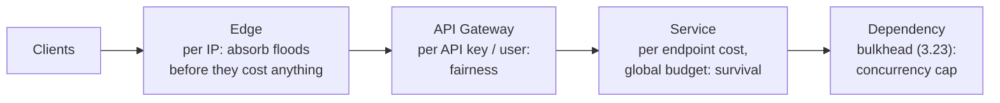

Monday, 09:00. Version 4.2 of the Android app shipped with a bug: when a search
fails, it retries immediately, every 50 ms, forever. At 09:03 one search shard
had a two-second blip. Every phone that saw a failure started looping at 1,200
searches a minute, the extra load made more searches fail, and more phones
joined. By 09:06, 4,000 phones were sending 4.8 million searches a minute at a
system sized for 9,000.

The API Gateway enforces a per-caller limit, exactly as 3.5 built it. It is set to
100,000 requests a minute - chosen at launch "so nobody is ever blocked by
mistake" - and it blocked no one.

> [!NOTE]
> Think first: the heaviest legitimate caller - a recruiter's dashboard that
> polls and searches - peaks at 240 requests a minute. Commit to a number for the
> gateway's limit before reading on, and to what that number alone cannot
> protect against.

## A limit is an admission decision

Everything 3.23 taught protects a caller from a slow dependency. A rate limit
protects a service from its callers, and it has two jobs that are easy to blur:

| Job | Question it answers | Keyed by |
|---|---|---|
| **Fairness** | Is this one caller taking more than its share? | API key, user, or IP |
| **Survival** | Is the total about to exceed what the system can serve? | Nothing - one budget for everyone |

Both are the same move: decide whether to admit a request *before* any work is
done on it, and make the refusal cheaper than the work. A request refused at the
gateway costs microseconds. The same request admitted costs an app slot, a search
query and a database read - and under overload, it also costs the request behind
it.

Note: each stop rejects with what it knows. The edge knows only addresses, so it
can stop a flood but not judge a customer; the service knows that a search costs
fifty page views, which the edge cannot see.

The rule for placement: **reject as early as possible, at the first stop that
knows enough to decide.** Per-caller limits sit at the gateway because that is
where the caller's identity is first known (3.5). Cost-aware and global limits
sit in the service, because only the service knows what a request will cost it.

## How a limiter counts

Four algorithms, all variations on "how many in what window":

| Algorithm | How it counts | Bursts | Cost |
|---|---|---|---|
| Fixed window | Counter per caller per clock minute, reset on the minute | Up to 2x the limit across a boundary: 600 at 10:00:59, 600 at 10:01:00 | One counter |
| Sliding window log | Timestamp of every request in the last 60 s | None beyond the limit | Memory per request |
| Sliding window counter | This minute's count plus last minute's, weighted by overlap | Approximately none | Two counters |
| Token bucket | A bucket of N tokens refilling at r per second; each request spends one | Up to N at once, then r per second | Two numbers per caller |

The **token bucket** is the common default because its two numbers map onto two
real requirements: refill rate is the sustained rate you will serve, and capacity
is the burst you will forgive. A bucket of 20 refilling at 4 per second lets a
dashboard load fire 20 requests at once, then holds it to 240 a minute.

| Second | Tokens before | Requests | Admitted | Refused |
|---|---|---|---|---|
| 0 (idle a while) | 20 | 20 | 20 | 0 |
| 1 | 4 | 10 | 4 | 6 |
| 2 | 4 | 3 | 3 | 0 |
| 3 | 5 | 0 | 0 | 0 |

Note: capacity is spent once and refilled slowly. A looping phone at 20 requests
a second drains its bucket in the first second and gets 4 a second after that.

A refused request gets **429 Too Many Requests** with a `Retry-After` header. A
client that honors it backs off; a client that does not - version 4.2 - is
refused in microseconds, every time, and costs the gateway almost nothing.

## Counting across many gateways

The gateway runs on several machines. If each counts on its own, a caller spread
across six of them gets six times the limit. Three ways out:

- **Shared counter** in a distributed cache (3.14) - exact, but every request
  pays a network hop to it, and the counter store is now on the request path.
- **Local counters with periodic sync** - each machine admits against its own
  share and reconciles every second or so. Cheap, and briefly over the limit.
- **Sticky routing by key** - send one caller to one gateway machine. Exact and
  local, until that machine dies and the caller's history goes with it.

Most production limiters accept being slightly wrong for a second in exchange for
no extra hop: a rate limit is a protection, not a ledger.

## Per caller, or for everyone

The Think-first answer, half one: the gateway's number should sit between the
heaviest legitimate caller and the looping client - above 240, well below 1,200 -
so the bug is refused and the recruiter never notices. Half two is what that
number cannot do. Per-caller limits keep one caller from taking everyone's share;
they do nothing when 40,000 well-behaved callers each stay under their limit and
together exceed what search can serve.

| | Per-caller limit | Global limit |
|---|---|---|
| Stops one runaway client | Yes, and only that client is refused | Only after it has spent the shared budget |
| Stops a legitimate traffic spike from overloading the system | No - every caller is within their limit | Yes |
| Who gets refused under overload | Nobody, until something breaks | Everyone, at random, including your best customers |

So you run both, and you make the global one smarter than "refuse at random".
**Load shedding** refuses by priority when the system is near its limit: search
and recommendations are refused first, applying for a job last. The essential
flow survives because the optional ones made room.

## What breaks

- **A limit set to "never block anyone".** It never blocks the client that needs
  blocking either. The cold open.
- **Keying by IP alone.** A university, a corporate office or a mobile carrier
  puts thousands of people behind one address, and one limit throttles all of
  them.
- **Counting requests when costs differ.** A search costs fifty page views; a
  limit of 600 of either treats them as equal.
- **Limiting only per caller.** Survives abuse, dies on a legitimate spike.
- **A limiter that fails closed.** If the shared counter store goes down and the
  limiter refuses everything it cannot check, the protection has become the
  outage. Most fail open, briefly unprotected.
- **Refusals that are expensive.** A 429 that renders an error page from the
  database is load, not protection.

## What changes at scale

At 10x, limits move from one gateway setting to a table: per plan, per endpoint,
per customer, each reviewed against what that caller actually does.

At 100x, request counts stop describing load. Limits are set in cost units - CPU
time, rows scanned, query complexity - and the global budget is adjusted from
measured latency rather than a number someone typed.

At 1000x, the edge absorbs volumetric floods (millions of requests a second from
botnets) that would saturate the network before any gateway sees them, and the
limiter's own state is a distributed system with its own consistency trade-off -
the same one 3.22 taught, made cheap by accepting approximation.

## In production

**Stripe** published that it runs four limiters in layers: a per-user request
rate limiter (token bucket, in a shared store), a per-user cap on concurrent
requests, a fleet-wide load shedder that reserves capacity for critical requests
such as charges, and a worker-level shedder that drops low-priority traffic first
when the fleet is overloaded. The cost they accepted is that under real overload,
some well-behaved customers' non-critical requests are refused on purpose.

**Shopify** limits its GraphQL API by calculated query cost, not request count: a
leaky bucket of points refilling at a fixed rate per app, where a query that
fetches 250 products with variants costs far more than one that fetches a single
order. Cost-based limiting is what stops one request from being worth a thousand.
The cost is complexity for developers, who now have to reason about what their
query costs before sending it.

A two-person startup puts one per-key limit on its gateway, set from the heaviest
real caller with headroom, and lets its hosting provider's edge absorb floods.
Cost-based limits and load shedding arrive when traffic mix, not volume, starts
causing incidents.

## Common mistakes

- **Choosing the number by feel.** The limit comes from the heaviest legitimate
  caller's peak plus headroom, and has to sit below what a misbehaving client
  sends.
- **Limiting in the service only.** The request has already consumed the gateway,
  the load balancer and an app slot by the time it is refused.
- **Refusing without saying when to come back.** No `Retry-After` invites
  immediate retries - the storm you were limiting.
- **Treating a rate limit as security.** It slows abuse; it does not
  authenticate anyone.

## In an interview

High relevance twice over: "design a rate limiter" is a standalone interview
question and the Rate Limiter project in Real World Extraction Tier 1, and "how do
you protect this API?" is a follow-up on nearly every design at step 6. The signal
is separating fairness from survival, picking an algorithm by the burst behavior
you want, and saying where the counter lives across many machines.

What that sounds like at a senior level: *"Two limits, for two reasons. Per API
key at the gateway, token bucket, sized from our heaviest real customer - say 20
burst, 4 a second - so a broken client is refused in microseconds with a
Retry-After. Then a global budget in the service with load shedding by priority:
under overload, search goes first and applying goes last. Counters are local per
gateway node with a sync every second; I'd rather be over the limit briefly than
add a hop to every request. And IP-only keys are out - one carrier NAT would
throttle a city."*

## Connections

3.5 gave the gateway its `rateLimitPerMinute` and warned that a value set too low
throttles every service at once; this chapter is the other direction, a value so
high it protects nothing. 3.23's retry storm is the cold open's mechanism with
your own users as the source - and 3.23's bulkhead is the last line in the
placement diagram, the limit nearest the dependency. 3.14's distributed cache
takes a second job here as the shared counter store.

## Recap

- Two jobs: fairness (per caller) and survival (global). You need both.
- Reject as early as possible, at the first stop that knows enough to decide.
- Token bucket: refill rate is the sustained rate, capacity is the forgiven burst.
- Many gateway machines need a shared or approximately synced counter; most
  accept approximation over an extra hop.
- Under overload, shed by priority so the essential flow survives.

## Your turn

The starter graph is the job board's request path, with the API Gateway exactly
where 3.5 put it. Validate has nothing to report: nothing is miswired, and the
problem is one number on one component.

The heaviest legitimate caller peaks at 240 requests a minute. A phone running
version 4.2's retry loop sends 1,200. Configure the gateway so the loop is refused
and no legitimate caller ever is. If Submit then reports a component as missing
while you can see it on the board, it is telling you that component is present
but configured outside what the brief allows.

## Next

3.25, Observability. On Monday, the first sign of version 4.2 was a support
ticket at 09:20 - seventeen minutes after the loop started, from a recruiter
whose dashboard would not load. Every component in this chapter knew something
was wrong by 09:04. Nothing was set up to tell anyone.
