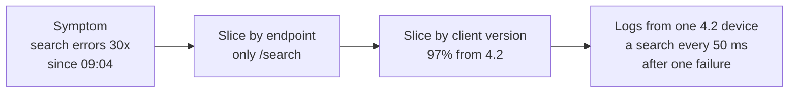

On Monday, version 4.2's retry loop started at 09:03. The first person at the job
board to know was a support agent reading a ticket at 09:20, from a recruiter
whose dashboard would not load. By then the search engine had been taking
hundreds of times its normal traffic for seventeen minutes.

Every component involved had the information at 09:04. The gateway was counting
requests per caller, the app servers were timing search calls, the search engine
knew its own queue depth. None of it was collected anywhere a person would see
it, and nothing turned it into a page.

> [!NOTE]
> Think first: you may add exactly one alert to this system, and it must have
> caught Monday by 09:05. Commit to what it measures before reading on - and why
> "search engine CPU above 90%" is the wrong answer even though it would have
> fired.

## Three signals, three questions

You cannot operate what you cannot see, and "see" means three different things:

| Signal | Answers | Shape | Cost |
|---|---|---|---|
| **Metrics** | *That* something is wrong, and how much | Numbers aggregated over time: request rate, error rate, latency percentiles | Cheap: storage grows with the number of series, not the traffic |
| **Logs** | *What* happened, in one event | One structured record per event, with whatever fields you chose to write | Grows with traffic; expensive to keep and search at volume |
| **Traces** | *Where* in the request path the time went | One tree of timed spans per request, across every service it touched | Grows with traffic; almost always sampled |

They are used in that order. A metric tells you search p99 jumped at 14:10.
A trace of one slow search tells you 2.2 of its 2.3 seconds went to one shard of
three. The logs from that span tell you what the shard was doing - here, retrying
reads from a failing disk.

```mermaid
gantt
    title Trace 7f3a - GET /search?q=remote+python, 2,310 ms total
    dateFormat x
    axisFormat %-S.%L s
    tickInterval 500millisecond
    section API Gateway
    receive and route            :0, 2310
    section App Server
    handle search                :3, 2306
    auth check                   :3, 8
    section Search Engine
    shard 1                      :8, 41
    shard 2                      :8, 2228
    shard 3                      :8, 39
    section SQL Database
    load matching listings       :2228, 2239
```

Note: shards 1 and 3 answered in about 30 ms and the database in 11. A search
latency metric says "search is slow"; only the trace says it is one shard, and
that the request waited on it alone (3.13's fan-out waits for its slowest).

A trace exists only because every hop passed one **trace id** along with the
request, usually in a header, and recorded its own span against it. The same id
written into every log line is what lets you pull all the logs for one request
across five services. A hop that drops the id breaks the tree there.

## Metrics: what to measure, and how to read it

Two checklists cover most of what is worth measuring:

- **For anything that serves requests - rate, errors, duration** (RED). Per
  endpoint, because "/search is failing" and "the site is failing" lead to
  different places.
- **For anything with finite capacity - utilization, saturation, errors**
  (USE). App slots in use, queue depth (3.17's), connections to the database,
  disk.

Duration is reported as percentiles, never an average - 1.1's p99 rule. A search
p50 of 40 ms with a p99 of 2 s is a system where one request in a hundred waits
fifty times longer, and the average reports roughly neither.

Each metric can carry labels - endpoint, instance, client version - and every
distinct combination is a separate series to store. **Cardinality** is the count
of those series. A client-version label adds dozens; a user-id label adds
millions and can take the metrics system down. Per-user detail belongs in logs
and traces, not metric labels.

## SLIs, SLOs and the error budget

An **SLI** (service level indicator) is a measured ratio of good events to total
events: the fraction of searches that returned a result in under 300 ms. An
**SLO** (objective) is the target for it over a window: 99.9% over 30 days.

The gap between 100% and the SLO is the **error budget**: 0.1% of 30 days is
about 43 minutes of failing searches a month. The budget turns reliability from
an argument into arithmetic. Budget left: ship features, take risks. Budget spent:
slow down deploys and spend the time on reliability. Monday's seventeen minutes
spent 40% of the month's budget before anyone noticed.

Pick SLOs from what users feel, per journey: searching, viewing a listing,
applying. Applying might warrant 99.95% and search 99.5% - the same per-flow
priority 3.24 used to shed load.

## What to alert on

The Think-first answer: alert on the **symptom a user feels**, not on a cause you
guessed in advance. "Search success under 300 ms dropped below the SLO" fires for
a slow disk, a retry storm, a bad deploy or a cause nobody has imagined yet.
"Search CPU above 90%" fires for some of those, also fires on a harmless reindex
at 03:00, and stays silent when search is failing fast at low CPU.

- **Page a person only for a symptom that is spending error budget fast** - the
  rate at which the budget is burning, not a single bad minute. With nearly every
  search failing, Monday burned budget about 1,000 times faster than sustainable;
  that pages within a minute.
- **Slow burns become tickets**, read the next working day.
- **Every page needs an action** someone can take. An alert that is routinely
  acknowledged and ignored trains people to ignore the next one, which is how a
  real page gets missed.
- **Cause metrics** - CPU, queue depth, connection counts - go on the dashboards
  you open *after* the page, to explain it.

## Localizing a fault

The method is the same narrowing every time: start at the symptom, slice it by
labels until one value stands out, then open a trace if the question is *where in
the path* or the logs if it is *who* or *why*. Monday's question was who.

Note: the step that found the cause was a label - client version - that someone
had chosen to record. A metric with no useful labels can say *that* and never
*where*.

## Trade-offs

| Choice | Buys | Costs |
|---|---|---|
| Rich metric labels | Faster narrowing during an incident | Cardinality: storage and query cost, a metrics system that can fall over |
| Log everything | Any question answerable later | Storage cost proportional to traffic; the useful line buried in noise |
| Trace every request | Every slow request explainable | Cost; so most systems keep a sample, and the slow request you need may not be in it |
| Tight SLOs | Problems caught early, users happier | Pages more often; less budget for shipping |

Sampling deserves its own line. Keeping 1 trace in 100, decided at the start of
the request, is cheap and blind to which requests turn out interesting. Deciding
*after* the request finishes - keep every error and every slow one, plus a
sample of the rest - catches what you need at the cost of buffering every trace
until it ends.

## What breaks

- **Monitoring that runs on the thing it monitors.** 2.2's Facebook outage:
  the tools to see and fix the problem were behind the same failing names.
  The dashboards and the paging path need to survive the outage they report.
- **Alerting on causes only.** Silence during the failure nobody predicted.
- **Averages.** They hide the tail where the outage lives.
- **A dropped trace id.** One service that does not propagate it splits every
  trace through it in two.
- **A user-id metric label.** The metrics system becomes the incident.
- **Silent work with no signal at all.** 3.19's nightly job that does not run
  produces no error to alert on; you alert on the success that should have
  appeared and did not.

## What changes at scale

At 10x, dashboards per service stop being enough; each user journey gets an SLO,
and alerts are defined against those rather than against machines.

At 100x, the volume of telemetry is itself a capacity problem. Logs are sampled
or kept for days instead of months, traces are sampled after the fact, and the
observability pipeline gets its own capacity plan, bulkheads and on-call.

At 1000x, no person reads a dashboard of ten thousand services. Automated
comparison - this deploy against the last, this region against the others - does
the first slice, and a person starts from its answer.

## In production

**Google** made the SLO and error budget the contract between product and
reliability teams: when a service exhausts its budget, feature launches for it
stop until reliability work brings it back. The cost is that a team can be
blocked from shipping by an SLO it agreed to, which is exactly what makes the
number taken seriously.

**Uber** built Jaeger, a distributed tracing system, when thousands of
microservices made a single request's logs impossible to join by hand. It
propagates a trace id through every hop and keeps a sample of traces. The cost is
that every service, in every language Uber runs, has to carry the id faithfully -
one that does not becomes a blind spot in every trace through it.

A two-person team needs RED metrics on its endpoints, structured logs with a
request id, and one or two symptom alerts on the flows that make money. Tracing
pays for itself once a request crosses more services than one person can hold in
their head.

## Common mistakes

- **A dashboard for every metric and no alert on the user's experience.**
- **Treating logs as the metrics system.** Counting errors by searching logs
  works at small scale and fails exactly when traffic spikes.
- **Paging on everything.** Alert fatigue is a reliability failure.
- **No owner for an alert.** A page nobody can act on is noise with a pager.

## In an interview

Medium relevance, and it separates senior candidates: most designs end before
anyone asks "how would you know it's broken?", and the candidate who raises it
unprompted at step 6 or 8 signals production experience. The Metrics Monitoring
project in Real World Extraction Tier 1 is this chapter built as a system.

What that sounds like at a senior level: *"I'd put an SLO on each journey that
matters - say 99.9% of searches under 300 ms over 30 days - and page on error
budget burn rate, not on CPU, so we're alerted on what users feel whatever the
cause. RED metrics per endpoint, labeled by region and client version but never
by user. Every request carries a trace id through every hop and into every log
line, and we keep all error and slow traces plus a sample of the rest. And the
monitoring and paging path runs somewhere that doesn't share a failure with
production."*

## Connections

1.1 introduced p99 because averages hide the requests that hurt; this chapter
makes that the default for every duration you record. 2.2 warned against
monitoring only the stops you own, and this is how you watch the ones you do.
3.17's queue depth and dead letter queue, 3.23's breaker state and 3.24's refused
requests are each a metric waiting to be recorded - every pattern in this group
produces a signal, and this chapter is where those signals go.

## Recap

- Metrics say *that*, traces say *where*, logs say *what*; use them in that order.
- RED for request paths, USE for capacity; percentiles, never averages; keep
  labels low-cardinality.
- SLI is the measured ratio, SLO the target, the error budget the gap - and the
  budget decides when to ship and when to fix.
- Page on symptoms burning budget fast, with an action attached; causes go on
  dashboards.

## Your turn

There is no canvas exercise in this chapter. Telemetry has no component on the
board - every component you place already emits it, and what you choose to
collect is configuration in a system the canvas does not draw. The knowledge
check is the exercise: each question hands you symptoms and what the dashboards
show, and asks you to localize the fault or choose the alert, the way the
narrowing above did.

## Next

3.26, Fault Tolerance. At 02:14 on Tuesday the error-budget alert fired within a
minute: the database holding applications had stopped answering. Observability
did its job - the on-call engineer knew immediately, and knew where. Then it
took forty minutes to decide by hand which copy of the data was safe to make the
new primary, and the old one came back halfway through.
