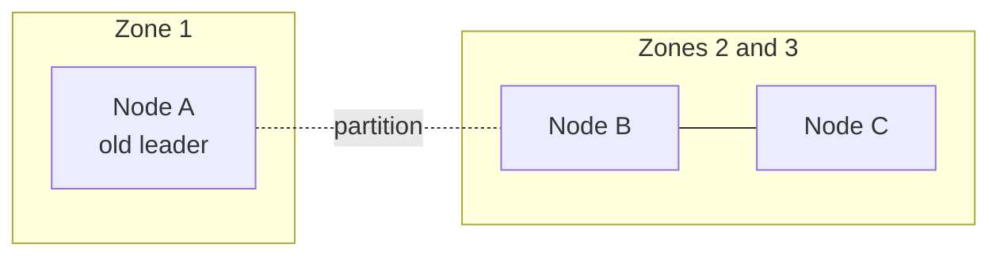

Tuesday, 02:14. The power supply in the applications database's primary failed,
and the alert from 3.25 fired within a minute. The read replica from 3.12 had
every write up to about 400 ms before the crash. Promoting it took forty minutes:
check how far behind it was, decide that was acceptable, repoint the app
servers, promote.

At 02:38, halfway through, the old primary rebooted. Two app instances still
pointed at it, and it still believed it was the primary, so it accepted their
writes. When the dust settled, 31 applications existed only on a machine that was
no longer the database.

> [!NOTE]
> Think first: the obvious fix is a script - promote the replica automatically
> when the primary misses three health checks. Commit to an answer before reading
> on: what does that script do the first time the network between the two
> machines drops for ten seconds?

## A role, not a machine

3.12 made copies of the data. It never said who decides which copy may accept
writes, because with one primary and an engineer on call, the answer was "the
engineer". That answer takes forty minutes, and it has to be made while the
machine in question may only be unreachable, not dead.

A **leader** is whichever node currently holds the right to accept writes; the
others are **followers**, which replicate from it and may serve reads. The
words name roles, not machines. Fault tolerance is the role moving to a healthy
machine without a person, without losing acknowledged writes, and without ever
being held by two machines at once.

The Think-first script fails the last condition. Ten seconds of network loss
looks identical to a dead primary from the replica's side. The replica promotes
itself, the primary never stopped, and both accept writes - **split brain**, the
Tuesday incident produced by automation instead of by hand. Two divergent
histories of the same data cannot be merged safely after the fact.

## Failover, step by step

<Walkthrough
  title="Losing the leader without losing the database"
  description="Three database nodes, a coordinator group and the app tier, through one failover."
  nodes={[
    { id: "app", kind: "component", componentId: "app-server", label: "App Server" },
    { id: "coord", kind: "component", componentId: "coordinator", label: "Coordinator group" },
    { id: "a", kind: "custom", icon: "database", label: "Node A", category: "distributed-systems" },
    { id: "b", kind: "custom", icon: "database", label: "Node B", category: "distributed-systems" },
    { id: "c", kind: "custom", icon: "database", label: "Node C", category: "distributed-systems" },
  ]}
  edges={[
    { id: "ask", source: "app", target: "coord", kind: "control" },
    { id: "write-a", source: "app", target: "a", kind: "request-flow" },
    { id: "write-b", source: "app", target: "b", kind: "request-flow" },
    { id: "lease-a", source: "coord", target: "a", kind: "control" },
    { id: "lease-b", source: "coord", target: "b", kind: "control" },
    { id: "lease-c", source: "coord", target: "c", kind: "control" },
    { id: "a-b", source: "a", target: "b", kind: "replication" },
    { id: "a-c", source: "a", target: "c", kind: "replication" },
    { id: "b-c", source: "b", target: "c", kind: "replication" },
  ]}
  steps={[
    {
      caption: "The App Server asks the Coordinator group who leads. The answer is Node A, for term 7, and every write goes to Node A.",
      focus: ["ask", "write-a"],
    },
    {
      caption: "Node A replicates each write to Node B and Node C, and acknowledges it once a majority - itself and one follower - has it.",
      focus: ["a-b", "a-c"],
    },
    {
      caption: "Node A holds its role on a lease the Coordinator group renews every second. At 02:14 Node A stops renewing: dead or unreachable, nobody can tell yet.",
      focus: "lease-a",
    },
    {
      caption: "After the election timeout, the Coordinator group picks the follower with the most recent data, Node B, and records it as leader for term 8. Node C agrees, so a majority stands behind it.",
      focus: ["lease-b", "lease-c"],
    },
    {
      caption: "The App Server's next request to the Coordinator group returns Node B, term 8. Writes go to Node B, which replicates to Node C. About three seconds have passed.",
      focus: ["ask", "write-b", "b-c"],
    },
    {
      caption: "Node A comes back still believing it leads term 7. It cannot renew its lease, and Node B and Node C refuse anything stamped with term 7. Node A rejoins as a follower.",
      highlightNodeIds: ["a", "coord"],
      highlightEdgeIds: ["lease-a"],
    },
  ]}
/>

Note: the role moved from Node A to Node B without any machine changing. The
cards are machines; the leader is a fact the Coordinator group records, with a
term number that makes an old leader's claim visibly stale.

Three mechanisms carry this, and you have met each one already:

- **Detection by lease.** The leader holds its role for a few seconds at a time and
  must keep renewing - 3.23's lock lease, applied to "who may write". A leader
  that cannot reach the coordinator group cannot renew, and stops accepting
  writes when its lease runs out, whether or not anyone else noticed.
- **Election by majority.** A new leader needs a majority to agree, through
  3.22's consensus group. A minority cut off by a partition cannot elect anyone,
  so at most one side of any split can have a leader.
- **Fencing by term.** Every election increments a term number, and nodes refuse
  writes from an older term - 3.23's fencing token, applied to leaders. This is
  what made Node A's return harmless.

## Why an odd number

Majority is what prevents split brain, so the size of the group decides how many
failures it survives:

| Members | Majority needed | Failures survived |
|---|---|---|
| 1 | 1 | 0 |
| 2 | 2 | 0 - worse than one, since either failing stops writes |
| 3 | 2 | 1 |
| 4 | 3 | 1 - same as three, with one more machine to fail |
| 5 | 3 | 2 |

An even member adds cost and a failure source without adding tolerance, and a
clean half-and-half split leaves neither side a majority. Three is the default;
five when you need to survive a failure during maintenance.

Note: during a partition, the side with Node B and Node C holds a majority (two of
three) and elects a leader. Node A, alone, cannot renew its lease and stops
accepting writes. Exactly one side can write.

Put the three members in three different failure domains - racks, or better,
availability zones - or one power failure takes the majority with it.

## The writes a failover can lose

Node B became leader with the most recent data *it had*. Whether that includes
every acknowledged write depends on 3.12's choice:

| Replication | Acknowledged when | On failover |
|---|---|---|
| Asynchronous | The leader alone has it | Writes from the last few hundred ms can vanish - the Tuesday replica's 400 ms |
| Majority (synchronous to one follower) | Leader plus one follower have it | Nothing acknowledged is lost, since the election picks a follower holding it |

The majority option is what makes "no acknowledged application is ever lost"
true, and it costs a follower's round trip on every write. Most systems that store
something a user was told is saved pay it.

## Graceful degradation

A failover is seconds, not zero. What the product does during those seconds - and
during the failures automation cannot fix - is a design decision made in advance:

- **Reads keep working from followers.** Listings a few hundred ms stale are
  3.22's AP-ish posture for data that tolerates it.
- **Writes wait or refuse clearly.** The apply button retries with its idempotency
  key (3.23), or says "try again in a moment" - never a silent loss.
- **Optional features turn off first.** Recommendations go static, search
  suggestions disappear; applying keeps working. 3.24's priority list, reused.

Partial service beats binary up or down, and it only exists if someone decided
which flows are essential before the incident.

## Trade-offs

| Choice | Buys | Costs |
|---|---|---|
| Short election timeout (200 ms) | Failover in well under a second | A garbage-collection pause or a network blip triggers needless elections, each a brief write outage |
| Long election timeout (10 s) | No false failovers | Ten seconds of refused writes on every real failure |
| Majority-acknowledged writes | No acknowledged write lost in a failover | A follower's round trip on every write |
| Members across zones | Survives losing a zone | Every majority write crosses zones, adding milliseconds |
| Five members instead of three | Survives two failures | More machines, and a slightly slower majority |

## What breaks

- **Two members.** A majority of two is two; losing either stops everything.
- **All members in one zone.** One power or network failure removes the majority.
- **An old leader with no fencing.** It returns, accepts writes, and Tuesday
  happens again.
- **Failing over on a single missed heartbeat.** A busy leader is declared dead,
  and the cluster spends its time electing.
- **Clients that cache the leader forever.** They keep writing to Node A after the
  term changed; they must ask again on any refusal.
- **Followers serving reads the product treats as current.** 3.12's lag, now with
  a failover making it briefly larger.

## What changes at scale

At 10x, every stateful tier - the database, the queue, the lock service - runs as
a three-member group across zones, and failover is tested on purpose, on a
schedule, instead of discovered at 02:14.

At 100x, data is sharded (3.13), so there are hundreds of groups, each with its own
leader, and a coordinator balances leaders across machines so no machine leads
too many.

At 1000x, whole regions fail. Cross-region failover adds 70-150 ms to every
majority write if the members span regions, so most systems keep each group in one
region and fail over regions as a separate, slower, more deliberate decision -
the step where GitHub's 2018 incident (2.2) went wrong, when automation promoted a
primary across the country after 43 seconds of network trouble.

## In production

**Amazon Aurora** stores six copies of every piece of data across three
availability zones and acknowledges a write once four of the six have it, so it
keeps accepting writes after losing an entire zone, and loses no data even if one
more copy fails on top of that. The cost
is that each write fans out to six copies, which Aurora offsets by sending only
the log record instead of whole pages.

**Kubernetes** keeps the state of an entire cluster in etcd, a Raft group, and
its operators are told to run three or five members, never two or four, for
exactly the arithmetic above. The cost they accept is that if a majority of etcd
members is lost, the cluster can keep running what it already runs but cannot
change anything until a person restores quorum.

A two-person team buys this rather than builds it: a managed database with
automatic failover across two zones is the leader, the followers and the
coordinator in one product. The decisions that stay theirs are the replication
mode and what the product does for the thirty seconds the failover takes.

## Common mistakes

- **Automating promotion without a majority.** The Think-first script: split
  brain on the first network blip.
- **Treating failover as instant.** Something must happen during the seconds it
  takes, and it should be designed.
- **Counting copies instead of failure domains.** Three copies in one rack are
  one copy against a rack failure.
- **Assuming no data is lost.** With asynchronous replication, some always can be.

## In an interview

High relevance at steps 6 and 8: "what happens when the database dies?" is the
most common follow-up in system design, and "kill the leader" is how an
interviewer checks whether you know what a replica does on its own (nothing).
Every Tier 2 and Tier 3 project in Real World Extraction asks it of at least one
stateful component.

What that sounds like at a senior level: *"The orders store runs as three nodes
across three zones, leader plus two followers, with leadership held on a lease
through a small consensus group. If the leader dies, the group elects the
most up-to-date follower in a few seconds; the old leader is fenced by term
number, so it can't accept writes when it returns. Writes are acknowledged by a
majority, so a failover loses nothing we told a customer was saved, and that
costs a cross-zone round trip per write. During the failover, browsing keeps
working from followers and checkout retries with its idempotency key."*

## Connections

3.12 taught replication as a mechanism - copies exist - and this chapter teaches
it as coordination: which copy may accept writes, and who decides. 3.22's
coordinator group and majority agreement are the decider; 3.23's lease and
fencing token are the two tools, reused for leadership instead of a job lock. And
3.25's alert got a person to the incident in a minute; this chapter is how the
system finishes recovering before that person has logged in.

## Recap

- A leader is a role: the one node allowed to accept writes, held on a lease.
- A new leader needs a majority, so at most one side of a partition can write;
  terms fence the old leader when it returns.
- Run an odd number of members, across failure domains: three survives one, five
  survives two.
- Asynchronous replication loses the last writes on failover; majority
  acknowledgement closes the gap for a round trip per write.
- Decide in advance what degrades during the seconds a failover takes.

## Your turn

The starter graph is the applications service with its data tier removed: the
hand-promoted primary-and-replica pair from Tuesday is gone. The comment on the
board is the incident.

Build a data tier where losing any one database machine means writes resume
within seconds with no person involved, two machines can never accept writes at
the same time, and the application tier always learns which machine to write to.
Before you submit, predict what happens on your board if you remove the machine
currently accepting writes - then check that your drawing says the same.

## Next

Checkpoint R2, Building a Complete Backend. Every group in Part 3 has now
answered one question about a system. R2 hands you a product with all of those
questions in it at once - including the ones nobody mentions until 02:14 - and
an empty canvas.
