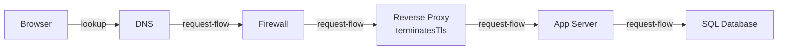

3.2 got the request an address to aim at. This chapter is about what happens
the instant it arrives there. 2.1 already drew this stop doing two jobs,
terminating TLS and forwarding inward, and 2.3 named Group A's pressure as
resolved, admitted, routed. Routed is this chapter.

Replace today's one app server with three, running a rewrite in a different
language, on different machines. If nothing sits between the outside world
and it, every client needs to learn the new addresses. If something does,
none of them ever notice.

> [!NOTE]
> Think first: if you doubled the number of app servers behind today's one
> public address, what would a client outside your network need to change?
> Commit to an answer before reading on.

## One address, many things behind it

A reverse proxy is the thing that makes the second answer to that question
"nothing." It sits in front of one or more backends and presents exactly one
address to the outside world; nobody outside ever learns how many machines,
or what's running on them, actually answer.

Note: everything left of the proxy decides whether and where a request
arrives; everything right of it is free to change shape without any of that
machinery noticing. DNS is drawn inline again so the canvas can validate the
chain - as in 3.2, the lookup is still a separate exchange beside the request
path, not a hop the request itself travels through.

## What happens when a request arrives

The proxy reads the request's host and path, matches it against its own
configured routing rules, and forwards to whichever backend those rules
name. Nothing about that decision is visible upstream - a client that asked
for `example.com/api` never learns which of possibly several machines
actually answered.

2.1 already worked the TLS side of this in full: the proxy is where the
handshake ends, and the trade-off (one certificate and readable internal
hops, against plaintext on your own network) was priced there, not here.
What's new is that TLS is only one of several jobs centralized at this one
stop. Compression and serving static files (images, scripts, anything that
doesn't change per request) are two more - work every backend would
otherwise duplicate, done once, in front of all of them.

The `reverse-proxy` component's `terminatesTls` field is 2.1's decision,
made concrete: on, and this is the box that ends the encrypted channel; off,
and encryption continues inward, which 2.1's own table already priced both
ways.

## What one front door buys, and what it costs

Buys: a backend that can be replaced, resized, or rewritten without a
single client-facing change, plus one place to patch, certify, and log
instead of many. Costs: every request now pays an extra hop, and the proxy
itself is a new single point of failure - if it goes down, so does
everything behind it, even if every backend is healthy.

Neither side of that is free, and neither disappears by adding more
proxies later (3.4 is what that actually takes) - for now, one proxy in
front of one backend group is the shape, and the trade-off is exactly as
stated above.

## When the front door can't reach what's behind it

2.2 already named DNS-down and firewall-blocked as failures nothing
downstream ever sees. This one looks different: the proxy itself answers -
often with a `502` or `504` - while everything behind it reports healthy,
because the proxy's configured upstream (an address, a port, a path) no
longer matches where the backend actually is. A deploy that moves the app
server, a typo in the proxy's own config, or a backend that's simply down
all produce the identical symptom from outside: the front door is up, and
whatever it's pointing at isn't answering.

## At scale, one box becomes the ceiling

At 10x traffic, one proxy in front of one backend handles it - the proxy
does far less work per request than the backend does. At 100x, or the
moment a second backend group exists, one proxy instance becomes the next
thing to run out of room, and "one proxy" stops being a safe assumption.

## In production

**Google** runs its Front End (GFE) as one address in front of nearly
every Google service: it terminates TLS and routes each request to the
specific internal service by hostname, so any one of those services can be
moved, rewritten, or replaced without a single client ever noticing. It's
the single-front-door pattern at the largest scale anyone runs it at.

## Common mistakes

- **Confusing reverse with forward.** A forward proxy stands in front of
  clients, hiding who's asking; a reverse proxy stands in front of servers,
  hiding what's answering. They solve opposite problems.
- **Letting one client reach a backend directly "just this once."** The
  moment any client knows a backend's real address, that backend stops
  being swappable - the whole point of the front door is that nothing
  outside ever learns it.
- **Treating the proxy as authentication.** It routes by host and path; it
  doesn't check who's asking or what they're allowed to do. That's a
  different layer's job.
- **Assuming one proxy scales by itself.** It centralizes work, it doesn't
  multiply capacity - more traffic than one instance can carry needs
  something new, not a bigger version of the same box.

## In an interview

This is loop step 4 (0.4), and it resurfaces at step 6 as exactly the
"502s but backends are healthy" scenario above - the interviewer is
checking whether you localize a failure to the right hop instead of
guessing at the backend first.

What that sounds like at a senior level: *"A 502 from the edge with
healthy backends means the proxy's own idea of where the backend is has
gone stale - I'd check its upstream config before I'd suspect the
application. And I'd keep auth and rate limiting out of this layer
entirely; this box's job is routing by host and path, not deciding who's
allowed through."*

## Recap

- A reverse proxy presents one address for whatever's behind it; nothing
  outside ever learns how many backends there really are or what they run.
- It centralizes TLS termination (priced in 2.1), compression, and static
  serving - work every backend would otherwise duplicate.
- The cost is a real one: an extra hop on every request, and a new single
  point of failure in front of everything it fronts.
- A healthy-backends-but-502-at-the-edge failure means the proxy's own
  upstream configuration, not the application, is wrong.

## Your turn

The starter graph carries 3.2's own chain - browser, DNS, firewall - plus
the app server and database, already wired to each other. Nothing connects
the firewall's output to the app tier yet. Add a Reverse Proxy, wire it
into that gap, and get a clean Validate before you Submit. Which specific
check fires until you do isn't previewed here.

## Next

3.4 Load Balancer picks up the moment one proxy instance stops being
enough - the same front door, now needing to be more than one machine. This
chapter drew the first line between the three front-door components: routing
lives here, authentication and rate limiting don't. 3.5 finishes that
separation.
