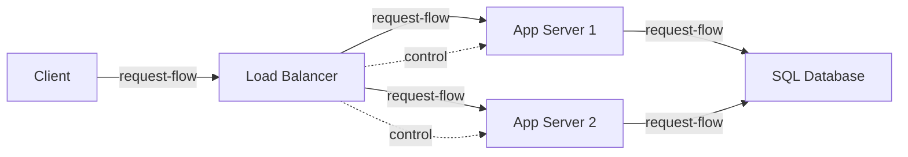

1.6 left you with one app-server instance and a warning: at 100x traffic it
runs out of headroom, and adding a second instance doesn't solve anything by
itself - something still has to decide which instance gets each request. You
now have that traffic. You add a second instance. Nothing routes between
them. Half your clients still point at the first server by habit, the second
sits idle, and the first is exactly as overloaded as before.

Two identical servers are not a scaling win until something distributes
requests across them and stops sending traffic to one that's stopped
answering. That something is a load balancer - the piece 1.6 named and
deferred.

> [!NOTE]
> Think first: you have two identical app-server instances and one client.
> What is the simplest rule you could use to decide which instance handles
> the next request? Commit to a rule before reading on.

## One address, many identical backends

A load balancer is a receptionist, not a decision-maker: it sees one address
from the outside, and behind it are several interchangeable instances that
can each answer any request equally well. Its two jobs are picking which
instance gets the next request, and knowing which instances are actually
alive to pick from.

Note: two edge kinds, not one. The solid `request-flow` edges carry actual
requests; the dashed `control` edges are the load balancer checking each
instance is still alive. Losing a `control` edge to an instance takes it out
of rotation without touching the request path to the other one.

## Picking an instance, and knowing who's alive

The simplest routing rule is round-robin: request 1 to instance A, request 2
to instance B, request 3 back to A, and so on. It costs almost nothing to
compute and is fair when every request takes roughly the same amount of
work.

Routing alone isn't enough - an instance can crash, hang, or run out of
memory without the load balancer noticing, and round-robin will keep sending
it a fair share of traffic anyway. A health check closes that gap: the load
balancer pings each instance on a short interval over a `control` edge, and
an instance that stops answering (or answers slow enough to count as sick)
gets pulled out of rotation immediately, before a real user hits it.

## Same rule doesn't fit every workload

Round-robin's fairness assumption breaks the moment requests aren't
uniform. A request that takes 30 seconds and a request that takes 30
milliseconds count as "one request" to round-robin either way, so an
instance can end up buried under several long-running requests while its
neighbor sits idle.

Least-connections fixes exactly this: send the next request to whichever
instance currently has the fewest requests in flight, not whichever is
"due" by rotation. It costs more to track (the load balancer has to keep a
live count per instance) and buys nothing when every request is already
short and uniform - round-robin is cheaper there and just as fair.

Neither algorithm is wrong. Round-robin fits uniform, fast workloads;
least-connections fits workloads with real variance in request duration.
Picking one is a config decision made against your own traffic shape, not a
default you leave alone.

## The load balancer is now load-bearing

Everything behind the load balancer can now lose an instance without a
user noticing - that's the entire point. But the load balancer itself is a
single component sitting in front of all of it: if it goes down, every
healthy instance behind it becomes unreachable at once, which is a worse
failure than losing any one app-server instance ever was. Production load
balancers are usually run in a redundant pair or as a managed service for
exactly this reason - the goal is never to remove every single point of
failure, it's to move it somewhere cheaper to make redundant.

At 10x today's traffic, round-robin and a couple of instances are enough.
At 100x, you're adding instances fast enough that health checks and
algorithm choice stop being tuning details and start being the difference
between "degraded" and "down" during a bad deploy.

## In production

Cloudflare's core product is this exact pattern, run at global scale: route
each request to a healthy nearby server, and pull sick ones out of rotation
automatically, across millions of domains at once. The underlying decision
is the same one this chapter teaches - the scale is just enormous.

## Common mistakes

- **Putting a load balancer in front of one instance.** It adds a hop and a
  new failure point without adding capacity or redundancy - validation
  calls this out directly.
- **Picking round-robin (the default) without checking whether the workload
  is uniform.** Long-tail request durations pile up unevenly under
  round-robin; least-connections exists for exactly that case.
- **Skipping health checks.** Without them, a load balancer spreads traffic
  across a dead instance exactly as confidently as a healthy one.
- **Treating the load balancer as immune to failure.** It's still a single
  component; it earns its resilience from redundancy or a managed provider,
  not from being called "the load balancer."

## In an interview

This is loop step 4 (0.4) again, one level deeper, and it feeds step 6
directly: "what happens when an instance dies?" is one of the most common
follow-ups to any multi-server design, and the honest answer is now yours to
give.

What that sounds like at a senior level: *"I'd put a load balancer in front
of at least two app-server instances, with health checks so a dead instance
gets pulled out of rotation automatically. I'd start with round-robin since
this workload is uniform - I'd only reach for least-connections if request
durations varied a lot. The load balancer itself is now a single point of
failure, so in production I'd run it redundant or use a managed one rather
than treat it as unkillable."*

## Recap

- A load balancer distributes requests across identical instances and
  removes unhealthy ones from rotation - both jobs matter; routing alone
  isn't load balancing.
- `control` edges (health checks) are a different kind of edge from
  `request-flow` - they carry liveness information, not user traffic.
- Round-robin and least-connections are both correct, for different
  workloads - the choice is config, not a default.
- The load balancer becomes the new single point of failure the moment it
  exists; redundancy has to move with it, not stop at it.

## Your turn

The starter graph has one load balancer routing to a single app-server
instance - the same cargo-cult shape the lesson just named: a load balancer
over one backend balances nothing. Run Validate, read what it reports, and
use that to decide what's missing. Add a second app-server instance, wire it
the same way the first one is wired, get a clean Validate, then Submit.

## Next

1.6 named this component and deferred it to this chapter; 1.7's "what breaks
first" methodology now applies to a real multi-instance system for the first
time, rather than the single point of failure 1.6 left you with.

Two instances behind a load balancer is a scaling win once - it stops being
one the moment you're adding instances by hand for every traffic spike. 3.8
Horizontal Scaling picks up exactly that problem.
