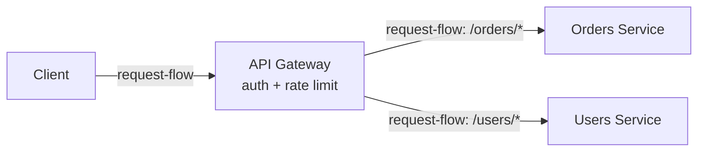

3.3 closed with a promise: "3.5 API Gateway, two chapters out, is where
reverse proxy, load balancer and API gateway - all three - finally get told
apart in one place; this chapter already drew the first line: routing lives
here, authentication and rate limiting don't." 3.4 filled in the middle word
of that promise: a load balancer spreads traffic across identical,
health-checked copies of one service. Neither chapter said what happens once
there's more than one service.

Orders and Users are two separate app-server groups now, built by two
different teams, each already load balanced the way 3.4 taught. Each team
adds its own login check and its own request cap, on its own schedule, in
its own style. One team enforces the rate limit before the expensive
database lookup; the other enforces it after. Nothing routes past either
check - the failure is that there are now two different checks, drifting
apart the moment either team touches their own code.

> [!NOTE]
> Think first: two services, one shared question - who's allowed to call
> this API, and how many times a minute. Where should that question get
> answered: inside each service, separately, or in one place both of them
> sit behind? Commit to an answer before reading on.

## One entry, one policy, many services

An API gateway is the client-facing policy layer: one place, in front of
however many services exist, that decides who's allowed in and how often -
before any specific service ever sees the request.

Note: one policy check happens once, before the fork - neither service
re-checks who's asking or how many requests they've already made.

## How a request actually gets through

The gateway reads the request and runs it against its own config before
forwarding anything. `requiresAuth` decides whether a request with no valid
credentials gets rejected right here, before it costs either service a
cycle. `rateLimitPerMinute` caps how many requests any one caller gets,
checked once, not once per service. A request that passes both gets matched
to whichever service its path names and forwarded - Orders and Users each
receive only traffic the gateway already vetted.

## Three components, three jobs

| Component | Fronts | Decides | Doesn't do |
|---|---|---|---|
| Reverse proxy (3.3) | One backend group | Which host or path gets forwarded, TLS | Auth, rate limits, spreading load |
| Load balancer (3.4) | Identical instances of one service | Which healthy instance gets this request | Auth, rate limits, routing between different services |
| API gateway (3.5) | However many distinct services exist | Who's allowed in, how often, which service | Spreading load across one service's own instances |

None of the three replaces either of the others. A service behind the
gateway with more than one instance still needs its own load balancer - the
gateway decides which service, the load balancer decides which copy of it.

## What centralizing policy buys, and what it costs

Buys: one place to patch when the auth scheme changes, one rate-limit config
instead of a dozen slightly different ones, and every service behind it can
assume both checks already happened. Costs: a new hop on every request, and
the widest blast radius of the three front-door components in this
curriculum - a reverse proxy outage costs one backend group; a gateway
outage costs every service behind it, at once, because every one of them
sits behind the same policy check.

## When the gateway itself is the problem

Two related failures, both invisible from behind the gateway. The gateway
goes down entirely: every service it fronts is now unreachable, even though
each one is individually healthy - a wider version of 3.3's 502 story,
correlated across every service instead of confined to one. The gateway's
own config is wrong instead: a `rateLimitPerMinute` set too low throttles
legitimate traffic across every service at once; `requiresAuth` set to
`false` where it should be `true` lets unauthenticated traffic reach every
service behind it, not just one. A single bad value here now has the blast
radius of the whole system it fronts.

## At scale, the gateway becomes the shared ceiling

At 10x, one gateway instance does less work per request than any one
service does, so it's not the constraint. At 100x, or the moment a third and
fourth service exist, the gateway is doing that lightweight work for every
request in the entire system, not one service's share of it - it becomes
the shared ceiling before any individual service does.

## In production

Uber's edge runs a single gateway in front of thousands of internal
services, centralizing authentication once so no individual service
reimplements its own check. It applies once an organization has enough
services that duplicating the same policy check stops being a rounding
error. The trade-off: every one of those thousands of services now depends
on the gateway's own availability, not only its own.

## Common mistakes

- **Confusing the gateway with a load balancer.** A service behind the
  gateway with more than one instance still needs an LB of its own - the
  gateway decides which service, not which copy of it.
- **Confusing the gateway with a reverse proxy.** A proxy has no policy
  logic at all; describing it as "handling auth" is describing this
  chapter's component, not 3.3's.
- **Adding a gateway for one service, one client, and no policy to
  centralize.** It's a hop with nothing behind it to buy.
- **Treating the gateway as exempt from the reliability story every
  front-door component in this curriculum tells.** It carries the widest
  blast radius of the three, not the narrowest.

## In an interview

This is loop step 4 again, and the perennial follow-up: "gateway vs. load
balancer?" A vague answer here reads as not actually knowing either
component's job.

What that sounds like at a senior level: *"A load balancer spreads traffic
across identical copies of one service - it doesn't know or care what the
request is asking for. An API gateway is the client-facing policy layer in
front of however many services exist - it decides who's allowed in and how
often, then routes by service, not by instance. I'd add a gateway once
there's more than one service, or a policy that needs to be enforced the
same way across all of them; with one service and no shared policy, it's a
hop that buys nothing."*

## Recap

- An API gateway is the client-facing policy layer: authentication and rate
  limiting applied once, in front of however many services exist, before
  any one of them sees the request.
- It differs from a reverse proxy (no policy logic, one backend group) and a
  load balancer (identical instances of one service, no policy logic) - the
  three can coexist, each doing exactly one job.
- Centralizing policy buys consistency and one place to patch; it costs a
  new hop and the widest blast radius of the three - a gateway failure costs
  every service behind it, not one.
- A gateway fronting one service with no shared policy to enforce is a hop
  that resolves nothing.

## Your turn

The starter graph carries 3.3's own chain - browser, DNS, firewall, reverse
proxy - already wired to each other, plus an app server wired to a
database. Nothing connects the reverse proxy's output to the app tier yet.
Add an API Gateway, wire it into that gap, and get a clean Validate before
you Submit. Which specific check fires until you do isn't previewed here.

## Next

Group A is complete: five chapters teaching the request everything it
passes through before your own code ever sees it. Every app-server instance
behind that front door, whether reached through a load balancer's identical
copies or a gateway's distinct services, has been treated as interchangeable
without ever saying why that has to be true. 3.6 Stateless Services names
the assumption Group A has been quietly making the whole time.
