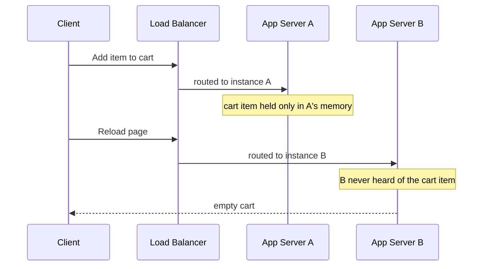

3.5 closed by naming what Group A had been quietly assuming: every app-server
instance behind a load balancer's identical copies, or a gateway's distinct
services, gets treated as interchangeable. Nobody said why that has to be
true.

Say it isn't. A user adds an item to their cart. The load balancer sends that
request to instance A, and A holds the addition in its own memory - the
fastest place to put it, since the alternative is a database round trip
nobody asked for yet. The user reloads the page. Same load balancer, same
policy, no promise it ever made about landing on A twice - the request goes
to instance B. B has never heard of the cart. The item is gone.

> [!NOTE]
> Think first: the load balancer never promised two requests from the same
> user would hit the same instance - only a healthy one. What would have to
> be true about instance A and instance B for that not to matter? Commit to
> an answer before reading on.

## Any instance, same answer

A service is stateless when any instance can answer any request, because
nothing about the response depends on what a specific instance remembers
from an earlier one.

Note: the load balancer's routing decision is the same both times - "any
healthy instance." What changed is that the second request needed the first
one's memory, and had no way to get it.

## What's actually not allowed to be local

Statelessness doesn't mean an instance holds nothing in memory - only that
nothing it holds changes what the *next* request from anyone is entitled to
see. A cache of a slow-to-compute value is fine to keep local: if instance B
never learned it, B just recomputes it, a little slower, same answer. A cart
addition, a login, a half-finished multi-step form - real state, all of it -
is not fine to keep local, because the next request might not land on the
instance that remembers it, and the user gets the wrong answer, not just a
slow one.

The database was never the issue. It's real, shared state every instance
already reaches identically - that's the whole reason it exists (1.2). The
instances themselves are what have to hold nothing but throwaway,
recomputable memory.

## Where does it go, then

Two roads, and this chapter only states the fork - 3.7 builds the second one
properly. Pin a user's repeat requests to the instance that first served
them (session affinity, "sticky" routing) and the cart survives a reload
without moving a byte - but that re-couples the user to one instance: lose
it, and everyone pinned to it loses their state too. Or move the state out
of the app tier entirely, into something every instance reaches the same
way the database already is - correct under load balancing, at the cost of
a new hop on every request that touches it.

## Why this is worth the constraint

At 10x traffic the payoff barely shows - you were adding an instance either
way. At 100x, or the moment autoscaling reacts to a spike on its own, it's
the whole reason that's safe: a newly started instance can take real traffic
immediately, because there's nothing it needs to have learned first. A
service that kept anything load-bearing in local memory can't scale out this
way - a new instance would be wrong for anyone whose state lived on an
older one.

## In production

Stripe's API tier runs as a fleet of interchangeable instances behind a load
balancer - any of them can pick up any request, so handling a spike (a
launch, a big sale day) is adding servers, not planning which one takes
which customer. The cost: every piece of state a request might need - who's
calling, what they've already done - has to already live somewhere every
instance reaches identically, which is infrastructure Stripe runs and pays
for regardless of how few instances happen to be up at a given moment.

## Common mistakes

- **Keeping anything request-deciding in local memory and hoping the load
  balancer keeps sending the same user back.** It doesn't promise that, and
  even a policy that mostly does breaks the moment an instance restarts or a
  new one is added.
- **Treating "stateless" as "no state exists anywhere."** The database is
  real state, reached identically by every instance - that's not what this
  chapter is warning about.
- **Panicking about a local cache of a recomputable value.** Losing it costs
  a slower answer, not a wrong one - not everything in an instance's memory
  is the kind this chapter means.
- **Assuming pinning a user to one instance fully solves the problem.** It
  buys time, not a fix - 3.7 covers what it costs.

## In an interview

Loop step 4 vocabulary, and it surfaces every time scaling the compute tier
comes up: "stateless" gets used as a checkbox term, and a vague answer here
reads as not having actually thought about what's sitting in an instance's
memory.

What that sounds like at a senior level: *"Any instance has to be able to
answer any request, so nothing a request depends on can live only in the
memory of the instance that handled the last one. If something does - a
session, an in-progress action - it either gets pinned to one instance,
which reintroduces a single point of failure for whoever's pinned, or it
moves into a shared store every instance reaches the same way. I'd default
to the shared store and only pin as a stopgap."*

## Recap

- A service is stateless when any instance can answer any request - nothing
  in the response depends on which instance handled an earlier one.
- Local memory isn't banned; only request-deciding memory is. A recomputable
  cache is safe to lose; a cart addition or login is not.
- Pinning a user to one instance patches the symptom without removing the
  coupling; moving the state out removes it, at the cost of a new hop - 3.7
  builds that properly.
- This is what makes "just add an instance" safe at 100x and under
  autoscaling - a new instance is never behind on anything it needs to know.

## Your turn

The starter graph is the system as built through 3.5: browser, DNS,
firewall, reverse proxy, API gateway, load balancer, one app server, one
database - all correctly wired, nothing missing. The one thing wrong is a
number: the app server's own Instances field is still 1, so the load
balancer in front of it is exactly the pass-through 3.4 warned about. This
chapter's fix is a number, not a shape - open the app server's config panel
and raise Instances. Don't add a second node; that's 3.4's fix, not this
chapter's. Get a clean Validate, then Submit.

## Next

3.6 named the constraint copies of the app tier run under: nothing a request
depends on may live in only one instance's memory. 3.7 Sessions & State
Management builds the missing half - where the displaced state actually
goes, and what pinning it costs versus moving it.
