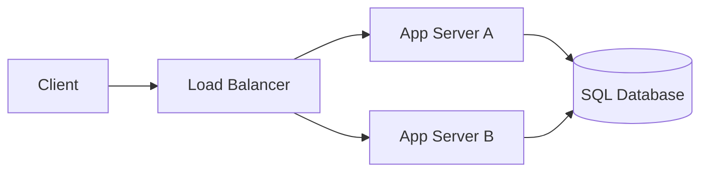

3.6 named the fork without walking either road: pin state to the instance that
first saw it, or move it out where every instance can reach it the same way.
Both are real answers. Neither is free.

Say you reach for the first instinct - it needs no new component, just a
routing decision. Configure the load balancer to send a user's repeat
requests back to the same instance, and the cart from 3.6 survives a reload
without moving a byte. It works right up until that instance restarts for a
deploy, fails a health check, or an autoscaler prunes it under low traffic.
Every user pinned to it loses whatever it was holding, all at once, with no
warning.

> [!NOTE]
> Think first: sticky routing fixes 3.6's reload-loses-cart bug without
> moving a single byte of state anywhere. What did it just cost you that the
> load balancer used to give you for free? Commit to an answer before
> reading on.

## Pin it, or move it

Sticky sessions keep the promise a stateless instance broke. Externalizing
keeps the guarantee load balancing depends on.

Note: both instances read and write the same database row for a given
session. Which one happens to serve a request stops being something either
instance's answer depends on - the load balancer's routing decision is free
to be whatever it wants again.

## How each one actually works

Sticky routing is a change to the load balancer's decision, not to where
data lives: it keys its choice on a stable client identifier - a cookie it
sets, or a hash of the client's address - and replays the same instance
every time that key repeats. Nothing about the session data itself moves;
the instance still holds it in memory, exactly as in 3.6. The load balancer
has just promised to stop distributing that one client's traffic.

Externalizing changes where the data lives instead. The app server already
writes business data to the SQL database on every request - that connection
has existed since 1.2. Routing session reads and writes through that same
connection costs no new component and no new edge: the fix is reusing
machinery already in the system for a second job, not building new
machinery.

## Two products, two right answers

| Product | Traffic pattern | Right call | Why |
|---|---|---|---|
| Internal admin console, ~15 employees | Fixed, predictable, never autoscales | Sticky is a defensible stopgap | An instance dying mid-incident logs out a handful of employees, not the business |
| Consumer checkout flow | Bursty, autoscales aggressively | Externalize | Autoscaling changes which instances even exist faster than any affinity table can track - sticky keeps going stale |

Both costs are real, stated both ways. Sticky costs even load distribution
and clean failover - a busy user pins load unevenly, and an instance's death
logs out everyone pinned to it. Externalizing costs a network hop on every
request that touches a session, and it changes *what* breaks: lose one
instance under sticky routing and only its pinned users notice; lose the
shared database and every session, everywhere, goes with it at once. Moving
state out doesn't remove the risk - it concentrates it.

## What changes at scale

At 10x, sticky mostly holds - the affinity table is small and instances
rarely churn. At 100x, once autoscaling is reacting to real spikes on its
own, sticky's assumption breaks structurally: instances start and die faster
than any pinning scheme can track, and each death evicts a slice of live
sessions. Externalizing scales cleanly on the app-tier side, but the
database is now doing double duty - business data and every instance's
session traffic - which is exactly why 3.14 introduces a store built for
this specific job. Not needed yet; the SQL database this chapter already
requires is enough for what this system does today.

## In production

Shopify's application servers are stateless behind a load balancer - cart
and session data live in a shared datastore every server reaches
identically, not in whichever server happened to answer first. That's what
lets Shopify add capacity during a flash sale without anyone asking which
server a given shopper's cart is sitting on; the cost is that the shared
store, not any one server, is what has to hold up when checkout traffic
spikes hardest.

## Common mistakes

- **Treating sticky sessions as a full fix rather than a stopgap.** It buys
  time by re-coupling a user to one instance's uptime - the same coupling
  statelessness was supposed to remove.
- **Assuming externalizing means adding a new component.** It doesn't - the
  database connection already required for business data does the job.
- **Declaring victory once state is "somewhere shared" without asking what
  that concentrates.** A shared store outage now takes every session down at
  once, not just one instance's share.
- **Picking one answer for every product.** The right call is read off a
  product's traffic and failure profile, not memorized as a universal rule.

## In an interview

High relevance - "why not just use sticky sessions?" is the classic
follow-up the moment a candidate claims their services are stateless, and a
dismissive answer reads as not having thought through the cost either way.

What that sounds like at a senior level: *"Sticky sessions buy you zero new
infrastructure today, but they reintroduce the single point of failure
statelessness was supposed to remove - lose that instance, and everyone
pinned to it loses their session. I'd default to externalizing into a store
the app tier already reaches for other data, and only reach for sticky
routing as a short-term stopgap before that migration lands."*

## Recap

- Sticky routing is a load-balancer decision (pin by client identity); it
  doesn't move data, it re-couples a user to one instance's uptime.
- Externalizing moves the data instead - reusing the database connection
  already required for business data, not new machinery.
- Neither removes risk, each relocates it: sticky risks per-instance loss,
  externalizing concentrates all sessions behind one shared dependency.
- The right call depends on the product's traffic and failure profile, not
  on a universal rule - 3.14 gives externalizing a faster, purpose-built
  store once this system's traffic justifies it.

## Your turn

The starter graph is the system as built through 3.6 - two Application
Server instances behind the load balancer, everything upstream correctly
wired. The SQL Database is on the canvas but disconnected: no edges in or
out. That's this chapter's fault, and it's a wire, not a config field -
there is no sticky-session toggle anywhere on this canvas to look for.
Connect the Application Server to the SQL Database with a request-flow edge,
the same kind of connection 1.2 first taught, so sessions are externalized
into the store this system already requires. Get a clean Validate, then
Submit.

## Next

3.7 answered where displaced state goes. 3.8 Horizontal Scaling picks up the
other half of 3.6's own cliffhanger: two app-server instances exist, but
nothing yet decides how many should, or what happens when one dies while
serving a request.
