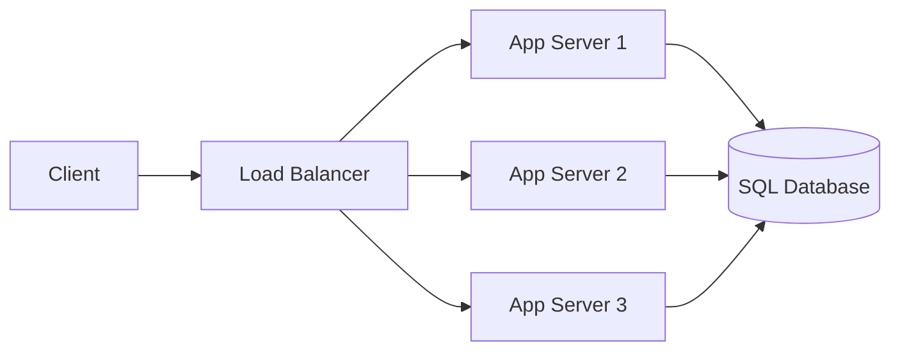

3.7 answered where displaced state goes. Two Application Server instances have
existed since 3.6, routed by the load balancer 3.4 built for exactly this
shape. Neither chapter said how many, or what happens the moment one of them
stops answering.

Traffic keeps growing. At some point the two instances you have are pegged at
peak, and the obvious first move is to make the box bigger - more CPU, more
RAM, same one instance. It works. Latency drops back down, the on-call page
stops. Then the next growth spurt hits the same ceiling, on a machine that's
already about as big as anyone will sell you - and the whole time, it's been
one box: lose it, and there's nothing behind it to answer instead.

> [!NOTE]
> Think first: you can make the existing instance bigger, or add more
> instances the same size. What's different about how each approach
> eventually runs out? Commit to an answer before reading on.

## A bigger box, or more of the same box

Vertical scaling buys a bigger box. Horizontal scaling buys more of the same
box. One has a ceiling and a single point of failure built in; the other has
neither, at the cost of the coordination 3.4 and 3.6 already paid for.

Note: the load balancer has been able to route to any number of identical
backends since 3.4. Horizontal scaling changes how many boxes sit behind it,
not the shape around them.

## Why duplicating is a number, not a project

Adding a third instance behind an already-load-balanced, already-stateless
tier needs no new component and no new edge. The load balancer already
splits traffic across however many backends exist (3.4); statelessness
already guarantees any of them gives the same answer to the same request
(3.6). What used to be true of one instance is now true of three - the fix
is raising a config field, not redesigning anything.

What makes this safe operationally, not just structurally, is the load
balancer's own health checking, the same mechanism 3.4 named. It's the
reason a dead instance stops receiving traffic without anyone paging in a
fix by hand - though it isn't instant: the load balancer notices on its next
check, not the moment the instance actually dies. `control`-kind edges
depict health checking in diagrams throughout the curriculum, but it isn't a
wire you can draw on canvas yet - real and load-bearing here, just not
something the palette exposes.

## How many is enough

Say this service peaks at 300 requests per second, and load testing shows
one instance holds up to 150 before latency climbs - the same
back-of-envelope habit 1.1 built, now aimed at a config field instead of an
architecture sketch. Two instances covers peak exactly, with nothing spare.
Lose one and the survivor is carrying 300 on a machine tested to 150 - a
guaranteed overload, arriving exactly when reliability matters most. A third
instance changes that: lose any one, and the remaining two still cover 300
combined. That's N+1 - size for the load, then add one more so a single
failure doesn't put you under it.

## Both directions are real

A bigger box is genuinely the simpler operational choice for a small,
predictable workload - no load balancer to run, no health checks to reason
about, one thing to monitor instead of several. Its cost is structural: no
machine is 100x bigger than a normal one, so growth eventually runs out of
room to buy, and until that day it stays a single failure domain - lose the
one box, lose everything behind it. Horizontal scaling has neither limit,
but it isn't free either: it only works because 3.6 made every instance
interchangeable and 3.4 already built something to route across them. Pick
vertical without a stateless tier or a load balancer in place and there's
nothing to duplicate into.

## What changes at scale

At 10x, instance count is still a number a load test justifies by hand, the
same reasoning this chapter's exercise uses. At 100x, or the moment
autoscaling starts reacting to load on its own, hand-picking that number
stops working - instances start and stop faster than anyone is watching, and
something has to track which ones are actually alive right now. That's not
this chapter's problem to solve.

## In production

Netflix's streaming backend runs as a large fleet of small, identical,
stateless instances behind load balancing, not a handful of large ones -
capacity changes by resizing the fleet, and losing any single instance,
which happens constantly at that scale, is a routine health-check event
absorbed by the survivors, not an incident anyone gets paged for.

## Common mistakes

- **Reaching for a bigger box because it's operationally simpler, without
  naming the ceiling it eventually hits.** Fine as a choice for the right
  workload; not fine as a choice made without knowing the trade.
- **Sizing instance count for today's average load with nothing spare.**
  Passes every check until the day one instance actually goes down.
- **Treating "add an instance" as new engineering work.** With 3.4 and 3.6
  already in place, it's a config change, not a project.
- **Assuming the load balancer reacts to a dead instance instantly.** It
  reacts on its next health check, not the moment the instance dies - a real
  gap, not a bug.

## In an interview

High relevance - steps 4 and 7. "How would you scale this?" is asked in
nearly every design interview, and an answer that jumps straight to "add
more servers" without naming what forces that choice, or how many, reads as
reciting a term rather than reasoning about one.

What that sounds like at a senior level: *"I'd add instances rather than
size up the box - a bigger machine still hits a ceiling and stays a single
point of failure. Since the tier is stateless and already load-balanced with
health checks, scaling out is a config change: I'd size the count off
measured per-instance capacity, plus one spare, so losing any single
instance under load doesn't drop us below what's needed."*

## Recap

- Vertical scaling buys a bigger box; horizontal buys more of the same box -
  one hits a hardware ceiling and stays a single point of failure, the other
  doesn't, at the cost of the load-balancing and statelessness it depends on.
- Duplicating a stateless instance behind an existing load balancer is a
  config change, not new architecture - 3.4 and 3.6 already did the real
  work.
- Health checks are what make losing an instance a blip instead of an
  outage, but they react on the next check, not instantly.
- Size instance count for measured load, then add one more (N+1) so a single
  failure doesn't drop capacity below what's needed.

## Your turn

The starter graph is the system as built through 3.7 - every edge already
wired correctly, including the Application Server's connection to the SQL
Database. Validate is already clean; nothing here is broken. The Application
Server is configured at Instances: 2, which is exactly enough for this
service's stated 300 requests/second peak at 150 tested per instance - and
exactly enough is the problem. Raise Instances until losing any single
instance still leaves the survivors covering peak load, then Submit.

## Next

Once instance count stops being a number you pick by hand - once autoscaling
is adding and removing them on its own - something has to track which
instances actually exist right now. 3.9 Service Discovery is that system.
