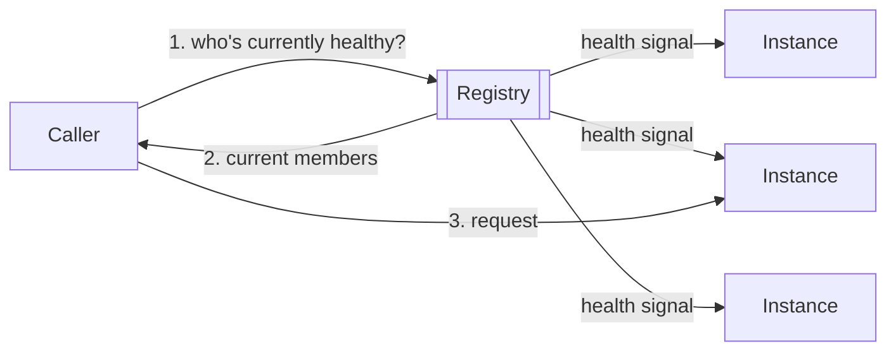

3.8 ended on a bridge: once autoscaling starts adding and removing instances on
its own, hand-picking an instance count stops working, because nothing is left
to track which instances currently exist. That's this chapter's problem.

Every request that reaches the load balancer already depends on an answer to
"which backends are alive right now" - the load balancer has been computing
that answer since 3.4, refreshed by its own health checks. What's new here is
generalizing that answer into a pattern that shows up anywhere one service
needs to find another whose membership isn't fixed - not just the app tier
behind one load balancer, but any service calling any other service in a
system built from more than one internal service.

> [!NOTE]
> If the load balancer already knows which backends are alive, what's
> actually new about giving that its own chapter instead of folding it into
> 3.4? Think about what happens once there's more than one internal service,
> not just one client-facing tier. Commit to an answer before reading on.

## Membership, not connectivity

Service discovery answers a different question than routing does: not "how
do I reach it" but "who currently counts as it."

Caption: the registry, not the caller, tracks who's currently healthy -
membership updates on a health signal, not on someone editing a list by hand.

## The load balancer already does this, for one tier

3.4's load balancer has been running exactly this pattern since it was
introduced: poll every backend, drop the ones that fail their check, route
only to the survivors. That's a registry with the caller and the lookup built
into the same box - no separate component needed, because there's only one
tier asking the question. The pattern needs its own name and its own chapter
once more than one internal service needs the same answer, which is beyond
what this system's shape requires today - no new component belongs on the
canvas for it yet.

The health signal behind this is the same `control`-kind edge 3.4 introduced.
It's still real and still not something you can wire on canvas (checked
directly against every registry component's own `relations` field) - shown
here in diagrams and prose only, the same disclosed gap 3.4 and 3.8 already
named.

## Two ways to answer "who's current"

| Strategy | How it stays fresh | Cost |
|---|---|---|
| Health-check-driven (the load balancer, since 3.4) | Actively polls; drops a failing backend within one check interval | Polling load, plus a short grace window before a dead instance is actually removed |
| TTL-driven (DNS, since 3.2) | Caches an answer for `ttlSeconds`, then re-asks | Cheap per lookup, but a stale answer can survive for the full TTL |

This system already runs the second kind: DNS's own `ttlSeconds`, sitting
between the browser and this stack's public address. A low TTL narrows the
staleness window at the cost of more lookups hitting DNS - the exact trade
3.2's own DNS docs already state, now load-bearing instead of incidental.

## What it costs to get this wrong

A registry (or a load balancer acting as one) becomes the one thing every
caller asks "who's alive" - if it goes down, everything routing through it
goes down with it, a new single point of failure introduced by solving the
old one. A TTL set too loose isn't a crash; it's quiet staleness that only
shows up as "some requests reach something that isn't there anymore,"
discovered by a confused user, not an alert.

## What changes at scale

One person can eyeball a handful of instances and know which are alive.
Past that, or the moment autoscaling reacts to load without anyone in the
loop - 3.8's own bridge into this chapter - nobody can keep that list current
by hand. Discovery stops being optional exactly then.

## In production

Airbnb's internal service fleet outgrew a hand-maintained list of addresses
faster than anyone could update it, so they built SmartStack: every service
registers itself and is health-checked continuously, with the current,
healthy set of addresses pushed to everyone that needs it. The trade they
accepted knowingly: that registry (backed by ZooKeeper) is now critical
infrastructure of its own, and it has to stay up for anything else to find
anything else.

## Common mistakes

- **Hardcoding instance addresses once autoscaling exists.** Correct on day
  one, wrong within the first scale-up or scale-down.
- **Setting a freshness window (TTL or check interval) looser than how fast
  membership actually changes.** Passes on a quiet day, fails the moment
  churn picks up.
- **Treating "passed a health check once" as "healthy forever."** Readiness
  can regress without liveness ever failing - the check keeps saying yes
  while the app itself is broken.
- **Running a registry with no redundancy of its own.** The one component
  whose failure takes down everyone's ability to find anyone.

## In an interview

Medium relevance. It surfaces as a follow-up once a design has more than one
internal service: "how does service A find service B once B's instances
change?"

What that sounds like at a senior level: *"Once there's more than one
internal service, hardcoded addresses don't survive the first autoscaling
event or deploy. I'd put a registry, or a lightweight DNS-based equivalent,
between callers and instances, driven by health checks so membership
reflects who's actually alive - and I'd size its freshness window against how
fast the fleet actually churns, not a default someone left in place."*

## Recap

- Service discovery answers "who currently counts as this service," not "how
  do I route to it" - a question that only gets harder as instances start and
  stop on their own.
- The load balancer has already been solving this for one tier since 3.4;
  the general pattern (a registry, health-driven membership) is what's needed
  once more than one internal service needs the same answer.
- Health-check-driven freshness (near-immediate, costs polling) and
  TTL-driven freshness (cheap, costs a staleness window) are two different,
  legitimate strategies for the same problem.
- A registry becomes a new dependency everything else routes through - it
  has to be reliable enough to earn that trust.

## Your turn

This system's public DNS record still carries the 300-second default TTL set
back in 3.2 - reasonable for an address that never changes. It's about to:
ops is cutting the whole stack over to new infrastructure during a planned
deploy with a 30-second downtime budget. Anyone who resolved the old address
in the last five minutes keeps hitting it until their cached answer expires -
a staleness window ten times longer than the cutover itself. Lower the DNS
node's `ttlSeconds` until it can't outlast the deploy's own downtime budget,
then Submit. Validate is already clean here; nothing is wired wrong.

## Next

Every service you've built so far ends at the same place: one SQL Database,
taken for granted since 1.2. 3.10 Databases is where that assumption finally
gets examined - what it actually guarantees, and why disks shape everything
built on top of them.
