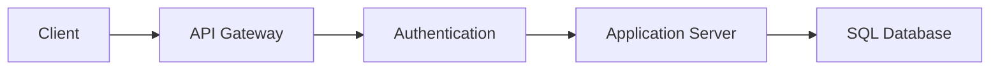

# API Gateway

A centralized networking component that acts as a single entry point for 
all client requests destined for a collection of microservices.

## What is it?

The API Gateway mediates communication between external clients and 
internal backend services. It provides a unified interface, shielding 
consumers from the complexity and evolution of the underlying microservice 
architecture. Instead of clients needing to know dozens of individual 
service endpoints, they interact with a single, consistent entry point 
managed by the gateway. This pattern decouples client development from 
service implementation details, centralizing concerns like authentication, 
rate limiting, and request transformation.

## Why do we need it?

In distributed systems composed of many small services (microservices), 
exposing each service endpoint directly creates significant management 
overhead and security risk. The API Gateway addresses the problem of 
cross-cutting concerns—logic that needs to be applied to every request but 
belongs nowhere specific. Without a gateway, common tasks like enforcing 
rate limits, validating JSON schemas, or handling token introspection must 
be replicated across dozens of services, leading to inconsistency, 
maintenance debt, and increased latency.

## How does it work?

The API Gateway manages the ingress flow by accepting external HTTP 
requests and directing them internally using defined routing rules. The 
process generally follows these steps:

1.  **Ingress:** A client sends a request (e.g., `POST /v2/users`) to the 
gateway's public endpoint.
2.  **Policy Enforcement:** The gateway intercepts the request and 
executes pre-configured logic. This includes validating API keys, checking 
JWT tokens for expiration or scope, and applying rate limiting checks 
against consumer quotas.
3.  **Transformation & Routing:** If validation succeeds, the gateway 
transforms the request (e.g., changing HTTP headers or translating the URL 
path) and resolves it to the correct internal service cluster address.
4.  **Forwarding:** The gateway forwards the cleaned request payload over 
the network fabric to the target microservice instance, often employing a 
circuit breaker pattern to handle upstream failures gracefully.

## Architecture Diagram

## Common Configurations

| Configuration | Description |
| :--- | :--- |
| **Request Routing** | Maps external paths (e.g., `/v1/users`) to 
internal service names and ports. |
| **Authentication Scheme** | Specifies the required mechanism (e.g., JWT 
validation, API Key lookup) for request authorization. |
| **Rate Limiting Policy** | Defines thresholds (e.g., 100 request
requests/minute) and strategies (e.g., Leaky Bucket, Token Bucket). |
| **Request Transformation** | Allows modification of HTTP headers or 
payload bodies before forwarding the request to the backend service. |
| **Circuit Breaker Settings** | Configures thresholds (failure pe
percentage, delay time) that trigger fallback mechanisms upon service 
instability. |

## Where is it used?

*   Managing external client interactions for SaaS platforms.
*   Implementing unified security policies across heterogeneous mi
microservice backends.
*   Routing traffic based on tenant IDs or subscription tiers (mul
(multi-tenancy).
*   Providing versioning layers, allowing older clients to interact with 
deprecated API endpoints while newer services use updated versions.

## Key Points

*   The gateway abstracts away the network topology of the internal 
system.
*   It is responsible for cross-cutting concerns like security and 
observability.
*   Effective gateways introduce necessary latency due to policy p
processing and transformation overhead.
*   Design requires careful consideration of failure modes (e.g., should 
throttling fail open or fail closed?).
*   Gateway logic must be highly scalable, often requiring specialized 
caching layers for rate limiting.

## Related Components

*   Load Balancer
*   Application Server
*   Firewall
*   Cache

## Learn More

Circuit Breaker Pattern
Backend for Frontend (BFF)
Content Delivery Network (CDN)
Ingress Controller

