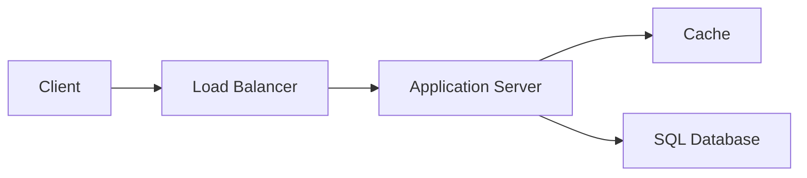

# Application Server

The compute layer responsible for executing business logic and processing 
client requests within a containerized environment.

## What is it?

An Application Server executes the core business logic of an application. 
It receives incoming HTTP or internal protocol requests, processes them 
according to defined rules, and interacts with persistence layers 
(databases) or caching systems. These servers run compiled code that 
implements specific features, such as user authentication, transaction 
processing, or data manipulation. Proper configuration ensures resource 
isolation and high availability for the computational tasks required by 
the system's frontend services.

## Why do we need it?

The Application Server separates complex business logic from infra
infrastructure plumbing. Without it, application components would require 
direct knowledge of networking details and persistence mechanisms, 
creating brittle systems. It solves the problem of state management by 
allowing stateless processing units that can be scaled horizontally across 
multiple instances to meet varying load demands. This architecture 
maximizes fault tolerance and resource utilization under fluctuating 
traffic patterns.

## How does it work?

The request flow typically starts with an external client initiating a 
connection to the system's perimeter component, usually a Load Balancer. 
The Load Balancer distributes incoming requests across a pool of A
Application Server instances based on defined algorithms (e.g., ro
round-robin or least connections). 
1. An App Server instance receives a request and validates parameters.
2. It executes the required business logic, often requiring interaction 
with downstream services like a Cache or Database for necessary data 
retrieval.
3. The server processes the result set.
4. Finally, it serializes the response payload (e.g., JSON) and returns 
the HTTP status code to the Load Balancer, which relays it back to the 
client.

## Architecture Diagram

## Common Configurations

| Configuration | Description |
| :--- | :--- |
| `replica_count` | Defines the minimum number of running instances 
required for high availability. |
| `resource_requests` | Specifies the CPU and memory resources the 
container must reserve to run. |
| `health_check_path` | The endpoint (e.g., `/actuator/health`) used by 
load balancers to check instance readiness. |
| `max_connections` | Limits the number of concurrent external connections 
the application layer can maintain. |

## Where is it used?

*   E-commerce platforms handling checkout and inventory logic.
*   Microservices managing user profile data and identity verification 
(AuthN/AuthZ).
*   Financial services performing transaction validation and ledger 
updates.
*   Backend APIs serving aggregated data streams for client-facing 
dashboards.

## Key Points

*   Serves as the execution environment for proprietary business logic.
*   Typically configured to be stateless to facilitate horizontal scaling.
*   Interacts with persistence layers (DB, Cache) over optimized network 
protocols.
*   Scalability is managed by orchestration systems monitoring resource 
utilization metrics.
*   Should maintain strict separation of concerns from infrastructure 
code.
*   Uses defined service contracts (APIs) for all internal component 
communication.

## Related Components

*   Load Balancer
*   Cache
*   SQL Database
*   Message Queue

## Learn More

Statelessness
Horizontal Scaling
Containerization
API Gateways
Idempotency

