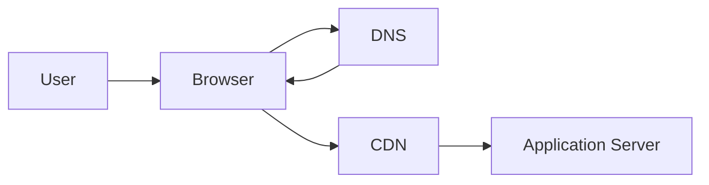

# Browser

The primary client application responsible for requesting, receiving, 
interpreting, and rendering web content over standard Internet protocols.

## What is it?

The browser functions as the end-user's interface to distributed services. 
It manages the complex negotiation of HTTP requests and interprets various 
media types, including HTML, CSS, JavaScript, and images. Architecturally, 
it abstracts the underlying network complexity from the user while 
performing client-side logic execution. Modern browsers are sophisticated 
state machines that adhere to strict specifications for rendering content 
received from backend resource servers.

## Why do we need it?

The browser solves the problem of universal accessibility and stan
standardization for web services. Without a standardized client, every 
consumer would require a custom native SDK or application, drastically 
increasing development overhead. It provides an environment where service 
providers can deploy business logic independently of the end-user's 
operating system or device type. This portability is essential for 
scalable, multi-platform consumption of backend APIs.

## How does it work?

1.  The user enters a URL into the browser, initiating a request that 
triggers DNS resolution to locate the service IP address.
2.  The browser establishes a secure connection using TLS/SSL with the 
target server endpoint.
3.  It constructs an HTTP GET request, including necessary headers (e.g., 
`User-Agent`, `Accept`).
4.  Upon receiving the response payload, the browser's rendering engine 
parses HTML and executes any embedded JavaScript, dynamically constructing 
the visible Document Object Model (DOM).
5.  The browser continuously manages resource fetching by issuing 
subsequent requests for linked assets (CSS files, images) until the entire 
view is rendered or a defined state is reached.

## Architecture Diagram

## Common Configurations

| Configuration | Description |
| :--- | :--- |
| `User-Agent` Header | Identifies the browser type, version, and 
operating system to the backend service. |
| Cache Control Headers | Directives instructing the browser on how long 
resources should be stored locally (e.g., `max-age`). |
| Content Negotiation | The ability to specify preferred data formats 
(e.g., `Accept: application/json`) for server responses. |
| TLS Version Enforcement | Controls the minimum secure communication 
protocol used during the handshake phase. |

## Where is it used?

*   **Content Delivery Networks (CDNs):** Caching static assets (images, 
fonts) and serving cached HTML to minimize latency from geographically 
distant origins.
*   **Web Applications:** Providing the primary interface for Single Page 
Applications (SPAs) where JavaScript manages client-side state tra
transitions.
*   **API Consumption:** Making direct HTTP calls to public 
API endpoints when the service is consumed via embedded widgets or if a 
fully native client is not feasible.

## Key Points

*   Browsers operate fundamentally based on standard HTTP methods and 
status codes.
*   Rendering complexity requires continuous parsing of HTML, CSS, and 
JavaScript specifications.
*   Client-side rendering increases bandwidth usage but enhances i
interactivity.
*   Browser security mechanisms implement policies like CORS to prevent 
unauthorized data access between domains.
*   The browser is responsible for managing cookies and local storage for 
session persistence.
*   Effective resource management involves proper handling of HTTP caching 
headers to reduce redundant network traffic.

## Related Components

*   API Gateway
*   CDN
*   Load Balancer
*   DNS

## Learn More

Client-side Rendering (CSR)
Server-Side Rendering (SSR)
Cross-Origin Resource Sharing (CORS)
Document Object Model (DOM)
HTTP Caching Mechanisms

