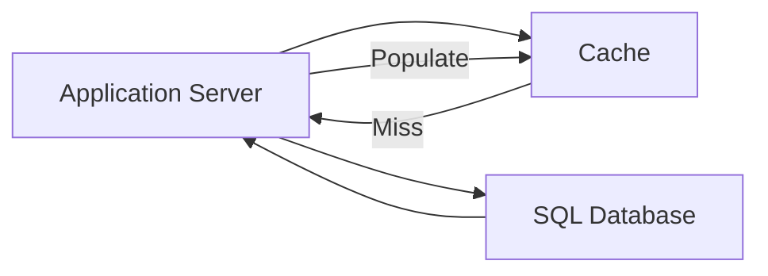

# Cache

Provides a high-speed, temporary storage layer for frequently accessed 
data, decoupling read traffic from primary persistence stores.

## What is it?

A distributed cache implements an in-memory key-value data store designed 
for extreme low latency and massive read throughput. Unlike traditional 
databases that prioritize ACID properties and permanent storage, the cache 
focuses on retrieval speed (read path optimization). It accepts simple 
operations, primarily `GET` and `SET`, to temporarily hold copies of 
frequently used data records or computed results. Cache systems are 
inherently non-persistent; they function as a fast look-aside mechanism 
rather than a primary source of truth for application state.

## Why do we need it?

Cache introduces separation between the read path and the write path, 
significantly reducing latency for highly accessed resources. Without 
caching, every request would require a trip to the underlying persistent 
data store (database), leading to bottlenecks, increased load on costly 
database connections, and poor scaling under high read volume. Caching 
solves this by handling the vast majority of read operations in volatile 
memory, providing near-instantaneous access while mitigating direct 
reliance on the transactional capabilities of the core persistence layer.

## How does it work?

The data flow begins when an application service requests a resource 
identifier (key). The request first routes to the Cache cluster. The cache 
system attempts to locate the key within its in-memory storage. If the key 
exists (a "cache hit"), the value is immediately returned to the a
application, completing the transaction quickly. If the key does not exist 
(a "cache miss"), the cache layer propagates the request downstream to the 
persistent database component.

1.  The backend database retrieves the data and returns it to the Cache 
cluster.
2.  The cache system writes this retrieved data into its local memory 
store, establishing a future retrieval path.
3.  The cache then forwards the value back up the chain to the requesting 
application service. This write-through process ensures subsequent 
requests for the same key will result in a hit.

## Architecture Diagram

## Common Configurations

| Configuration | Description |
| :--- | :--- |
| **Time-To-Live (TTL)** | Defines the maximum duration an item remains in 
the cache before automatic invalidation. Essential for preventing stale 
data. |
| **Eviction Policy** | Determines which item is removed when the memory 
capacity threshold is reached (e.g., LRU, LFU). |
| **Maximum Memory Size** | Sets the hard limit on the total dedicated RAM 
allocated to the cache cluster nodes. |
| **Replication Factor** | Specifies the number of synchronous replicas 
across different availability zones for data durability and high a
availability. |
| **Consistency Mode** | Configures how write operations propagate (e.g., 
eventual, strong) between the primary database and the cache layer. |

## Where is it used?

*   Serving user session tokens in authentication services.
*   Caching materialized views or pre-calculated leaderboard scores.
*   Storing rate limiting counts and IP blacklists for API gateways.
*   Holding query results derived from complex joins on the database 
(read-through pattern).
*   Managing frequently accessed static content metadata.

## Key Points

*   Caches should never be treated as a primary source of truth; they are 
read optimizations.
*   Designing cache invalidation logic is often the most critical part of 
the system design.
*   High consistency requirements necessitate integration with the 
underlying database's transaction mechanisms.
*   The typical workflow involves implementing a "read-through" pattern 
for optimal developer experience.
*   Cache cluster scaling usually requires sharding based on key ranges or 
consistent hashing algorithms.
*   They significantly improve Mean Time to Read (MTTR) by serving data 
from RAM rather than disk.

## Related Components

*   Distributed Cache
*   SQL Database
*   NoSQL Database
*   Application Server

## Learn More

Cache invalidation strategies
Time-to-Live Expiration
Consistent Hashing
Read Through Pattern
Write Back Policy

